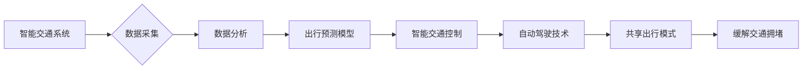

                 

## 硅谷的交通拥堵:创新出行解决方案

> 关键词：交通拥堵、智能交通、出行解决方案、机器学习、预测模型、数据分析、自动驾驶、共享出行

## 1. 背景介绍

硅谷，作为全球科技创新中心，其高速发展也带来了严峻的交通挑战。每天，数百万辆汽车涌入狭窄的道路，导致交通拥堵成为硅谷居民和企业面临的巨大难题。交通拥堵不仅浪费了宝贵时间和燃料，还加剧了空气污染和噪音污染，严重影响了人们的生活质量和经济效益。

面对这一挑战，硅谷的科技巨头和创业公司纷纷投入研发，探索创新出行解决方案。从智能交通系统到自动驾驶技术，从共享出行模式到出行预测模型，各种技术方案层出不穷，为缓解交通拥堵提供了新的思路和希望。

## 2. 核心概念与联系

### 2.1 智能交通系统

智能交通系统 (ITS) 是利用信息技术和通信技术，对交通系统进行智能化管理和控制的系统。ITS 通过传感器、通信网络、数据分析和控制系统等技术手段，实时监测交通状况，优化交通流量，提高道路通行效率。

### 2.2 出行预测模型

出行预测模型利用历史交通数据、实时路况信息、天气预报等数据，通过机器学习算法预测未来交通流量和出行时间。这些模型可以帮助驾驶员规划最优出行路线，避免拥堵路段，提高出行效率。

### 2.3 自动驾驶技术

自动驾驶技术是指车辆能够自动感知周围环境、做出决策并控制行驶的系统。自动驾驶技术可以减少人为驾驶误差，提高道路安全性，并为未来智能交通系统提供基础设施。

### 2.4 共享出行模式

共享出行模式是指多人共享一辆车辆出行，例如拼车、租车、共享单车等。共享出行模式可以减少车辆数量，降低交通拥堵压力，促进资源共享和绿色出行。

**核心概念与联系流程图:**



## 3. 核心算法原理 & 具体操作步骤

### 3.1 算法原理概述

出行预测模型通常基于机器学习算法，例如线性回归、支持向量机、决策树、神经网络等。这些算法通过学习历史交通数据和相关因素之间的关系，建立预测模型，并预测未来交通流量和出行时间。

### 3.2 算法步骤详解

1. **数据收集:** 收集历史交通数据、实时路况信息、天气预报、节日活动等相关数据。
2. **数据预处理:** 对收集到的数据进行清洗、转换、特征工程等处理，使其适合机器学习算法的训练。
3. **模型选择:** 根据数据特点和预测需求，选择合适的机器学习算法。
4. **模型训练:** 使用训练数据训练选择的机器学习模型，并调整模型参数，使其能够准确预测未来交通流量和出行时间。
5. **模型评估:** 使用测试数据评估模型的预测精度，并进行模型优化。
6. **模型部署:** 将训练好的模型部署到生产环境中，实时预测交通流量和出行时间，并提供给驾驶员或交通管理系统。

### 3.3 算法优缺点

**优点:**

* 能够准确预测未来交通流量和出行时间。
* 可以根据实时路况信息动态调整预测结果。
* 可以帮助驾驶员规划最优出行路线，避免拥堵路段。

**缺点:**

* 需要大量的历史交通数据进行训练。
* 预测结果受天气、节日活动等因素影响。
* 模型需要定期更新，以适应变化的交通环境。

### 3.4 算法应用领域

出行预测模型广泛应用于以下领域:

* **导航系统:** 提供实时交通信息和最优出行路线建议。
* **交通管理系统:** 优化交通信号灯控制、道路拥堵缓解等。
* **城市规划:** 预测未来交通需求，制定城市交通规划。
* **出行服务:** 提供个性化出行服务，例如预约车位、叫车等。

## 4. 数学模型和公式 & 详细讲解 & 举例说明

### 4.1 数学模型构建

出行预测模型通常采用时间序列模型，例如ARIMA模型、SARIMA模型、Prophet模型等。这些模型假设未来交通流量与历史交通流量之间存在一定的统计关系，并通过数学公式进行建模。

**ARIMA模型:**

ARIMA模型是一种经典的时间序列模型，其全称是Autoregressive Integrated Moving Average模型。ARIMA模型包含三个参数:

* **p:** Autoregressive (AR) order，表示模型中自回归项的阶数。
* **d:** Integrated (I) order，表示模型中差分项的阶数。
* **q:** Moving Average (MA) order，表示模型中移动平均项的阶数。

ARIMA模型的数学公式如下:

$$
y_t = c + \phi_1 y_{t-1} + \phi_2 y_{t-2} + ... + \phi_p y_{t-p} + \theta_1 \epsilon_{t-1} + \theta_2 \epsilon_{t-2} + ... + \theta_q \epsilon_{t-q} + \epsilon_t
$$

其中:

* $y_t$ 是时间t的交通流量。
* $c$ 是截距项。
* $\phi_i$ 是自回归系数。
* $\theta_i$ 是移动平均系数。
* $\epsilon_t$ 是时间t的随机误差项。

### 4.2 公式推导过程

ARIMA模型的公式推导过程较为复杂，涉及到时间序列分析、统计学等方面的知识。

### 4.3 案例分析与讲解

假设我们想要预测某条道路的未来交通流量，我们可以使用ARIMA模型进行预测。首先，我们需要收集该道路的历史交通流量数据，并进行数据预处理。然后，我们可以使用ARIMA模型的识别方法，确定模型的参数p、d、q。最后，我们可以使用训练好的ARIMA模型预测未来交通流量。

## 5. 项目实践：代码实例和详细解释说明

### 5.1 开发环境搭建

为了实现出行预测模型，我们需要搭建一个开发环境。常用的开发环境包括Python、R、Java等。

### 5.2 源代码详细实现

以下是一个使用Python和Scikit-learn库实现ARIMA模型的代码示例:

```python
from statsmodels.tsa.arima.model import ARIMA
import pandas as pd

# 加载历史交通流量数据
data = pd.read_csv('traffic_data.csv', index_col='Date')

# 训练ARIMA模型
model = ARIMA(data['Traffic'], order=(5,1,0))
model_fit = model.fit()

# 预测未来交通流量
forecast = model_fit.predict(start=len(data), end=len(data)+10)

# 打印预测结果
print(forecast)
```

### 5.3 代码解读与分析

这段代码首先加载历史交通流量数据，然后使用ARIMA模型训练模型。训练完成后，我们可以使用模型预测未来交通流量。

### 5.4 运行结果展示

运行结果将显示未来10天的交通流量预测值。

## 6. 实际应用场景

### 6.1 智能交通系统

出行预测模型可以集成到智能交通系统中，实时监测交通状况，预测拥堵路段，并通过交通信号灯控制、车辆引导等方式优化交通流量。

### 6.2 导航系统

导航系统可以利用出行预测模型提供实时交通信息和最优出行路线建议，帮助驾驶员避开拥堵路段，节省时间和燃料。

### 6.3 城市规划

城市规划部门可以利用出行预测模型预测未来交通需求，制定合理的城市交通规划，缓解交通拥堵问题。

### 6.4 未来应用展望

随着人工智能技术的不断发展，出行预测模型将更加智能化、精准化。未来，出行预测模型将应用于更多领域，例如自动驾驶、共享出行、出行服务等，为人们提供更加便捷、高效、舒适的出行体验。

## 7. 工具和资源推荐

### 7.1 学习资源推荐

* **书籍:**
    * 《时间序列分析》
    * 《机器学习》
* **在线课程:**
    * Coursera: Time Series Analysis
    * edX: Machine Learning

### 7.2 开发工具推荐

* **Python:**
    * Scikit-learn
    * Statsmodels
    * Pandas
* **R:**
    * forecast
    * tseries

### 7.3 相关论文推荐

* **ARIMA模型:**
    * Box, G. E. P., & Jenkins, G. M. (1976). Time series analysis: Forecasting and control. Holden-Day.
* **深度学习模型:**
    * Wang, Z., & Chen, Y. (2017). Deep learning for traffic prediction: A survey. IEEE Transactions on Intelligent Transportation Systems, 18(11), 3197-3212.

## 8. 总结：未来发展趋势与挑战

### 8.1 研究成果总结

近年来，在人工智能、机器学习等技术的推动下，出行预测模型取得了显著进展。这些模型能够准确预测未来交通流量和出行时间，为缓解交通拥堵提供了新的思路和方法。

### 8.2 未来发展趋势

未来，出行预测模型将朝着以下方向发展:

* **更加精准的预测:** 利用更先进的机器学习算法和更丰富的交通数据，提高预测精度。
* **更加个性化的服务:** 根据用户的出行需求和习惯，提供个性化的出行建议和服务。
* **更加智能的交互:** 利用自然语言处理、语音识别等技术，实现更加智能的出行交互。

### 8.3 面临的挑战

尽管出行预测模型取得了显著进展，但仍面临一些挑战:

* **数据质量:** 准确的交通数据是出行预测模型的基础，但现实中交通数据往往存在缺失、错误等问题。
* **模型复杂度:** 一些复杂的机器学习模型需要大量的计算资源和时间进行训练。
* **隐私保护:** 出行预测模型需要处理大量用户出行数据，如何保护用户隐私是一个重要的挑战。

### 8.4 研究展望

未来，我们需要继续加强对出行预测模型的研究，解决上述挑战，并将其应用于更多领域，为人们提供更加便捷、高效、舒适的出行体验。

## 9. 附录：常见问题与解答

### 9.1 如何选择合适的出行预测模型?

选择合适的出行预测模型需要根据具体应用场景和数据特点进行选择。例如，对于短期预测，ARIMA模型是一个不错的选择；对于长期预测，深度学习模型可能更合适。

### 9.2 如何处理交通数据中的缺失值?

交通数据中的缺失值可以通过多种方法处理，例如插值法、平均值法、机器学习算法等。

### 9.3 如何评估出行预测模型的精度?

出行预测模型的精度可以通过多种指标评估，例如均方误差 (MSE)、平均绝对误差 (MAE) 等。

作者：禅与计算机程序设计艺术 / Zen and the Art of Computer Programming


<end_of_turn>

