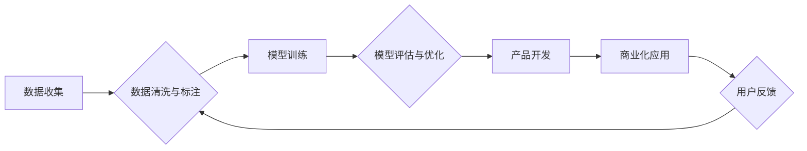

                 

## 硅谷风格的中国AI公司：Lepton AI的运营模式

> 关键词：Lepton AI, 中国AI公司, 运营模式, 硅谷风格, 深度学习, 计算机视觉, 商业化

## 1. 背景介绍

近年来，中国人工智能（AI）产业蓬勃发展，涌现出一批具有全球竞争力的AI公司。其中，Lepton AI作为一家以深度学习和计算机视觉为核心的AI公司，以其独特的运营模式和商业化策略，在业界引起了广泛关注。本文将深入探讨Lepton AI的运营模式，分析其成功经验，并展望其未来发展趋势。

Lepton AI成立于2017年，总部位于中国上海，是一家专注于开发和应用深度学习技术的AI公司。Lepton AI的核心团队由来自清华大学、斯坦福大学等世界知名学府的科学家和工程师组成，拥有丰富的AI研究和应用经验。

Lepton AI致力于将先进的AI技术应用于各个行业，例如智能制造、智慧城市、医疗健康等。其产品和服务涵盖图像识别、视频分析、自然语言处理等多个领域，为客户提供智能化解决方案。

## 2. 核心概念与联系

Lepton AI的运营模式融合了硅谷的创新文化和中国市场的特点，其核心概念包括：

* **数据驱动:** Lepton AI高度重视数据收集、清洗和分析，将其视为AI模型训练和优化不可或缺的要素。
* **技术创新:** Lepton AI坚持自主研发，不断探索和突破新的AI算法和技术，以保持其技术领先优势。
* **生态合作:** Lepton AI积极与高校、科研机构、产业合作伙伴等建立合作关系，共同推动AI产业发展。
* **商业化落地:** Lepton AI将技术成果转化为商业价值，通过提供产品和服务，为客户创造价值。

Lepton AI的运营模式可以概括为以下流程：

## 3. 核心算法原理 & 具体操作步骤

Lepton AI的核心算法主要基于深度学习，特别是卷积神经网络（CNN）和循环神经网络（RNN）。

### 3.1  算法原理概述

深度学习算法通过多层神经网络结构，模拟人脑的学习机制，从海量数据中自动提取特征，并进行模式识别和预测。CNN擅长处理图像数据，通过卷积和池化操作，提取图像的局部特征，并将其组合成全局特征，从而实现图像识别、分类等任务。RNN擅长处理序列数据，例如文本和语音，通过循环连接，捕捉序列中的时间依赖关系，实现自然语言处理、语音识别等任务。

### 3.2  算法步骤详解

Lepton AI的算法开发流程通常包括以下步骤：

1. **数据收集和预处理:** 收集相关数据，并进行清洗、标注和格式转换，以满足模型训练需求。
2. **模型选择和架构设计:** 根据任务需求选择合适的深度学习模型，并设计模型的架构，例如网络层数、节点数量、激活函数等。
3. **模型训练:** 使用训练数据训练模型，通过反向传播算法，调整模型参数，使其能够准确地识别或预测目标。
4. **模型评估和优化:** 使用测试数据评估模型的性能，并根据评估结果，调整模型参数或架构，以提高模型精度和效率。
5. **模型部署和应用:** 将训练好的模型部署到实际应用场景中，例如云平台、边缘设备等，并进行监控和维护。

### 3.3  算法优缺点

Lepton AI所使用的深度学习算法具有以下优点：

* **高精度:** 深度学习算法能够从海量数据中自动提取特征，从而实现高精度的识别和预测。
* **自动化学习:** 深度学习算法能够自动学习数据模式，无需人工特征工程。
* **可扩展性:** 深度学习算法可以轻松扩展到更大的数据集和更复杂的模型。

但也存在一些缺点：

* **数据依赖:** 深度学习算法对数据质量和数量有很高的要求。
* **计算资源消耗:** 深度学习模型训练需要大量的计算资源。
* **可解释性差:** 深度学习模型的决策过程难以解释。

### 3.4  算法应用领域

Lepton AI的深度学习算法应用于多个领域，例如：

* **智能制造:** 工件缺陷检测、质量控制、生产流程优化。
* **智慧城市:** 交通监控、安防监控、环境监测。
* **医疗健康:** 疾病诊断、影像分析、药物研发。

## 4. 数学模型和公式 & 详细讲解 & 举例说明

Lepton AI的深度学习算法基于复杂的数学模型和公式，例如：

### 4.1  数学模型构建

深度学习模型通常由多层神经网络组成，每层神经网络包含多个神经元。每个神经元接收来自上一层的输入信号，并通过激活函数进行处理，输出到下一层。

### 4.2  公式推导过程

深度学习模型的训练过程基于梯度下降算法，通过不断调整模型参数，最小化模型预测误差。梯度下降算法的核心公式是：

$$
\theta = \theta - \alpha \nabla J(\theta)
$$

其中：

* $\theta$ 是模型参数
* $\alpha$ 是学习率
* $\nabla J(\theta)$ 是损失函数 $J(\theta)$ 对参数 $\theta$ 的梯度

### 4.3  案例分析与讲解

例如，在图像识别任务中，Lepton AI使用CNN模型识别图像中的物体。CNN模型的每一层神经元都学习到图像的局部特征，例如边缘、纹理等。通过多层网络的叠加，CNN模型能够提取图像的全局特征，并将其映射到不同的类别标签。

## 5. 项目实践：代码实例和详细解释说明

Lepton AI的开发团队使用Python语言和深度学习框架TensorFlow或PyTorch进行代码开发。

### 5.1  开发环境搭建

Lepton AI的开发环境通常包括：

* 操作系统：Linux或Windows
* Python版本：3.6或更高版本
* 深度学习框架：TensorFlow或PyTorch
* 其他库：NumPy、Pandas、Matplotlib等

### 5.2  源代码详细实现

Lepton AI的源代码通常包含以下部分：

* 数据预处理模块：负责数据清洗、标注和格式转换。
* 模型定义模块：定义深度学习模型的架构和参数。
* 模型训练模块：负责训练模型并评估模型性能。
* 模型部署模块：负责将训练好的模型部署到实际应用场景中。

### 5.3  代码解读与分析

Lepton AI的代码遵循良好的编码规范，并进行充分的注释，方便其他开发者理解和维护。

### 5.4  运行结果展示

Lepton AI的代码运行结果通常包括：

* 模型训练过程中的损失函数值和准确率曲线。
* 模型测试过程中的准确率、召回率和F1-score等指标。
* 模型预测结果的展示，例如图像识别结果的分类标签和置信度。

## 6. 实际应用场景

Lepton AI的深度学习技术已应用于多个实际场景，例如：

### 6.1  智能制造

Lepton AI的深度学习算法可以用于工业场景的缺陷检测、质量控制和生产流程优化。例如，Lepton AI可以帮助制造商识别产品中的微小缺陷，提高产品质量；可以帮助制造商优化生产流程，提高生产效率。

### 6.2  智慧城市

Lepton AI的深度学习算法可以用于智慧城市建设，例如交通监控、安防监控和环境监测。例如，Lepton AI可以帮助城市管理部门监控交通流量，优化交通信号灯控制；可以帮助城市管理部门识别违章行为，提高城市安全；可以帮助城市管理部门监测空气质量，改善城市环境。

### 6.3  医疗健康

Lepton AI的深度学习算法可以用于医疗健康领域，例如疾病诊断、影像分析和药物研发。例如，Lepton AI可以帮助医生诊断疾病，提高诊断准确率；可以帮助医生分析医学影像，辅助诊断；可以帮助科学家发现新的药物，加速药物研发。

### 6.4  未来应用展望

Lepton AI的深度学习技术未来将应用于更多领域，例如：

* **教育:** 个性化学习、智能辅导
* **金融:** 风险评估、欺诈检测
* **零售:** 商品推荐、客户服务

## 7. 工具和资源推荐

### 7.1  学习资源推荐

* **在线课程:** Coursera、edX、Udacity等平台提供深度学习相关的在线课程。
* **书籍:** 《深度学习》、《动手学深度学习》等书籍是深度学习学习的经典教材。
* **博客和论坛:** TensorFlow、PyTorch等深度学习框架的官方博客和论坛提供丰富的学习资源和技术支持。

### 7.2  开发工具推荐

* **Python:** 深度学习开发的常用编程语言。
* **TensorFlow:** Google开发的开源深度学习框架。
* **PyTorch:** Facebook开发的开源深度学习框架。
* **Jupyter Notebook:** 用于深度学习代码开发和可视化的交互式环境。

### 7.3  相关论文推荐

* **AlexNet:** 《ImageNet Classification with Deep Convolutional Neural Networks》
* **VGGNet:** 《Very Deep Convolutional Networks for Large-Scale Image Recognition》
* **ResNet:** 《Deep Residual Learning for Image Recognition》

## 8. 总结：未来发展趋势与挑战

### 8.1  研究成果总结

Lepton AI在深度学习算法研究和应用方面取得了显著成果，其技术已应用于多个行业，为客户创造了价值。

### 8.2  未来发展趋势

Lepton AI将继续深耕深度学习技术，探索新的算法和应用场景，例如：

* **增强现实（AR）和虚拟现实（VR）:** Lepton AI将利用深度学习技术，开发AR和VR应用，例如虚拟试衣、虚拟旅游等。
* **自动驾驶:** Lepton AI将利用深度学习技术，开发自动驾驶系统，例如自动泊车、自动驾驶辅助等。
* **机器人:** Lepton AI将利用深度学习技术，开发智能机器人，例如服务机器人、工业机器人等。

### 8.3  面临的挑战

Lepton AI也面临一些挑战，例如：

* **数据安全和隐私保护:** 深度学习算法依赖于海量数据，如何确保数据安全和隐私保护是重要的挑战。
* **算法可解释性:** 深度学习模型的决策过程难以解释，如何提高算法的可解释性是重要的研究方向。
* **人才短缺:** 深度学习领域人才需求量大，如何吸引和培养人才是重要的挑战。

### 8.4  研究展望

Lepton AI将继续致力于深度学习技术的研究和应用，为社会创造更多价值。

## 9. 附录：常见问题与解答

### 9.1  Q1: Lepton AI的深度学习算法有哪些优势？

**A1:** Lepton AI的深度学习算法具有高精度、自动化学习和可扩展性等优势。

### 9.2  Q2: Lepton AI的深度学习算法有哪些应用场景？

**A2:** Lepton AI的深度学习算法已应用于智能制造、智慧城市、医疗健康等多个领域。

### 9.3  Q3: Lepton AI如何确保数据安全和隐私保护？

**A3:** Lepton AI严格遵守数据安全和隐私保护相关法律法规，并采取多种技术措施，例如数据加密、匿名化等，确保数据安全。

作者：禅与计算机程序设计艺术 / Zen and the Art of Computer Programming 
<end_of_turn>

