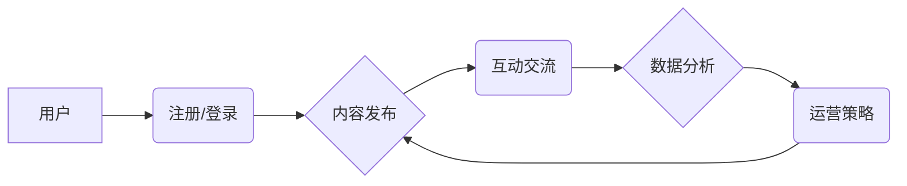

                 

## 社群运营工具：程序员打造知识付费社群必备

> 关键词：知识付费、社群运营、程序员、工具、技术、平台、增长、用户体验

## 1. 背景介绍

近年来，知识付费市场蓬勃发展，程序员作为技术领域的重要力量，也积极参与其中。许多程序员选择通过建立知识付费社群，分享技术经验、提供学习资源，并获得收益。然而，社群运营是一个复杂的过程，需要投入大量的时间和精力。为了帮助程序员更有效地运营知识付费社群，本文将介绍一些必备的社群运营工具，并探讨其核心原理、应用场景以及实践案例。

## 2. 核心概念与联系

**2.1 社群运营工具概述**

社群运营工具是指用于管理和运营社群的软件或平台，其功能涵盖用户管理、内容发布、互动交流、数据分析等多个方面。对于知识付费社群而言，这些工具可以帮助程序员简化运营流程，提升用户体验，并最终实现商业目标。

**2.2 社群运营工具架构**



**2.3 核心概念关系**

* **用户:** 社群的核心成员，包括付费用户、免费用户、管理员等。
* **注册/登录:** 用户进入社群的第一步，需要建立账号并进行身份验证。
* **内容发布:** 程序员发布技术文章、视频课程、直播等学习资源。
* **互动交流:** 用户之间进行评论、讨论、提问等互动行为。
* **数据分析:** 收集用户行为数据，分析用户喜好、学习需求等，为运营策略提供依据。
* **运营策略:** 根据数据分析结果，制定相应的运营策略，例如内容更新频率、互动活动策划等。

## 3. 核心算法原理 & 具体操作步骤

**3.1 算法原理概述**

社群运营工具通常采用一些算法来实现个性化推荐、内容排序、用户匹配等功能。例如，基于用户的学习历史和行为数据，推荐相关内容；根据内容的热度和用户评价，排序内容展示顺序；根据用户的兴趣标签和专业领域，匹配合适的学习伙伴。

**3.2 算法步骤详解**

* **数据采集:** 收集用户注册信息、学习记录、互动行为等数据。
* **数据预处理:** 对数据进行清洗、转换、格式化等处理，使其适合算法模型训练。
* **特征提取:** 从数据中提取用户兴趣、学习偏好、行为模式等特征。
* **模型训练:** 利用机器学习算法，训练模型以预测用户行为、推荐内容等。
* **模型评估:** 使用测试数据评估模型的性能，并进行调整优化。
* **模型部署:** 将训练好的模型部署到线上环境，为用户提供个性化服务。

**3.3 算法优缺点**

* **优点:** 可以实现个性化推荐、内容排序、用户匹配等功能，提升用户体验和社群活跃度。
* **缺点:** 需要大量数据进行训练，算法模型的准确性依赖于数据质量，存在算法偏差和隐私安全问题。

**3.4 算法应用领域**

* **内容推荐:** 推荐用户感兴趣的内容，例如文章、视频、课程等。
* **用户匹配:** 匹配用户之间的学习需求和兴趣爱好，促进互动交流。
* **社群运营:** 分析用户行为数据，制定运营策略，提升社群活跃度和用户粘性。

## 4. 数学模型和公式 & 详细讲解 & 举例说明

**4.1 数学模型构建**

社群运营工具中常用的数学模型包括协同过滤、内容聚类、用户画像等。

* **协同过滤:** 基于用户的历史行为数据，预测用户对特定内容的兴趣。

$$
R(u, i) = \frac{\sum_{v \in N(u)} \frac{R(v, i) * sim(u, v)}{\sum_{w \in N(u)} sim(u, w)}}{\sum_{i \in I} sim(u, i)}
$$

其中：

* $R(u, i)$ 表示用户 $u$ 对内容 $i$ 的评分。
* $N(u)$ 表示与用户 $u$ 具有相似行为的用户集合。
* $sim(u, v)$ 表示用户 $u$ 和用户 $v$ 之间的相似度。
* $I$ 表示所有内容的集合。

* **内容聚类:** 将内容按照主题、类别等进行聚类，方便用户查找和浏览。

**4.2 公式推导过程**

协同过滤算法的评分预测公式通过计算用户与其他用户之间的相似度，以及这些用户对特定内容的评分，来预测用户对该内容的评分。

**4.3 案例分析与讲解**

假设有一个用户 $u$，他喜欢观看编程教程视频。通过协同过滤算法，可以找到与用户 $u$ 兴趣相似的用户 $v$，并计算用户 $u$ 和用户 $v$ 之间的相似度。然后，根据用户 $v$ 对编程教程视频的评分，以及用户 $u$ 和用户 $v$ 之间的相似度，预测用户 $u$ 对该视频的评分。

## 5. 项目实践：代码实例和详细解释说明

**5.1 开发环境搭建**

* 操作系统: Ubuntu 20.04
* 编程语言: Python 3.8
* 开发框架: Django 3.2
* 数据库: PostgreSQL 13

**5.2 源代码详细实现**

```python
# models.py
from django.db import models

class User(models.Model):
    username = models.CharField(max_length=255)
    password = models.CharField(max_length=255)
    # ... 其他用户属性

class Content(models.Model):
    title = models.CharField(max_length=255)
    description = models.TextField()
    # ... 其他内容属性

# views.py
from django.shortcuts import render
from .models import User, Content

def index(request):
    # 获取热门内容
    hot_contents = Content.objects.order_by('-views')[:5]
    return render(request, 'index.html', {'hot_contents': hot_contents})
```

**5.3 代码解读与分析**

* **models.py:** 定义了用户和内容的模型，用于存储用户和内容数据。
* **views.py:** 定义了首页视图，用于获取热门内容并渲染页面。

**5.4 运行结果展示**

运行代码后，可以访问网站首页，看到热门内容的列表。

## 6. 实际应用场景

**6.1 程序员知识付费社群**

程序员可以利用社群运营工具建立知识付费社群，分享技术经验、提供学习资源，并获得收益。

**6.2 技术论坛和社区**

技术论坛和社区可以利用社群运营工具提升用户体验，促进用户互动，并提供更精准的知识服务。

**6.3 企业内部知识共享平台**

企业可以利用社群运营工具建立内部知识共享平台，方便员工交流学习，提升团队协作效率。

**6.4 未来应用展望**

随着人工智能技术的不断发展，社群运营工具将更加智能化、个性化，能够更好地满足用户需求，并推动知识付费市场的发展。

## 7. 工具和资源推荐

**7.1 学习资源推荐**

* **书籍:** 《社群运营实战》、《用户增长黑客》
* **课程:** Udemy、Coursera 等平台上的社群运营课程
* **博客:** 社群运营相关的技术博客

**7.2 开发工具推荐**

* **Django:** Python 框架，用于开发Web应用
* **Node.js:** JavaScript 运行环境，用于开发实时应用
* **Firebase:** Google 提供的云平台，提供数据库、身份验证、推送等服务

**7.3 相关论文推荐**

* **Collaborative Filtering for Recommender Systems**
* **Content-Based Recommendation Systems**
* **Social Network Analysis for Community Detection**

## 8. 总结：未来发展趋势与挑战

**8.1 研究成果总结**

本文介绍了社群运营工具的原理、算法、应用场景以及未来发展趋势。

**8.2 未来发展趋势**

* **人工智能驱动:** 利用人工智能技术，实现更智能化、个性化的社群运营。
* **沉浸式体验:** 通过VR/AR等技术，打造更沉浸式的社群体验。
* **跨平台融合:** 社群运营工具将跨越平台限制，实现更广泛的用户覆盖。

**8.3 面临的挑战**

* **数据隐私安全:** 社群运营工具需要妥善处理用户数据，保障用户隐私安全。
* **算法偏差:** 算法模型的准确性依赖于数据质量，存在算法偏差和公平性问题。
* **用户粘性:** 如何提升用户粘性，打造活跃的社群，是持续的挑战。

**8.4 研究展望**

未来研究将重点关注人工智能驱动的社群运营、沉浸式社群体验、跨平台融合等领域，并积极解决数据隐私安全、算法偏差等挑战。

## 9. 附录：常见问题与解答

* **Q1: 如何选择合适的社群运营工具？**

A1: 选择社群运营工具时，需要考虑自身的业务需求、用户规模、预算等因素。

* **Q2: 如何提升社群活跃度？**

A2: 可以通过举办线上线下活动、提供优质内容、加强用户互动等方式提升社群活跃度。

* **Q3: 如何保障用户数据安全？**

A3: 社群运营工具需要采用安全加密技术，并制定完善的数据隐私政策，保障用户数据安全。


作者：禅与计算机程序设计艺术 / Zen and the Art of Computer Programming 
<end_of_turn>

