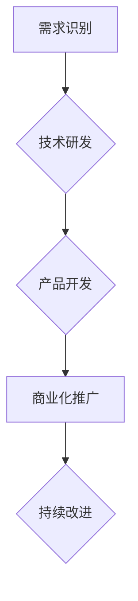

                 

## 科技创新：社会进步的阶梯

> 关键词：人工智能、科技创新、社会进步、算法、机器学习、深度学习、数据科学、未来趋势

## 1. 背景介绍

人类文明的发展历程，始终伴随着科技创新的不断涌现。从火的使用到互联网的普及，每一次科技突破都深刻地改变着人类的生活方式、社会结构和价值观。科技创新，如同社会进步的阶梯，推动着人类不断攀登更高的文明高峰。

然而，在当今信息爆炸的时代，科技创新面临着前所未有的机遇和挑战。一方面，人工智能、大数据、云计算等新兴技术蓬勃发展，为科技创新提供了强大的工具和平台；另一方面，科技伦理、数据安全、社会公平等问题也日益凸显，需要我们认真思考和应对。

## 2. 核心概念与联系

科技创新是一个复杂而多维的概念，它涉及到多个领域和多个层次的相互作用。

**2.1  科技创新要素**

科技创新是一个系统工程，需要多种要素的协同作用才能取得成功。主要要素包括：

* **技术创新：** 这是科技创新的核心，指的是对现有技术进行改进、升级或开发全新的技术。
* **知识创新：** 科技创新离不开知识的积累和转化，包括科学研究、技术开发、知识共享等。
* **资本创新：** 科技创新需要大量的资金投入，包括研发投入、市场推广投入等。
* **人才创新：** 科技创新离不开优秀人才的支撑，包括科学家、工程师、设计师、管理者等。
* **政策创新：** 政府政策可以为科技创新提供支持和引导，例如提供税收优惠、设立科研基金等。

**2.2  科技创新与社会进步的关系**

科技创新是社会进步的引擎，它推动着经济发展、社会转型和人类文明的进步。

* **经济发展：** 科技创新可以提高生产效率、创造新的产品和服务，从而促进经济增长。
* **社会转型：** 科技创新可以改变人们的生活方式、工作方式和社会结构，推动社会向更先进的方向发展。
* **人类文明进步：** 科技创新可以解决人类面临的各种挑战，例如疾病、环境污染、能源短缺等，从而提升人类的生存水平和生活质量。

**2.3  科技创新流程**

科技创新的流程是一个循序渐进的过程，通常包括以下几个阶段：

* **需求识别：** 首先要明确科技创新的目标和方向，识别社会发展和人们生活中的需求。
* **技术研发：** 根据需求，进行技术研究和开发，探索新的技术方案和解决方案。
* **产品开发：** 将研发成果转化为实际的产品或服务，并进行市场测试和验证。
* **商业化推广：** 将产品或服务推向市场，并进行推广和销售。
* **持续改进：** 在产品或服务的推广过程中，不断收集用户反馈，进行改进和优化。

**2.4  Mermaid 流程图**



## 3. 核心算法原理 & 具体操作步骤

**3.1  算法原理概述**

算法是解决特定问题的一系列步骤或规则，是科技创新的核心驱动力之一。

**3.2  算法步骤详解**

算法的步骤详解取决于具体的算法类型，例如：

* **排序算法：** 将数据按照特定顺序排列，例如冒泡排序、快速排序等。
* **搜索算法：** 在数据集中查找特定元素，例如线性搜索、二分搜索等。
* **机器学习算法：** 从数据中学习规律，进行预测或分类，例如线性回归、决策树、神经网络等。

**3.3  算法优缺点**

不同的算法具有不同的优缺点，需要根据具体问题选择合适的算法。例如：

* **时间复杂度：** 算法执行所需的时间，越低的复杂度越好。
* **空间复杂度：** 算法执行所需的空间，越低的复杂度越好。
* **准确率：** 算法的预测或分类准确率，越高越好。

**3.4  算法应用领域**

算法广泛应用于各个领域，例如：

* **计算机科学：** 数据结构、算法分析、软件开发等。
* **人工智能：** 机器学习、深度学习、自然语言处理等。
* **生物信息学：** 基因组分析、蛋白质结构预测等。
* **金融科技：** 风险管理、欺诈检测等。

## 4. 数学模型和公式 & 详细讲解 & 举例说明

**4.1  数学模型构建**

数学模型是描述客观现象和规律的抽象工具，在科技创新中扮演着至关重要的角色。例如：

* **线性回归模型：** 用于预测连续变量，例如房价、股票价格等。

$$
y = mx + c
$$

其中：

* $y$ 是预测变量
* $x$ 是自变量
* $m$ 是斜率
* $c$ 是截距

* **逻辑回归模型：** 用于预测分类变量，例如客户是否会购买产品、邮件是否为垃圾邮件等。

$$
P(y=1|x) = \frac{1}{1 + e^{-(wx + b)}}
$$

其中：

* $P(y=1|x)$ 是预测变量 $y$ 为 1 的概率
* $x$ 是自变量
* $w$ 是权重
* $b$ 是偏置

**4.2  公式推导过程**

数学模型的公式推导过程通常需要用到微积分、概率论、统计学等数学工具。例如：

* **线性回归模型的斜率和截距的计算公式** 需要用到最小二乘法。

**4.3  案例分析与讲解**

通过对实际案例的分析，可以更好地理解数学模型的应用和效果。例如：

* **使用线性回归模型预测房价**，需要收集房价和相关特征的数据，然后训练模型，最后使用模型预测新的房价。

## 5. 项目实践：代码实例和详细解释说明

**5.1  开发环境搭建**

项目实践需要搭建合适的开发环境，例如：

* **Python 开发环境：** 安装 Python 语言和相关库，例如 NumPy、Pandas、Scikit-learn 等。

**5.2  源代码详细实现**

代码实现需要根据具体的算法和项目需求进行编写，例如：

* **实现线性回归模型的 Python 代码**

```python
import numpy as np
from sklearn.linear_model import LinearRegression

# 训练数据
X = np.array([[1], [2], [3], [4], [5]])
y = np.array([2, 4, 5, 4, 5])

# 创建线性回归模型
model = LinearRegression()

# 训练模型
model.fit(X, y)

# 预测新的房价
new_X = np.array([[6]])
predicted_y = model.predict(new_X)

print(predicted_y)
```

**5.3  代码解读与分析**

代码解读需要分析代码的逻辑结构和功能，例如：

* 上述代码首先定义了训练数据和模型，然后使用 `fit()` 方法训练模型，最后使用 `predict()` 方法预测新的房价。

**5.4  运行结果展示**

运行结果展示需要展示代码的执行结果，例如：

* 运行上述代码，可以得到预测的房价为 6。

## 6. 实际应用场景

**6.1  医疗保健**

* **疾病诊断：** 使用机器学习算法分析患者的医疗数据，辅助医生进行疾病诊断。
* **药物研发：** 使用人工智能加速药物研发过程，例如预测药物的有效性、安全性等。

**6.2  金融科技**

* **风险管理：** 使用机器学习算法分析金融数据，识别和评估金融风险。
* **欺诈检测：** 使用人工智能识别和预防金融欺诈行为。

**6.3  教育科技**

* **个性化学习：** 使用人工智能根据学生的学习情况，提供个性化的学习内容和建议。
* **智能辅导：** 使用人工智能为学生提供智能辅导，帮助他们解决学习问题。

**6.4  未来应用展望**

科技创新将继续推动社会进步，未来将出现更多新的应用场景，例如：

* **自动驾驶：** 使用人工智能和传感器技术，实现自动驾驶汽车。
* **虚拟现实：** 使用虚拟现实技术，创造沉浸式的虚拟体验。
* **量子计算：** 使用量子计算技术，解决传统计算机无法解决的复杂问题。

## 7. 工具和资源推荐

**7.1  学习资源推荐**

* **在线课程：** Coursera、edX、Udacity 等平台提供丰富的科技创新相关课程。
* **书籍：** 《人工智能简史》、《深度学习》、《算法导论》等书籍。
* **博客和网站：** Hacker News、Medium、Towards Data Science 等平台。

**7.2  开发工具推荐**

* **编程语言：** Python、Java、C++ 等。
* **机器学习库：** TensorFlow、PyTorch、Scikit-learn 等。
* **云计算平台：** AWS、Azure、Google Cloud 等。

**7.3  相关论文推荐**

* **人工智能领域：** 《Attention Is All You Need》、《BERT: Pre-training of Deep Bidirectional Transformers for Language Understanding》等。
* **机器学习领域：** 《Support Vector Machines》、《Random Forests》等。

## 8. 总结：未来发展趋势与挑战

**8.1  研究成果总结**

科技创新取得了显著的成果，例如人工智能、大数据、云计算等新兴技术蓬勃发展，为社会进步提供了强大的动力。

**8.2  未来发展趋势**

未来科技创新将朝着以下方向发展：

* **更智能的算法：** 发展更智能、更强大的机器学习算法，例如强化学习、迁移学习等。
* **更广泛的应用场景：** 将人工智能、大数据等技术应用到更多领域，例如医疗保健、教育科技、金融科技等。
* **更注重伦理和社会影响：** 关注科技创新的伦理和社会影响，确保科技发展造福人类。

**8.3  面临的挑战**

科技创新也面临着一些挑战，例如：

* **人才短缺：** 科技创新需要大量优秀人才，而人才短缺是一个普遍问题。
* **数据安全：** 数据安全是一个重要的议题，需要加强数据保护和隐私保护。
* **伦理问题：** 科技创新带来的伦理问题需要认真思考和解决。

**8.4  研究展望**

未来，我们需要继续加强科技创新研究，探索新的技术和应用场景，同时也要关注科技创新的伦理和社会影响，确保科技发展造福人类。

## 9. 附录：常见问题与解答

**9.1  什么是科技创新？**

科技创新是指对现有技术进行改进、升级或开发全新的技术，并将其应用于实际生产和生活中。

**9.2  科技创新有哪些要素？**

科技创新的要素包括技术创新、知识创新、资本创新、人才创新和政策创新。

**9.3  科技创新对社会有什么影响？**

科技创新是社会进步的引擎，它推动着经济发展、社会转型和人类文明的进步。

**9.4  如何进行科技创新？**

科技创新是一个循序渐进的过程，通常包括需求识别、技术研发、产品开发、商业化推广和持续改进等阶段。

**9.5  科技创新有哪些挑战？**

科技创新面临着人才短缺、数据安全、伦理问题等挑战。


作者：禅与计算机程序设计艺术 / Zen and the Art of Computer Programming 
<end_of_turn>

