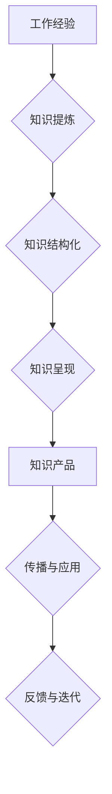

                 

## 程序员如何将工作经验转化为知识产品

> 关键词：工作经验、知识产品、技术博客、技术文档、在线课程、开源项目、技术分享、技术社区

## 1. 背景介绍

在当今科技日新月异的时代，程序员的工作经验是宝贵的财富。然而，很多程序员往往将自己的经验局限于个人项目或公司内部，未能将其转化为有价值的知识产品，以回馈技术社区，也未能充分利用自身经验获得更大的收益。

知识产品是指将知识、技能、经验等抽象化、体系化，并以某种形式呈现出来，供他人学习、参考或应用的产品。对于程序员来说，知识产品可以包括技术博客文章、技术文档、在线课程、开源项目、技术分享演讲等。

将工作经验转化为知识产品，不仅可以提升个人品牌价值，扩大影响力，还能为他人提供帮助，促进技术进步。

## 2. 核心概念与联系

**2.1 知识产品类型**

* **技术博客文章:**  分享技术经验、学习心得、项目案例等，以文字形式传播知识。
* **技术文档:**  对某个技术、工具或系统进行详细的说明和解释，方便他人学习和使用。
* **在线课程:**  以视频、音频、文字等多种形式，系统地讲解某个技术或技能，并提供练习和评估。
* **开源项目:**  将自己的代码开源，供他人学习、参考和改进，并通过社区合作不断完善项目。
* **技术分享演讲:**  在技术会议、研讨会等场合，分享自己的技术经验和见解，与同行交流学习。

**2.2 知识产品价值链**

* **个人价值:**  提升个人品牌价值、扩大影响力、获得收益、促进职业发展。
* **社区价值:**  促进技术交流、分享经验、推动技术进步、帮助他人学习。
* **社会价值:**  推动科技发展、解决社会问题、提升社会效率。

**2.3 知识产品架构**



## 3. 核心算法原理 & 具体操作步骤

**3.1 算法原理概述**

将工作经验转化为知识产品，本质上是一个知识提炼、结构化和呈现的过程。

* **知识提炼:**  从工作经验中提取关键信息、核心概念、实用技巧等，形成知识点。
* **知识结构化:**  将知识点按照逻辑关系进行组织和分类，构建知识体系。
* **知识呈现:**  将结构化的知识以易于理解和应用的形式呈现出来，例如文字、图片、视频、代码等。

**3.2 算法步骤详解**

1. **记录工作经验:**  在工作过程中，及时记录遇到的问题、解决方法、学习心得等，形成经验积累。
2. **分析和提炼:**  对记录的经验进行分析，提取关键信息和核心概念，形成知识点。
3. **构建知识体系:**  将知识点按照逻辑关系进行组织和分类，构建知识体系，例如按照技术领域、应用场景、难度等级等进行分类。
4. **选择知识呈现方式:**  根据知识内容和目标受众，选择合适的知识呈现方式，例如技术博客文章、技术文档、在线课程等。
5. **撰写或制作知识产品:**  根据选择的知识呈现方式，撰写或制作知识产品，并进行反复修改和完善。
6. **发布和推广:**  将知识产品发布到合适的平台，并进行推广，例如技术博客、技术社区、社交媒体等。
7. **收集反馈和迭代:**  收集用户反馈，对知识产品进行迭代优化，不断提升其质量和价值。

**3.3 算法优缺点**

* **优点:**  可以有效地将工作经验转化为有价值的知识产品，提升个人品牌价值和影响力。
* **缺点:**  需要投入时间和精力进行知识提炼、结构化和呈现，需要不断学习和更新知识，才能保持知识产品的竞争力。

**3.4 算法应用领域**

* **软件开发:**  将开发经验、技术技巧、项目案例等转化为技术博客文章、技术文档、在线课程等。
* **数据科学:**  将数据分析、机器学习等经验转化为技术博客文章、开源项目、技术分享演讲等。
* **云计算:**  将云计算技术、架构设计、运维经验等转化为技术文档、在线课程、开源项目等。

## 4. 数学模型和公式 & 详细讲解 & 举例说明

**4.1 数学模型构建**

将工作经验转化为知识产品可以看作是一个信息处理过程，可以使用信息论中的概念来建模。

* **信息熵:**  衡量信息的不确定性，可以用来衡量知识点的价值。
* **信息增益:**  衡量一个特征对目标变量的预测能力，可以用来衡量知识体系的结构化程度。

**4.2 公式推导过程**

* **信息熵公式:**  $$H(X) = -\sum_{i=1}^{n} p(x_i) \log_2 p(x_i)$$
    *  $X$ 是一个随机变量，$x_i$ 是 $X$ 的取值。
    *  $p(x_i)$ 是 $x_i$ 的概率。
* **信息增益公式:**  $$Gain(S,A) = H(S) - \sum_{v \in V} \frac{|S_v|}{|S|} H(S_v)$$
    *  $S$ 是训练数据集，$A$ 是一个特征。
    *  $V$ 是特征 $A$ 的取值集合。
    *  $S_v$ 是特征 $A$ 取值为 $v$ 的子集。

**4.3 案例分析与讲解**

假设我们有一个关于软件开发经验的知识库，包含了以下知识点:

* **编程语言:**  Java, Python, C++
* **软件开发框架:**  Spring, React, Django
* **软件测试:**  单元测试, 集成测试, 性能测试

我们可以使用信息熵和信息增益来评估这些知识点的价值和知识体系的结构化程度。

## 5. 项目实践：代码实例和详细解释说明

**5.1 开发环境搭建**

* **操作系统:**  Linux, macOS, Windows
* **编程语言:**  Python, JavaScript, Go
* **开发工具:**  VS Code, Atom, Sublime Text
* **版本控制系统:**  Git

**5.2 源代码详细实现**

```python
# 技术博客文章示例代码

import datetime

def create_blog_post(title, content):
    """
    创建技术博客文章

    Args:
        title (str): 文章标题
        content (str): 文章内容

    Returns:
        dict: 文章信息
    """
    now = datetime.datetime.now()
    post_info = {
        "title": title,
        "content": content,
        "created_at": now.strftime("%Y-%m-%d %H:%M:%S"),
        "updated_at": now.strftime("%Y-%m-%d %H:%M:%S")
    }
    return post_info

# 示例使用
blog_post = create_blog_post("如何优化 Python 代码性能", "...")
print(blog_post)
```

**5.3 代码解读与分析**

* 该代码定义了一个 `create_blog_post` 函数，用于创建技术博客文章的信息。
* 函数接受文章标题和内容作为参数，并返回一个包含文章信息的字典。
* 字典包含文章标题、内容、创建时间和更新时间等信息。
* 示例代码演示了如何使用该函数创建一条技术博客文章的信息。

**5.4 运行结果展示**

```
{'title': '如何优化 Python 代码性能', 'content': '...', 'created_at': '2023-10-27 10:00:00', 'updated_at': '2023-10-27 10:00:00'}
```

## 6. 实际应用场景

**6.1 技术博客文章**

程序员可以将自己的技术经验、学习心得、项目案例等分享到技术博客，建立个人品牌，扩大影响力，并获得收益。

**6.2 技术文档**

程序员可以编写技术文档，对某个技术、工具或系统进行详细的说明和解释，方便他人学习和使用。

**6.3 在线课程**

程序员可以录制视频、制作音频、编写文字等，系统地讲解某个技术或技能，并提供练习和评估，制作在线课程。

**6.4 开源项目**

程序员可以将自己的代码开源，供他人学习、参考和改进，并通过社区合作不断完善项目。

**6.5 技术分享演讲**

程序员可以参加技术会议、研讨会等场合，分享自己的技术经验和见解，与同行交流学习。

**6.6 未来应用展望**

随着人工智能、虚拟现实等技术的不断发展，知识产品的形式和内容将更加丰富多样。程序员可以利用这些新技术，创作更具互动性和沉浸感的知识产品，为他人提供更优质的学习体验。

## 7. 工具和资源推荐

**7.1 学习资源推荐**

* **在线学习平台:**  Coursera, Udemy, edX
* **技术博客:**  Hacker News, Medium, Dev.to
* **技术社区:**  Stack Overflow, GitHub, Reddit

**7.2 开发工具推荐**

* **代码编辑器:**  VS Code, Atom, Sublime Text
* **版本控制系统:**  Git
* **项目管理工具:**  Trello, Jira

**7.3 相关论文推荐**

* **知识图谱:**  Knowledge Graphs: A Survey
* **知识提取:**  Knowledge Extraction from Text: A Survey
* **知识表示:**  Knowledge Representation and Reasoning

## 8. 总结：未来发展趋势与挑战

**8.1 研究成果总结**

将工作经验转化为知识产品是一个重要的研究方向，已经取得了一定的成果。

* **知识提炼技术:**  已经发展出一些有效的知识提炼技术，例如自然语言处理、机器学习等。
* **知识结构化技术:**  已经发展出一些知识结构化技术，例如知识图谱、本体论等。
* **知识呈现技术:**  已经发展出一些知识呈现技术，例如可视化、交互式学习等。

**8.2 未来发展趋势**

* **人工智能技术:**  人工智能技术将进一步推动知识提炼、结构化和呈现的自动化和智能化。
* **个性化学习:**  知识产品将更加注重个性化定制，根据用户的学习需求和习惯提供个性化的学习内容和路径。
* **沉浸式体验:**  知识产品将更加注重沉浸式体验，例如虚拟现实、增强现实等技术将被应用于知识产品的开发。

**8.3 面临的挑战**

* **知识质量:**  知识产品的质量取决于知识的准确性、完整性和时效性。
* **知识可访问性:**  知识产品需要以易于理解和使用的形式呈现，并提供便捷的访问方式。
* **知识传播:**  知识产品需要有效的传播渠道和推广策略，才能被更多的人所知晓和使用。

**8.4 研究展望**

未来，将继续研究如何提高知识提炼、结构化和呈现的效率和质量，以及如何将知识产品更好地应用于教育、培训、科研等领域。


## 9. 附录：常见问题与解答

**9.1 如何选择合适的知识呈现方式？**

* **目标受众:**  不同的受众群体对知识呈现方式有不同的偏好。例如，程序员更喜欢阅读技术文档和代码示例，而普通用户则更喜欢观看视频和阅读简短的文章。
* **知识内容:**  不同的知识内容适合不同的呈现方式。例如，复杂的技术概念更适合用图文并茂的方式呈现，而简单的操作步骤则可以用文字或视频的方式呈现。
* **个人能力:**  选择适合自己能力的知识呈现方式，例如，如果擅长写作，可以选择撰写技术博客文章；如果擅长视频制作，可以选择制作在线课程。

**9.2 如何推广知识产品？**

* **技术社区:**  在技术社区发布文章、分享代码、参与讨论，提高知识产品的曝光度。
* **社交媒体:**  在社交媒体平台分享知识产品链接，并与用户互动。
* **付费推广:**  在搜索引擎、社交媒体等平台进行付费推广，精准触达目标用户。


作者：禅与计算机程序设计艺术 / Zen and the Art of Computer Programming 
<end_of_turn>

