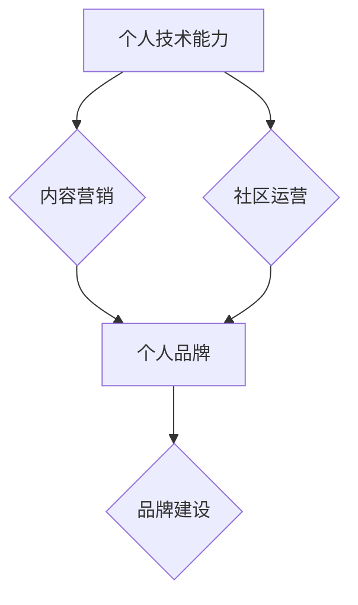

                 

## 程序员如何打造个人IP矩阵

> 关键词：个人IP，技术博客，内容营销，品牌建设，社区运营，技术专家，程序员

### 1. 背景介绍

在当今科技日新月异的时代，程序员作为数字世界的核心力量，拥有着巨大的影响力和价值。然而，在激烈的竞争环境下，仅仅拥有扎实的技术能力已经不足以立于不败之地。如何打造个人品牌，提升个人影响力，成为行业内的领军人物，成为了众多程序员共同的追求。

个人IP矩阵的概念正是为了解决这一问题而提出的。它指的是程序员通过构建多维度的个人品牌体系，在技术领域建立起独特的认知和影响力。个人IP矩阵的核心在于将个人技术能力、内容输出、社区运营、品牌建设等多个方面有机结合，形成一个完整的个人品牌生态系统。

### 2. 核心概念与联系

个人IP矩阵的核心概念包括：

* **个人品牌 (Personal Brand):**  程序员在特定领域内所建立的独特形象和声誉，包括技术能力、专业领域、价值观、个人风格等。
* **内容营销 (Content Marketing):** 通过创作高质量的技术博客文章、视频教程、开源项目等内容，吸引目标受众，建立信任关系，提升个人影响力。
* **社区运营 (Community Operation):**  积极参与技术社区，分享经验、解答问题、参与讨论，建立人脉关系，扩大个人影响力。
* **品牌建设 (Brand Building):**  通过设计个人网站、社交媒体账号、品牌logo等，打造统一的个人品牌形象，提升品牌认知度和辨识度。

这些概念相互关联，共同构成了个人IP矩阵的完整体系。

**Mermaid 流程图:**

### 3. 核心算法原理 & 具体操作步骤

打造个人IP矩阵并非一蹴而就，需要程序员遵循一定的步骤和策略，逐步积累和提升个人品牌价值。

#### 3.1 算法原理概述

个人IP矩阵的构建可以看作是一个迭代优化过程，需要不断根据市场反馈和自身发展进行调整和完善。

#### 3.2 算法步骤详解

1. **自我定位和目标设定:**  程序员需要明确自己的技术领域、个人优势和目标受众，制定清晰的个人品牌定位和目标。
2. **内容输出和积累:**  程序员需要持续创作高质量的技术博客文章、视频教程、开源项目等内容，并通过社交媒体平台进行推广和分享。
3. **社区参与和互动:**  程序员需要积极参与技术社区，分享经验、解答问题、参与讨论，建立人脉关系，提升个人影响力。
4. **品牌形象打造:**  程序员需要设计个人网站、社交媒体账号、品牌logo等，打造统一的个人品牌形象，提升品牌认知度和辨识度。
5. **数据分析和优化:**  程序员需要定期分析内容表现、社区参与度、品牌影响力等数据，根据反馈进行调整和优化，不断提升个人IP矩阵的价值。

#### 3.3 算法优缺点

**优点:**

* **提升个人影响力:**  通过打造个人IP矩阵，程序员可以提升个人品牌价值，在技术领域建立起独特的认知和影响力。
* **拓展职业发展:**  个人IP矩阵可以帮助程序员拓展职业发展机会，吸引更多潜在雇主和合作方。
* **建立个人品牌资产:**  个人IP矩阵可以成为程序员的个人品牌资产，为未来发展提供保障。

**缺点:**

* **时间和精力投入:**  打造个人IP矩阵需要程序员投入大量的时间和精力，需要坚持不懈的努力。
* **内容创作难度:**  高质量的内容创作需要程序员具备一定的写作能力和表达能力，需要不断学习和提升。
* **市场竞争激烈:**  技术领域竞争激烈，打造个人IP矩阵需要程序员不断创新和突破，才能脱颖而出。

#### 3.4 算法应用领域

个人IP矩阵的应用领域非常广泛，包括：

* **技术博客:**  程序员可以通过技术博客分享技术经验、发表原创文章，提升个人影响力。
* **开源项目:**  程序员可以通过开源项目展示技术能力，积累代码经验，建立个人品牌。
* **技术社区:**  程序员可以通过积极参与技术社区，分享经验、解答问题，建立人脉关系，提升个人影响力。
* **线上课程:**  程序员可以通过录制线上课程，分享技术知识，建立个人品牌。

### 4. 数学模型和公式 & 详细讲解 & 举例说明

个人IP矩阵的构建可以抽象为一个数学模型，其中个人品牌价值可以看作是一个函数，取决于多个因素的综合影响。

#### 4.1 数学模型构建

设个人IP矩阵的价值为 V，则可以构建如下数学模型：

$$V = f(T, C, S, B)$$

其中：

* T 代表个人技术能力
* C 代表内容输出量和质量
* S 代表社区参与度和影响力
* B 代表品牌建设和认知度

#### 4.2 公式推导过程

每个因素的权重可以通过数据分析和市场调研确定，例如：

* T 的权重可以根据个人技术能力在行业内的排名和认可度进行评估。
* C 的权重可以根据内容输出量、阅读量、点赞量等指标进行评估。
* S 的权重可以根据社区参与度、粉丝数量、影响力等指标进行评估。
* B 的权重可以根据品牌认知度、搜索引擎排名、媒体曝光度等指标进行评估。

#### 4.3 案例分析与讲解

例如，假设一个程序员在人工智能领域拥有很高的技术能力 (T=90)，他定期发布高质量的技术博客文章 (C=80)，积极参与人工智能社区，并拥有较高的粉丝数量和影响力 (S=70)，他同时建立了一个个人品牌网站，并获得了部分媒体曝光 (B=60)。

根据上述模型和权重，我们可以计算出该程序员的个人IP矩阵价值：

$$V = 0.4 * 90 + 0.3 * 80 + 0.2 * 70 + 0.1 * 60 = 36 + 24 + 14 + 6 = 80$$

### 5. 项目实践：代码实例和详细解释说明

#### 5.1 开发环境搭建

打造个人IP矩阵需要搭建一个完善的开发环境，包括：

* **个人网站:**  可以使用 WordPress、Hugo 等开源平台搭建个人网站，展示个人技术能力、项目经验、博客文章等内容。
* **社交媒体账号:**  在 GitHub、Twitter、LinkedIn 等平台建立个人账号，分享技术经验、参与讨论、建立人脉关系。
* **博客平台:**  可以使用 Medium、CSDN 等博客平台发布技术文章，积累内容输出。

#### 5.2 源代码详细实现

由于个人IP矩阵的构建是一个综合性的过程，没有一个特定的源代码实现。

#### 5.3 代码解读与分析

代码解读和分析主要针对个人网站、社交媒体账号、博客平台等平台的开发和维护。

#### 5.4 运行结果展示

运行结果展示主要体现在个人网站、社交媒体账号、博客平台等平台的访问量、用户互动、品牌认知度等指标上。

### 6. 实际应用场景

#### 6.1 技术博客

程序员可以通过技术博客分享技术经验、发表原创文章，提升个人影响力。例如，可以撰写关于特定技术框架、编程语言、开发工具的教程、案例分析、技术趋势预测等内容。

#### 6.2 开源项目

程序员可以通过开源项目展示技术能力、积累代码经验，建立个人品牌。例如，可以开发一个开源的工具库、框架、应用程序，并将其发布到 GitHub 等平台。

#### 6.3 社区运营

程序员可以通过积极参与技术社区，分享经验、解答问题、参与讨论，提升个人影响力。例如，可以加入 Stack Overflow、Reddit、微信群等技术社区，积极参与讨论，解答问题，分享经验。

#### 6.4 未来应用展望

随着人工智能、大数据、云计算等技术的快速发展，个人IP矩阵的应用场景将会更加广泛。例如，程序员可以利用人工智能技术，自动生成技术文档、代码注释、学习资源等，提高内容输出效率。

### 7. 工具和资源推荐

#### 7.1 学习资源推荐

* **书籍:** 《程序员如何打造个人IP矩阵》、《技术博客写作指南》、《开源项目开发实战》
* **在线课程:** Udemy、Coursera、Udacity 等平台提供丰富的技术课程，可以帮助程序员提升技术能力和个人品牌价值。
* **技术社区:** Stack Overflow、Reddit、GitHub 等技术社区可以帮助程序员学习新技术、解决问题、建立人脉关系。

#### 7.2 开发工具推荐

* **个人网站搭建平台:** WordPress、Hugo、Ghost 等开源平台可以帮助程序员快速搭建个人网站。
* **社交媒体管理工具:** Hootsuite、Buffer 等工具可以帮助程序员管理多个社交媒体账号，提高内容推广效率。
* **内容创作工具:** Grammarly、Hemingway Editor 等工具可以帮助程序员提高写作质量。

#### 7.3 相关论文推荐

* **个人品牌建设:**  "The Impact of Personal Branding on Career Success"
* **内容营销:**  "Content Marketing: A Strategic Approach"
* **社区运营:**  "Community Building for Online Platforms"

### 8. 总结：未来发展趋势与挑战

#### 8.1 研究成果总结

个人IP矩阵的构建是一个不断迭代和完善的过程，需要程序员不断学习和实践，才能打造出具有独特价值的个人品牌。

#### 8.2 未来发展趋势

未来，个人IP矩阵的构建将会更加注重个性化、智能化和数据化。例如，人工智能技术可以帮助程序员自动生成个性化的内容推荐、分析用户行为数据，优化内容输出策略。

#### 8.3 面临的挑战

个人IP矩阵的构建也面临着一些挑战，例如：

* **内容创作质量:**  高质量的内容创作需要程序员具备一定的写作能力和表达能力，需要不断学习和提升。
* **市场竞争激烈:**  技术领域竞争激烈，打造个人IP矩阵需要程序员不断创新和突破，才能脱颖而出。
* **数据安全和隐私:**  个人IP矩阵的构建需要收集和分析用户数据，需要程序员重视数据安全和隐私保护。

#### 8.4 研究展望

未来，个人IP矩阵的研究将会更加深入，例如：

* **个性化IP矩阵构建:**  根据用户的兴趣、需求、行为等数据，构建个性化的IP矩阵，提供更精准的内容推荐和服务。
* **智能化IP矩阵管理:**  利用人工智能技术，自动分析数据、优化策略，帮助程序员更有效地管理个人IP矩阵。
* **跨平台IP矩阵整合:**  将个人IP矩阵整合到多个平台，形成一个完整的个人品牌生态系统。

### 9. 附录：常见问题与解答

**常见问题:**

* 如何打造个人IP矩阵？
* 个人IP矩阵的价值体现在哪里？
* 如何维护个人IP矩阵？

**解答:**

* 打造个人IP矩阵需要程序员明确目标、持续输出高质量内容、积极参与社区、打造品牌形象等。
* 个人IP矩阵的价值体现在提升个人影响力、拓展职业发展、建立个人品牌资产等方面。
* 维护个人IP矩阵需要程序员定期更新内容、参与社区互动、分析数据、优化策略等。

作者：禅与计算机程序设计艺术 / Zen and the Art of Computer Programming 
<end_of_turn>

