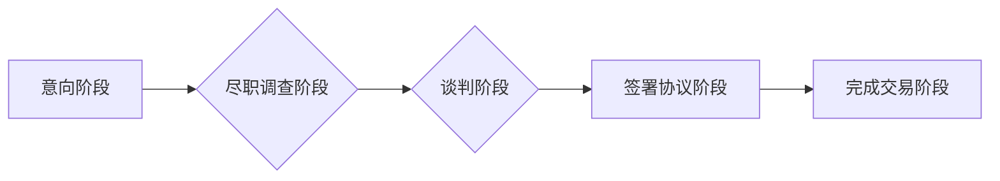

                 

## 程序员如何评估并购offer的真实价值

> 关键词：并购、估值、程序员、技术资产、财务分析、风险评估、谈判策略

## 1. 背景介绍

作为一名程序员，你可能在某个时刻会面临一个重要的决定：接受一家公司提出的并购offer。这不仅关乎你个人的职业发展，也可能影响到你的团队、你的项目，甚至你的整个公司。然而，并购offer的真实价值往往隐藏在复杂的财务报表和商业谈判背后，需要程序员具备一定的评估能力才能做出明智的决定。

本文将从程序员的角度出发，深入探讨如何评估并购offer的真实价值，帮助你理解并购交易的本质，掌握必要的评估技巧，并最终做出最有利于自己的选择。

## 2. 核心概念与联系

**2.1 并购交易的本质**

并购交易是指一家公司（收购方）收购另一家公司（被收购方）的全部或部分股权的行为。并购交易的目的是为了获得被收购方的技术、市场、人才等资源，从而实现自身的发展目标。

**2.2 程序员视角下的并购价值**

从程序员的角度来看，并购交易的价值主要体现在以下几个方面：

* **技术资产的价值:** 被收购方的技术团队、代码库、专利等技术资产是并购交易的核心价值。
* **市场份额的价值:** 被收购方的市场份额、客户群体、品牌影响力等市场资源也是重要的价值体现。
* **人才资源的价值:** 被收购方的技术人才、管理人才、销售人才等都是宝贵的资源。

**2.3 并购交易流程**

并购交易通常经历以下几个阶段：

* **意向阶段:** 双方初步沟通，确定并购意向。
* **尽职调查阶段:** 收购方对被收购方进行全面的财务、法律、技术等方面的调查。
* **谈判阶段:** 双方就收购价格、交易结构、交割时间等关键条款进行谈判。
* **签署协议阶段:** 双方签署并购协议，明确交易条款。
* **完成交易阶段:** 完成所有必要的审批程序，最终完成并购交易。

**2.4 Mermaid 流程图**



## 3. 核心算法原理 & 具体操作步骤

**3.1 算法原理概述**

评估并购offer的真实价值是一个复杂的决策过程，需要综合考虑多种因素，并运用一定的算法模型进行分析。

**3.2 算法步骤详解**

1. **收集信息:** 收集被收购方和收购方的财务报表、技术文档、市场数据等相关信息。
2. **财务分析:** 对被收购方的财务状况进行分析，包括收入、利润、资产负债率、现金流等指标。
3. **技术评估:** 对被收购方的技术资产进行评估，包括代码质量、技术领先性、专利数量等。
4. **市场分析:** 对被收购方的市场份额、客户群体、竞争对手等进行分析。
5. **风险评估:** 评估并购交易所带来的风险，包括财务风险、技术风险、市场风险等。
6. **估值模型:** 选择合适的估值模型，例如DCF模型、倍数模型等，对被收购方的价值进行估算。
7. **谈判策略:** 根据估值结果和风险评估，制定合理的谈判策略，争取有利于自己的交易条款。

**3.3 算法优缺点**

* **优点:** 能够提供一个系统化的评估框架，帮助程序员更全面地了解并购交易的价值。
* **缺点:** 算法模型的准确性依赖于输入数据的质量，以及模型本身的假设条件。

**3.4 算法应用领域**

该算法模型可以应用于各种类型的并购交易，包括技术并购、战略并购、财务并购等。

## 4. 数学模型和公式 & 详细讲解 & 举例说明

**4.1 数学模型构建**

**4.1.1 DCF模型**

DCF模型（Discounted Cash Flow模型）是一种常用的估值模型，它基于未来现金流的现值来估算一个公司的价值。

**公式:**

$$V = \sum_{t=1}^{n} \frac{CF_t}{(1+r)^t} + \frac{FV_n}{(1+r)^n}$$

其中：

* $V$：公司价值
* $CF_t$：第t年的现金流
* $r$：贴现率
* $n$：预测期
* $FV_n$：预测期末的终端价值

**4.1.2 倍数模型**

倍数模型是一种基于市场上类似公司交易的估值模型，它将被收购方的价值与其财务指标（例如收入、利润、资产等）的倍数进行比较。

**公式:**

$$V = Multiple \times Financial Metric$$

其中：

* $V$：公司价值
* $Multiple$：市场上类似公司交易的倍数
* $Financial Metric$：被收购方的财务指标

**4.2 公式推导过程**

DCF模型的公式推导过程基于以下假设：

* 公司未来的现金流是可预测的。
* 公司的贴现率是稳定的。
* 公司的终端价值可以被估算出来。

倍数模型的公式推导过程基于以下假设：

* 市场上的类似公司交易是合理的参考。
* 被收购方的财务指标与类似公司的财务指标具有可比性。

**4.3 案例分析与讲解**

假设一家技术公司正在考虑收购一家拥有优秀技术团队的创业公司。

* **DCF模型:** 可以根据创业公司的未来现金流预测，以及市场上的风险溢价率，计算出其价值。
* **倍数模型:** 可以参考市场上类似技术公司的交易倍数，以及创业公司的收入、利润等财务指标，估算其价值。

最终的估值结果将取决于具体的财务数据、市场环境和风险评估。

## 5. 项目实践：代码实例和详细解释说明

**5.1 开发环境搭建**

* Python 3.x 环境
* pandas 库用于数据分析
* numpy 库用于数值计算
* matplotlib 库用于数据可视化

**5.2 源代码详细实现**

```python
import pandas as pd
import numpy as np
from matplotlib import pyplot as plt

# 导入财务数据
data = pd.read_csv('financial_data.csv')

# 计算未来现金流
def calculate_future_cash_flow(data, growth_rate, discount_rate):
    # ...

# 计算终端价值
def calculate_terminal_value(data, growth_rate, discount_rate):
    # ...

# 计算公司价值
def calculate_company_value(data, growth_rate, discount_rate):
    # ...

# 运行代码
company_value = calculate_company_value(data, 0.1, 0.1)
print(f'公司价值: {company_value}')

# 可视化数据
# ...
```

**5.3 代码解读与分析**

* `calculate_future_cash_flow()` 函数根据历史数据和预期的增长率计算未来现金流。
* `calculate_terminal_value()` 函数根据未来现金流的增长率和贴现率计算终端价值。
* `calculate_company_value()` 函数将未来现金流和终端价值进行折现，最终计算出公司的价值。

**5.4 运行结果展示**

运行代码后，程序将输出公司的估值结果，并可以生成图表展示财务数据和现金流预测。

## 6. 实际应用场景

**6.1 并购交易评估**

程序员可以利用上述算法模型和代码实例，对并购交易的真实价值进行评估，帮助自己做出明智的决策。

**6.2 技术资产估值**

程序员可以利用技术评估模型，对自己的技术资产进行估值，为并购交易提供参考依据。

**6.3 创业公司估值**

创业公司可以利用上述算法模型，对自己的公司价值进行估算，以便吸引投资和进行融资。

**6.4 未来应用展望**

随着人工智能技术的不断发展，并购交易评估的算法模型将更加智能化和自动化，程序员将能够更轻松地进行并购交易评估。

## 7. 工具和资源推荐

**7.1 学习资源推荐**

* **书籍:** 《估值与投资》
* **在线课程:** Coursera 上的并购交易课程
* **网站:** Crunchbase、PitchBook 等并购交易数据平台

**7.2 开发工具推荐**

* **Python:** 数据分析和编程语言
* **pandas:** 数据分析库
* **numpy:** 数值计算库
* **matplotlib:** 数据可视化库

**7.3 相关论文推荐**

* **DCF模型:** Myers, S. C. (1997). Corporate Finance. McGraw-Hill.
* **倍数模型:** Damodaran, A. (2018). Investment Valuation: Tools and Techniques for Determining the Value of Any Asset. Wiley.

## 8. 总结：未来发展趋势与挑战

**8.1 研究成果总结**

本文探讨了程序员如何评估并购offer的真实价值，介绍了常用的估值模型和算法步骤，并提供了代码实例和实际应用场景。

**8.2 未来发展趋势**

* **人工智能驱动的估值:** 人工智能技术将被应用于并购交易评估，提高估值效率和准确性。
* **数据驱动的决策:** 大数据分析将为并购交易提供更丰富的决策依据。
* **个性化估值:** 估值模型将更加个性化，能够根据不同的交易场景和公司特点进行定制。

**8.3 面临的挑战**

* **数据质量:** 估值模型的准确性依赖于输入数据的质量，如何获取高质量的数据仍然是一个挑战。
* **模型复杂性:** 复杂的估值模型需要专业的知识和技能才能理解和应用。
* **风险评估:** 并购交易存在一定的风险，如何准确评估风险仍然是一个难题。

**8.4 研究展望**

未来研究将继续探索人工智能驱动的估值模型，以及如何更好地处理数据质量和风险评估问题，为程序员提供更精准、更便捷的并购交易评估工具。

## 9. 附录：常见问题与解答

**9.1 如何选择合适的估值模型？**

选择合适的估值模型需要根据具体的交易场景和公司特点进行判断。

**9.2 如何获取高质量的数据？**

可以通过公开数据平台、行业报告、公司财务报表等途径获取高质量的数据。

**9.3 如何评估并购交易的风险？**

可以通过分析财务报表、市场环境、竞争对手等因素，评估并购交易的风险。


作者：禅与计算机程序设计艺术 / Zen and the Art of Computer Programming 
<end_of_turn>

