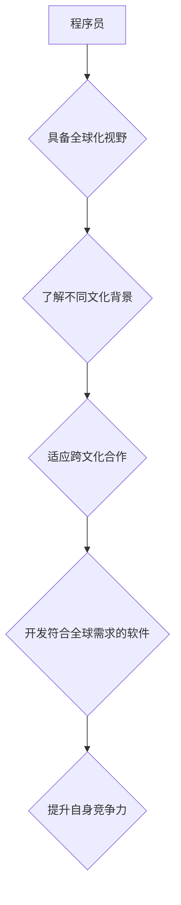

                 

## 程序员的全球化视野：机遇与挑战

> 关键词：全球化、程序员、机遇、挑战、技术、文化、合作、创新、未来

### 1. 背景介绍

在当今世界，科技发展日新月异，互联网无处不在，全球化浪潮席卷全球。作为科技发展的重要力量，程序员群体也面临着前所未有的机遇和挑战。

随着全球经济一体化进程的加速，软件开发已成为全球化的产业。跨国公司、跨地域团队、跨文化合作成为常态。程序员需要具备更广阔的视野，了解不同文化背景下的工作方式和沟通习惯，才能在全球化环境中高效协作。

另一方面，全球化也带来了激烈的竞争。来自世界各地的程序员都在争夺有限的资源和机会。程序员需要不断提升自身的技术水平和竞争力，才能在全球人才市场中脱颖而出。

### 2. 核心概念与联系

**2.1 全球化视野**

全球化视野是指程序员对世界局势、文化差异、经济发展趋势等方面有深入的理解和认识，能够将自身的工作与全球发展趋势相结合，并从中获得启发和借鉴。

**2.2 程序员角色演变**

随着全球化的发展，程序员的角色也发生了转变。从单纯的代码编写者，逐渐演变成能够独立完成项目、领导团队、参与跨文化合作的复合型人才。

**2.3 技术与文化的融合**

技术和文化是相互影响、相互促进的。程序员需要了解不同文化背景下的技术需求和使用习惯，才能开发出更符合用户需求的软件产品。

**Mermaid 流程图**



### 3. 核心算法原理 & 具体操作步骤

**3.1 算法原理概述**

在全球化背景下，程序员需要掌握一些核心算法，例如：

* **数据结构算法**: 用于高效存储和处理海量数据，例如树、图、哈希表等。
* **机器学习算法**: 用于分析数据、发现模式、进行预测，例如决策树、支持向量机、神经网络等。
* **分布式算法**: 用于协调多个节点之间的协作，例如一致性算法、容错算法等。

**3.2 算法步骤详解**

以数据结构算法为例，其具体操作步骤包括：

1. **选择合适的算法**: 根据具体需求选择合适的算法，例如，如果需要快速查找数据，可以选择哈希表；如果需要排序数据，可以选择快速排序算法。
2. **实现算法**: 使用编程语言实现选择的算法，并进行测试验证。
3. **优化算法**: 根据实际情况对算法进行优化，例如，减少时间复杂度、空间复杂度等。

**3.3 算法优缺点**

每个算法都有其优缺点，程序员需要根据具体情况选择合适的算法。例如，哈希表查找速度快，但存储空间较大；快速排序算法时间复杂度低，但空间复杂度较高。

**3.4 算法应用领域**

数据结构算法广泛应用于各个领域，例如：

* **搜索引擎**: 用于快速检索海量数据。
* **社交网络**: 用于存储和管理用户关系。
* **电子商务**: 用于推荐商品、处理订单等。

### 4. 数学模型和公式 & 详细讲解 & 举例说明

**4.1 数学模型构建**

在程序设计中，数学模型可以用来描述算法的运行过程、数据结构的特性等。例如，可以使用图论模型来描述社交网络的关系，可以使用概率模型来描述机器学习算法的决策过程。

**4.2 公式推导过程**

程序员需要掌握一些基本的数学公式，例如：

* **时间复杂度**: 用于衡量算法的时间效率，例如，O(n)表示时间复杂度与输入数据大小成线性关系。
* **空间复杂度**: 用于衡量算法的空间效率，例如，O(1)表示空间复杂度与输入数据大小无关。

**4.3 案例分析与讲解**

以时间复杂度为例，我们可以分析一下不同算法的时间复杂度：

* **线性搜索**: 时间复杂度为O(n)，需要遍历所有数据元素才能找到目标元素。
* **二分查找**: 时间复杂度为O(log n)，需要不断将搜索范围缩小一半，效率更高。

**4.4 数学公式举例说明**

$$
T(n) = 2T(n/2) + n
$$

这是一个递归式的时间复杂度公式，用于描述分治算法的时间复杂度。

**4.5 数学模型应用场景**

数学模型在程序设计中应用广泛，例如：

* **算法分析**: 用于评估算法的效率。
* **数据结构设计**: 用于设计高效的数据结构。
* **系统性能优化**: 用于分析和优化系统性能。

### 5. 项目实践：代码实例和详细解释说明

**5.1 开发环境搭建**

程序员需要选择合适的开发环境，例如：

* **操作系统**: Windows、Linux、macOS等。
* **编程语言**: Python、Java、C++等。
* **IDE**: Eclipse、IntelliJ IDEA、VS Code等。

**5.2 源代码详细实现**

以Python为例，实现一个简单的线性搜索算法：

```python
def linear_search(arr, target):
  """
  线性搜索算法

  Args:
    arr: 待搜索的数组
    target: 目标值

  Returns:
    目标值在数组中的索引，如果未找到则返回-1
  """
  for i in range(len(arr)):
    if arr[i] == target:
      return i
  return -1

# 示例用法
arr = [1, 2, 3, 4, 5]
target = 3
index = linear_search(arr, target)
if index != -1:
  print(f"目标值 {target} 在数组中的索引为 {index}")
else:
  print(f"目标值 {target} 未在数组中找到")
```

**5.3 代码解读与分析**

该代码实现了一个线性搜索算法，它遍历数组中的每个元素，如果找到目标值，则返回其索引；否则返回-1。

**5.4 运行结果展示**

运行该代码，输出结果为：

```
目标值 3 在数组中的索引为 2
```

### 6. 实际应用场景

**6.1 搜索引擎**

搜索引擎使用各种算法，例如：

* **PageRank**: 用于评估网页的重要性。
* **TF-IDF**: 用于计算关键词的重要性。
* **自然语言处理**: 用于理解用户搜索意图。

**6.2 社交网络**

社交网络使用各种算法，例如：

* **推荐算法**: 用于推荐朋友、内容等。
* **图算法**: 用于分析用户关系。
* **流算法**: 用于处理实时数据流。

**6.3 电子商务**

电子商务使用各种算法，例如：

* **商品推荐算法**: 用于推荐商品。
* **价格优化算法**: 用于优化商品价格。
* **库存管理算法**: 用于管理商品库存。

**6.4 未来应用展望**

随着人工智能、大数据等技术的不断发展，程序员将面临更多新的应用场景，例如：

* **自动驾驶**: 需要开发复杂的算法来控制车辆。
* **医疗诊断**: 需要开发算法来辅助医生诊断疾病。
* **个性化教育**: 需要开发算法来提供个性化的学习方案。

### 7. 工具和资源推荐

**7.1 学习资源推荐**

* **在线课程**: Coursera、edX、Udemy等平台提供丰富的编程课程。
* **书籍**: 《程序员的自我修养》、《代码的艺术》等经典书籍。
* **开源项目**: GitHub、GitLab等平台提供大量的开源项目，可以学习其他程序员的代码。

**7.2 开发工具推荐**

* **IDE**: Eclipse、IntelliJ IDEA、VS Code等。
* **版本控制系统**: Git、SVN等。
* **测试工具**: JUnit、pytest等。

**7.3 相关论文推荐**

* **ACM Transactions on Programming Languages and Systems (TOPLAS)**
* **IEEE Transactions on Software Engineering (TSE)**
* **Journal of the ACM (JACM)**

### 8. 总结：未来发展趋势与挑战

**8.1 研究成果总结**

近年来，程序员领域取得了丰硕的成果，例如：

* **人工智能**: 深度学习、自然语言处理等领域取得了突破性进展。
* **云计算**: 云平台的普及，使得程序员可以更容易地访问和利用计算资源。
* **移动互联网**: 移动设备的普及，使得程序员需要开发更加便捷、高效的移动应用。

**8.2 未来发展趋势**

未来，程序员领域将继续朝着以下方向发展：

* **更智能的软件**: 人工智能将被更加广泛地应用于软件开发，使得软件更加智能、人性化。
* **更安全的软件**: 随着网络安全威胁的不断增加，程序员需要更加重视软件安全，开发更加安全的软件。
* **更可持续的软件**: 程序员需要考虑软件的生态环境影响，开发更加可持续的软件。

**8.3 面临的挑战**

程序员也面临着一些挑战，例如：

* **技术更新迭代**: 科技发展日新月异，程序员需要不断学习新的技术，才能保持竞争力。
* **人才短缺**: 全球范围内对程序员的需求量不断增加，但人才供给不足。
* **跨文化合作**: 随着全球化进程的加速，程序员需要具备跨文化合作的能力。

**8.4 研究展望**

未来，程序员需要更加注重以下方面的研究：

* **人工智能的伦理问题**: 人工智能的应用需要考虑伦理问题，例如算法偏见、数据隐私等。
* **软件的可解释性**: 程序员需要开发更加可解释的软件，以便用户能够理解软件的决策过程。
* **软件的可靠性**: 程序员需要开发更加可靠的软件，以避免软件故障带来的损失。

### 9. 附录：常见问题与解答

**9.1 如何提高编程效率？**

* **掌握常用的算法和数据结构**: 
* **使用合适的工具**: 
* **编写简洁、易读的代码**: 
* **进行代码复查**: 

**9.2 如何应对跨文化合作的挑战？**

* **了解不同文化背景下的工作方式和沟通习惯**: 
* **保持良好的沟通和协作**: 
* **尊重彼此的文化差异**: 

**9.3 如何保持学习的动力？**

* **设定明确的目标**: 
* **寻找合适的学习资源**: 
* **与其他程序员交流学习**: 
* **参与开源项目**: 


作者：禅与计算机程序设计艺术 / Zen and the Art of Computer Programming 
<end_of_turn>

