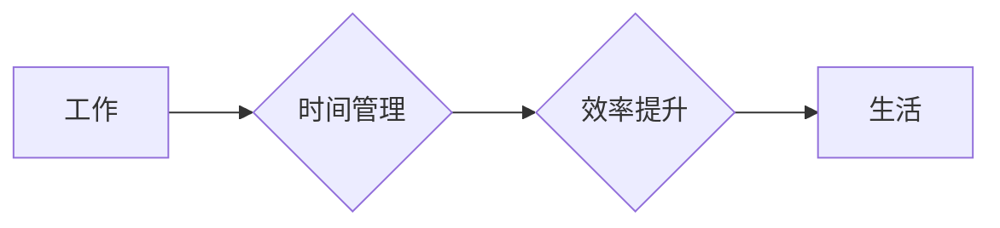

                 

## 程序员的工作与生活平衡：实现之道

> 关键词：程序员，工作与生活平衡，时间管理，效率提升，心理健康，个人成长，技术发展，职业规划

### 1. 背景介绍

在当今科技飞速发展的时代，程序员作为数字世界的建造者，肩负着构建未来、推动社会进步的重要使命。然而，这份充满挑战和机遇的职业也常常伴随着高强度的工作压力、长时间的代码编写和紧迫的项目交付。如何平衡工作和生活，保持身心健康，实现个人成长，成为众多程序员面临的共同难题。

程序员的工作节奏通常是快速且紧凑的，需要长时间专注于代码编写、调试和测试，这很容易导致工作时间过长、睡眠不足、缺乏运动和社交活动，进而影响身心健康。长期处于这种状态下，容易出现焦虑、抑郁、疲劳等问题，甚至影响工作效率和创造力。

### 2. 核心概念与联系

工作与生活平衡的核心概念是**时间管理**和**效率提升**。

程序员需要合理规划时间，将工作和生活任务分配到不同的时间段，避免工作时间过长，侵占生活时间。同时，提高工作效率，缩短完成任务的时间，才能腾出更多时间用于休息、娱乐和个人发展。

**Mermaid 流程图：**



### 3. 核心算法原理 & 具体操作步骤

#### 3.1  算法原理概述

工作与生活平衡的实现本质上是一个时间分配和效率优化问题，可以将其视为一个算法。

该算法的核心原理是：

* **时间规划:** 将时间划分为不同的时间段，分别用于工作、休息、娱乐、学习等不同类型活动。
* **任务优先级:** 根据任务的重要性、紧急程度和截止时间，制定任务优先级，并合理分配时间。
* **效率提升:** 采用高效的工作方法，减少不必要的浪费时间，提高工作效率。

#### 3.2  算法步骤详解

1. **时间记录:** 使用时间跟踪工具记录每天的工作时间和活动内容，了解时间使用情况。
2. **时间分析:** 分析时间记录数据，找出时间浪费的来源，例如频繁的社交媒体使用、无意义的会议等。
3. **时间规划:** 根据时间分析结果，制定合理的每日工作计划，将时间分配到不同类型活动中。
4. **任务优先级:** 将工作任务按照重要性和紧急程度进行排序，优先完成重要且紧急的任务。
5. **效率提升:** 采用番茄工作法、Pomodoro Technique等高效工作方法，提高工作效率。
6. **定期评估:** 定期评估时间管理计划的执行情况，根据实际情况进行调整和优化。

#### 3.3  算法优缺点

**优点:**

* 可以有效提高时间利用率，缩短工作时间。
* 可以帮助程序员更好地规划时间，平衡工作和生活。
* 可以提高工作效率，减少工作压力。

**缺点:**

* 需要程序员付出一定的学习成本，掌握时间管理和效率提升的方法。
* 需要程序员坚持执行时间管理计划，才能取得效果。
* 时间管理计划需要根据实际情况进行调整，不能一成不变。

#### 3.4  算法应用领域

该算法适用于所有需要高效管理时间和提高效率的职业，特别适合程序员、设计师、作家等需要长时间专注于工作任务的职业。

### 4. 数学模型和公式 & 详细讲解 & 举例说明

#### 4.1  数学模型构建

我们可以用以下数学模型来描述工作与生活平衡：

$$
Work-Life Balance = \frac{Time_{Work}}{Time_{Total}} \times \frac{Efficiency_{Work}}{Efficiency_{Life}}
$$

其中：

* $Time_{Work}$：工作时间
* $Time_{Total}$：总时间
* $Efficiency_{Work}$：工作效率
* $Efficiency_{Life}$：生活效率

#### 4.2  公式推导过程

该公式的推导过程如下：

1. 工作与生活平衡取决于工作时间占总时间的比例。
2. 工作效率越高，工作时间可以完成的量越多，工作与生活平衡度越高。
3. 生活效率越高，生活质量越高，工作与生活平衡度越高。

#### 4.3  案例分析与讲解

假设程序员A每天工作8小时，生活效率为1，工作效率为0.8，程序员B每天工作6小时，生活效率为1.2，工作效率为0.9。

根据公式计算：

* 程序员A的工作与生活平衡度为：

$$
Work-Life Balance_A = \frac{8}{24} \times \frac{0.8}{1} = 0.267
$$

* 程序员B的工作与生活平衡度为：

$$
Work-Life Balance_B = \frac{6}{24} \times \frac{0.9}{1.2} = 0.225
$$

从计算结果可以看出，尽管程序员B的工作时间更短，但由于工作效率更高，生活效率也更高，因此其工作与生活平衡度更高。

### 5. 项目实践：代码实例和详细解释说明

#### 5.1  开发环境搭建

为了更好地实践工作与生活平衡的算法，我们可以使用以下工具和技术：

* **时间跟踪工具:** Toggl Track, RescueTime, Clockify等
* **任务管理工具:** Trello, Asana, Todoist等
* **效率提升工具:** Pomodoro Technique, Forest等

#### 5.2  源代码详细实现

以下是一个简单的Python代码示例，用于记录每天的工作时间和活动内容：

```python
import datetime

def record_time(activity, duration):
  """记录工作时间和活动内容"""
  now = datetime.datetime.now()
  timestamp = now.strftime("%Y-%m-%d %H:%M:%S")
  print(f"{timestamp} - {activity} ({duration}分钟)")

# 记录工作时间
record_time("代码编写", 60)
record_time("会议", 30)
record_time("休息", 15)

# 记录生活时间
record_time("吃饭", 30)
record_time("运动", 60)
record_time("阅读", 30)
```

#### 5.3  代码解读与分析

该代码定义了一个`record_time`函数，用于记录工作时间和活动内容。函数接受两个参数：活动名称和持续时间。

每次调用`record_time`函数时，都会记录当前时间、活动名称和持续时间。

#### 5.4  运行结果展示

运行该代码后，会输出以下类似的记录：

```
2023-10-27 10:00:00 - 代码编写 (60分钟)
2023-10-27 10:00:00 - 会议 (30分钟)
2023-10-27 10:30:00 - 休息 (15分钟)
2023-10-27 10:45:00 - 吃饭 (30分钟)
2023-10-27 11:15:00 - 运动 (60分钟)
2023-10-27 12:15:00 - 阅读 (30分钟)
```

### 6. 实际应用场景

#### 6.1  程序员工作场景

程序员可以利用时间管理和效率提升方法，合理安排工作时间，提高工作效率，避免过度加班，保持身心健康。

#### 6.2  项目管理场景

项目经理可以利用时间管理工具和方法，规划项目进度，分配任务，跟踪进度，确保项目按时完成。

#### 6.3  个人生活场景

每个人都可以利用时间管理和效率提升方法，规划个人时间，安排学习、娱乐、社交等活动，提高生活质量。

#### 6.4  未来应用展望

随着科技的发展，时间管理和效率提升工具将更加智能化、个性化，能够更好地帮助人们平衡工作和生活。

### 7. 工具和资源推荐

#### 7.1  学习资源推荐

* **书籍:** 《Getting Things Done》、《Deep Work》、《The 7 Habits of Highly Effective People》
* **网站:** Zen Habits, Lifehacker, The Productivityist
* **课程:** Coursera, Udemy, edX

#### 7.2  开发工具推荐

* **时间跟踪工具:** Toggl Track, RescueTime, Clockify
* **任务管理工具:** Trello, Asana, Todoist
* **效率提升工具:** Pomodoro Technique, Forest

#### 7.3  相关论文推荐

* **时间管理研究:** "Time Management: A Review of the Literature"
* **效率提升研究:** "The Science of Productivity: How to Get More Done in Less Time"

### 8. 总结：未来发展趋势与挑战

#### 8.1  研究成果总结

工作与生活平衡是一个重要的研究课题，已经取得了一定的成果。时间管理和效率提升方法已经得到广泛应用，帮助人们更好地平衡工作和生活。

#### 8.2  未来发展趋势

未来，工作与生活平衡的研究将更加注重个性化、智能化和可持续性。

* **个性化:** 针对不同职业、不同性格、不同生活方式的人群，开发更加个性化的时间管理和效率提升方法。
* **智能化:** 利用人工智能技术，开发更加智能化的时间管理工具，能够自动分析时间使用情况，提供个性化的建议。
* **可持续性:** 关注工作与生活平衡的长期健康发展，研究如何避免过度工作、过度劳累，实现身心健康。

#### 8.3  面临的挑战

工作与生活平衡的研究仍然面临一些挑战，例如：

* **工作压力:** 随着科技发展和社会竞争加剧，工作压力越来越大，难以平衡工作和生活。
* **信息爆炸:** 信息爆炸时代，人们面临着来自各种渠道的信息冲击，难以集中精力，提高效率。
* **个人习惯:** 每个人都有不同的生活习惯和工作方式，难以找到适合自己的时间管理方法。

#### 8.4  研究展望

未来，需要进一步研究如何应对工作压力、信息爆炸等挑战，开发更加有效的、可持续的、个性化的工作与生活平衡方法，帮助人们更好地平衡工作和生活，实现身心健康、个人成长和社会进步。

### 9. 附录：常见问题与解答

#### 9.1  如何提高工作效率？

* **番茄工作法:** 将工作时间划分为25分钟的间隔，每间隔后休息5分钟，可以提高专注力，提高工作效率。
* **消除干扰:** 关闭不必要的通知，屏蔽社交媒体，创造一个专注的工作环境。
* **优先级排序:** 将工作任务按照重要性和紧急程度进行排序，优先完成重要且紧急的任务。

#### 9.2  如何平衡工作和生活？

* **合理规划时间:** 将时间划分为不同的时间段，分别用于工作、休息、娱乐、学习等不同类型活动。
* **设定界限:** 在工作时间内专注于工作，下班后尽量避免处理工作事务。
* **培养兴趣爱好:** 培养一些兴趣爱好，可以帮助放松身心，缓解工作压力。


作者：禅与计算机程序设计艺术 / Zen and the Art of Computer Programming 
<end_of_turn>

