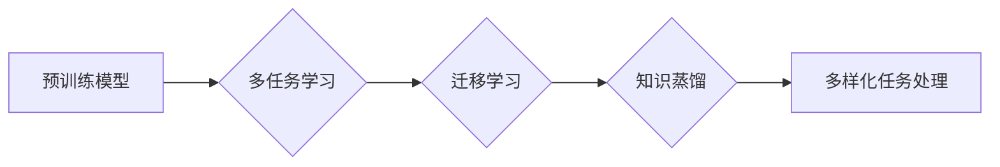

                 

## 突破限制：LLM如何实现多样化任务处理

> 关键词：LLM, 大模型, 多任务学习, 迁移学习, 泛化能力, 知识蒸馏, 应用程序

## 1. 背景介绍

近年来，大型语言模型（LLM）在自然语言处理（NLP）领域取得了显著的突破，展现出强大的文本生成、翻译、问答和代码生成能力。然而，传统的LLM通常针对单一任务进行训练，缺乏对多样化任务的处理能力。随着对人工智能应用场景的不断拓展，LLM需要具备更强的泛化能力，能够适应各种不同的任务需求。

## 2. 核心概念与联系

**2.1 多任务学习 (Multi-Task Learning)**

多任务学习是指在一个模型中训练多个相关任务，共享模型参数，从而提高模型的泛化能力和效率。

**2.2 迁移学习 (Transfer Learning)**

迁移学习是指利用预训练模型在源任务上的知识，迁移到目标任务上进行训练，以提高目标任务的性能。

**2.3 知识蒸馏 (Knowledge Distillation)**

知识蒸馏是一种迁移学习技术，通过训练一个小的学生模型来模仿一个大的教师模型的输出，从而将教师模型的知识传递给学生模型。

**2.4 核心概念架构**

## 3. 核心算法原理 & 具体操作步骤

**3.1 算法原理概述**

LLM的多样化任务处理主要基于多任务学习、迁移学习和知识蒸馏等技术。通过共享模型参数，LLM可以学习到多个任务的共同特征，从而提高模型的泛化能力。

**3.2 算法步骤详解**

1. **预训练阶段:** 使用大量的文本数据对LLM进行预训练，学习语言的语法和语义知识。
2. **微调阶段:** 将预训练的LLM用于不同的任务进行微调，例如文本分类、问答、机器翻译等。
3. **知识蒸馏阶段:** 使用预训练的LLM作为教师模型，训练一个更小的学生模型，将教师模型的知识传递给学生模型。

**3.3 算法优缺点**

**优点:**

* 提高模型的泛化能力
* 减少训练数据和训练时间
* 提升模型的效率

**缺点:**

* 需要大量的计算资源
* 不同任务之间的相关性需要仔细考虑
* 模型的复杂度可能会增加

**3.4 算法应用领域**

* 自然语言理解
* 机器翻译
* 文本生成
* 代码生成
* 聊天机器人

## 4. 数学模型和公式 & 详细讲解 & 举例说明

**4.1 数学模型构建**

LLM通常使用Transformer架构，其核心是自注意力机制。自注意力机制可以捕捉文本序列中单词之间的长距离依赖关系，从而提高模型的理解能力。

**4.2 公式推导过程**

自注意力机制的计算公式如下：

$$
Attention(Q, K, V) = softmax(\frac{QK^T}{\sqrt{d_k}})V
$$

其中：

* $Q$：查询矩阵
* $K$：键矩阵
* $V$：值矩阵
* $d_k$：键向量的维度
* $softmax$：softmax函数

**4.3 案例分析与讲解**

例如，在机器翻译任务中，LLM可以将源语言句子作为查询矩阵，将目标语言词典作为键矩阵和值矩阵。通过自注意力机制，LLM可以学习到源语言句子中每个单词与目标语言词典中每个词语之间的关系，从而生成准确的翻译结果。

## 5. 项目实践：代码实例和详细解释说明

**5.1 开发环境搭建**

使用Python语言和深度学习框架TensorFlow或PyTorch搭建开发环境。

**5.2 源代码详细实现**

使用预训练的LLM模型，例如BERT或GPT-3，进行微调和知识蒸馏。

**5.3 代码解读与分析**

代码主要包括以下部分：

* 数据加载和预处理
* 模型定义和参数设置
* 训练过程和评估指标
* 模型保存和部署

**5.4 运行结果展示**

通过测试数据评估模型的性能，例如准确率、召回率和F1-score。

## 6. 实际应用场景

**6.1 文本分类**

LLM可以用于情感分析、主题分类和垃圾邮件过滤等文本分类任务。

**6.2 问答系统**

LLM可以用于构建问答系统，回答用户的问题并提供相关信息。

**6.3 机器翻译**

LLM可以用于机器翻译，将文本从一种语言翻译成另一种语言。

**6.4 代码生成**

LLM可以用于代码生成，根据用户需求生成代码片段。

**6.5 聊天机器人**

LLM可以用于构建聊天机器人，与用户进行自然语言对话。

**6.6 未来应用展望**

LLM在未来将应用于更广泛的领域，例如医疗诊断、法律咨询和教育培训等。

## 7. 工具和资源推荐

**7.1 学习资源推荐**

* Transformer论文：https://arxiv.org/abs/1706.03762
* Hugging Face Transformers库：https://huggingface.co/transformers/

**7.2 开发工具推荐**

* TensorFlow：https://www.tensorflow.org/
* PyTorch：https://pytorch.org/

**7.3 相关论文推荐**

* BERT论文：https://arxiv.org/abs/1810.04805
* GPT-3论文：https://arxiv.org/abs/2005.14165

## 8. 总结：未来发展趋势与挑战

**8.1 研究成果总结**

LLM在多样化任务处理方面取得了显著的进展，展现出强大的潜力。

**8.2 未来发展趋势**

* 模型规模和能力的进一步提升
* 更加高效的训练和推理方法
* 针对特定领域的LLM模型开发
* 增强LLM的安全性、可靠性和可解释性

**8.3 面临的挑战**

* 数据获取和标注的成本
* 模型训练和部署的计算资源需求
* 伦理和社会影响的考虑

**8.4 研究展望**

未来研究将继续探索LLM的多样化任务处理能力，开发更强大、更安全、更可解释的LLM模型，推动人工智能技术在各个领域的应用。

## 9. 附录：常见问题与解答

**9.1 如何选择合适的LLM模型？**

选择合适的LLM模型需要根据具体任务的需求和资源限制进行考虑。

**9.2 如何进行LLM模型的微调和知识蒸馏？**

微调和知识蒸馏需要根据模型架构和任务类型进行调整。

**9.3 如何评估LLM模型的性能？**

可以使用准确率、召回率、F1-score等指标评估LLM模型的性能。

作者：禅与计算机程序设计艺术 / Zen and the Art of Computer Programming 
<end_of_turn>

