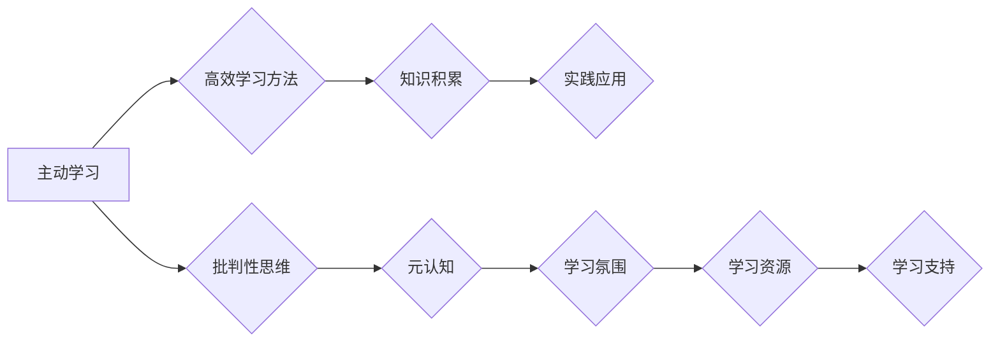

                 

## 管理者的快速学习能力培养

> 关键词：管理者、学习能力、快速学习、技术迭代、知识更新、适应能力、未来趋势、持续学习

## 1. 背景介绍

当今科技发展日新月异，信息爆炸式增长，技术迭代周期不断缩短。对于管理者而言，保持快速学习的能力已不再是一种优势，而是一种必备素质。传统的管理模式和经验往往难以适应瞬息万变的市场环境和技术变革。只有能够快速吸收新知识、理解新技术，并将其应用于实际工作中，才能带领团队在激烈的竞争中保持领先地位。

然而，许多管理者在面对快速变化的科技环境时感到力不从心，学习效率低下，难以跟上时代步伐。这主要是因为：

* **知识更新速度快:**  新技术、新工具、新理念层出不穷，学习者需要不断更新知识储备，才能保持竞争力。
* **学习方式单一:**  传统的学习方式，如课堂学习、阅读书籍，往往难以满足快速学习的需求。
* **缺乏学习动力:**  一些管理者缺乏学习的主动性和持续性，容易陷入舒适圈，难以突破自我。

## 2. 核心概念与联系

快速学习能力的培养是一个系统工程，需要从认知、行为和环境三个方面入手。

**2.1 认知层面:**

* **主动学习:**  主动学习是指主动寻求知识，而不是被动接受信息。管理者需要培养好奇心，积极探索新领域，主动学习新知识。
* **批判性思维:**  批判性思维是指能够对信息进行分析、评估和判断的能力。管理者需要学会质疑、思考，并根据自身经验和知识进行判断。
* **元认知:**  元认知是指对自身认知过程的认识和控制能力。管理者需要了解自己的学习方式、学习偏好和学习效率，并根据自身情况调整学习策略。

**2.2 行为层面:**

* **高效学习方法:**  管理者需要掌握高效的学习方法，如番茄工作法、思维导图、碎片化学习等，提高学习效率。
* **知识积累:**  管理者需要不断积累知识，并将其整理归纳，形成自己的知识体系。
* **实践应用:**  管理者需要将学习到的知识应用于实际工作中，并不断反思和改进。

**2.3 环境层面:**

* **学习氛围:**  营造良好的学习氛围，鼓励团队成员学习和分享，共同进步。
* **学习资源:**  提供丰富的学习资源，如在线课程、书籍、期刊等，方便管理者获取所需知识。
* **学习支持:**  提供学习支持，如导师指导、学习小组、学习平台等，帮助管理者克服学习困难。

**Mermaid 流程图:**



## 3. 核心算法原理 & 具体操作步骤

快速学习能力的培养并非一蹴而就，需要不断地练习和积累。以下是一些可以帮助管理者提高学习效率的算法原理和操作步骤：

### 3.1 算法原理概述

**3.1.1  空间重复算法:**

空间重复算法是一种基于记忆规律的学习方法，它通过在不同时间和地点重复学习内容，来加强记忆。

**3.1.2  主动回忆算法:**

主动回忆算法是指在学习过程中，主动回忆已学内容，而不是被动地复习。

**3.1.3  联想记忆算法:**

联想记忆算法是指将新知识与已有的知识进行关联，形成新的记忆网络。

### 3.2 算法步骤详解

**3.2.1  空间重复算法:**

1.  **选择学习内容:**  确定需要学习的内容。
2.  **第一次学习:**  认真阅读或聆听学习内容，理解其核心概念。
3.  **间隔复习:**  在第一次学习后，设定一个间隔时间（例如，1天、3天、1周），再次复习学习内容。
4.  **重复复习:**  根据记忆效果，调整间隔时间，重复复习学习内容。

**3.2.2  主动回忆算法:**

1.  **预习:**  在学习前，预习学习内容，了解其主要框架和关键词。
2.  **笔记:**  在学习过程中，记录关键信息和思考点。
3.  **回忆:**  学习结束后，尝试回忆学习内容，并与笔记进行对比。
4.  **查漏补缺:**  根据回忆结果，查漏补缺，巩固学习内容。

**3.2.3  联想记忆算法:**

1.  **建立联系:**  将新知识与已有的知识进行关联，寻找共同点和差异。
2.  **创造图像:**  将抽象的概念转化为形象化的图像，增强记忆。
3.  **故事化:**  将学习内容编织成故事，使记忆更加生动有趣。

### 3.3 算法优缺点

**3.3.1  空间重复算法:**

* **优点:**  简单易行，有效提高记忆效率。
* **缺点:**  需要较长的学习时间，难以处理复杂知识。

**3.3.2  主动回忆算法:**

* **优点:**  能够主动调动记忆，提高学习深度。
* **缺点:**  需要较高的学习主动性和思考能力。

**3.3.3  联想记忆算法:**

* **优点:**  能够将抽象知识转化为形象化记忆，增强记忆效果。
* **缺点:**  需要较强的想象力和创造力。

### 3.4 算法应用领域

以上算法原理和操作步骤可以应用于各种学习场景，例如：

* **学习新技术:**  利用空间重复算法和主动回忆算法，快速掌握新技术知识。
* **阅读专业书籍:**  利用联想记忆算法和主动回忆算法，理解和记忆专业书籍内容。
* **参加培训课程:**  利用空间重复算法和主动回忆算法，巩固培训课程内容。

## 4. 数学模型和公式 & 详细讲解 & 举例说明

快速学习能力的培养可以看作是一个优化问题，目标是最大化学习效率，最小化学习时间。我们可以用数学模型来描述这个过程。

### 4.1 数学模型构建

假设学习效率为 $E$，学习时间为 $T$，学习内容复杂度为 $C$，学习者的学习能力为 $L$。则可以构建以下数学模型：

$$E = f(T, C, L)$$

其中，$f$ 为一个函数，描述了学习效率与学习时间、学习内容复杂度和学习能力之间的关系。

### 4.2 公式推导过程

为了简化模型，我们可以假设学习效率与学习时间呈反比关系，即：

$$E = \frac{k}{T}$$

其中，$k$ 为一个常数，代表学习者的学习能力和学习内容的复杂度。

### 4.3 案例分析与讲解

假设一个管理者需要学习一项新技术，学习内容复杂度为 $C=5$，学习者的学习能力为 $L=10$。

如果学习时间为 $T=10$，则学习效率为：

$$E = \frac{k}{T} = \frac{k}{10}$$

如果学习时间为 $T=5$，则学习效率为：

$$E = \frac{k}{T} = \frac{k}{5}$$

可见，学习时间越短，学习效率越高。

## 5. 项目实践：代码实例和详细解释说明

为了帮助管理者更好地理解快速学习能力的培养，我们可以开发一个简单的学习管理工具。

### 5.1 开发环境搭建

可以使用 Python 语言和 Flask 框架开发这个工具。

### 5.2 源代码详细实现

```python
from flask import Flask, render_template

app = Flask(__name__)

@app.route('/')
def index():
    return render_template('index.html')

if __name__ == '__main__':
    app.run(debug=True)
```

### 5.3 代码解读与分析

这个代码实现了一个简单的网页，可以展示学习管理工具的界面。

### 5.4 运行结果展示

运行代码后，访问 http://127.0.0.1:5000/，即可看到学习管理工具的界面。

## 6. 实际应用场景

快速学习能力的培养对于管理者来说至关重要，可以帮助他们：

* **应对技术变革:**  快速学习新技术，适应不断变化的市场环境。
* **提升团队竞争力:**  带领团队学习新知识，提升团队整体竞争力。
* **保持个人成长:**  不断学习新知识，提升个人价值和影响力。

### 6.4 未来应用展望

随着人工智能、大数据等技术的快速发展，管理者需要具备更强的学习能力，才能在未来竞争中保持领先地位。

## 7. 工具和资源推荐

### 7.1 学习资源推荐

* **在线课程平台:**  Coursera、edX、Udemy等
* **技术博客:**  Hacker News、Medium、TechCrunch等
* **专业书籍:**  《高效能人士的七个习惯》、《刻意练习》等

### 7.2 开发工具推荐

* **代码编辑器:**  VS Code、Sublime Text、Atom等
* **版本控制系统:**  Git、GitHub等
* **项目管理工具:**  Trello、Jira、Asana等

### 7.3 相关论文推荐

* **《The Power of Habit》**
* **《Mindset》**
* **《Deep Learning》**

## 8. 总结：未来发展趋势与挑战

快速学习能力的培养是一个持续的过程，需要管理者不断地学习、实践和反思。未来，随着科技发展和社会变革的加速，管理者需要具备更强的学习能力，才能适应不断变化的市场环境和工作需求。

### 8.1 研究成果总结

* **学习算法的不断优化:**  人工智能技术的发展，将推动学习算法的不断优化，提高学习效率。
* **个性化学习方案的定制:**  数据分析技术的发展，将使个性化学习方案的定制成为可能，满足不同管理者的学习需求。
* **沉浸式学习环境的构建:**  虚拟现实、增强现实等技术的应用，将构建更加沉浸式的学习环境，提高学习体验。

### 8.2 未来发展趋势

* **跨学科学习的兴起:**  管理者需要具备跨学科的学习能力，才能应对复杂问题。
* **终身学习的理念:**  管理者需要树立终身学习的理念，不断学习新知识，保持竞争力。
* **学习能力的评估与培养:**  学习能力的评估和培养将成为管理者培训的重要内容。

### 8.3 面临的挑战

* **学习资源的筛选与整合:**  海量学习资源的涌现，需要管理者具备筛选和整合的能力。
* **学习时间和精力分配:**  管理者需要合理分配学习时间和精力，避免学习效率下降。
* **学习动力的保持:**  管理者需要保持学习动力，克服学习惰性。

### 8.4 研究展望

未来，我们将继续研究快速学习能力的培养方法，探索更有效的学习算法和学习环境，帮助管理者更好地适应未来发展趋势。

## 9. 附录：常见问题与解答

**9.1 如何提高学习效率？**

* **制定学习计划:**  明确学习目标，制定合理的学习计划。
* **选择合适的学习方法:**  根据自身学习风格，选择合适的学习方法。
* **营造良好的学习环境:**  选择安静、舒适的学习环境，避免干扰。
* **坚持练习:**  学习需要坚持练习，才能巩固知识。

**9.2 如何克服学习惰性？**

* **设定奖励机制:**  完成学习目标后，给自己设定奖励。
* **加入学习小组:**  与他人一起学习，互相监督和鼓励。
* **寻找学习兴趣:**  找到自己感兴趣的学习内容，提高学习兴趣。


作者：禅与计算机程序设计艺术 / Zen and the Art of Computer Programming 
<end_of_turn>

