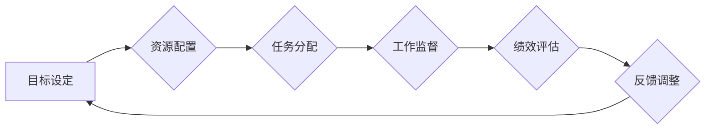

                 

## 经典著作对管理者的重要性

> 关键词：管理学、经典著作、领导力、团队建设、决策制定、创新、效率提升、个人成长

### 1. 背景介绍

在当今瞬息万变的科技时代，管理者肩负着带领团队实现目标、推动组织发展的重要使命。然而，管理并非一蹴而就，它需要不断学习、思考和实践。经典著作作为管理学领域的宝贵财富，蕴含着丰富的管理智慧和经验，为管理者提供了一条通往成功的指引。

从《管理学原理》到《高效能人士的七个习惯》，从《金字塔管理》到《零缺陷》，这些经典著作以其深刻的洞察力和实用的指导，帮助管理者更好地理解管理本质，掌握管理技巧，提升管理水平。

### 2. 核心概念与联系

管理的核心在于有效地组织和协调资源，以实现预定的目标。经典著作往往从不同的角度阐释了管理的本质，并提出了相应的管理理论和方法。

**管理流程图**



* **目标设定:** 明确组织和团队的目标，为管理者和团队成员提供方向和动力。
* **资源配置:** 充分利用人力、物力、财力等资源，为目标的实现提供保障。
* **任务分配:** 将目标分解成具体的任务，并合理分配给团队成员，确保任务的完成。
* **工作监督:** 及时了解团队成员的工作进展，及时提供帮助和指导，确保任务按计划执行。
* **绩效评估:** 定期评估团队成员的工作成果，并根据评估结果进行激励和改进。
* **反馈调整:** 根据绩效评估结果，及时调整管理策略和方法，不断优化管理流程。

经典著作强调了管理的各个环节之间的相互联系，以及管理者需要具备的综合素质，例如领导力、沟通能力、决策能力、团队建设能力等。

### 3. 核心算法原理 & 具体操作步骤

经典管理理论并非简单的算法，但我们可以将其抽象为一种管理思维模式，并将其应用于实际操作中。

#### 3.1 算法原理概述

经典管理理论的核心在于以科学的方法和系统化的流程来管理组织和团队。它强调了计划、组织、领导和控制四个基本管理功能，并提出了相应的管理原则和方法。

#### 3.2 算法步骤详解

1. **目标设定:** 明确组织和团队的目标，并将其分解成具体的、可衡量的、可实现的、相关的和有时间限制的目标（SMART目标）。
2. **资源配置:** 根据目标需求，合理配置人力、物力、财力等资源，确保资源的有效利用。
3. **任务分配:** 将目标分解成具体的任务，并根据团队成员的技能和能力进行合理分配。
4. **工作监督:** 及时了解团队成员的工作进展，及时提供帮助和指导，确保任务按计划执行。
5. **绩效评估:** 定期评估团队成员的工作成果，并根据评估结果进行激励和改进。
6. **反馈调整:** 根据绩效评估结果，及时调整管理策略和方法，不断优化管理流程。

#### 3.3 算法优缺点

**优点:**

* **科学性:** 基于科学的方法和系统化的流程，提高管理效率。
* **可操作性:** 提供了具体的管理原则和方法，易于实施。
* **可量化:** 通过绩效评估等手段，可以量化管理效果。

**缺点:**

* **僵化性:** 可能会过于强调规则和流程，缺乏灵活性。
* **忽视人性:** 可能会忽视员工的个性和需求，导致员工士气低落。
* **难以适应快速变化的环境:** 在快速变化的环境中，经典管理理论可能难以适应。

#### 3.4 算法应用领域

经典管理理论广泛应用于各种组织和团队，例如企业、政府机构、非营利组织等。

### 4. 数学模型和公式 & 详细讲解 & 举例说明

经典管理理论中的一些概念可以用数学模型和公式来表达，例如：

#### 4.1 数学模型构建

**生产率模型:**

$$
P = f(L, K)
$$

其中：

* $P$ 表示生产率
* $L$ 表示劳动力投入
* $K$ 表示资本投入

该模型表明生产率取决于劳动力和资本投入的多少。

#### 4.2 公式推导过程

我们可以通过对生产率模型进行微分，推导出劳动力和资本投入对生产率的影响。

#### 4.3 案例分析与讲解

例如，假设一家工厂的生产率模型为：

$$
P = 2L^{0.5}K^{0.5}
$$

我们可以通过计算该模型的偏导数，得出劳动力和资本投入对生产率的影响：

* $\frac{\partial P}{\partial L} = L^{-0.5}K^{0.5}$
* $\frac{\partial P}{\partial K} = L^{0.5}K^{-0.5}$

该结果表明，劳动力和资本投入对生产率的影响是相互依存的。

### 5. 项目实践：代码实例和详细解释说明

经典管理理论的应用可以体现在实际项目中，例如：

#### 5.1 开发环境搭建

* 操作系统：Windows/Linux/macOS
* 编程语言：Python/Java/C++
* 工具：IDE、版本控制系统

#### 5.2 源代码详细实现

```python
# 目标设定
target = "完成项目开发"

# 资源配置
resources = {
    "人力": 5,
    "物力": 10000,
    "财力": 50000
}

# 任务分配
tasks = [
    {"名称": "需求分析", "负责人": "张三"},
    {"名称": "设计开发", "负责人": "李四"},
    {"名称": "测试部署", "负责人": "王五"}
]

# 工作监督
def monitor_progress():
    # ...

# 绩效评估
def evaluate_performance():
    # ...

# 反馈调整
def adjust_strategy():
    # ...
```

#### 5.3 代码解读与分析

该代码示例展示了如何将经典管理理论中的概念转化为代码实现。

* **目标设定:** 使用变量 `target` 来存储项目目标。
* **资源配置:** 使用字典 `resources` 来存储项目所需的资源。
* **任务分配:** 使用列表 `tasks` 来存储项目中的各个任务。
* **工作监督:** 使用函数 `monitor_progress` 来模拟工作监督的过程。
* **绩效评估:** 使用函数 `evaluate_performance` 来模拟绩效评估的过程。
* **反馈调整:** 使用函数 `adjust_strategy` 来模拟反馈调整的过程。

#### 5.4 运行结果展示

运行该代码可以模拟项目管理的过程，并根据实际情况进行调整和优化。

### 6. 实际应用场景

经典管理理论在各种实际应用场景中都有着广泛的应用，例如：

* **企业管理:** 帮助企业制定战略目标、配置资源、分配任务、监督工作、评估绩效、调整策略，从而提高企业效率和竞争力。
* **项目管理:** 帮助项目经理规划项目进度、分配任务、协调资源、控制风险、评估成果，从而确保项目按计划顺利完成。
* **团队建设:** 帮助团队领导建立高效的团队合作机制、激发团队成员的积极性、提升团队凝聚力，从而提高团队绩效。

#### 6.4 未来应用展望

随着科技的进步和社会的发展，经典管理理论将不断演进和完善，并与新的管理理念和方法相结合，更好地服务于现代管理实践。

### 7. 工具和资源推荐

#### 7.1 学习资源推荐

* **书籍:** 《管理学原理》、《高效能人士的七个习惯》、《金字塔管理》
* **网站:** Harvard Business Review、MIT Sloan Management Review
* **课程:** Coursera、edX

#### 7.2 开发工具推荐

* **项目管理工具:** Jira、Trello、Asana
* **协作工具:** Slack、Microsoft Teams、Zoom
* **数据分析工具:** Excel、Tableau、Power BI

#### 7.3 相关论文推荐

* **管理学经典论文:** Fayol's 14 Principles of Management、Peter Drucker's Management by Objectives
* **现代管理理论论文:** Agile Management、Lean Management、Servant Leadership

### 8. 总结：未来发展趋势与挑战

#### 8.1 研究成果总结

经典管理理论为现代管理实践提供了宝贵的经验和指导，但它也面临着一些挑战。

#### 8.2 未来发展趋势

* **更加注重人性化管理:** 
* **更加重视创新和变革:** 
* **更加强调数据驱动决策:** 

#### 8.3 面临的挑战

* **快速变化的环境:** 
* **全球化和文化多元化:** 
* **科技的快速发展:** 

#### 8.4 研究展望

未来，管理学研究将更加注重以下几个方面:

* **人工智能和管理:** 
* **可持续发展和管理:** 
* **跨文化管理:** 

### 9. 附录：常见问题与解答

* **Q1: 如何将经典管理理论应用于实际工作中？**
* **A1:** ...
* **Q2: 经典管理理论是否适用于所有类型的组织？**
* **A2:** ...


作者：禅与计算机程序设计艺术 / Zen and the Art of Computer Programming 
<end_of_turn>

