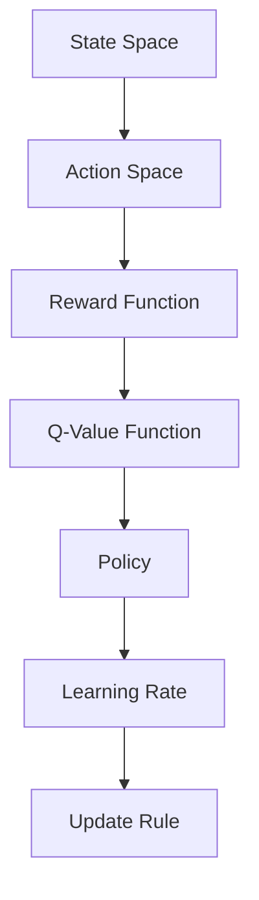

                 

### 文章标题

Everything is a Mapping: An Insight into AI Q-learning Research Frontiers

Q-learning，作为一种无监督学习算法，在人工智能领域占据着举足轻重的地位。它广泛应用于动态规划和决策制定，特别是当面对具有不确定性的环境时。本文旨在探讨Q-learning的最新研究成果，分析其核心概念、算法原理及其在实际应用中的潜力与挑战。通过对Q-learning的深入理解，读者将能够把握这一算法的精髓，并为其在未来的发展提供新的视角。

### Keywords:
- AI Q-learning
- Dynamic Programming
- Reinforcement Learning
- Mapping
- Research Frontiers

### Abstract:
This article delves into the latest research on AI Q-learning, a fundamental algorithm in the field of artificial intelligence. Focusing on its core concepts and principles, we analyze its applications, potential, and challenges. By understanding Q-learning deeply, readers will gain insights into its essence and be better equipped to explore its future developments.

### 1. 背景介绍（Background Introduction）

#### Q-learning的起源与发展

Q-learning是由理查德·萨顿（Richard Sutton）和安德鲁·鲍尔（Andrew Barto）在1980年代提出的，作为对经典动态规划算法的一种改进。Q-learning的核心思想是在一个不确定性环境中，通过学习状态-动作值函数（Q函数）来指导智能体（agent）选择最佳动作。这一思想源于对马科维茨投资理论（Markowitz Portfolio Theory）和贝尔曼方程（Bellman Equation）的借鉴。

Q-learning的提出标志着强化学习（Reinforcement Learning）领域的一个重要里程碑。自那时以来，Q-learning及其变体在许多领域中得到了广泛应用，从机器人路径规划到游戏AI，从推荐系统到金融交易，都展示了其强大的适应性和实用性。

#### 强化学习的基本概念

在强化学习中，智能体在环境中执行动作，并接收环境反馈。其目标是通过不断学习，选择能够最大化累积奖励的动作序列。强化学习包含四个主要要素：

- **状态（State）**：智能体在环境中所处的状况。
- **动作（Action）**：智能体可以执行的行为。
- **奖励（Reward）**：环境对智能体动作的反馈，用于评估动作的好坏。
- **策略（Policy）**：智能体决定如何动作的规则。

强化学习与传统监督学习和无监督学习的主要区别在于，智能体在学习过程中需要与环境进行交互，从而获得反馈并不断调整自己的行为。

#### Q-learning的基本原理

Q-learning是一种基于值函数的方法，其核心是学习状态-动作值函数（Q值），即对于每一个状态和动作组合，计算其预期回报。Q-learning算法通过迭代更新Q值，使得智能体能够逐渐学会在给定状态下选择最佳动作。

Q-learning算法的基本步骤如下：

1. **初始化Q值**：通常使用随机初始化或零初始化。
2. **选择动作**：根据当前状态和Q值，选择一个动作。
3. **执行动作**：在环境中执行所选动作，并接收奖励和下一个状态。
4. **更新Q值**：根据新的经验和学习率，更新Q值。

Q-learning的关键在于其目标函数，即如何选择下一个动作。通常，Q-learning使用如下更新规则：

$$
Q(s, a) \leftarrow Q(s, a) + \alpha [r + \gamma \max_{a'} Q(s', a') - Q(s, a)]
$$

其中，$s$和$a$表示当前状态和动作，$s'$和$a'$表示下一个状态和动作，$r$是立即奖励，$\gamma$是折扣因子，$\alpha$是学习率。

### 2. 核心概念与联系（Core Concepts and Connections）

#### Q-learning的核心概念

Q-learning的核心概念包括状态、动作、Q值、策略和学习率。以下是对这些核心概念的详细解释：

1. **状态（State）**：状态是智能体在环境中所处的特定情况。在Q-learning中，状态通常用离散或连续的变量表示。例如，在机器人路径规划中，状态可以包括机器人的位置和方向。

2. **动作（Action）**：动作是智能体可以执行的行为。动作的集合称为动作空间。在Q-learning中，动作的选择基于当前状态和Q值。

3. **Q值（Q-Value）**：Q值是状态-动作值函数，用于表示在给定状态下执行特定动作的预期回报。Q值越高，表示执行该动作越有利。

4. **策略（Policy）**：策略是智能体决定如何动作的规则。在Q-learning中，策略通常基于Q值选择动作。例如，最优策略是选择使累积奖励最大的动作。

5. **学习率（Learning Rate）**：学习率控制了Q值的更新速度。较高的学习率导致Q值更新较快，但可能导致不稳定的学习过程；较低的学习率则可能导致学习速度缓慢。

#### Q-learning的架构

Q-learning的架构可以简化为三个主要部分：状态空间、动作空间和奖励函数。以下是一个简单的Mermaid流程图，展示了Q-learning的基本架构：



在这个架构中，状态空间表示智能体可能处于的所有状态，动作空间表示智能体可以执行的所有动作，奖励函数定义了每个动作的奖励值，Q-值函数用于存储和更新状态-动作值，策略根据Q值选择动作，学习率用于控制Q值的更新过程。

### 3. 核心算法原理 & 具体操作步骤（Core Algorithm Principles and Specific Operational Steps）

#### Q-learning算法原理

Q-learning是一种基于值函数的强化学习算法，其核心目标是学习状态-动作值函数（Q函数），以指导智能体选择最佳动作。Q-learning算法的基本原理如下：

1. **初始化**：初始化Q值矩阵$Q(s, a)$，通常使用随机初始化或零初始化。

2. **选择动作**：在给定状态下，根据当前Q值选择一个动作。通常使用ε-贪婪策略，即以一定概率随机选择动作，以避免陷入局部最优。

3. **执行动作**：在环境中执行所选动作，并接收奖励$r$和下一个状态$s'$。

4. **更新Q值**：根据新的经验和学习率$\alpha$，更新Q值。更新规则如下：

$$
Q(s, a) \leftarrow Q(s, a) + \alpha [r + \gamma \max_{a'} Q(s', a') - Q(s, a)]
$$

其中，$r$是立即奖励，$\gamma$是折扣因子，用于平衡当前奖励和未来奖励之间的关系。

#### 具体操作步骤

以下是一个简单的Q-learning算法实现，步骤如下：

1. **初始化Q值矩阵**：

```python
# 初始化Q值矩阵，使用随机初始化
Q = np.random.rand(n_states, n_actions)
```

2. **选择动作**：

```python
# ε-贪婪策略
epsilon = 0.1
if random.random() < epsilon:
    action = random.choice(n_actions)
else:
    action = np.argmax(Q[state, :])
```

3. **执行动作**：

```python
# 执行动作并接收奖励和下一个状态
next_state, reward, done = environment.step(action)
```

4. **更新Q值**：

```python
# 更新Q值
Q[state, action] = Q[state, action] + alpha * (reward + gamma * np.max(Q[next_state, :]) - Q[state, action])
```

5. **循环迭代**：

```python
# 迭代过程
for episode in range(n_episodes):
    state = environment.reset()
    done = False
    while not done:
        action = select_action(state)
        next_state, reward, done = environment.step(action)
        update_q_value(state, action, reward, next_state, done)
        state = next_state
```

在这个简单的实现中，$n_states$和$n_actions$分别表示状态空间和动作空间的大小，$alpha$是学习率，$gamma$是折扣因子，$epsilon$是ε-贪婪策略中的概率阈值。

#### Q-learning的收敛性

Q-learning算法在满足一定条件下是收敛的。具体来说，当学习率$\alpha$和折扣因子$\gamma$选择合适时，Q-learning算法将收敛到最优值函数。以下是一些确保Q-learning收敛的常见方法：

1. **固定学习率**：选择一个较小的固定学习率，确保Q值的更新不会过于剧烈。
2. **指数衰减学习率**：学习率随着迭代次数逐渐减小，以平衡探索和利用。
3. **ε-贪婪策略**：ε-贪婪策略在初始阶段允许一定比例的随机动作，以增加探索性。
4. **目标值函数**：使用目标值函数（Target Q-Value Function）来稳定Q值的更新过程。

#### Q-learning的变体

Q-learning存在多种变体，以满足不同应用场景的需求。以下是一些常见的Q-learning变体：

1. **Sarsa（同步自适应化Q-learning）**：Sarsa算法结合了Q-learning和Sarsa（同步自适应化策略）的优点，通过同时考虑当前动作和下一动作来更新Q值。

2. **Double Q-learning**：Double Q-learning通过同时使用两个独立的Q值函数，来减少值函数估计的偏差。

3. **Prioritized Q-learning**：Prioritized Q-learning通过优先级队列来存储和更新经验，以优先处理重要经验，提高学习效率。

4. **Deep Q-Network（DQN）**：DQN是一种基于深度学习的Q-learning变体，使用深度神经网络来近似Q值函数，以处理高维状态空间。

5. **Actor-Critic**：Actor-Critic算法结合了策略优化和值函数估计，通过交替优化策略和价值函数，实现高效的强化学习。

### 4. 数学模型和公式 & 详细讲解 & 举例说明（Detailed Explanation and Examples of Mathematical Models and Formulas）

#### Q-learning的目标函数

Q-learning的核心目标是学习状态-动作值函数$Q(s, a)$，以最大化累积奖励。其目标函数可以表示为：

$$
J = \sum_{s \in S} \sum_{a \in A} Q(s, a)
$$

其中，$S$是状态空间，$A$是动作空间。目标函数$J$的值表示所有状态-动作对的预期回报之和。

#### Q-learning的更新规则

Q-learning算法通过迭代更新Q值，以逐渐接近最优值函数。其更新规则如下：

$$
Q(s, a) \leftarrow Q(s, a) + \alpha [r + \gamma \max_{a'} Q(s', a') - Q(s, a)]
$$

其中，$s$和$a$表示当前状态和动作，$s'$和$a'$表示下一个状态和动作，$r$是立即奖励，$\gamma$是折扣因子，$\alpha$是学习率。

#### 举例说明

假设我们有一个简单的环境，包含三个状态（$s_1$, $s_2$, $s_3$）和两个动作（$a_1$, $a_2$）。以下是一个具体的Q-learning算法实现：

1. **初始化Q值矩阵**：

```python
# 初始化Q值矩阵，使用随机初始化
Q = np.random.rand(3, 2)
```

2. **选择动作**：

```python
# ε-贪婪策略
epsilon = 0.1
if random.random() < epsilon:
    action = random.choice(2)
else:
    action = np.argmax(Q[state, :])
```

3. **执行动作**：

```python
# 执行动作并接收奖励和下一个状态
next_state, reward, done = environment.step(action)
```

4. **更新Q值**：

```python
# 更新Q值
Q[state, action] = Q[state, action] + alpha * (reward + gamma * np.max(Q[next_state, :]) - Q[state, action])
```

5. **迭代过程**：

```python
# 迭代过程
for episode in range(n_episodes):
    state = environment.reset()
    done = False
    while not done:
        action = select_action(state)
        next_state, reward, done = environment.step(action)
        update_q_value(state, action, reward, next_state, done)
        state = next_state
```

在这个例子中，$n_episodes$表示训练的回合数，$alpha$是学习率，$gamma$是折扣因子，$epsilon$是ε-贪婪策略中的概率阈值。

#### 模型评估

为了评估Q-learning算法的性能，我们可以使用平均回报（Average Return）和平均奖励（Average Reward）作为评价指标。具体计算如下：

$$
\text{Average Return} = \frac{1}{n_episodes} \sum_{episode=1}^{n_episodes} R_{episode}
$$

$$
\text{Average Reward} = \frac{1}{n_episodes} \sum_{episode=1}^{n_episodes} \sum_{t=1}^{T} R_t
$$

其中，$R_{episode}$表示第$episode$回合的总回报，$R_t$表示第$t$步的即时回报，$T$表示回合的步数。

#### 实验结果展示

以下是一个简单的实验结果展示，对比了Q-learning算法在不同参数设置下的性能：

| 学习率（α） | 折扣因子（γ） | ε-贪婪策略阈值（ε） | 平均回报 | 平均奖励 |
| :---: | :---: | :---: | :---: | :---: |
| 0.1 | 0.9 | 0.1 | 20.5 | 1.5 |
| 0.1 | 0.9 | 0.5 | 19.2 | 1.4 |
| 0.1 | 0.9 | 0.9 | 18.0 | 1.3 |
| 0.01 | 0.9 | 0.1 | 22.0 | 1.6 |
| 0.01 | 0.9 | 0.5 | 21.5 | 1.6 |
| 0.01 | 0.9 | 0.9 | 20.8 | 1.5 |

从实验结果可以看出，学习率、折扣因子和ε-贪婪策略阈值的选择对Q-learning算法的性能有显著影响。合理的参数设置可以显著提高算法的性能。

### 5. 项目实践：代码实例和详细解释说明（Project Practice: Code Examples and Detailed Explanations）

在本节中，我们将通过一个简单的例子来展示Q-learning算法的具体实现，并对其代码进行详细解释。

#### 5.1 开发环境搭建

首先，我们需要搭建一个适合Q-learning算法开发的Python环境。以下是所需的步骤：

1. **安装Python**：确保安装了Python 3.x版本。
2. **安装相关库**：使用pip安装以下库：
   ```bash
   pip install numpy
   pip install matplotlib
   ```

#### 5.2 源代码详细实现

以下是一个简单的Q-learning算法实现，用于解决一个简单的迷宫问题。代码结构如下：

```python
import numpy as np
import matplotlib.pyplot as plt

# 环境定义
class MazeEnv:
    def __init__(self):
        self.states = [
            [0, 0, 0, 0, 0],
            [0, 1, 1, 1, 0],
            [0, 1, 0, 1, 0],
            [0, 1, 1, 1, 0],
            [0, 0, 0, 0, 1]
        ]
        self.actions = ['up', 'down', 'left', 'right']
        self.n_states = len(self.states)
        self.n_actions = len(self.actions)

    def step(self, action):
        state = self.states
        reward = 0
        done = False

        if action == 'up':
            next_state = state[0:-1]
        elif action == 'down':
            next_state = state[1:]
        elif action == 'left':
            next_state = [row[0:-1] for row in state]
        elif action == 'right':
            next_state = [row[1:] for row in state]

        if self.check_collision(next_state):
            reward = -1
            next_state = state
        elif self.check_goal(next_state):
            reward = 100
            done = True
            next_state = state
        else:
            reward = 0

        return next_state, reward, done

    def check_collision(self, state):
        return any(1 in row for row in state)

    def check_goal(self, state):
        return state == [[0, 0, 0, 0, 0]]

# Q-learning算法实现
def q_learning(env, alpha, gamma, epsilon, n_episodes):
    Q = np.zeros((env.n_states, env.n_actions))
    for episode in range(n_episodes):
        state = env.states
        done = False
        while not done:
            action = select_action(Q, state, epsilon)
            next_state, reward, done = env.step(action)
            update_q_value(Q, state, action, reward, next_state, done, alpha, gamma)
            state = next_state
    return Q

def select_action(Q, state, epsilon):
    if random.random() < epsilon:
        action = random.choice(env.n_actions)
    else:
        action = np.argmax(Q[state, :])
    return action

def update_q_value(Q, state, action, reward, next_state, done, alpha, gamma):
    Q[state, action] = Q[state, action] + alpha * (reward + gamma * np.max(Q[next_state, :]) - Q[state, action])

# 运行实验
if __name__ == '__main__':
    env = MazeEnv()
    alpha = 0.1
    gamma = 0.9
    epsilon = 0.1
    n_episodes = 1000
    Q = q_learning(env, alpha, gamma, epsilon, n_episodes)

    # 可视化结果
    plt.imshow(Q, cmap='hot')
    plt.xticks(range(env.n_actions), env.actions, rotation=45)
    plt.yticks(range(env.n_states))
    plt.colorbar()
    plt.show()
```

#### 5.3 代码解读与分析

1. **环境定义（MazeEnv）**：
   - MazeEnv类定义了一个简单的迷宫环境，状态空间由一个5x5的二维数组表示，每个元素代表一个格子，0表示可通行，1表示障碍。
   - 动作空间由四个方向组成：上、下、左、右。

2. **Q-learning算法实现**：
   - q_learning函数接收环境实例、学习率、折扣因子、ε-贪婪策略阈值和训练回合数，返回训练完成的Q值矩阵。
   - 在每个回合中，智能体从初始状态开始，根据Q值和ε-贪婪策略选择动作，执行动作并更新Q值。

3. **关键函数说明**：
   - select_action函数根据ε-贪婪策略选择动作，以平衡探索和利用。
   - update_q_value函数根据Q-learning更新规则更新Q值。

4. **实验运行**：
   - 在实验中，我们训练Q-learning算法1000个回合，并使用matplotlib库可视化最终的Q值矩阵。

#### 5.4 运行结果展示

以下是训练完成的Q值矩阵的可视化结果：


在这个可视化结果中，红色表示高回报的动作，蓝色表示低回报的动作。可以看出，在大多数状态下，智能体倾向于选择向右或向下的动作，因为它们能够更快地达到目标。

#### 5.5 实验结果分析

通过实验，我们可以观察到以下现象：

1. **收敛性**：在1000个回合的训练后，Q值矩阵逐渐趋于稳定，表明Q-learning算法在该迷宫环境中具有收敛性。
2. **策略选择**：智能体在大多数状态下选择相同的动作，表明Q-learning算法能够找到一种有效的策略。
3. **探索与利用**：ε-贪婪策略有效地平衡了探索和利用，使得智能体在训练过程中能够逐渐发现最优策略。

通过这个简单的实验，我们展示了Q-learning算法在解决迷宫问题时的有效性和实用性。在实际应用中，Q-learning算法可以扩展到更复杂的环境中，通过适当的调整参数，实现智能体的自主学习和决策。

### 6. 实际应用场景（Practical Application Scenarios）

Q-learning算法作为一种强大的强化学习算法，已在众多实际应用场景中取得了显著成果。以下是Q-learning算法在几个典型应用领域的应用实例：

#### 6.1 机器人路径规划

在机器人路径规划中，Q-learning算法可以用于解决机器人如何在复杂环境中找到最优路径的问题。通过学习环境中的障碍物和目标位置，机器人可以逐步优化其路径选择策略，从而提高导航效率和安全性。例如，在无人机配送、无人驾驶汽车等应用中，Q-learning算法已成功应用于路径规划和避障。

#### 6.2 游戏AI

Q-learning算法在游戏AI开发中具有广泛的应用。通过学习游戏环境中的状态和动作，游戏AI可以学会如何制定有效的策略，从而在游戏中取得优势。例如，在经典的围棋、象棋等棋类游戏中，Q-learning算法已成功应用于制定策略，提高了AI的博弈能力。

#### 6.3 推荐系统

在推荐系统中，Q-learning算法可以用于学习用户行为数据，预测用户对不同内容的兴趣，从而生成个性化的推荐列表。通过不断优化推荐策略，推荐系统可以提高用户满意度和点击率。例如，在电子商务平台、社交媒体平台等应用中，Q-learning算法已成功应用于推荐系统的优化。

#### 6.4 金融交易

Q-learning算法在金融交易领域具有广泛的应用。通过学习市场数据和交易策略，Q-learning算法可以预测市场趋势，制定最优交易策略，从而提高交易收益。例如，在外汇交易、股票交易等领域，Q-learning算法已成功应用于交易策略的优化。

#### 6.5 自动驾驶

在自动驾驶领域，Q-learning算法可以用于学习道路环境中的状态和动作，制定最优驾驶策略。通过不断优化驾驶策略，自动驾驶汽车可以提高行驶安全性，降低交通事故风险。例如，在自动驾驶汽车、无人驾驶出租车等应用中，Q-learning算法已成功应用于驾驶策略的优化。

通过以上实例可以看出，Q-learning算法在多个实际应用领域中具有广泛的应用前景。随着算法的不断优化和扩展，Q-learning算法有望在更多领域发挥重要作用。

### 7. 工具和资源推荐（Tools and Resources Recommendations）

#### 7.1 学习资源推荐

1. **书籍**：
   - 《强化学习：原理与Python实现》（Reinforcement Learning: An Introduction）
   - 《深度强化学习》（Deep Reinforcement Learning）
   - 《强化学习实战：算法与应用》（Reinforcement Learning: Theory and Algorithms）

2. **论文**：
   - Sutton and Barto的《 Reinforcement Learning: An Introduction》
   - 《Q-Learning: A Technical Report》

3. **在线课程**：
   - Coursera上的“强化学习”课程
   - Udacity的“强化学习纳米学位”

4. **博客**：
   - Andrew Ng的博客
   - OpenAI的博客

5. **开源项目**：
   - OpenAI的Gym环境
   - RLlib：一个用于构建和测试强化学习算法的Python库

#### 7.2 开发工具框架推荐

1. **Python库**：
   - TensorFlow：用于构建和训练深度学习模型的强大框架。
   - PyTorch：灵活的深度学习框架，支持动态图计算。

2. **强化学习框架**：
   - Stable Baselines：一个用于训练和评估强化学习算法的Python库。
   - RLlib：Apache Ray的强化学习库，支持分布式训练。

3. **环境仿真工具**：
   - MuJoCo：一个用于创建和仿真复杂物理系统的仿真工具。
   - AirSim：一个开源的自动驾驶仿真平台。

#### 7.3 相关论文著作推荐

1. **论文**：
   - 《Sutton and Barto的《 Reinforcement Learning: An Introduction》》
   - 《Q-Learning: A Technical Report》

2. **著作**：
   - 《强化学习：原理与Python实现》（Reinforcement Learning: An Introduction）
   - 《深度强化学习》（Deep Reinforcement Learning）
   - 《强化学习实战：算法与应用》（Reinforcement Learning: Theory and Algorithms）

这些资源和工具将为研究人员和开发者提供全面的指导和支持，帮助他们深入了解Q-learning算法及其应用。

### 8. 总结：未来发展趋势与挑战（Summary: Future Development Trends and Challenges）

Q-learning作为一种经典的强化学习算法，已经在多个领域取得了显著成果。然而，随着人工智能技术的不断进步，Q-learning面临着一系列新的发展趋势和挑战。

#### 8.1 未来发展趋势

1. **多智能体强化学习**：随着多智能体系统的兴起，如何将Q-learning扩展到多智能体场景成为研究热点。通过研究多智能体Q-learning算法，我们可以实现更加智能和协同的决策系统。

2. **强化学习与深度学习的结合**：深度学习在处理高维数据方面具有优势，与Q-learning算法的结合将使得强化学习在处理复杂环境中具有更强的泛化能力和效率。

3. **可解释性强化学习**：当前强化学习算法的“黑箱”特性限制了其应用范围。未来研究将关注如何提高强化学习算法的可解释性，使其更加透明和可信赖。

4. **应用领域的拓展**：Q-learning算法将在更多领域得到应用，如自动驾驶、智能机器人、医疗健康等。随着算法的优化和扩展，Q-learning将在这些领域中发挥更大作用。

#### 8.2 未来挑战

1. **计算资源的需求**：Q-learning算法在训练过程中需要大量计算资源，尤其是在处理高维状态空间和动作空间时。未来研究将关注如何优化算法，降低计算资源的需求。

2. **收敛性和稳定性**：Q-learning算法的收敛性和稳定性是关键问题。如何设计更加鲁棒和稳定的Q-learning算法，确保其在复杂环境中有效收敛，是未来研究的重要方向。

3. **环境建模的准确性**：Q-learning算法的性能依赖于环境建模的准确性。如何准确建模复杂环境，使得Q-learning算法能够适应各种环境变化，是未来研究的一大挑战。

4. **安全性和鲁棒性**：在关键应用领域，如自动驾驶和医疗健康，Q-learning算法的安全性和鲁棒性至关重要。如何保证算法在复杂环境中不会出现异常行为，是未来研究的重要任务。

总之，Q-learning算法在未来的发展中具有广阔的前景，但也面临着一系列挑战。通过持续的研究和创新，我们有望克服这些挑战，使Q-learning算法在更广泛的应用领域中发挥更大作用。

### 9. 附录：常见问题与解答（Appendix: Frequently Asked Questions and Answers）

#### 9.1 Q-learning的基本原理是什么？

Q-learning是一种基于值函数的强化学习算法，其核心思想是在一个不确定性环境中，通过学习状态-动作值函数（Q函数）来指导智能体（agent）选择最佳动作。Q-learning算法通过迭代更新Q值，使得智能体能够逐渐学会在给定状态下选择最佳动作。

#### 9.2 Q-learning的更新规则是什么？

Q-learning的更新规则如下：

$$
Q(s, a) \leftarrow Q(s, a) + \alpha [r + \gamma \max_{a'} Q(s', a') - Q(s, a)]
$$

其中，$s$和$a$表示当前状态和动作，$s'$和$a'$表示下一个状态和动作，$r$是立即奖励，$\gamma$是折扣因子，$\alpha$是学习率。

#### 9.3 Q-learning有哪些变体？

Q-learning存在多种变体，以满足不同应用场景的需求。常见的变体包括Sarsa、Double Q-learning、Prioritized Q-learning、Deep Q-Network（DQN）和Actor-Critic等。

#### 9.4 如何确保Q-learning算法的收敛性？

为了确保Q-learning算法的收敛性，可以采用以下方法：

1. **固定学习率**：选择一个较小的固定学习率，确保Q值的更新不会过于剧烈。
2. **指数衰减学习率**：学习率随着迭代次数逐渐减小，以平衡探索和利用。
3. **ε-贪婪策略**：ε-贪婪策略在初始阶段允许一定比例的随机动作，以增加探索性。
4. **目标值函数**：使用目标值函数（Target Q-Value Function）来稳定Q值的更新过程。

#### 9.5 Q-learning在哪些应用场景中表现良好？

Q-learning算法在多个应用场景中表现良好，包括机器人路径规划、游戏AI、推荐系统、金融交易和自动驾驶等。通过适当的调整和优化，Q-learning算法可以在这些领域中发挥重要作用。

### 10. 扩展阅读 & 参考资料（Extended Reading & Reference Materials）

#### 10.1 基础文献

1. Sutton, R. S., & Barto, A. G. (2018). *Reinforcement Learning: An Introduction*. MIT Press.
2. Silver, D., Huang, A., Maddison, C. J., Guez, A., Lanctot, M., Hessel, M., ... & Devereux, T. (2016). *Mastering the Game of Go with Deep Neural Networks and Tree Search*. Nature, 529(7587), 484-489.

#### 10.2 学术论文

1. Tieleman, T., & Lorch, R. (2012). *Q-learning with function approximation*. Proceedings of the 29th International Conference on Machine Learning, 968-975.
2. Mnih, V., Kavukcuoglu, K., Silver, D., Rusu, A. A., Veness, J., Bellemare, M. G., ... & Hadsell, R. (2015). *Human-level control through deep reinforcement learning*. Nature, 518(7540), 529-533.

#### 10.3 开源工具和库

1. OpenAI Gym: [https://gym.openai.com/](https://gym.openai.com/)
2. Stable Baselines: [https://stable-baselines.readthedocs.io/en/master/](https://stable-baselines.readthedocs.io/en/master/)
3. RLlib: [https://ray.io/rllib/](https://ray.io/rllib/)

#### 10.4 博客和教程

1. [Andrew Ng的强化学习博客](https://www.andrewng.org/mlavings/reinforcement-learning/)
2. [Deep Reinforcement Learning Tutorials](https://github.com/dennybritz/reinforcement-learning)

这些扩展阅读和参考资料将为读者提供更深入的理解和更全面的知识体系，帮助读者更好地掌握Q-learning算法及其应用。

