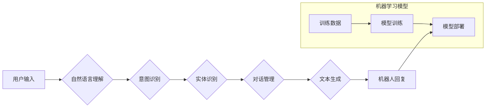

                 

## 聊天机器人设计助手：人工智能增强的创作

> 关键词：聊天机器人、人工智能、自然语言处理、对话系统、文本生成、机器学习、深度学习

## 1. 背景介绍

在当今数字时代，聊天机器人已成为一种越来越普遍的交互方式，广泛应用于客户服务、教育、娱乐等领域。随着人工智能技术的飞速发展，聊天机器人也从简单的规则型系统演变为能够进行更自然、更智能对话的复杂系统。

然而，设计和开发高质量的聊天机器人仍然是一个具有挑战性的任务。需要对自然语言处理、对话系统设计、机器学习等多个领域有深入的了解。同时，还需要考虑用户体验、业务需求、技术可行性等多方面因素。

为了帮助开发者更轻松、更高效地设计和开发聊天机器人，我们提出了“聊天机器人设计助手”的概念。该助手将利用人工智能技术，提供一系列工具和功能，帮助开发者各个阶段的开发工作，从概念设计到最终部署。

## 2. 核心概念与联系

### 2.1 聊天机器人设计助手

聊天机器人设计助手是一个基于人工智能的平台，旨在帮助开发者设计、开发和部署高质量的聊天机器人。它提供了一系列工具和功能，包括：

* **对话设计工具:** 提供可视化界面，帮助开发者构建对话流程，定义意图和实体，设计自然流畅的对话体验。
* **自然语言理解引擎:** 利用自然语言处理技术，理解用户的输入，识别意图和实体，并将其转换为机器可理解的格式。
* **文本生成引擎:** 利用机器学习技术，生成自然、流畅的文本回复，并根据上下文进行个性化定制。
* **机器学习模型训练平台:** 提供平台和工具，帮助开发者训练自己的机器学习模型，提升聊天机器人的性能。
* **部署和监控工具:** 提供便捷的部署和监控工具，帮助开发者将聊天机器人部署到线上环境，并实时监控其运行状态。

### 2.2 核心架构

聊天机器人设计助手基于微服务架构，各个模块独立部署，可根据需要进行扩展和升级。



## 3. 核心算法原理 & 具体操作步骤

### 3.1 算法原理概述

聊天机器人设计助手的核心算法包括自然语言理解、文本生成和对话管理。

* **自然语言理解 (NLU):** 旨在理解用户的自然语言输入，识别用户的意图和实体。常用的算法包括词袋模型、TF-IDF、隐马尔可夫模型 (HMM)、条件随机场 (CRF) 和深度学习模型 (如循环神经网络、Transformer)。
* **文本生成:** 旨在根据用户的意图和上下文生成自然流畅的文本回复。常用的算法包括基于规则的生成、统计语言模型和深度学习模型 (如生成对抗网络、Transformer)。
* **对话管理:** 旨在控制对话流程，根据用户的输入和上下文选择合适的回复，并引导对话走向预期的目标。常用的算法包括状态机、基于规则的对话系统和基于机器学习的对话系统。

### 3.2 算法步骤详解

**自然语言理解:**

1. **预处理:** 对用户输入进行预处理，包括分词、去停用词、词干提取等。
2. **特征提取:** 从预处理后的文本中提取特征，例如词频、词向量、语法结构等。
3. **模型训练:** 利用训练数据，训练 NLU 模型，使其能够将文本特征映射到意图和实体。
4. **意图识别和实体识别:** 将用户输入作为输入，利用训练好的 NLU 模型识别用户的意图和实体。

**文本生成:**

1. **上下文理解:** 根据对话历史和用户输入，理解对话上下文。
2. **回复生成:** 利用文本生成模型，根据上下文和用户的意图生成合适的回复。
3. **回复筛选:** 对生成的回复进行筛选，选择最合适的回复。

**对话管理:**

1. **状态跟踪:** 记录对话的当前状态，例如用户身份、对话主题等。
2. **意图匹配:** 将用户的意图与预定义的意图进行匹配。
3. **回复选择:** 根据用户的意图和对话状态，选择合适的回复。
4. **对话引导:** 根据对话目标，引导对话走向预期的方向。

### 3.3 算法优缺点

**优点:**

* **自动化:** 自动化了聊天机器人设计和开发过程，提高了效率。
* **智能化:** 利用人工智能技术，使聊天机器人能够进行更自然、更智能的对话。
* **个性化:** 可以根据用户的需求和喜好进行个性化定制。

**缺点:**

* **数据依赖:** 需要大量的训练数据才能训练出高质量的模型。
* **解释性差:** 深度学习模型的决策过程难以解释，难以进行调试和维护。
* **通用性有限:** 现有的算法在特定领域表现较好，但在其他领域可能需要重新训练。

### 3.4 算法应用领域

聊天机器人设计助手可以应用于各个领域，例如：

* **客户服务:** 自动化客户服务，提高服务效率和客户满意度。
* **教育:** 提供个性化的学习辅导，帮助学生提高学习效果。
* **娱乐:** 提供互动式游戏和娱乐体验。
* **医疗保健:** 提供医疗咨询和健康管理服务。

## 4. 数学模型和公式 & 详细讲解 & 举例说明

### 4.1 数学模型构建

在自然语言理解领域，常用的数学模型包括词袋模型、TF-IDF 和 Word2Vec。

* **词袋模型 (Bag-of-Words):** 将文本表示为词的集合，忽略词的顺序和语法结构。

$$
\mathbf{x} = \left(x_1, x_2, ..., x_n\right)
$$

其中，$\mathbf{x}$ 表示文本的词袋表示，$x_i$ 表示词 $i$ 在文本中出现的次数。

* **TF-IDF (Term Frequency-Inverse Document Frequency):** 考虑词在文本中的出现频率和在整个语料库中的稀疏度。

$$
TF-IDF(t, d) = TF(t, d) \times IDF(t)
$$

其中，$TF(t, d)$ 表示词 $t$ 在文档 $d$ 中的出现频率，$IDF(t)$ 表示词 $t$ 在整个语料库中的逆文档频率。

* **Word2Vec:** 将词表示为向量，捕捉词之间的语义关系。

$$
\mathbf{w}_i = \text{Word2Vec}(\text{word}_i)
$$

其中，$\mathbf{w}_i$ 表示词 $\text{word}_i$ 的词向量。

### 4.2 公式推导过程

TF-IDF 公式的推导过程如下：

1. **Term Frequency (TF):**

$$
TF(t, d) = \frac{f(t, d)}{\sum_{t' \in d} f(t', d)}
$$

其中，$f(t, d)$ 表示词 $t$ 在文档 $d$ 中出现的次数，$\sum_{t' \in d} f(t', d)$ 表示文档 $d$ 中所有词的总出现次数。

2. **Inverse Document Frequency (IDF):**

$$
IDF(t) = \log \frac{N}{df(t)}
$$

其中，$N$ 表示语料库中文档的总数，$df(t)$ 表示词 $t$ 在语料库中出现的文档数。

3. **TF-IDF:**

$$
TF-IDF(t, d) = TF(t, d) \times IDF(t)
$$

### 4.3 案例分析与讲解

假设我们有一个语料库包含 1000 篇文档，其中词 "苹果" 出现在 500 篇文档中。

* **TF:** 如果文档 $d$ 中词 "苹果" 出现在 10 次，则 $TF("苹果", d) = \frac{10}{100} = 0.1$.

* **IDF:**

$$
IDF("苹果") = \log \frac{1000}{500} = \log 2 \approx 0.693
$$

* **TF-IDF:**

$$
TF-IDF("苹果", d) = 0.1 \times 0.693 \approx 0.0693
$$

## 5. 项目实践：代码实例和详细解释说明

### 5.1 开发环境搭建

* **操作系统:** Ubuntu 18.04 或以上
* **编程语言:** Python 3.6 或以上
* **深度学习框架:** TensorFlow 或 PyTorch
* **自然语言处理库:** NLTK、spaCy 或 HuggingFace Transformers

### 5.2 源代码详细实现

以下是一个使用 TensorFlow 和 HuggingFace Transformers 库构建一个简单的聊天机器人文本生成器的代码示例：

```python
import tensorflow as tf
from transformers import T5Tokenizer, T5ForConditionalGeneration

# 加载预训练模型和词典
tokenizer = T5Tokenizer.from_pretrained("t5-small")
model = T5ForConditionalGeneration.from_pretrained("t5-small")

# 定义输入文本
input_text = "你好，今天天气怎么样？"

# 将文本转换为模型输入格式
input_ids = tokenizer.encode(input_text, return_tensors="tf")

# 生成文本回复
output = model.generate(input_ids=input_ids)

# 将回复转换为文本
response = tokenizer.decode(output[0], skip_special_tokens=True)

# 打印回复
print(response)
```

### 5.3 代码解读与分析

* 该代码首先加载预训练的 T5 模型和词典。
* 然后，将用户输入文本转换为模型输入格式。
* 使用模型生成文本回复。
* 最后，将回复转换为文本并打印输出。

### 5.4 运行结果展示

运行该代码后，将输出类似于以下的回复：

```
今天天气很好
```

## 6. 实际应用场景

### 6.1 客户服务机器人

聊天机器人可以用于自动处理客户服务请求，例如回答常见问题、提供产品信息、处理订单等。

### 6.2 教育机器人

聊天机器人可以作为个性化的学习助手，帮助学生学习新知识、练习技能、完成作业等。

### 6.3 娱乐机器人

聊天机器人可以用于提供互动式游戏、聊天和娱乐体验。

### 6.4 未来应用展望

随着人工智能技术的不断发展，聊天机器人将应用于更多领域，例如医疗保健、金融、交通等。

## 7. 工具和资源推荐

### 7.1 学习资源推荐

* **书籍:**
    * 《深度学习》 by Ian Goodfellow, Yoshua Bengio, and Aaron Courville
    * 《自然语言处理》 by Dan Jurafsky and James H. Martin
* **在线课程:**
    * Coursera: Natural Language Processing Specialization
    * Udacity: Deep Learning Nanodegree

### 7.2 开发工具推荐

* **TensorFlow:** https://www.tensorflow.org/
* **PyTorch:** https://pytorch.org/
* **HuggingFace Transformers:** https://huggingface.co/transformers/

### 7.3 相关论文推荐

* **Attention Is All You Need:** https://arxiv.org/abs/1706.03762
* **BERT: Pre-training of Deep Bidirectional Transformers for Language Understanding:** https://arxiv.org/abs/1810.04805

## 8. 总结：未来发展趋势与挑战

### 8.1 研究成果总结

聊天机器人设计助手已经取得了显著的成果，能够帮助开发者更高效地设计和开发高质量的聊天机器人。

### 8.2 未来发展趋势

未来，聊天机器人设计助手将朝着以下方向发展:

* **更智能的对话系统:** 利用更先进的机器学习算法，构建更智能、更自然、更具交互性的对话系统。
* **更个性化的体验:** 基于用户的行为和偏好，提供更个性化的聊天体验。
* **跨平台部署:** 支持在各种平台上部署聊天机器人，例如网站、移动应用、智能家居等。

### 8.3 面临的挑战

聊天机器人设计助手仍然面临一些挑战:

* **数据获取和标注:** 训练高质量的聊天机器人模型需要大量的训练数据，而获取和标注这些数据成本较高。
* **模型解释性和可解释性:** 深度学习模型的决策过程难以解释，这使得调试和维护聊天机器人更加困难。
* **伦理和安全问题:** 聊天机器人可能会被用于恶意目的，例如传播虚假信息、进行网络欺诈等。

### 8.4 研究展望

未来，我们将继续致力于研究和开发更智能、更安全、更可靠的聊天机器人设计助手，为开发者提供更强大的工具和功能，推动人工智能技术在各个领域的应用。

## 9. 附录：常见问题与解答

**Q1: 如何选择合适的聊天机器人设计助手平台？**

**A1:** 选择聊天机器人设计助手平台时，需要考虑以下因素:

* **功能:** 平台提供的功能是否满足您的需求？
* **易用性:** 平台是否易于使用和上手？
* **价格:** 平台的收费模式是否合理？
* **社区支持:** 平台是否有活跃的社区支持？

**Q2: 如何训练自己的聊天机器人模型？**

**A2:** 训练自己的聊天机器人模型需要以下步骤:

1. **收集和标注训练数据:** 
2. **选择合适的模型架构:** 
3. **训练模型:** 
4. **评估模型性能:** 
5. **部署模型:**

**Q3: 聊天机器人设计助手有哪些伦理和安全问题？**

**A3:** 聊天机器人设计助手可能面临以下伦理和安全问题:

* **虚假信息传播:** 聊天机器人可能被用于传播虚假信息。
* **网络欺诈:** 聊天机器人可能被用于进行网络欺诈。
* **隐私泄露:** 聊天机器人可能收集用户的个人信息，并将其泄露给第三方。

**Q4: 如何解决聊天机器人设计助手的伦理和安全问题？**

**A4:** 为了解决聊天机器人设计助手的伦理和安全问题，可以采取以下措施:

* **开发伦理指南:** 制定聊天机器人开发的伦理指南。
* **加强模型安全性:** 开发更安全的聊天机器人模型，防止其被用于恶意目的。
* **保护用户隐私:** 确保聊天机器人不会收集用户的个人信息，或只收集必要的个人信息，并采取措施保护用户的隐私。


作者：禅与计算机程序设计艺术 / Zen and the Art of Computer Programming<end_of_turn>

