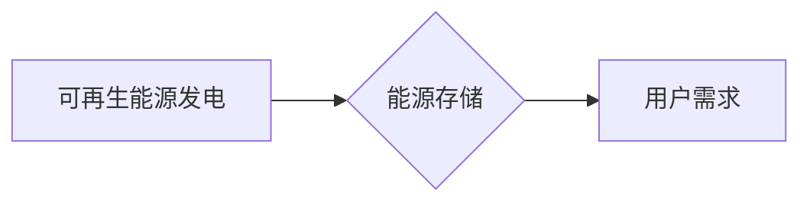

                 

## 能源存储创业：清洁能源革命的关键

> 关键词：能源存储、电池技术、储能系统、可再生能源、智能电网、人工智能、云计算

## 1. 背景介绍

全球能源结构正在经历深刻变革，清洁能源正逐渐成为主流。太阳能、风能等可再生能源的利用日益广泛，但其间歇性发电特性带来了巨大的挑战。如何有效存储清洁能源，并将其稳定输送到用户端，是实现清洁能源革命的关键。

能源存储技术作为解决这一问题的关键技术，近年来发展迅速。从传统的铅酸电池到锂离子电池、钠离子电池、固态电池等新兴技术，不断涌现出更高效、更安全的储能方案。 

随着可再生能源的普及，能源存储市场规模持续扩大，并呈现出爆发式增长趋势。 

## 2. 核心概念与联系

### 2.1 能源存储概述

能源存储是指将电能、热能、化学能等形式的能量储存起来，并在需要时释放出来，以满足不同时间和地点的能量需求。

### 2.2 能源存储类型

能源存储技术主要分为以下几类：

* **电化学存储:** 利用化学反应来存储和释放能量，如锂离子电池、铅酸电池、钠离子电池等。
* **机械存储:** 利用机械运动来存储和释放能量，如 pumped hydro storage (PHS)、压缩空气储能 (CAES) 等。
* **热能存储:** 利用材料的热容量来存储和释放热能，如相变材料、热容量材料等。
* **其他类型:** 包括燃料电池、超级电容器、氢能存储等。

### 2.3 能源存储与清洁能源的关联

可再生能源，如太阳能和风能，具有间歇性发电的特点，其发电量受天气条件影响较大。 

能源存储技术可以有效解决这一问题，通过在发电高峰期储存能量，并在发电低谷期释放能量，实现清洁能源的稳定供给。

**Mermaid 流程图**



## 3. 核心算法原理 & 具体操作步骤

### 3.1 算法原理概述

本文将重点介绍锂离子电池作为一种主流能源存储技术，并探讨其工作原理。

锂离子电池的工作原理基于锂离子的嵌入和脱嵌。电池由正极、负极和隔膜组成。正极通常采用锂金属氧化物，负极采用碳材料，隔膜阻止锂离子在正负极之间直接流动，同时允许锂离子在充电和放电过程中穿梭。

在充电过程中，外部电源提供电能，使负极的碳材料吸附锂离子，而正极的锂金属氧化物释放锂离子。在放电过程中，锂离子从正极流向负极，释放电能。

### 3.2 算法步骤详解

1. **充电过程:**

   * 外部电源提供直流电，使负极的碳材料吸附锂离子。
   * 锂离子通过隔膜从正极的锂金属氧化物中脱嵌，并向负极移动。
   * 负极的碳材料与锂离子结合，形成锂化碳材料。
   * 正极的锂金属氧化物失去锂离子，形成脱锂状态。

2. **放电过程:**

   * 锂离子从负极的锂化碳材料中脱嵌。
   * 锂离子通过隔膜从负极流向正极的锂金属氧化物。
   * 正极的锂金属氧化物与锂离子结合，形成锂化状态。
   * 负极的碳材料失去锂离子，恢复到初始状态。

### 3.3 算法优缺点

**优点:**

* **高能量密度:** 锂离子电池具有较高的能量密度，能够存储较多的能量在单位体积或质量内。
* **长循环寿命:** 锂离子电池具有较长的循环寿命，能够重复充电和放电多次。
* **低自放电率:** 锂离子电池的自放电率较低，能够长时间保持电量。

**缺点:**

* **成本较高:** 锂离子电池的成本相对较高，制约了其大规模应用。
* **安全性问题:** 锂离子电池存在着安全隐患，如过充、过放、短路等，可能导致电池过热、爆炸等事故。
* **资源限制:** 锂资源的储量有限，其开采和利用存在着环境和社会问题。

### 3.4 算法应用领域

锂离子电池广泛应用于：

* **移动电子设备:** 智能手机、平板电脑、笔记本电脑等。
* **电动汽车:** 电动汽车的动力电池。
* **储能系统:** 用于电力系统调峰、削峰填谷、并网支持等。
* **其他领域:** 医疗设备、航空航天、国防军工等。

## 4. 数学模型和公式 & 详细讲解 & 举例说明

### 4.1 数学模型构建

锂离子电池的充放电过程可以用数学模型来描述。

**电池电压:**

$$V = V_0 - kQ$$

其中:

* $V$ 是电池电压
* $V_0$ 是电池开路电压
* $k$ 是电池内部阻抗
* $Q$ 是电池电荷量

**电池容量:**

$$C = \frac{Q}{V}$$

其中:

* $C$ 是电池容量
* $Q$ 是电池电荷量
* $V$ 是电池电压

### 4.2 公式推导过程

电池电压和电池容量的公式可以根据电池的电化学原理推导得出。

电池电压是由电池内部化学反应产生的电动势和电池内部阻抗造成的电压降共同决定的。电池容量则是电池能够存储的电荷量与电池电压的比值。

### 4.3 案例分析与讲解

假设一个锂离子电池的开路电压为 3.7V，内部阻抗为 0.05Ω，电池容量为 1000mAh。

当电池放电时，电池电压会随着电荷量的减少而降低。

当电池电荷量为 500mAh 时，电池电压为:

$$V = 3.7V - 0.05Ω \times 500mAh = 3.6V$$

## 5. 项目实践：代码实例和详细解释说明

### 5.1 开发环境搭建

本项目使用 Python 语言进行开发，并使用以下工具和库:

* Python 3.x
* NumPy
* Matplotlib

### 5.2 源代码详细实现

```python
import numpy as np
import matplotlib.pyplot as plt

# 定义电池参数
V0 = 3.7  # 开路电压
k = 0.05  # 内部阻抗
C = 1000  # 容量 (mAh)

# 定义放电过程
Q = np.linspace(C, 0, 100)  # 电荷量
V = V0 - k * Q  # 电压

# 绘制放电曲线
plt.plot(Q, V)
plt.xlabel('电荷量 (mAh)')
plt.ylabel('电压 (V)')
plt.title('锂离子电池放电曲线')
plt.show()
```

### 5.3 代码解读与分析

这段代码首先定义了电池的参数，包括开路电压、内部阻抗和容量。然后，使用 NumPy 库生成一个电荷量序列，从电池容量到 0 变化。根据电池电压公式，计算出相应的电压值。最后，使用 Matplotlib 库绘制出电池放电曲线。

### 5.4 运行结果展示

代码运行后，会生成一个电池放电曲线的图形，显示出电池电压随着电荷量的减少而降低的趋势。

## 6. 实际应用场景

### 6.1 电力系统储能

锂离子电池可以用于电力系统储能，帮助解决电力系统供需矛盾。

* **调峰:** 在电力负荷高峰期，锂离子电池可以释放能量，补充电力系统缺口。
* **削峰填谷:** 在电力负荷低谷期，锂离子电池可以吸收余量电能，减少电力系统浪费。
* **并网支持:** 锂离子电池可以提高电力系统的稳定性和可靠性，并支持可再生能源的并网。

### 6.2 电动汽车

锂离子电池是电动汽车的核心部件，为电动汽车提供动力。

* **高能量密度:** 锂离子电池能够提供足够的能量，满足电动汽车的续航需求。
* **快速充电:** 锂离子电池支持快速充电，缩短充电时间。
* **长循环寿命:** 锂离子电池能够承受多次充电和放电，延长电动汽车的使用寿命。

### 6.3 其他应用场景

锂离子电池还广泛应用于其他领域，例如：

* **移动电子设备:** 智能手机、平板电脑、笔记本电脑等。
* **医疗设备:** 心脏起搏器、胰岛素泵等。
* **航空航天:** 无人机、卫星等。

### 6.4 未来应用展望

随着技术的进步，锂离子电池的性能将不断提升，应用场景也将更加广泛。

* **更高能量密度:** 研究人员正在开发新型锂离子电池材料，以提高电池的能量密度。
* **更快的充电速度:** 新型电池管理系统和充电技术将进一步缩短充电时间。
* **更长的循环寿命:** 提高电池的循环寿命，延长电池的使用寿命。
* **更低的成本:** 随着规模化生产和材料成本的降低，锂离子电池的成本将进一步降低。

## 7. 工具和资源推荐

### 7.1 学习资源推荐

* **书籍:**

    * 《电池技术》
    * 《锂离子电池》
    * 《能源存储》

* **在线课程:**

    * Coursera: 电池科学与工程
    * edX: 能源存储技术

### 7.2 开发工具推荐

* **Python:** 广泛用于电池管理系统和仿真软件开发。
* **MATLAB:** 用于电池建模和仿真。
* **LabVIEW:** 用于电池测试和数据分析。

### 7.3 相关论文推荐

* **Journal of Power Sources:** 发表电池技术领域的最新研究成果。
* **Electrochemistry Communications:** 发表电池化学和电化学方面的研究论文。
* **Energy & Environmental Science:** 发表能源存储和可再生能源方面的研究论文。

## 8. 总结：未来发展趋势与挑战

### 8.1 研究成果总结

近年来，锂离子电池技术取得了显著进展，其能量密度、循环寿命、安全性等方面都有了很大提升。

### 8.2 未来发展趋势

未来，锂离子电池技术将朝着以下方向发展:

* **提高能量密度:** 开发新型电池材料，提高电池的能量密度。
* **降低成本:** 降低电池材料成本和生产成本。
* **提高安全性:** 提高电池的安全性，减少电池过充、过放、短路等事故的发生。
* **延长循环寿命:** 提高电池的循环寿命，延长电池的使用寿命。

### 8.3 面临的挑战

锂离子电池技术的发展也面临着一些挑战:

* **资源限制:** 锂资源的储量有限，其开采和利用存在着环境和社会问题。
* **安全性问题:** 锂离子电池存在着安全隐患，如过充、过放、短路等，可能导致电池过热、爆炸等事故。
* **成本问题:** 锂离子电池的成本相对较高，制约了其大规模应用。

### 8.4 研究展望

未来，需要加强对锂离子电池技术的研发和创新，以解决上述挑战，推动锂离子电池技术向更高效、更安全、更经济的方向发展。


## 9. 附录：常见问题与解答

**常见问题:**

* **锂离子电池的原理是什么？**

**解答:** 锂离子电池的工作原理基于锂离子的嵌入和脱嵌。电池由正极、负极和隔膜组成。正极通常采用锂金属氧化物，负极采用碳材料，隔膜阻止锂离子在正负极之间直接流动，同时允许锂离子在充电和放电过程中穿梭。

* **锂离子电池的优点和缺点是什么？**

**解答:** 锂离子电池的优点包括高能量密度、长循环寿命和低自放电率。缺点包括成本较高、安全性问题和资源限制。

* **锂离子电池的应用场景有哪些？**

**解答:** 锂离子电池广泛应用于电动汽车、电力系统储能、移动电子设备等领域。

* **锂离子电池的未来发展趋势是什么？**

**解答:** 未来，锂离子电池技术将朝着提高能量密度、降低成本、提高安全性、延长循环寿命的方向发展。


作者：禅与计算机程序设计艺术 / Zen and the Art of Computer Programming 
<end_of_turn>

