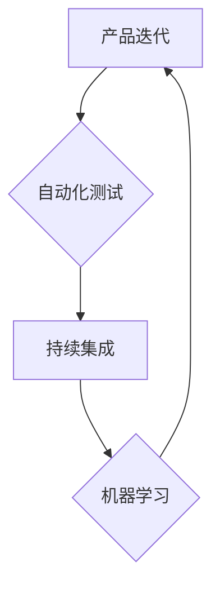

                 

## 自动化创业中的产品迭代与优化

> 关键词：产品迭代、自动化测试、持续集成、机器学习、数据分析、敏捷开发、创业

## 1. 背景介绍

在当今瞬息万变的市场环境下，创业者们面临着前所未有的挑战。如何快速响应用户需求，不断优化产品，并保持竞争优势，成为创业成功的关键。传统的产品开发模式往往较为缓慢，难以适应快速迭代的需求。而自动化创业，则为创业者提供了一种全新的思路和方法。

自动化创业的核心在于利用自动化技术，提高产品开发效率，降低成本，并增强产品质量。自动化测试、持续集成、机器学习等技术，为创业者提供了强大的工具，帮助他们快速迭代产品，并不断优化用户体验。

## 2. 核心概念与联系

### 2.1 产品迭代

产品迭代是指在产品开发过程中，根据用户反馈和市场需求，不断改进和完善产品的过程。

### 2.2 自动化测试

自动化测试是指利用软件工具，自动执行测试用例，并生成测试报告的过程。自动化测试可以提高测试效率，降低测试成本，并确保产品质量。

### 2.3 持续集成

持续集成是指将代码频繁集成到主代码库中，并自动构建和测试代码的过程。持续集成可以帮助团队更快地发现和解决代码问题，并提高软件开发效率。

### 2.4 机器学习

机器学习是指利用算法，使计算机能够从数据中学习，并自动改进其性能的过程。机器学习可以应用于产品迭代中，例如根据用户行为数据，预测用户需求，并自动优化产品功能。

**核心概念联系流程图**



## 3. 核心算法原理 & 具体操作步骤

### 3.1 算法原理概述

在自动化创业中，常用的算法包括：

* **回归算法**: 用于预测连续数值，例如用户留存率、产品转化率等。
* **分类算法**: 用于分类数据，例如用户画像、产品推荐等。
* **聚类算法**: 用于将数据分组，例如用户行为分析、产品功能聚类等。

这些算法的原理基于统计学和数学模型，通过训练数据，学习数据之间的关系，并预测或分类新的数据。

### 3.2 算法步骤详解

**以回归算法为例，其步骤如下：**

1. **数据收集**: 收集与预测目标相关的历史数据。
2. **数据预处理**: 对数据进行清洗、转换、特征工程等处理，使其适合算法训练。
3. **模型选择**: 选择合适的回归算法模型，例如线性回归、逻辑回归等。
4. **模型训练**: 利用训练数据，训练模型参数，使模型能够预测目标值。
5. **模型评估**: 利用测试数据，评估模型的预测精度，例如R-squared、MSE等指标。
6. **模型优化**: 根据评估结果，调整模型参数或选择其他模型，提高预测精度。
7. **模型部署**: 将训练好的模型部署到生产环境中，用于预测新的数据。

### 3.3 算法优缺点

**回归算法的优点**:

* 预测精度高
* 计算效率高
* 易于理解和解释

**回归算法的缺点**:

* 对数据质量要求高
* 难以处理非线性关系
* 容易受到异常值的影响

### 3.4 算法应用领域

回归算法广泛应用于以下领域：

* **市场预测**: 预测市场需求、产品销量等。
* **财务预测**: 预测财务指标、风险评估等。
* **用户行为预测**: 预测用户留存率、转化率等。

## 4. 数学模型和公式 & 详细讲解 & 举例说明

### 4.1 数学模型构建

**线性回归模型**:

假设我们想要预测房屋价格，并已知房屋面积和房间数量等特征。我们可以构建一个线性回归模型，表示房屋价格与特征之间的关系：

$$
y = \beta_0 + \beta_1 x_1 + \beta_2 x_2 + \epsilon
$$

其中：

* $y$ 为房屋价格
* $x_1$ 为房屋面积
* $x_2$ 为房间数量
* $\beta_0$ 为截距
* $\beta_1$ 和 $\beta_2$ 为特征系数
* $\epsilon$ 为误差项

### 4.2 公式推导过程

线性回归模型的目标是找到最佳的 $\beta_0$, $\beta_1$ 和 $\beta_2$ 值，使模型预测的房屋价格与实际价格之间的误差最小。

可以使用最小二乘法来求解最佳参数值。最小二乘法的原理是，找到使得模型预测值与实际值之间的平方误差最小化的参数值。

### 4.3 案例分析与讲解

假设我们有一组房屋数据，包括房屋面积、房间数量和房屋价格。我们可以使用线性回归模型，训练模型参数，并预测新的房屋价格。

例如，如果我们有一个面积为100平方米，房间数量为3的房屋，我们可以使用训练好的模型，预测其价格。

## 5. 项目实践：代码实例和详细解释说明

### 5.1 开发环境搭建

* Python 3.x
* scikit-learn 库
* Jupyter Notebook

### 5.2 源代码详细实现

```python
import pandas as pd
from sklearn.linear_model import LinearRegression
from sklearn.model_selection import train_test_split

# 加载数据
data = pd.read_csv('house_data.csv')

# 选择特征和目标变量
X = data[['面积', '房间数量']]
y = data['价格']

# 将数据分成训练集和测试集
X_train, X_test, y_train, y_test = train_test_split(X, y, test_size=0.2, random_state=42)

# 创建线性回归模型
model = LinearRegression()

# 训练模型
model.fit(X_train, y_train)

# 预测测试集数据
y_pred = model.predict(X_test)

# 评估模型性能
from sklearn.metrics import mean_squared_error
mse = mean_squared_error(y_test, y_pred)
print(f'均方误差: {mse}')
```

### 5.3 代码解读与分析

* 首先，我们加载数据，并选择特征和目标变量。
* 然后，我们将数据分成训练集和测试集，用于训练和评估模型。
* 接下来，我们创建线性回归模型，并使用训练数据训练模型参数。
* 训练完成后，我们可以使用模型预测测试集数据，并评估模型性能。

### 5.4 运行结果展示

运行代码后，会输出模型的均方误差值，该值越小，模型的预测精度越高。

## 6. 实际应用场景

### 6.1 产品推荐

利用机器学习算法，分析用户行为数据，预测用户可能感兴趣的产品，并进行个性化推荐。

### 6.2 用户画像

根据用户数据，构建用户画像，了解用户的兴趣、需求和行为模式，为产品开发和营销提供参考。

### 6.3 异常检测

利用机器学习算法，检测产品中的异常行为，例如用户账户异常登录、系统错误等，及时进行处理。

### 6.4 未来应用展望

随着人工智能技术的不断发展，自动化创业将更加广泛地应用于各个领域，例如：

* **自动生成产品文案**: 利用自然语言处理技术，自动生成产品描述、广告文案等。
* **自动设计产品界面**: 利用机器学习算法，自动设计用户友好的产品界面。
* **自动进行产品测试**: 利用自动化测试工具，自动执行产品测试用例，提高测试效率。

## 7. 工具和资源推荐

### 7.1 学习资源推荐

* **书籍**:
    * 《Python机器学习实战》
    * 《深度学习》
* **在线课程**:
    * Coursera
    * edX
    * Udemy

### 7.2 开发工具推荐

* **Python**: 
    * scikit-learn
    * TensorFlow
    * PyTorch
* **自动化测试工具**:
    * Selenium
    * Appium
* **持续集成工具**:
    * Jenkins
    * GitLab CI

### 7.3 相关论文推荐

* **机器学习**:
    * 《Support Vector Machines》
    * 《Deep Learning》
* **自动化测试**:
    * 《Automated Software Testing: A Practical Approach》
* **持续集成**:
    * 《Continuous Integration: Improving Software Quality and Reducing Risk》

## 8. 总结：未来发展趋势与挑战

### 8.1 研究成果总结

自动化创业为创业者提供了强大的工具和方法，帮助他们更快地迭代产品，并提高产品质量。

### 8.2 未来发展趋势

未来，自动化创业将更加智能化、自动化和个性化。

* **人工智能技术的进一步发展**: 将推动自动化创业的更广泛应用。
* **云计算技术的普及**: 将降低自动化创业的门槛，使更多创业者能够利用自动化技术。
* **数据分析技术的进步**: 将帮助创业者更好地理解用户需求，并进行更精准的产品开发。

### 8.3 面临的挑战

* **数据安全和隐私保护**: 自动化创业需要大量的数据，如何保证数据安全和隐私保护是一个重要的挑战。
* **算法的解释性和可信度**: 许多机器学习算法的内部机制难以理解，如何提高算法的解释性和可信度是一个重要的研究方向。
* **人才短缺**: 自动化创业需要具备人工智能、数据分析等方面的专业人才，人才短缺是一个制约发展的瓶颈。

### 8.4 研究展望

未来，我们需要继续研究和探索自动化创业的新技术、新方法和新应用场景，并解决自动化创业面临的挑战，推动自动化创业的健康发展。

## 9. 附录：常见问题与解答

* **Q1: 自动化创业适合哪些类型的创业项目？**

* **A1**: 自动化创业适合所有类型的创业项目，但对于数据驱动型、迭代速度快的项目，自动化创业的优势更加明显。

* **Q2: 如何选择合适的自动化工具？**

* **A2**: 选择自动化工具需要根据项目的具体需求和技术栈进行选择。

* **Q3: 自动化创业需要具备哪些技能？**

* **A3**: 自动化创业需要具备编程、数据分析、机器学习等方面的技能。


作者：禅与计算机程序设计艺术 / Zen and the Art of Computer Programming 
<end_of_turn>

