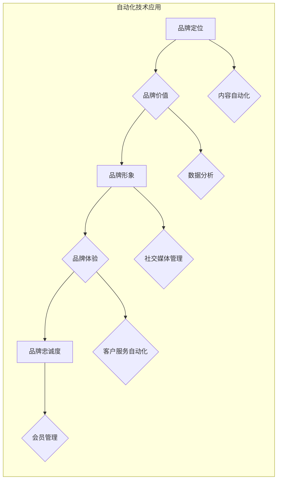

                 

## 自动化创业中的品牌建设与维护

> 关键词：自动化创业、品牌建设、品牌维护、人工智能、机器学习、数据分析、内容营销、社交媒体

## 1. 背景介绍

在当今数字化时代，创业者面临着前所未有的机遇和挑战。自动化技术正在迅速发展，为创业者提供了构建和维护品牌的新途径。自动化创业是指利用自动化技术来简化和加速创业流程，包括品牌建设和维护。

传统品牌建设和维护通常需要大量的人力、时间和资源。然而，自动化技术可以帮助创业者更高效地完成这些任务，例如：

* **自动生成内容：** 利用人工智能和机器学习技术，可以自动生成各种类型的品牌内容，如博客文章、社交媒体帖子、电子邮件营销内容等。
* **个性化营销：** 通过数据分析，可以了解目标客户的喜好和需求，并根据这些信息进行个性化营销，提高营销效果。
* **实时监控和分析：** 利用自动化工具可以实时监控品牌在社交媒体和网络上的表现，并进行数据分析，及时调整品牌策略。

## 2. 核心概念与联系

品牌建设和维护的核心概念包括品牌定位、品牌价值、品牌形象、品牌体验和品牌忠诚度。自动化技术可以应用于各个环节，帮助创业者更有效地管理和提升品牌。

**品牌建设与维护自动化流程图**



## 3. 核心算法原理 & 具体操作步骤

### 3.1  算法原理概述

自动化品牌建设和维护的核心算法原理包括：

* **自然语言处理 (NLP)：** 用于理解和生成人类语言，例如自动生成品牌内容、分析客户评论等。
* **机器学习 (ML)：** 用于从数据中学习模式，例如预测客户行为、个性化推荐等。
* **深度学习 (DL)：** 用于更复杂的数据分析和模式识别，例如图像识别、语音识别等。

### 3.2  算法步骤详解

**自动生成品牌内容**

1. **数据收集：** 收集品牌相关信息，如品牌理念、产品特点、目标客户画像等。
2. **主题提取：** 利用NLP算法提取品牌内容的主题和关键词。
3. **内容模板生成：** 根据主题和关键词，生成不同的内容模板。
4. **内容填充：** 利用机器学习算法填充内容模板，生成个性化的品牌内容。

**个性化营销**

1. **数据收集：** 收集客户的购买记录、浏览历史、社交媒体行为等数据。
2. **用户画像构建：** 利用机器学习算法构建客户的个性化画像。
3. **营销策略制定：** 根据客户画像，制定个性化的营销策略，例如推荐产品、发送促销信息等。

### 3.3  算法优缺点

**优点：**

* **提高效率：** 自动化可以大幅度提高品牌建设和维护的效率。
* **降低成本：** 自动化可以减少人力成本和时间成本。
* **个性化体验：** 自动化可以提供更个性化的品牌体验。

**缺点：**

* **技术门槛：** 自动化技术需要一定的技术门槛。
* **数据安全：** 自动化需要处理大量客户数据，需要确保数据安全。
* **缺乏创意：** 自动化生成的品牌内容可能缺乏创意和个性。

### 3.4  算法应用领域

* **内容营销：** 自动生成博客文章、社交媒体帖子、电子邮件营销内容等。
* **社交媒体管理：** 自动回复客户评论、监控品牌舆情等。
* **客户服务自动化：** 利用聊天机器人提供客户服务。
* **会员管理：** 自动发送会员优惠信息、管理会员积分等。

## 4. 数学模型和公式 & 详细讲解 & 举例说明

### 4.1  数学模型构建

品牌建设和维护可以看作是一个优化问题，目标是最大化品牌价值。品牌价值可以由以下因素影响：

* **品牌知名度：**  $$Brand Awareness = \frac{Number of Brand Mentions}{Total Number of Mentions}$$
* **品牌忠诚度：** $$Brand Loyalty = \frac{Repeat Customers}{Total Customers}$$
* **品牌形象：** $$Brand Image = \frac{Positive Reviews}{Total Reviews}$$

### 4.2  公式推导过程

品牌价值可以定义为：

$$Brand Value = f(Brand Awareness, Brand Loyalty, Brand Image)$$

其中，$f$ 是一个函数，表示品牌价值与上述因素之间的关系。

### 4.3  案例分析与讲解

假设一家新创公司想要提高品牌价值。可以通过以下方式进行优化：

* **提高品牌知名度：** 通过社交媒体营销、内容营销等方式增加品牌曝光率。
* **提高品牌忠诚度：** 通过提供优质的产品和服务，以及会员计划等方式增强客户粘性。
* **提升品牌形象：** 通过口碑营销、用户评价管理等方式提升品牌正面形象。

通过优化上述因素，可以提高品牌价值，从而实现创业目标。

## 5. 项目实践：代码实例和详细解释说明

### 5.1  开发环境搭建

* **操作系统：** Ubuntu 20.04 LTS
* **编程语言：** Python 3.8
* **框架：** Flask
* **库：** NLTK, Scikit-learn, TensorFlow

### 5.2  源代码详细实现

```python
from flask import Flask, request, jsonify
from nltk.tokenize import word_tokenize
from sklearn.feature_extraction.text import TfidfVectorizer
from tensorflow.keras.models import Sequential
from tensorflow.keras.layers import Embedding, LSTM, Dense

app = Flask(__name__)

# 加载预训练词嵌入模型
embedding_model = ...

# 加载训练好的文本分类模型
classifier = ...

@app.route('/generate_content', methods=['POST'])
def generate_content():
    data = request.get_json()
    topic = data['topic']
    keywords = data['keywords']

    # 使用NLP算法生成内容
    content = ...

    return jsonify({'content': content})

@app.route('/classify_sentiment', methods=['POST'])
def classify_sentiment():
    data = request.get_json()
    text = data['text']

    # 使用机器学习模型分类情感
    sentiment = classifier.predict(text)

    return jsonify({'sentiment': sentiment})

if __name__ == '__main__':
    app.run(debug=True)
```

### 5.3  代码解读与分析

* **内容生成模块：** 利用NLP算法，根据主题和关键词生成品牌内容。
* **情感分类模块：** 利用机器学习模型，对客户评论进行情感分类。
* **API接口：** 提供RESTful API接口，方便外部应用调用。

### 5.4  运行结果展示

* **内容生成：** 系统可以根据用户输入的主题和关键词，自动生成相关的品牌内容。
* **情感分类：** 系统可以对客户评论进行情感分类，例如正面、负面、中性等。

## 6. 实际应用场景

* **新创公司：** 利用自动化技术快速建立品牌，并进行有效的品牌推广。
* **中小企业：** 利用自动化技术提高品牌管理效率，节省人力成本。
* **大型企业：** 利用自动化技术进行大规模品牌营销，提升品牌影响力。

### 6.4  未来应用展望

* **更智能的品牌内容生成：** 利用更先进的AI技术，生成更具创意和个性化的品牌内容。
* **更精准的个性化营销：** 利用更强大的数据分析能力，进行更精准的客户画像和营销策略制定。
* **更全面的品牌管理：** 将自动化技术应用于品牌全生命周期管理，从品牌定位到品牌维护，实现全方位品牌管理。

## 7. 工具和资源推荐

### 7.1  学习资源推荐

* **Coursera：** 提供人工智能、机器学习等相关课程。
* **Udacity：** 提供深度学习、自然语言处理等相关课程。
* **Kaggle：** 提供数据科学竞赛和学习资源。

### 7.2  开发工具推荐

* **Python：** 广泛应用于数据科学和人工智能领域。
* **Flask：** 轻量级Web框架，适合开发API接口。
* **TensorFlow：** 深度学习框架，用于构建和训练机器学习模型。

### 7.3  相关论文推荐

* **Attention Is All You Need：** Transformer模型的论文，对自然语言处理领域产生了重大影响。
* **BERT：** 基于Transformer的预训练语言模型，在文本理解任务上取得了优异的成绩。

## 8. 总结：未来发展趋势与挑战

### 8.1  研究成果总结

自动化技术在品牌建设和维护领域取得了显著进展，例如自动生成品牌内容、个性化营销、情感分析等。

### 8.2  未来发展趋势

* **更智能的自动化：** 利用更先进的AI技术，实现更智能的品牌管理。
* **更个性化的体验：** 利用更强大的数据分析能力，提供更个性化的品牌体验。
* **更全面的品牌管理：** 将自动化技术应用于品牌全生命周期管理。

### 8.3  面临的挑战

* **数据安全：** 自动化需要处理大量客户数据，需要确保数据安全。
* **算法偏见：** 机器学习算法可能存在偏见，需要进行算法调优和监控。
* **伦理问题：** 自动化品牌建设和维护可能引发伦理问题，需要进行伦理规范的制定和监管。

### 8.4  研究展望

未来，自动化品牌建设和维护将朝着更智能、更个性化、更全面的方向发展。需要进一步研究更先进的AI技术，解决数据安全、算法偏见等问题，并制定相应的伦理规范，确保自动化品牌建设和维护的健康发展。

## 9. 附录：常见问题与解答

* **Q：自动化品牌建设和维护是否会取代人类的工作？**

A：自动化技术可以提高品牌管理效率，但不会完全取代人类的工作。人类仍然需要进行品牌战略规划、创意设计、客户关系管理等工作。

* **Q：如何确保自动化品牌建设和维护的安全性？**

A：需要采取措施确保数据安全，例如加密存储数据、定期备份数据、进行安全审计等。

* **Q：如何解决自动化品牌建设和维护中的算法偏见问题？**

A：需要进行算法调优和监控，并使用多元化的训练数据，以减少算法偏见。


作者：禅与计算机程序设计艺术 / Zen and the Art of Computer Programming 
<end_of_turn>

