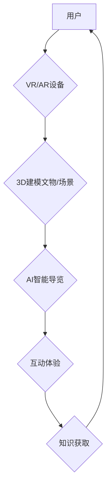

                 

## 虚拟博物馆教育:全球文化资源的沉浸式学习平台

> 关键词：虚拟现实、增强现实、博物馆教育、文化遗产、沉浸式学习、人工智能、3D建模、游戏化学习

## 1. 背景介绍

随着科技的飞速发展，虚拟现实 (VR) 和增强现实 (AR) 技术逐渐成熟，为博物馆教育带来了前所未有的机遇。传统博物馆的参观模式往往局限于静态展示和文字讲解，难以激发参观者的兴趣和参与度。而虚拟博物馆教育平台则通过沉浸式体验，将参观者带入虚拟的博物馆环境，与文物和历史事件进行互动，从而实现更生动、更直观、更具参与性的学习体验。

全球文化资源的数字化和网络化也为虚拟博物馆教育提供了丰富的素材。越来越多的博物馆和文化机构将文物、艺术品、历史文献等数字化，并将其发布到网络平台。虚拟博物馆教育平台可以整合这些资源，构建一个全球性的文化知识库，为用户提供更广泛、更深入的文化学习体验。

## 2. 核心概念与联系

虚拟博物馆教育平台的核心概念包括：

* **虚拟现实 (VR):** 利用计算机技术模拟真实环境，用户可以通过头戴式设备或其他设备沉浸其中，体验虚拟世界。
* **增强现实 (AR):** 将虚拟内容叠加到现实世界中，用户可以通过手机、平板电脑等设备看到虚拟元素，与现实世界进行交互。
* **3D建模:**  利用计算机软件创建三维模型，可以精确地还原文物、建筑、场景等，为虚拟博物馆提供逼真的视觉效果。
* **人工智能 (AI):**  利用人工智能技术，可以实现虚拟博物馆的智能化导览、个性化推荐、互动问答等功能，提升用户体验。

**核心架构流程图:**



## 3. 核心算法原理 & 具体操作步骤

### 3.1  算法原理概述

虚拟博物馆教育平台的核心算法主要包括：

* **3D建模算法:** 用于创建虚拟文物和场景的模型，常用的算法包括网格生成算法、纹理贴图算法、光照计算算法等。
* **路径规划算法:** 用于规划用户在虚拟博物馆中的移动路径，常用的算法包括A*算法、Dijkstra算法等。
* **物体识别算法:** 用于识别用户与虚拟文物进行交互，常用的算法包括深度学习、计算机视觉等。
* **自然语言处理算法:** 用于理解用户自然语言输入，并进行相应的回应，常用的算法包括词向量模型、序列标注模型等。

### 3.2  算法步骤详解

**3D建模算法步骤:**

1. **数据采集:** 使用3D扫描仪、照片、模型等方式采集文物或场景的真实数据。
2. **数据处理:** 对采集到的数据进行预处理，例如去除噪声、修复缺失部分等。
3. **网格生成:** 将处理后的数据转换为三维网格模型，定义模型的形状和结构。
4. **纹理贴图:** 为模型添加纹理贴图，赋予模型真实感和细节。
5. **光照计算:** 计算模型在不同光照条件下的外观效果，使模型更加逼真。

**路径规划算法步骤:**

1. **构建地图:** 将虚拟博物馆环境构建成地图，包含障碍物、路径等信息。
2. **设定起点和终点:** 用户指定需要前往的虚拟地点作为终点。
3. **搜索路径:** 使用路径规划算法搜索从起点到终点的最佳路径，考虑时间、距离、障碍物等因素。
4. **生成导航指令:** 将搜索到的路径转换为用户可以理解的导航指令，例如转向、行走距离等。

### 3.3  算法优缺点

**3D建模算法:**

* **优点:** 可以精确地还原文物和场景的细节，提升虚拟博物馆的逼真度。
* **缺点:** 建模过程复杂，需要专业的技能和软件工具，建模时间较长。

**路径规划算法:**

* **优点:** 可以帮助用户快速找到目标地点，提高用户体验。
* **缺点:** 在复杂环境下，算法可能会出现路径规划错误，需要不断优化算法和地图数据。

### 3.4  算法应用领域

* **博物馆教育:** 虚拟博物馆教育平台可以为用户提供沉浸式的文化学习体验，激发学习兴趣。
* **文物保护:** 通过虚拟化文物，可以减少文物被损坏的风险，并方便进行文物研究和保护。
* **旅游业:** 虚拟博物馆可以作为旅游景点的一部分，吸引游客前来参观，提升旅游体验。
* **文化传播:** 虚拟博物馆可以将文化资源传播到全球各地，促进文化交流和理解。

## 4. 数学模型和公式 & 详细讲解 & 举例说明

### 4.1  数学模型构建

虚拟博物馆教育平台的数学模型主要包括：

* **3D空间坐标系模型:** 用于描述虚拟文物和场景在三维空间中的位置和姿态。
* **路径规划模型:** 用于描述虚拟博物馆环境中的路径和障碍物，并计算用户从起点到终点的最佳路径。
* **物体识别模型:** 用于描述虚拟文物和场景的特征，并识别用户与虚拟物体的交互行为。

### 4.2  公式推导过程

**3D空间坐标系模型:**

* **位置向量:**  用三维坐标 (x, y, z) 表示虚拟物体的空间位置。
* **旋转矩阵:** 用 3x3 矩阵表示虚拟物体的旋转角度和方向。

**路径规划模型:**

* **曼哈顿距离:**  计算两个点在直角坐标系中的距离，公式为:  $d = |x_1 - x_2| + |y_1 - y_2|$
* **欧几里得距离:** 计算两个点在平面上的距离，公式为: $d = \sqrt{(x_1 - x_2)^2 + (y_1 - y_2)^2}$

### 4.3  案例分析与讲解

**案例:** 假设虚拟博物馆中有一个文物展厅，包含多个文物模型和虚拟导览员。用户想要参观某个特定的文物模型，可以使用路径规划算法计算从起点到文物模型的最佳路径。

**分析:** 

1. 构建虚拟展厅地图，包含文物模型的位置、展厅的布局、障碍物等信息。
2. 用户指定需要参观的文物模型作为终点。
3. 使用 A* 算法搜索从起点到终点的最佳路径，考虑时间、距离、障碍物等因素。
4. 生成导航指令，引导用户前往目标文物模型。

## 5. 项目实践：代码实例和详细解释说明

### 5.1  开发环境搭建

* **操作系统:** Windows/macOS/Linux
* **编程语言:** Python
* **开发工具:** PyCharm/VS Code
* **VR/AR SDK:** Unity/Unreal Engine/ARKit/ARCore

### 5.2  源代码详细实现

```python
# 3D建模示例代码 (使用 Blender API)

import bpy

# 创建一个立方体
bpy.ops.mesh.primitive_cube_add()

# 设置立方体的尺寸
bpy.context.object.scale = (1, 1, 1)

# 添加纹理贴图
material = bpy.data.materials.new(name="MyMaterial")
material.diffuse_color = (1, 0, 0, 1)  # 设置红色
bpy.context.object.data.materials.append(material)

# 导出模型为 .obj 文件
bpy.ops.export_mesh.obj(filepath="my_cube.obj")
```

### 5.3  代码解读与分析

* **导入 Blender API:**  使用 Python 脚本控制 Blender 软件。
* **创建立方体:** 使用 `bpy.ops.mesh.primitive_cube_add()` 命令创建立方体模型。
* **设置尺寸:** 使用 `bpy.context.object.scale` 属性设置立方体的尺寸。
* **添加纹理贴图:** 创建一个新的材质，设置颜色，并将其应用到立方体模型上。
* **导出模型:** 使用 `bpy.ops.export_mesh.obj()` 命令将模型导出为 .obj 文件。

### 5.4  运行结果展示

运行上述代码后，将生成一个名为 "my_cube.obj" 的文件，该文件包含一个红色的立方体模型。

## 6. 实际应用场景

* **博物馆展览:** 虚拟博物馆可以作为博物馆展览的一部分，为参观者提供更生动的体验。例如，可以将古代文物虚拟化，让参观者近距离观察文物细节，并了解文物背后的历史故事。
* **远程教育:** 虚拟博物馆可以用于远程教育，让学生即使身处远方也能体验博物馆的文化资源。例如，可以将博物馆的虚拟导览内容发布到在线平台，让学生在家中学习。
* **文化遗产保护:** 虚拟博物馆可以帮助保护脆弱的文化遗产。例如，可以将古建筑虚拟化，并进行修复和重建，防止文物被损坏。

### 6.4  未来应用展望

* **更沉浸式的体验:** 未来虚拟博物馆将更加注重沉浸式的体验，例如使用更逼真的3D建模技术、更自然的交互方式、更丰富的感官刺激。
* **个性化的学习:** 未来虚拟博物馆将提供个性化的学习体验，例如根据用户的学习进度和兴趣推荐不同的内容，并提供个性化的互动任务。
* **跨文化交流:** 未来虚拟博物馆将促进跨文化交流，例如将不同国家的文化资源整合到同一个平台，让用户可以体验来自世界各地的文化。

## 7. 工具和资源推荐

### 7.1  学习资源推荐

* **Unity Learn:** https://learn.unity.com/
* **Unreal Engine Learning:** https://www.unrealengine.com/en-US/learn
* **Blender Guru:** https://www.blenderguru.com/

### 7.2  开发工具推荐

* **Unity:** https://unity.com/
* **Unreal Engine:** https://www.unrealengine.com/
* **Blender:** https://www.blender.org/

### 7.3  相关论文推荐

* **Virtual Reality in Education: A Systematic Review**
* **Augmented Reality in Education: A Review of the Literature**
* **The Impact of Virtual Museums on Learning and Engagement**

## 8. 总结：未来发展趋势与挑战

### 8.1  研究成果总结

虚拟博物馆教育平台在博物馆教育、文物保护、文化传播等领域取得了显著成果，为用户提供了一种全新的文化学习体验。

### 8.2  未来发展趋势

* **更逼真的虚拟体验:**  利用更先进的3D建模技术、虚拟现实技术和增强现实技术，打造更加逼真的虚拟博物馆环境。
* **更智能化的交互体验:**  利用人工智能技术，实现虚拟博物馆的智能化导览、个性化推荐、互动问答等功能，提升用户体验。
* **更广泛的文化资源整合:**  整合来自世界各地的文化资源，构建一个全球性的虚拟博物馆平台，促进跨文化交流和理解。

### 8.3  面临的挑战

* **技术难题:**  虚拟博物馆的开发需要整合多种先进技术，例如3D建模、虚拟现实、增强现实、人工智能等，技术难度较大。
* **内容建设:**  虚拟博物馆需要大量的文化资源进行填充，内容建设是一个长期而艰巨的任务。
* **成本问题:**  虚拟博物馆的开发和维护成本较高，需要政府、企业和社会各界的共同支持。

### 8.4  研究展望

未来，虚拟博物馆教育平台将继续朝着更逼真、更智能、更广泛的方向发展，为用户提供更加丰富、更加精彩的文化学习体验。


## 9. 附录：常见问题与解答

* **Q: 虚拟博物馆和传统博物馆有什么区别？**

* **A:** 虚拟博物馆利用虚拟现实和增强现实技术，为用户提供沉浸式的体验，而传统博物馆则以实体文物和展览为主。虚拟博物馆可以突破地域限制，让用户随时随地体验文化资源，而传统博物馆则需要用户亲自前往参观。

* **Q: 如何创建虚拟博物馆？**

* **A:** 创建虚拟博物馆需要整合多种技术，例如3D建模、虚拟现实、增强现实、人工智能等。需要专业的技术人员和团队进行开发和维护。

* **Q: 虚拟博物馆的未来发展趋势是什么？**

* **A:** 虚拟博物馆的未来发展趋势是更加逼真、更加智能、更加广泛。将利用更先进的技术，提供更沉浸式的体验，并整合更多的文化资源，促进跨文化交流和理解。


作者：禅与计算机程序设计艺术 / Zen and the Art of Computer Programming 
<end_of_turn>

