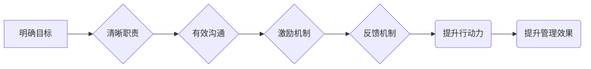

                 

## 行动力与管理效果的关系

> 关键词：行动力、管理效果、绩效提升、团队协作、目标驱动、激励机制、沟通效率、反馈机制、数据驱动

## 1. 背景介绍

在当今瞬息万变的科技时代，企业和组织面临着前所未有的挑战和机遇。如何激发员工的行动力，提升管理效果，从而实现组织目标，成为摆在管理者面前的首要课题。行动力，是指个体或团队在明确目标和计划下，能够有效地执行和完成任务的能力。管理效果，则是指管理者通过各种手段和方法，引导和调控团队成员的行为，最终实现组织目标的程度。两者之间存在着密切的关联，行动力是提升管理效果的关键因素。

传统的管理模式往往侧重于命令型和控制型，缺乏对员工的激励和赋能。这种模式难以激发员工的主动性和创造性，导致管理效果低下。随着管理理念的不断发展，越来越多的企业开始重视员工的行动力和自主性，并探索更加有效的管理模式。

## 2. 核心概念与联系

### 2.1 行动力与管理效果的关联

行动力与管理效果之间存在着双向促进的关系。

* **行动力提升管理效果：** 当员工拥有强烈的行动力时，他们能够积极主动地完成任务，提高工作效率，最终提升组织整体的管理效果。
* **管理效果提升行动力：**  有效的管理模式能够为员工提供清晰的目标、明确的职责和必要的支持，从而激发员工的行动力。

### 2.2  核心概念原理与架构

**Mermaid 流程图：**



**核心概念原理与架构解释：**

1. **明确目标：**  管理者需要清晰地将组织目标分解为具体的团队目标和个人目标，并与员工进行充分沟通，确保员工对目标的理解和认同。
2. **清晰职责：**  明确分配员工的职责和权限，让员工知道自己需要做什么，以及如何完成任务。
3. **有效沟通：** 建立畅通的沟通渠道，及时传递信息，解决问题，并鼓励员工积极表达自己的想法和建议。
4. **激励机制：**  建立合理的激励机制，例如绩效奖励、晋升机会等，鼓励员工积极主动地完成任务，并为优秀员工提供相应的回报。
5. **反馈机制：**  定期对员工的工作进行评估和反馈，及时指出不足，并给予鼓励和支持，帮助员工不断提升自己的能力。

## 3. 核心算法原理 & 具体操作步骤

### 3.1  算法原理概述

为了提升行动力，我们可以借鉴一些心理学和管理学中的原理，例如：

* **目标设定理论：**  明确的目标能够激发人们的行动力，并提供方向和动力。
* **自我效能感理论：**  相信自己能够完成任务的能力能够增强行动力。
* **激励理论：**  合理的激励机制能够提高员工的积极性和主动性。

### 3.2  算法步骤详解

1. **目标设定：**  与员工共同设定SMART目标（具体、可衡量、可实现、相关、时间限定）。
2. **职责清晰：**  明确分配员工的职责和权限，并提供必要的培训和支持。
3. **沟通畅通：**  建立定期沟通机制，及时了解员工的需求和困难，并提供及时有效的帮助。
4. **激励机制：**  建立合理的激励机制，例如绩效奖励、晋升机会等，并根据员工的贡献进行公平公正的分配。
5. **反馈机制：**  定期对员工的工作进行评估和反馈，及时指出不足，并给予鼓励和支持。

### 3.3  算法优缺点

**优点：**

* 能够有效地激发员工的行动力和主动性。
* 能够提高团队协作和沟通效率。
* 能够提升员工的自我效能感和工作满意度。

**缺点：**

* 需要投入一定的成本和时间来实施。
* 需要管理者具备良好的沟通和激励能力。
* 需要建立完善的评估和反馈机制。

### 3.4  算法应用领域

该算法适用于各种类型的组织和团队，例如：

* 科技公司
* 金融机构
* 教育机构
* 非营利组织

## 4. 数学模型和公式 & 详细讲解 & 举例说明

### 4.1  数学模型构建

我们可以使用以下数学模型来描述行动力与管理效果之间的关系：

$$
Management Effectiveness = f(Action Force, Communication Efficiency, Feedback Mechanism)
$$

其中：

* **Management Effectiveness** 代表管理效果。
* **Action Force** 代表员工的行动力。
* **Communication Efficiency** 代表沟通效率。
* **Feedback Mechanism** 代表反馈机制的有效性。

### 4.2  公式推导过程

该公式表明，管理效果是一个多因素综合的结果，其中行动力、沟通效率和反馈机制是关键因素。

* **行动力** 是员工完成任务的能力和意愿，直接影响着管理效果。
* **沟通效率** 是信息传递和理解的效率，能够有效地传递目标和信息，提高员工的行动力。
* **反馈机制** 是评估和改进员工行为的机制，能够及时指出不足，并给予鼓励和支持，帮助员工不断提升行动力。

### 4.3  案例分析与讲解

假设一家科技公司想要提升员工的行动力，从而提高管理效果。

* **行动力提升：** 公司可以设定SMART目标，并提供必要的培训和支持，帮助员工提升技能和自信心。
* **沟通效率提升：** 公司可以建立定期沟通机制，并使用协作工具，提高信息传递和理解的效率。
* **反馈机制提升：** 公司可以建立定期评估和反馈机制，及时指出员工的不足，并给予鼓励和支持。

通过以上措施，公司可以有效地提升员工的行动力，从而提高管理效果。

## 5. 项目实践：代码实例和详细解释说明

### 5.1  开发环境搭建

为了更好地理解行动力与管理效果之间的关系，我们可以开发一个简单的项目来模拟和验证。

* **编程语言：** Python
* **框架：** Flask

### 5.2  源代码详细实现

```python
from flask import Flask, render_template, request

app = Flask(__name__)

# 模拟员工数据
employees = [
    {'name': '张三', 'action_force': 80, 'communication_efficiency': 70, 'feedback_mechanism': 60},
    {'name': '李四', 'action_force': 90, 'communication_efficiency': 80, 'feedback_mechanism': 70},
    {'name': '王五', 'action_force': 70, 'communication_efficiency': 60, 'feedback_mechanism': 50},
]

@app.route('/')
def index():
    return render_template('index.html', employees=employees)

@app.route('/calculate', methods=['POST'])
def calculate():
    # 获取用户输入的数据
    action_force = float(request.form['action_force'])
    communication_efficiency = float(request.form['communication_efficiency'])
    feedback_mechanism = float(request.form['feedback_mechanism'])

    # 计算管理效果
    management_effectiveness = action_force * communication_efficiency * feedback_mechanism / 100

    return render_template('result.html', management_effectiveness=management_effectiveness)

if __name__ == '__main__':
    app.run(debug=True)
```

### 5.3  代码解读与分析

* **数据模拟：** 代码中模拟了员工的数据，包括行动力、沟通效率和反馈机制。
* **路由定义：** 代码定义了两个路由，一个是首页，一个是计算管理效果的路由。
* **用户输入：** 计算管理效果的路由接收用户输入的数据，包括行动力、沟通效率和反馈机制。
* **管理效果计算：** 代码根据公式计算管理效果。
* **结果展示：** 代码将计算结果展示在页面上。

### 5.4  运行结果展示

运行代码后，用户可以访问网页，输入员工的行动力、沟通效率和反馈机制，然后点击计算按钮，即可获取管理效果的计算结果。

## 6. 实际应用场景

### 6.1  团队管理

在团队管理中，可以利用行动力与管理效果之间的关系，制定有效的激励机制，提高团队成员的积极性和主动性，从而提升团队整体的绩效。

### 6.2  项目管理

在项目管理中，可以根据项目的具体情况，设定SMART目标，并制定相应的行动计划，确保项目能够按时完成。

### 6.3  个人成长

个人也可以利用行动力与管理效果之间的关系，设定个人目标，并制定相应的行动计划，从而实现个人成长和发展。

### 6.4  未来应用展望

随着人工智能和数据分析技术的不断发展，我们可以利用这些技术来更加精准地评估员工的行动力和管理效果，并提供更加个性化的建议和支持。

## 7. 工具和资源推荐

### 7.1  学习资源推荐

* **书籍：**
    * 《高效能人士的七个习惯》
    * 《行动力：从目标到成果的指南》
* **在线课程：**
    * Coursera:  Project Management Specialization
    * Udemy:  The Complete Project Management Course

### 7.2  开发工具推荐

* **协作工具：**
    * Slack
    * Microsoft Teams
* **项目管理工具：**
    * Jira
    * Trello

### 7.3  相关论文推荐

* **行动力与绩效之间的关系：**
    *  Action Force and Performance: A Meta-Analysis
* **激励机制与行动力的影响：**
    *  The Impact of Incentive Mechanisms on Action Force

## 8. 总结：未来发展趋势与挑战

### 8.1  研究成果总结

通过以上分析，我们可以得出以下结论：

* 行动力和管理效果之间存在着密切的关联。
* 提升行动力是提升管理效果的关键因素。
* 可以利用心理学和管理学原理，以及人工智能和数据分析技术，来更加有效地提升行动力和管理效果。

### 8.2  未来发展趋势

未来，行动力与管理效果的研究将朝着以下方向发展：

* **更加精准的评估方法：** 利用人工智能和数据分析技术，开发更加精准的评估方法，能够更加准确地评估员工的行动力和管理效果。
* **更加个性化的激励机制：** 根据员工的个性特点和需求，制定更加个性化的激励机制，提高员工的积极性和主动性。
* **更加智能的管理系统：** 开发更加智能的管理系统，能够自动分析数据，提供个性化的建议和支持，帮助管理者更加有效地提升行动力和管理效果。

### 8.3  面临的挑战

在实践中，提升行动力和管理效果也面临着一些挑战：

* **文化差异：** 不同文化背景下，对行动力和管理效果的理解和期望可能存在差异。
* **组织结构：** 复杂的组织结构可能会阻碍信息的传递和沟通，影响行动力的提升。
* **个人因素：** 员工的个人性格、能力和动机也会影响行动力和管理效果。

### 8.4  研究展望

未来，我们需要继续深入研究行动力与管理效果之间的关系，探索更加有效的提升行动力和管理效果的方法，为企业和组织的发展提供更加有力的支持。

## 9. 附录：常见问题与解答

**问题 1：如何提高员工的行动力？**

**解答：**

* 明确目标和职责
* 提供必要的培训和支持
* 建立有效的沟通机制
* 建立合理的激励机制
* 提供及时有效的反馈

**问题 2：如何评估员工的行动力？**

**解答：**

* 通过观察员工的工作表现
* 通过员工自我评估
* 通过同事和领导的评价
* 通过数据分析

**问题 3：如何提升管理效果？**

**解答：**

* 提升员工的行动力
* 提高沟通效率
* 建立完善的反馈机制
* 利用数据驱动决策
* 持续改进管理模式


作者：禅与计算机程序设计艺术 / Zen and the Art of Computer Programming 
<end_of_turn>

