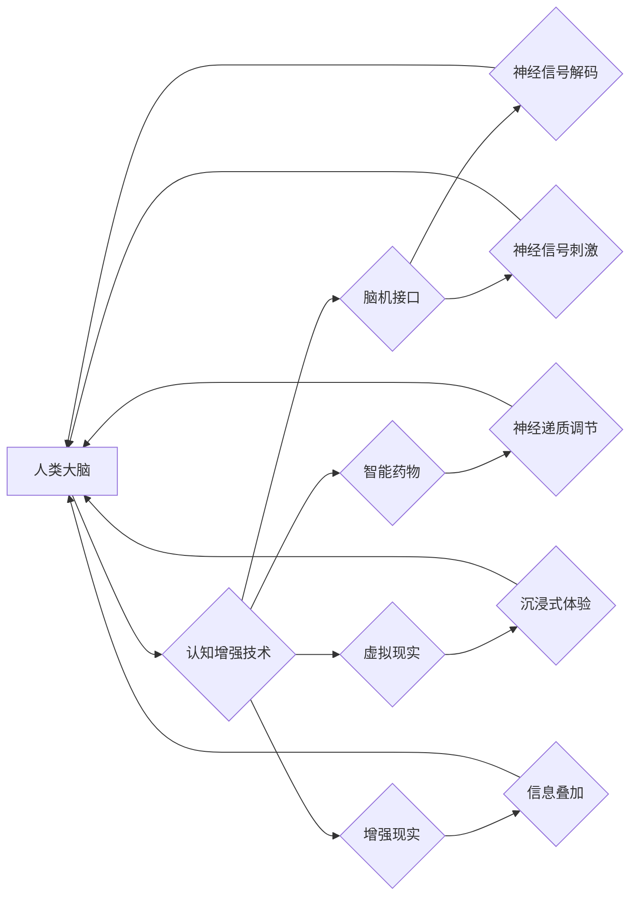

                 

## 认知增强技术：从脑机接口到智能药物

> 关键词：脑机接口、认知增强、智能药物、神经科学、人工智能、生物技术、未来科技

## 1. 背景介绍

人类对认知能力的提升一直是永恒的追求。从古至今，人们通过各种方式尝试增强自己的记忆、注意力、学习能力等。随着科技的进步，特别是近年来人工智能、神经科学和生物技术的蓬勃发展，认知增强技术（Cognitive Enhancement Technology）逐渐成为现实，并展现出巨大的潜力。

认知增强技术旨在通过外部工具或手段，提升人类的认知功能，使其能够更高效地学习、思考、记忆和创造。它涵盖了多种技术领域，包括脑机接口、智能药物、虚拟现实、增强现实等。

### 1.1 认知增强技术的驱动因素

* **人口老龄化和劳动力短缺:**  随着全球人口老龄化，劳动力短缺问题日益突出。认知增强技术可以帮助老年人保持认知功能，延长工作时间，缓解劳动力短缺压力。
* **激烈的竞争环境:**  在快速发展的社会，人们需要不断提升自己的竞争力。认知增强技术可以帮助人们提高学习效率、增强记忆力、提升创造力，在竞争中占据优势。
* **探索人类潜能:**  认知增强技术也蕴含着对人类潜能的探索。通过技术手段，我们可以更好地理解人类大脑的工作机制，并探索人类认知能力的极限。

### 1.2 认知增强技术的伦理挑战

认知增强技术的发展也引发了一些伦理争议，例如：

* **公平性:**  认知增强技术可能加剧社会不平等，因为只有经济条件允许的人才能获得这些技术带来的益处。
* **安全性和隐私性:**  脑机接口等技术可能会带来安全风险和隐私泄露问题。
* **人类本性:**  过度依赖认知增强技术可能会改变人类的思维方式和行为模式，甚至影响人类的本性。

## 2. 核心概念与联系

认知增强技术涉及多个领域，其核心概念和联系可以用以下流程图来表示：



* **人类大脑:**  认知增强技术的最终目标是提升人类大脑的认知功能。
* **认知增强技术:**  指通过各种技术手段，增强人类认知能力的技术。
* **脑机接口:**  通过电子设备与大脑直接连接，实现人机交互的技术。
* **智能药物:**  通过调节神经递质，提升认知功能的药物。
* **虚拟现实:**  通过模拟真实环境，提供沉浸式体验的技术。
* **增强现实:**  将虚拟信息叠加到现实世界中，提供增强现实体验的技术。

## 3. 核心算法原理 & 具体操作步骤

### 3.1 算法原理概述

本节将以脑机接口为例，介绍其核心算法原理。

脑机接口的核心算法原理是通过解码大脑神经信号，将大脑活动转换为可理解的指令，从而实现人机交互。

主要算法包括：

* **特征提取算法:**  从脑电信号中提取有意义的特征，例如频率、幅度、相位等。常用的特征提取算法包括小波变换、傅里叶变换、独立成分分析等。
* **分类算法:**  将提取的特征分类，识别不同的脑电活动模式，例如运动意图、语言意图等。常用的分类算法包括支持向量机、神经网络、决策树等。
* **解码算法:**  根据分类结果，解码大脑活动，生成相应的指令。

### 3.2 算法步骤详解

1. **数据采集:**  使用脑电图仪等设备采集脑电信号。
2. **信号预处理:**  对采集到的脑电信号进行滤波、去噪等预处理，去除无关信息，提高信号质量。
3. **特征提取:**  使用特征提取算法，从预处理后的脑电信号中提取有意义的特征。
4. **分类:**  使用分类算法，将提取的特征分类，识别不同的脑电活动模式。
5. **解码:**  根据分类结果，解码大脑活动，生成相应的指令。
6. **反馈:**  将指令反馈给外部设备，实现人机交互。

### 3.3 算法优缺点

**优点:**

* **无创性:**  脑机接口技术一般采用非侵入式方法采集脑电信号，不会对大脑造成伤害。
* **实时性:**  脑机接口技术可以实时解码大脑活动，实现即时人机交互。
* **潜力巨大:**  脑机接口技术有望在医疗、教育、娱乐等多个领域发挥重要作用。

**缺点:**

* **信号质量:**  脑电信号容易受到干扰，信号质量较低，需要进一步提高信号处理技术。
* **算法复杂度:**  脑机接口算法复杂，需要大量的训练数据和计算资源。
* **伦理问题:**  脑机接口技术涉及到隐私、安全等伦理问题，需要谨慎对待。

### 3.4 算法应用领域

* **医疗:**  帮助瘫痪患者控制假肢、恢复语言功能等。
* **教育:**  辅助学习、提高记忆力等。
* **娱乐:**  实现脑控游戏、虚拟现实体验等。
* **军事:**  增强士兵的作战能力、提高指挥效率等。

## 4. 数学模型和公式 & 详细讲解 & 举例说明

### 4.1 数学模型构建

脑机接口算法的数学模型通常基于统计学习理论，利用机器学习算法从脑电信号中学习特征，并建立预测模型。

一个典型的数学模型可以表示为：

$$
y = f(x; \theta)
$$

其中：

* $y$ 是预测的输出，例如运动意图的类别。
* $x$ 是输入的特征向量，例如脑电信号的频率、幅度等。
* $f$ 是预测函数，例如支持向量机、神经网络等算法。
* $\theta$ 是模型参数，需要通过训练数据学习得到。

### 4.2 公式推导过程

具体的公式推导过程取决于所使用的算法。例如，支持向量机算法的推导过程涉及到凸优化问题，需要使用拉格朗日乘子法等优化算法。

### 4.3 案例分析与讲解

假设我们使用支持向量机算法构建一个脑机接口模型，用于识别手部运动意图。

训练数据包括多个人的脑电信号和对应的运动意图标签。

模型训练完成后，可以将新的脑电信号输入模型，预测对应的运动意图。

例如，当用户想移动手指时，脑电信号会呈现出特定的特征模式，模型可以识别这些特征模式，并预测出用户的意图。

## 5. 项目实践：代码实例和详细解释说明

### 5.1 开发环境搭建

* **操作系统:**  Linux、Windows、macOS
* **编程语言:**  Python
* **库:**  NumPy、Scikit-learn、Matplotlib等

### 5.2 源代码详细实现

```python
# 导入必要的库
import numpy as np
from sklearn.svm import SVC

# 加载训练数据
X_train = np.load('X_train.npy')
y_train = np.load('y_train.npy')

# 创建支持向量机模型
model = SVC(kernel='linear')

# 训练模型
model.fit(X_train, y_train)

# 加载测试数据
X_test = np.load('X_test.npy')

# 预测测试数据
y_pred = model.predict(X_test)

# 打印预测结果
print(y_pred)
```

### 5.3 代码解读与分析

* **数据加载:**  代码首先加载训练数据和测试数据，数据格式为 NumPy 数组。
* **模型创建:**  使用 Scikit-learn 库创建支持向量机模型，并设置核函数为线性核。
* **模型训练:**  使用训练数据训练模型，学习模型参数。
* **模型预测:**  使用测试数据预测模型输出。
* **结果打印:**  打印预测结果。

### 5.4 运行结果展示

运行代码后，会输出预测结果，例如：

```
[0 1 0 1 0]
```

表示测试数据中，第一个样本预测为类别 0，第二个样本预测为类别 1，以此类推。

## 6. 实际应用场景

### 6.1 医疗领域

* **瘫痪患者辅助控制假肢:**  脑机接口可以帮助瘫痪患者通过意念控制假肢，恢复部分肢体功能。
* **失语症患者辅助语言恢复:**  脑机接口可以帮助失语症患者通过意念生成语音，辅助语言恢复。
* **癫痫患者预警和治疗:**  脑机接口可以监测脑电信号，识别癫痫发作的预兆，并及时发出预警，帮助患者进行治疗。

### 6.2 教育领域

* **辅助学习:**  脑机接口可以帮助学生更好地理解和记忆知识，提高学习效率。
* **个性化教育:**  脑机接口可以根据学生的认知特点，提供个性化的学习方案。
* **远程教育:**  脑机接口可以实现远程教育，让更多人有机会接受优质教育。

### 6.3 娱乐领域

* **脑控游戏:**  脑机接口可以实现脑控游戏，玩家可以通过意念控制游戏角色，体验更沉浸式的游戏乐趣。
* **虚拟现实体验:**  脑机接口可以增强虚拟现实体验，让玩家更真实地感受虚拟世界。

### 6.4 未来应用展望

随着科技的进步，认知增强技术将有更广泛的应用场景，例如：

* **增强人类认知能力:**  通过智能药物、脑机接口等技术，提升人类的记忆力、注意力、创造力等认知能力。
* **实现人机融合:**  将人类大脑与人工智能系统融合，创造出更智能的混合体。
* **探索宇宙奥秘:**  利用认知增强技术，帮助人类探索宇宙奥秘，理解宇宙的本质。

## 7. 工具和资源推荐

### 7.1 学习资源推荐

* **书籍:**  《脑机接口》 (Brain-Computer Interfaces)
* **在线课程:**  Coursera、edX 等平台上的脑机接口、人工智能等相关课程。
* **学术期刊:**  Journal of Neural Engineering、IEEE Transactions on Biomedical Engineering 等。

### 7.2 开发工具推荐

* **脑电图仪:**  OpenBCI、Emotiv 等。
* **编程语言:**  Python、C++ 等。
* **机器学习库:**  Scikit-learn、TensorFlow 等。

### 7.3 相关论文推荐

* **Brain-Computer Interfaces: A Review**
* **A Survey of Brain-Computer Interfaces**
* **Cognitive Enhancement with Brain-Computer Interfaces**

## 8. 总结：未来发展趋势与挑战

### 8.1 研究成果总结

近年来，认知增强技术取得了显著进展，特别是脑机接口技术。

* **信号处理技术:**  脑电信号处理技术不断进步，信号质量得到提高。
* **算法模型:**  机器学习算法在脑机接口领域得到广泛应用，模型性能不断提升。
* **硬件设备:**  脑机接口硬件设备不断 miniaturization，更加便携和舒适。

### 8.2 未来发展趋势

* **更精准的脑机接口:**  实现更精准的脑电信号解码，识别更细粒度的脑活动模式。
* **更广泛的应用场景:**  将脑机接口技术应用于更多领域，例如医疗、教育、娱乐等。
* **人机融合:**  将人类大脑与人工智能系统融合，创造出更智能的混合体。

### 8.3 面临的挑战

* **信号质量:**  脑电信号容易受到干扰，需要进一步提高信号处理技术。
* **算法复杂度:**  脑机接口算法复杂，需要大量的训练数据和计算资源。
* **伦理问题:**  脑机接口技术涉及到隐私、安全等伦理问题，需要谨慎对待。

### 8.4 研究展望

未来，认知增强技术将继续发展，为人类带来更多福祉。

我们需要加强基础研究，提高脑电信号处理技术和算法模型的性能。

同时，也要关注伦理问题，确保认知增强技术安全、公平、可持续地发展。

## 9. 附录：常见问题与解答

### 9.1 脑机接口技术安全吗？

脑机接口技术一般采用非侵入式方法采集脑电信号，不会对大脑造成伤害。

但是，任何技术都有潜在的风险，需要谨慎对待。

### 9.2 脑机接口技术会改变人类吗？

脑机接口技术可能会改变人类的思维方式和行为模式，但这种改变是渐进的，需要社会共同讨论和引导。

### 9.3 脑机接口技术何时能够普及？

脑机接口技术的普及还需要时间，需要解决技术、伦理、经济等方面的挑战。

但随着科技的进步，相信脑机接口技术将在未来得到更广泛的应用。


作者：禅与计算机程序设计艺术 / Zen and the Art of Computer Programming<end_of_turn>

