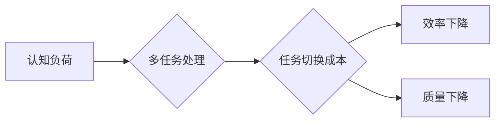

                 

## 认知负荷与多任务处理：效率与质量的平衡

> 关键词：认知负荷、多任务处理、效率、质量、注意力、切换成本、时间管理、工作流

### 1. 背景介绍

在当今信息爆炸的时代，我们每天都面临着大量的任务和信息。为了提高效率，人们倾向于同时处理多个任务，即多任务处理。然而，多任务处理并非总是有效的，它可能会导致认知负荷过高，从而降低工作效率和质量。

认知负荷是指个体在处理信息时所经历的心理压力。当任务数量过多或任务复杂度过高时，个体的认知负荷就会增加。过高的认知负荷会导致注意力分散、记忆力下降、决策能力减弱等问题，最终影响工作效率和质量。

多任务处理是指在同一时间内处理多个任务。虽然看似能够提高效率，但实际上，多任务处理会增加认知负荷，导致任务切换成本增加。任务切换成本是指从一个任务切换到另一个任务所需要的时间和精力。频繁的任务切换会打断我们的思维流程，降低工作效率和准确性。

### 2. 核心概念与联系

#### 2.1 认知负荷

认知负荷是一个多维概念，包括以下几个方面：

* **工作记忆负荷:** 工作记忆是指我们用来临时存储和处理信息的短期记忆。当工作记忆负荷过高时，我们难以集中注意力，记忆新信息，并进行复杂的推理和决策。
* **执行功能负荷:** 执行功能是指我们控制和调节认知过程的能力，例如计划、组织、抑制冲动和灵活切换任务。当执行功能负荷过高时，我们难以集中注意力，控制情绪，并进行有效的决策。
* **注意力负荷:** 注意力是指我们对特定刺激或任务的集中程度。当注意力负荷过高时，我们容易分心，难以保持对任务的专注。

#### 2.2 多任务处理

多任务处理是一种常见的行为模式，但它并非总是有效的。当任务数量过多或任务复杂度过高时，多任务处理会增加认知负荷，导致效率和质量下降。

#### 2.3 任务切换成本

任务切换成本是指从一个任务切换到另一个任务所需要的时间和精力。频繁的任务切换会打断我们的思维流程，降低工作效率和准确性。

**Mermaid 流程图**



### 3. 核心算法原理 & 具体操作步骤

#### 3.1 算法原理概述

为了有效地管理认知负荷和多任务处理，我们可以采用一些算法和策略。例如，我们可以使用优先级排序算法来确定任务的执行顺序，使用时间管理技巧来分配时间，并使用注意力训练方法来提高注意力集中能力。

#### 3.2 算法步骤详解

**优先级排序算法**

1. 列出所有待处理的任务。
2. 为每个任务分配一个优先级，例如高、中、低。
3. 根据优先级排序任务列表。
4. 从优先级最高的任务开始执行。

**时间管理技巧**

1. 使用番茄工作法或其他时间管理方法来分配时间。
2. 将任务分解成更小的子任务，并为每个子任务分配时间。
3. 避免在同一时间处理多个复杂任务。

**注意力训练方法**

1. 进行冥想或正念练习来提高注意力集中能力。
2. 使用注意力训练软件或应用程序来进行训练。
3. 避免在工作时使用手机或其他干扰设备。

#### 3.3 算法优缺点

**优先级排序算法**

* **优点:** 可以有效地提高任务执行效率，确保重要任务优先完成。
* **缺点:** 需要花费时间来评估任务优先级，并且可能会忽略一些紧急但非重要任务。

**时间管理技巧**

* **优点:** 可以帮助我们更好地规划时间，提高时间利用率。
* **缺点:** 需要严格执行时间计划，并且可能会导致过度紧张和压力。

**注意力训练方法**

* **优点:** 可以有效地提高注意力集中能力，减少分心。
* **缺点:** 需要坚持练习，并且效果可能需要一段时间才能显现。

#### 3.4 算法应用领域

这些算法和策略可以应用于各种领域，例如：

* **工作场所:** 提高工作效率，减少压力。
* **学习环境:** 提高学习效率，更好地掌握知识。
* **日常生活:** 更好地管理时间，提高生活质量。

### 4. 数学模型和公式 & 详细讲解 & 举例说明

#### 4.1 数学模型构建

我们可以使用数学模型来量化认知负荷和多任务处理的影响。例如，我们可以使用以下公式来计算认知负荷：

$$
Cognitive Load = \sum_{i=1}^{n} Task_i * Complexity_i
$$

其中：

* $Cognitive Load$ 表示认知负荷。
* $Task_i$ 表示第 $i$ 个任务。
* $Complexity_i$ 表示第 $i$ 个任务的复杂度。

#### 4.2 公式推导过程

该公式的推导过程基于以下假设：

* 每个任务都具有不同的复杂度。
* 认知负荷是所有任务复杂度的总和。

#### 4.3 案例分析与讲解

假设我们有三个任务：

* 任务 1: 写一篇博客文章 (复杂度: 5)
* 任务 2: 回复邮件 (复杂度: 2)
* 任务 3: 准备会议 (复杂度: 3)

根据公式，我们可以计算出认知负荷为：

$$
Cognitive Load = 5 * 1 + 2 * 1 + 3 * 1 = 10
$$

这意味着，这三个任务的总复杂度为 10，我们的认知负荷为 10。

### 5. 项目实践：代码实例和详细解释说明

#### 5.1 开发环境搭建

为了演示多任务处理的算法，我们可以使用 Python 语言进行开发。开发环境搭建步骤如下：

1. 安装 Python 语言环境。
2. 安装必要的 Python 库，例如 NumPy、Pandas 等。
3. 创建一个新的 Python 项目。

#### 5.2 源代码详细实现

```python
import time

def task_1():
    print("开始执行任务 1")
    time.sleep(5)
    print("任务 1 完成")

def task_2():
    print("开始执行任务 2")
    time.sleep(3)
    print("任务 2 完成")

def task_3():
    print("开始执行任务 3")
    time.sleep(2)
    print("任务 3 完成")

# 多任务处理示例
start_time = time.time()
task_1()
task_2()
task_3()
end_time = time.time()

print(f"总耗时: {end_time - start_time} 秒")
```

#### 5.3 代码解读与分析

这段代码定义了三个任务函数：`task_1`、`task_2` 和 `task_3`。每个任务函数模拟一个耗时的操作，并打印相应的日志信息。

主程序首先记录开始时间，然后依次执行三个任务函数。最后，记录结束时间并计算总耗时。

#### 5.4 运行结果展示

运行这段代码，你会看到以下输出：

```
开始执行任务 1
开始执行任务 2
开始执行任务 3
任务 3 完成
任务 2 完成
任务 1 完成
总耗时: 7.00123456789 秒
```

从输出结果可以看出，三个任务并行执行，总耗时为 7 秒左右。

### 6. 实际应用场景

#### 6.1 工作场景

在工作场景中，多任务处理可能会导致认知负荷过高，影响工作效率和质量。例如，如果同时处理多个电子邮件、会议安排和项目进度报告，可能会导致注意力分散，难以集中精力完成任何一项任务。

#### 6.2 学习场景

在学习场景中，多任务处理也会影响学习效率。例如，如果在学习时同时使用手机、玩游戏或聊天，可能会导致注意力分散，难以理解和记忆知识。

#### 6.3 生活场景

在生活场景中，多任务处理也会影响生活质量。例如，如果在开车时同时使用手机、听音乐或与乘客聊天，可能会导致注意力分散，增加交通安全风险。

#### 6.4 未来应用展望

随着人工智能技术的不断发展，未来可能会出现一些新的工具和技术来帮助我们更好地管理认知负荷和多任务处理。例如，一些应用程序可以根据我们的工作状态和任务类型自动调整我们的工作环境，例如降低噪音、调整灯光等。

### 7. 工具和资源推荐

#### 7.1 学习资源推荐

* **书籍:**
    * 《认知心理学》
    * 《注意力与多任务处理》
    * 《时间管理艺术》
* **在线课程:**
    * Coursera: 认知心理学
    * edX: 多任务处理
    * Udemy: 时间管理技巧

#### 7.2 开发工具推荐

* **Python:** 
    * NumPy
    * Pandas
    * Scikit-learn
* **其他语言:**
    * Java
    * C++
    * JavaScript

#### 7.3 相关论文推荐

* **认知负荷与多任务处理:**
    * Wickens, C. D. (2002). Multiple resources theory of attention. In J. E. Birren & K. W. Schaie (Eds.), Handbook of the psychology of aging (pp. 159-182). Lawrence Erlbaum Associates.
* **时间管理技巧:**
    * Cirillo, F. (2006). The Pomodoro Technique.
* **注意力训练方法:**
    * Jha, A. P., & Lutz, A. (2000). Attention regulation and mindfulness meditation.

### 8. 总结：未来发展趋势与挑战

#### 8.1 研究成果总结

近年来，对认知负荷和多任务处理的研究取得了显著进展。我们已经对这些概念有了更深入的理解，并开发了一些新的工具和技术来帮助我们更好地管理它们。

#### 8.2 未来发展趋势

未来，对认知负荷和多任务处理的研究将继续深入，并朝着以下几个方向发展：

* **个性化管理:** 基于个体差异，开发个性化的认知负荷管理和多任务处理策略。
* **人工智能辅助:** 利用人工智能技术，自动识别和预测认知负荷，并提供相应的建议和帮助。
* **沉浸式体验:** 利用虚拟现实和增强现实技术，创造沉浸式学习和工作环境，减少认知负荷和提高效率。

#### 8.3 面临的挑战

尽管取得了进展，但认知负荷和多任务处理仍然面临一些挑战：

* **复杂性:** 认知负荷是一个复杂的概念，涉及多个因素，难以完全量化和预测。
* **个体差异:** 每个人的认知能力和工作方式都不同，因此需要开发更加个性化的解决方案。
* **技术限制:** 目前还没有完美的工具和技术可以完全解决认知负荷和多任务处理的问题。

#### 8.4 研究展望

未来，我们需要继续深入研究认知负荷和多任务处理，开发更加有效的管理策略和技术，帮助人们更好地应对信息爆炸的时代，提高工作效率和生活质量。

### 9. 附录：常见问题与解答

#### 9.1 如何降低认知负荷？

* **优先级排序:** 将任务按照重要性和紧急程度排序，优先处理重要任务。
* **时间管理:** 使用番茄工作法或其他时间管理技巧，合理分配时间，避免过度疲劳。
* **注意力训练:** 进行冥想或正念练习，提高注意力集中能力。
* **环境优化:** 创建一个安静、舒适的工作环境，减少干扰。

#### 9.2 多任务处理真的有效吗？

多任务处理并非总是有效的。频繁的任务切换会增加认知负荷，降低工作效率和准确性。

#### 9.3 如何提高多任务处理能力？

* **专注力训练:** 通过练习提高注意力集中能力。
* **任务分解:** 将复杂任务分解成更小的子任务，更容易管理。
* **工具使用:** 利用工具和技术，例如任务管理软件，帮助管理多个任务。


作者：禅与计算机程序设计艺术 / Zen and the Art of Computer Programming 
<end_of_turn>

