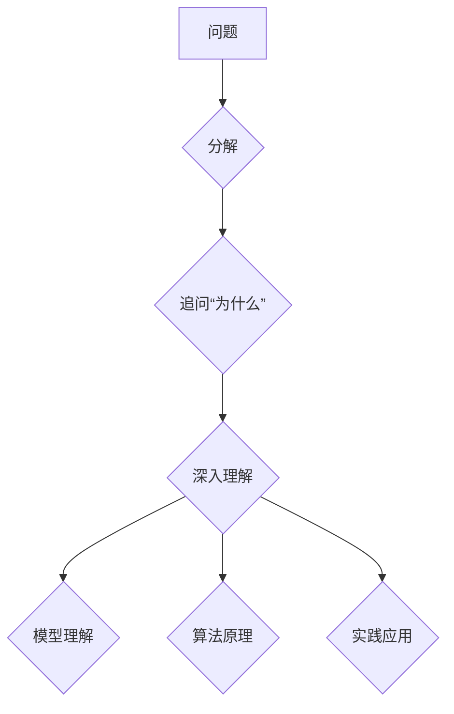

                 

## 费曼提问法:深度学习的利器

> 关键词：深度学习、费曼提问法、模型理解、算法原理、实践应用、学习资源

## 1. 背景介绍

深度学习作为人工智能领域最前沿的技术之一，近年来取得了令人瞩目的成就，在图像识别、自然语言处理、语音识别等领域展现出强大的应用潜力。然而，随着模型规模和复杂度的不断增加，理解深度学习模型的内部工作机制变得越来越困难。传统的解释方法往往过于抽象或局限于局部特征，难以全面揭示模型的决策过程。

费曼提问法，以物理学家理查德·费曼的名字命名，是一种简洁而有效的学习和理解知识的方法。它强调从根本问题出发，不断追问“为什么”直到到达最基础的原理。这种思维方式不仅适用于物理学，也能够有效地应用于深度学习领域。

## 2. 核心概念与联系

费曼提问法的核心在于将复杂问题分解成一系列简单易懂的问题，并通过不断追问“为什么”来逐步深入理解问题的本质。

在深度学习领域，我们可以将费曼提问法应用于模型理解、算法原理和实践应用等方面。

**Mermaid 流程图：**



**模型理解：**

* 为什么这个模型能够识别出这个图像中的物体？
* 为什么模型对某些输入更敏感？
* 模型的决策过程是如何进行的？

**算法原理：**

* 为什么这个算法能够有效地学习数据？
* 算法的数学原理是什么？
* 算法的优缺点是什么？

**实践应用：**

* 如何将这个模型应用到实际场景中？
* 模型的性能如何评估？
* 如何改进模型的性能？

## 3. 核心算法原理 & 具体操作步骤

### 3.1  算法原理概述

深度学习的核心算法之一是反向传播算法（Backpropagation）。它是一种迭代优化算法，用于训练神经网络模型。

反向传播算法的基本原理是通过计算误差信号，并根据误差信号调整模型参数，从而使模型的预测结果越来越接近真实值。

### 3.2  算法步骤详解

1. **前向传播：** 将输入数据输入到神经网络模型中，并计算输出结果。
2. **误差计算：** 将模型的输出结果与真实值进行比较，计算误差。
3. **反向传播：** 将误差信号反向传播到神经网络的各个层，并根据误差信号更新每个神经元的权重和偏置。
4. **重复步骤 1-3：** 迭代执行前向传播和反向传播步骤，直到模型的误差达到预设的阈值。

### 3.3  算法优缺点

**优点：**

* 能够有效地训练复杂的深度学习模型。
* 理论基础扎实，经过多年的实践验证。

**缺点：**

* 训练过程可能非常耗时，需要大量的计算资源。
* 容易陷入局部最优解，难以找到全局最优解。

### 3.4  算法应用领域

反向传播算法广泛应用于各种深度学习领域，例如：

* 图像识别
* 自然语言处理
* 语音识别
* 机器翻译
* 药物发现

## 4. 数学模型和公式 & 详细讲解 & 举例说明

### 4.1  数学模型构建

深度学习模型通常由多个神经网络层组成，每个层包含多个神经元。神经元之间通过连接权重进行信息传递。

**神经元激活函数：**

神经元的输出值由其输入值和权重经过激活函数处理得到。常见的激活函数包括 sigmoid 函数、ReLU 函数、tanh 函数等。

**损失函数：**

损失函数用于衡量模型预测结果与真实值的差异。常见的损失函数包括均方误差（MSE）、交叉熵损失（Cross-Entropy Loss）等。

### 4.2  公式推导过程

反向传播算法的核心是利用链式法则对损失函数进行求导，并根据梯度更新模型参数。

**链式法则：**

$$
\frac{d L}{d w} = \frac{d L}{d y} \cdot \frac{d y}{d w}
$$

其中：

* $L$ 是损失函数
* $w$ 是模型参数
* $y$ 是模型输出

### 4.3  案例分析与讲解

假设我们有一个简单的线性回归模型，其损失函数为均方误差。

**模型：**

$$
y = w x + b
$$

其中：

* $y$ 是模型输出
* $x$ 是输入特征
* $w$ 是权重
* $b$ 是偏置

**损失函数：**

$$
L = \frac{1}{2} \sum_{i=1}^{n} (y_i - \hat{y}_i)^2
$$

其中：

* $n$ 是样本数量
* $y_i$ 是真实值
* $\hat{y}_i$ 是模型预测值

利用链式法则，我们可以计算出损失函数对权重 $w$ 的梯度：

$$
\frac{d L}{d w} = \sum_{i=1}^{n} (y_i - \hat{y}_i) x_i
$$

根据梯度，我们可以更新权重 $w$：

$$
w = w - \alpha \frac{d L}{d w}
$$

其中：

* $\alpha$ 是学习率

## 5. 项目实践：代码实例和详细解释说明

### 5.1  开发环境搭建

* Python 3.x
* TensorFlow 或 PyTorch 深度学习框架
* Jupyter Notebook 或 VS Code 开发环境

### 5.2  源代码详细实现

```python
import tensorflow as tf

# 定义模型
model = tf.keras.models.Sequential([
    tf.keras.layers.Dense(128, activation='relu', input_shape=(784,)),
    tf.keras.layers.Dense(10, activation='softmax')
])

# 定义损失函数和优化器
model.compile(loss='sparse_categorical_crossentropy',
              optimizer='adam',
              metrics=['accuracy'])

# 加载 MNIST 数据集
(x_train, y_train), (x_test, y_test) = tf.keras.datasets.mnist.load_data()

# 数据预处理
x_train = x_train.reshape(-1, 784).astype('float32') / 255
x_test = x_test.reshape(-1, 784).astype('float32') / 255

# 模型训练
model.fit(x_train, y_train, epochs=5)

# 模型评估
loss, accuracy = model.evaluate(x_test, y_test)
print('Test Loss:', loss)
print('Test Accuracy:', accuracy)
```

### 5.3  代码解读与分析

* 代码首先定义了一个简单的深度学习模型，包含两层全连接神经网络。
* 然后定义了损失函数和优化器，用于训练模型。
* 加载 MNIST 数据集，并对数据进行预处理。
* 使用 `model.fit()` 函数训练模型，指定训练轮数（epochs）。
* 使用 `model.evaluate()` 函数评估模型在测试集上的性能。

### 5.4  运行结果展示

训练完成后，模型会输出测试集上的损失值和准确率。

## 6. 实际应用场景

深度学习模型在各个领域都有广泛的应用，例如：

* **图像识别：** 用于识别物体、场景、人脸等。
* **自然语言处理：** 用于机器翻译、文本摘要、情感分析等。
* **语音识别：** 用于语音转文本、语音助手等。
* **推荐系统：** 用于推荐商品、电影、音乐等。

### 6.4  未来应用展望

随着深度学习技术的不断发展，其应用场景将更加广泛，例如：

* **医疗诊断：** 用于辅助医生诊断疾病。
* **自动驾驶：** 用于感知周围环境，控制车辆行驶。
* **个性化教育：** 用于根据学生的学习情况提供个性化的学习内容。

## 7. 工具和资源推荐

### 7.1  学习资源推荐

* **书籍：**
    * 深度学习
    * 构建深度学习模型
    * 深度学习实战
* **在线课程：**
    * Coursera 深度学习课程
    * Udacity 深度学习课程
    * fast.ai 深度学习课程

### 7.2  开发工具推荐

* **TensorFlow：** Google 开发的开源深度学习框架。
* **PyTorch：** Facebook 开发的开源深度学习框架。
* **Keras：** TensorFlow 上的深度学习 API，易于使用。

### 7.3  相关论文推荐

* **ImageNet Classification with Deep Convolutional Neural Networks**
* **Attention Is All You Need**
* **Generative Adversarial Networks**

## 8. 总结：未来发展趋势与挑战

### 8.1  研究成果总结

深度学习在过去几年取得了显著的进展，在图像识别、自然语言处理等领域取得了突破性成果。

### 8.2  未来发展趋势

* **模型效率提升：** 研究更轻量级、更高效的深度学习模型。
* **模型解释性增强：** 研究更有效的模型解释方法，提高模型可解释性。
* **跨模态学习：** 研究能够处理多种模态数据的深度学习模型。

### 8.3  面临的挑战

* **数据获取和标注：** 深度学习模型需要大量的训练数据，数据获取和标注成本高昂。
* **模型可解释性：** 深度学习模型的决策过程复杂，难以解释模型的决策结果。
* **模型安全性和鲁棒性：** 深度学习模型容易受到攻击，需要提高模型的安全性和鲁棒性。

### 8.4  研究展望

未来，深度学习研究将继续朝着更智能、更安全、更可解释的方向发展。


## 9. 附录：常见问题与解答

**Q1：深度学习模型为什么需要反向传播算法？**

**A1：** 反向传播算法是深度学习模型训练的核心算法，它用于计算模型参数的梯度，并根据梯度更新模型参数，从而使模型的预测结果越来越接近真实值。

**Q2：深度学习模型的损失函数是什么？**

**A2：** 损失函数用于衡量模型预测结果与真实值的差异。常见的损失函数包括均方误差（MSE）、交叉熵损失（Cross-Entropy Loss）等。

**Q3：如何评估深度学习模型的性能？**

**A3：** 可以使用准确率、召回率、F1-score等指标来评估深度学习模型的性能。

**Q4：如何提高深度学习模型的性能？**

**A4：** 可以通过增加训练数据、调整模型结构、优化模型参数等方法来提高深度学习模型的性能。


作者：禅与计算机程序设计艺术 / Zen and the Art of Computer Programming 
<end_of_turn>

