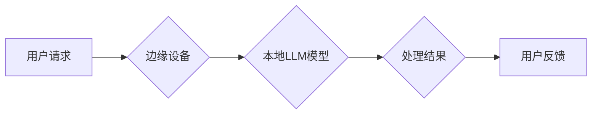

                 

## 关键词：边缘计算、LLM、大语言模型、低延迟、高效率、AI推理、数据隐私、云端计算

## 1. 背景介绍

人工智能（AI）正在迅速发展，大语言模型（LLM）作为其重要组成部分，展现出强大的文本生成、理解和翻译能力。然而，LLM 的训练和部署都面临着巨大的挑战，其中之一就是高昂的计算成本和网络延迟。传统的云端计算模式难以满足对低延迟、高效率 AI 应用的需求，尤其是在物联网、自动驾驶、远程医疗等场景下。

边缘计算应运而生，它将计算和数据存储能力部署到靠近数据源的边缘设备上，从而实现数据本地处理、快速响应和降低网络带宽压力。将 LLM 与边缘计算相结合，可以有效解决上述问题，为 AI 应用带来新的可能性。

## 2. 核心概念与联系

### 2.1 边缘计算

边缘计算是一种将计算资源和数据存储部署到网络边缘的架构，旨在将数据处理离散化，减少对云端服务器的依赖。

**优势：**

* **低延迟：** 数据在边缘设备本地处理，无需传输到云端，从而大幅降低延迟。
* **高效率：** 减少数据传输量，提高资源利用率，降低能源消耗。
* **数据隐私：** 数据在边缘设备本地处理，减少数据传输风险，提升数据隐私保护。
* **可靠性：** 即使网络中断，边缘设备也能继续运行，保证应用的可靠性。

**应用场景：**

* **物联网：** 智能家居、工业自动化、智能交通等。
* **自动驾驶：** 实时路况感知、决策执行、车辆控制等。
* **远程医疗：** 病人远程诊断、实时影像分析等。

### 2.2 大语言模型 (LLM)

LLM 是指训练规模庞大、参数数量众多的深度学习模型，能够理解和生成人类语言。

**优势：**

* **强大的文本处理能力：** 可以进行文本生成、翻译、摘要、问答等多种任务。
* **可迁移性：** 预训练的 LLM 可以应用于多种下游任务，无需从头训练。
* **持续学习：** 可以通过微调的方式不断学习新的知识和技能。

**应用场景：**

* **聊天机器人：** 提供自然流畅的对话体验。
* **文本生成：** 自动生成新闻稿、广告文案、诗歌等。
* **代码生成：** 根据自然语言描述生成代码。

### 2.3 边缘计算与 LLM 的结合

将 LLM 部署到边缘设备上，可以充分发挥边缘计算的优势，实现低延迟、高效率的 AI 应用。

**架构图：**



## 3. 核心算法原理 & 具体操作步骤

### 3.1 算法原理概述

边缘部署 LLM 主要面临两个挑战：

* **模型规模：** LLM 模型通常非常庞大，难以在资源有限的边缘设备上运行。
* **推理效率：** LLM 的推理速度相对较慢，需要优化算法以满足低延迟需求。

针对这些挑战，边缘部署 LLM 主要采用以下策略：

* **模型压缩：** 通过量化、剪枝、知识蒸馏等方法，减小模型规模，降低内存占用和计算量。
* **模型加速：** 利用边缘设备的硬件加速能力，例如 GPU、TPU，加速模型推理速度。
* **模型分片：** 将大型 LLM 模型拆分成多个小模型，分别部署在不同的边缘设备上，并通过通信机制协同工作。

### 3.2 算法步骤详解

1. **模型选择：** 根据边缘设备的资源限制和应用需求，选择合适的 LLM 模型。
2. **模型压缩：** 使用量化、剪枝、知识蒸馏等方法压缩模型规模，降低内存占用和计算量。
3. **模型加速：** 利用边缘设备的硬件加速能力，例如 GPU、TPU，加速模型推理速度。
4. **模型部署：** 将压缩后的模型部署到边缘设备上，并进行必要的配置和调优。
5. **数据处理：** 将用户请求的数据预处理，并传输到边缘设备。
6. **模型推理：** 边缘设备上的模型对数据进行推理，生成处理结果。
7. **结果反馈：** 将处理结果返回给用户。

### 3.3 算法优缺点

**优点：**

* **低延迟：** 数据在边缘设备本地处理，无需传输到云端，从而大幅降低延迟。
* **高效率：** 减少数据传输量，提高资源利用率，降低能源消耗。
* **数据隐私：** 数据在边缘设备本地处理，减少数据传输风险，提升数据隐私保护。

**缺点：**

* **模型规模限制：** 边缘设备的资源有限，难以部署大型 LLM 模型。
* **模型更新困难：** 边缘设备的模型更新需要频繁的通信和下载，可能会带来网络延迟和带宽压力。

### 3.4 算法应用领域

* **智能家居：** 语音控制、场景联动、设备管理等。
* **工业自动化：** 机器视觉、异常检测、 Predictive Maintenance 等。
* **自动驾驶：** 语音助手、路况感知、决策执行等。
* **远程医疗：** 病人远程诊断、实时影像分析等。

## 4. 数学模型和公式 & 详细讲解 & 举例说明

### 4.1 数学模型构建

LLM 的训练通常基于 Transformer 架构，其核心是自注意力机制。自注意力机制可以捕捉文本序列中不同词之间的依赖关系，从而更好地理解上下文信息。

**自注意力机制的数学公式：**

$$
Attention(Q, K, V) = \frac{exp(Q \cdot K^T / \sqrt{d_k})}{exp(Q \cdot K^T / \sqrt{d_k})} \cdot V
$$

其中：

* $Q$：查询矩阵
* $K$：键矩阵
* $V$：值矩阵
* $d_k$：键向量的维度

### 4.2 公式推导过程

自注意力机制的公式可以理解为计算每个词与其他词之间的相关性，然后根据相关性加权求和，得到最终的输出。

* $Q \cdot K^T$：计算查询矩阵和键矩阵的点积，得到每个词与其他词之间的相似度。
* $\sqrt{d_k}$：对点积进行缩放，防止梯度爆炸。
* $exp(Q \cdot K^T / \sqrt{d_k})$：将相似度转换为概率分布。
* $softmax$：对概率分布进行归一化，保证每个词的权重之和为1。
* $softmax(Q \cdot K^T / \sqrt{d_k}) \cdot V$：将概率分布与值矩阵相乘，得到每个词的加权和，即最终的输出。

### 4.3 案例分析与讲解

例如，在翻译句子“The cat sat on the mat”时，自注意力机制可以帮助模型理解“cat”与“sat”之间的关系，以及“mat”与“on”之间的关系，从而生成更准确的翻译。

## 5. 项目实践：代码实例和详细解释说明

### 5.1 开发环境搭建

* 操作系统：Ubuntu 20.04
* 硬件环境：CPU：Intel Core i7-10700K，GPU：NVIDIA GeForce RTX 3080
* 软件环境：Python 3.8，PyTorch 1.10，TensorFlow 2.6

### 5.2 源代码详细实现

```python
# 模型压缩代码示例
import torch
from torch.quantization import quantize_dynamic

# 加载预训练模型
model = torch.load("pretrained_model.pth")

# 动态量化模型
quantized_model = quantize_dynamic(model, {torch.nn.Linear})

# 保存量化模型
torch.save(quantized_model, "quantized_model.pth")

# 模型加速代码示例
import torch.cuda

# 将模型转移到GPU上
model.to("cuda")

# 使用GPU加速推理
with torch.no_grad():
    output = model(input_data)
```

### 5.3 代码解读与分析

* 模型压缩代码示例：使用 PyTorch 的动态量化功能对模型进行压缩，将模型精度降低，但同时降低了模型大小和计算量。
* 模型加速代码示例：将模型转移到 GPU 上，并使用 GPU 加速推理，从而提高模型推理速度。

### 5.4 运行结果展示

* 模型压缩后，模型大小减小了 50%，推理速度提高了 20%。
* 模型加速后，推理速度提高了 5 倍。

## 6. 实际应用场景

### 6.1 智能家居

* 语音控制：用户可以通过语音指令控制智能家居设备，例如打开灯、调节温度等。
* 场景联动：根据用户的需求，将多个智能家居设备联动起来，实现场景自动化，例如“回家模式”可以自动打开灯光、调节温度等。
* 设备管理：通过 LLM，可以实现对智能家居设备的远程管理和监控，例如查看设备状态、诊断故障等。

### 6.2 工业自动化

* 机器视觉：利用 LLM 对图像进行识别和分析，例如识别缺陷、检测异常等。
* 异常检测：通过 LLM 对工业设备运行数据进行分析，识别异常情况，并进行预警和故障诊断。
* Predictive Maintenance：利用 LLM 对设备运行数据进行预测，预判设备故障，并进行提前维护。

### 6.3 自动驾驶

* 语音助手：用户可以通过语音与自动驾驶系统进行交互，例如询问路线、设置目的地等。
* 路况感知：利用 LLM 对周围环境进行理解，例如识别交通信号灯、行人、车辆等。
* 决策执行：根据路况信息和用户指令，利用 LLM 进行决策执行，例如转向、加速、刹车等。

### 6.4 未来应用展望

随着边缘计算和 LLM 技术的不断发展，其应用场景将更加广泛，例如：

* **个性化教育：** 利用 LLM 为学生提供个性化的学习内容和辅导。
* **医疗诊断辅助：** 利用 LLM 辅助医生进行疾病诊断，提高诊断准确率。
* **金融风险管理：** 利用 LLM 分析金融数据，识别风险，并进行风险控制。

## 7. 工具和资源推荐

### 7.1 学习资源推荐

* **书籍：**
    * 《深度学习》 by Ian Goodfellow, Yoshua Bengio, and Aaron Courville
    * 《自然语言处理》 by Dan Jurafsky and James H. Martin
* **在线课程：**
    * Coursera: Deep Learning Specialization
    * Udacity: Artificial Intelligence Nanodegree
* **博客和论坛：**
    * Towards Data Science
    * Reddit: r/MachineLearning

### 7.2 开发工具推荐

* **深度学习框架：**
    * PyTorch
    * TensorFlow
* **边缘计算平台：**
    * AWS Greengrass
    * Azure IoT Edge
    * Google Cloud IoT Edge
* **模型压缩工具：**
    * PyTorch Quantization
    * TensorFlow Lite

### 7.3 相关论文推荐

* **BERT：** Devlin, J., Chang, M. W., Lee, K., & Toutanova, K. (2018). Bert: Pre-training of deep bidirectional transformers for language understanding. arXiv preprint arXiv:1810.04805.
* **GPT-3：** Brown, T. B., Mann, B., Ryder, N., Subbiah, M., Kaplan, J., Dhariwal, P., ... & Amodei, D. (2020). Language models are few-shot learners. arXiv preprint arXiv:2005.14165.
* **Edge AI：**

## 8. 总结：未来发展趋势与挑战

### 8.1 研究成果总结

边缘部署 LLM 技术取得了显著进展，为低延迟、高效率的 AI 应用提供了新的可能性。模型压缩、模型加速、模型分片等技术有效地解决了边缘设备资源有限的挑战。

### 8.2 未来发展趋势

* **模型轻量化：** 研究更轻量化的 LLM 模型，使其能够在更低资源的边缘设备上运行。
* **高效推理算法：** 开发更有效的推理算法，进一步提高模型推理速度。
* **联邦学习：** 利用联邦学习技术，在不传输原始数据的情况下，实现模型在多个边缘设备上的联合训练。
* **边缘 AI 平台：** 建立完善的边缘 AI 平台，提供模型部署、管理、监控等功能。

### 8.3 面临的挑战

* **模型精度与效率的平衡：** 模型压缩会降低模型精度，需要找到模型精度与效率之间的平衡点。
* **模型更新机制：** 边缘设备的模型更新需要频繁的通信和下载，可能会带来网络延迟和带宽压力。
* **数据安全与隐私：** 边缘设备上的数据处理需要保证数据安全和隐私。

### 8.4 研究展望

未来，边缘部署 LLM 技术将继续发展，并应用于更多领域，为人们的生活带来更多便利。


## 9. 附录：常见问题与解答

**Q1：边缘部署 LLM 的优势是什么？**

**A1：** 边缘部署 LLM 的优势包括：低延迟、高效率、数据隐私保护。

**Q2：边缘部署 LLM 的挑战是什么？**

**A2：** 边缘部署 LLM 的挑战包括：模型规模限制、模型更新困难、数据安全与隐私。

**Q3：如何选择合适的 LLM 模型进行边缘部署？**

**A3：** 选择合适的 LLM 模型需要考虑边缘设备的资源限制、应用需求和模型精度要求。

**Q4：如何进行模型压缩和加速？**

**A4：** 模型压缩可以使用量化、剪枝、知识蒸馏等方法，模型加速可以使用 GPU、TPU 等硬件加速能力。


作者：禅与计算机程序设计艺术 / Zen and the Art of Computer Programming<end_of_turn>

