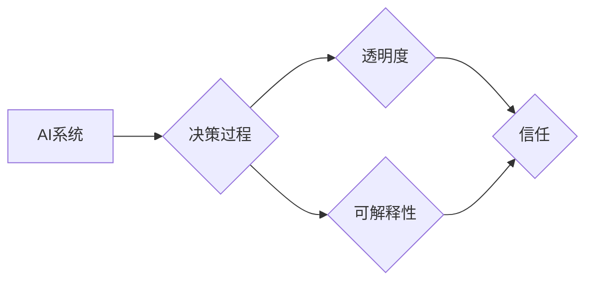

                 

## 透明度与可解释性：增强人工智能的可信

> 关键词：人工智能、透明度、可解释性、信任、模型解释、偏见检测、伦理

### 1. 背景介绍

人工智能（AI）正以惊人的速度发展，在各个领域展现出巨大的潜力。从医疗诊断到金融预测，从自动驾驶到个性化推荐，AI正在改变着我们的生活。然而，随着AI技术的日益成熟，其黑箱属性也引发了越来越多的担忧。

AI模型的决策过程往往过于复杂，难以被人类理解，这导致人们对AI的信任度下降。当AI系统做出错误决策时，缺乏透明度和可解释性使得我们难以追溯错误原因，更难以采取有效措施进行纠正。

透明度和可解释性是指AI系统能够清晰地解释其决策过程，并让人类能够理解其背后的逻辑和推理。这对于建立对AI的信任至关重要，也是推动AI技术可持续发展的关键。

### 2. 核心概念与联系

**2.1 透明度与可解释性**

* **透明度**是指AI系统决策过程的可见性。它意味着我们可以观察到AI系统是如何处理输入数据、进行推理和生成输出结果的。
* **可解释性**是指AI系统能够清晰地解释其决策过程，并让人类能够理解其背后的逻辑和推理。

**2.2 核心概念关系图**



**2.3 核心概念联系**

透明度和可解释性是相互关联的，但并非完全等同。透明度是可解释性的基础，只有当AI系统的决策过程是透明的，才能对其进行解释。

可解释性更强调的是对AI决策过程的理解，它不仅需要透明度，还需要能够用人类能够理解的语言和方式进行解释。

**2.4 透明度与可信的关系**

透明度和可解释性是建立对AI信任的关键因素。当人们能够理解AI系统的决策过程时，他们会更容易接受AI的决策结果，并对AI系统产生信任。

反之，缺乏透明度和可解释性的AI系统，其决策结果往往会被质疑，甚至被视为不可信。

### 3. 核心算法原理 & 具体操作步骤

**3.1 算法原理概述**

本节将介绍一种常用的AI可解释性算法：**LIME（Local Interpretable Model-agnostic Explanations）**。

LIME是一种模型无关的局部解释方法，它可以解释任何类型的机器学习模型，包括深度神经网络。

LIME的工作原理是：

1. **选择一个待解释的预测实例。**
2. **在该实例附近生成一个扰动数据集。**
3. **使用原始模型对扰动数据集进行预测。**
4. **训练一个简单的可解释模型（例如线性回归）来拟合原始模型在扰动数据集上的预测结果。**
5. **使用简单模型的系数来解释原始模型对该实例的预测结果。**

**3.2 算法步骤详解**

1. **选择实例：** 选择一个需要解释的预测实例，例如，一个图像分类模型预测为“猫”的图像。
2. **生成扰动数据集：** 在该实例附近生成一个扰动数据集，每个扰动实例都是原始实例的微小变动。
3. **预测扰动数据集：** 使用原始模型对扰动数据集进行预测，得到每个扰动实例的预测结果。
4. **训练简单模型：** 使用扰动数据集和对应的预测结果，训练一个简单的可解释模型，例如线性回归。
5. **解释预测结果：** 使用简单模型的系数来解释原始模型对该实例的预测结果。例如，如果系数表明颜色特征对预测结果有很大影响，则说明该图像的“猫”特征可能是由其颜色决定的。

**3.3 算法优缺点**

* **优点：**
    * 模型无关性：可以解释任何类型的机器学习模型。
    * 局部解释：可以解释单个预测实例的决策过程。
    * 可解释性：使用简单的模型进行解释，易于理解。
* **缺点：**
    * 局部性：只能解释单个实例，无法解释模型全局的行为。
    * 扰动数据集的生成：需要选择合适的扰动方式，才能生成有效的扰动数据集。
    * 简单模型的拟合：简单模型的拟合效果可能不理想，导致解释结果不准确。

**3.4 算法应用领域**

LIME算法广泛应用于以下领域：

* **医疗诊断：** 解释AI模型对患者病症的诊断结果。
* **金融风险评估：** 解释AI模型对客户贷款风险的评估结果。
* **自动驾驶：** 解释AI模型对道路场景的感知和决策结果。
* **推荐系统：** 解释AI模型对用户的推荐结果。

### 4. 数学模型和公式 & 详细讲解 & 举例说明

**4.1 数学模型构建**

LIME算法的核心是使用一个简单的可解释模型来近似原始模型在扰动数据集上的预测结果。

假设原始模型为f(x)，扰动数据集为{x_i, y_i}，其中x_i是扰动实例，y_i是原始模型对x_i的预测结果。

LIME算法的目标是找到一个简单的模型g(x)来拟合f(x)在扰动数据集上的预测结果，即：

$$
g(x) \approx f(x) \quad \forall x \in \mathcal{X}
$$

其中，$\mathcal{X}$是扰动数据集的实例空间。

**4.2 公式推导过程**

LIME算法使用最小二乘法来训练简单模型g(x)。

最小二乘法的目标是找到一个模型参数向量θ，使得模型预测结果与真实结果之间的平方误差最小化。

$$
\min_{\theta} \sum_{i=1}^{n} (g(x_i; \theta) - y_i)^2
$$

其中，n是扰动数据集的大小。

**4.3 案例分析与讲解**

假设我们有一个图像分类模型，需要解释其对一张猫图像的预测结果。

1. 使用LIME算法生成一个扰动数据集，每个扰动实例都是原始猫图像的微小变动。
2. 使用原始模型对扰动数据集进行预测，得到每个扰动实例的预测结果。
3. 使用最小二乘法训练一个线性回归模型来拟合原始模型在扰动数据集上的预测结果。
4. 使用线性回归模型的系数来解释原始模型对猫图像的预测结果。例如，如果系数表明颜色特征对预测结果有很大影响，则说明该图像的“猫”特征可能是由其颜色决定的。

### 5. 项目实践：代码实例和详细解释说明

**5.1 开发环境搭建**

本示例使用Python语言和Scikit-learn库实现LIME算法。

需要安装以下软件包：

* Python 3.x
* Scikit-learn
* Numpy
* Matplotlib

**5.2 源代码详细实现**

```python
from sklearn.datasets import load_iris
from sklearn.ensemble import RandomForestClassifier
from lime.lime_tabular import LimeTabularExplainer
import numpy as np
import matplotlib.pyplot as plt

# 加载iris数据集
iris = load_iris()
X = iris.data
y = iris.target

# 训练随机森林分类器
clf = RandomForestClassifier()
clf.fit(X, y)

# 创建LIME解释器
explainer = LimeTabularExplainer(X.columns)

# 选择一个实例进行解释
instance_index = 0
instance = X[instance_index]

# 生成解释结果
explanation = explainer.explain_instance(instance, clf.predict_proba, top_labels=5)

# 可视化解释结果
plt.figure(figsize=(10, 6))
explanation.as_pyplot_figure()
plt.show()
```

**5.3 代码解读与分析**

1. 加载iris数据集并训练随机森林分类器。
2. 创建LIME解释器，指定特征名称。
3. 选择一个实例进行解释。
4. 使用LIME解释器生成解释结果，并指定要显示的标签数量。
5. 使用matplotlib库可视化解释结果。

**5.4 运行结果展示**

运行代码后，将显示一个可视化解释结果的图，其中显示了哪些特征对该实例的预测结果有重要影响。

### 6. 实际应用场景

**6.1 医疗诊断**

AI模型可以辅助医生诊断疾病，但其决策过程往往难以理解。

使用LIME算法可以解释AI模型对患者病症的诊断结果，帮助医生了解模型的推理逻辑，并提高对AI诊断结果的信任。

**6.2 金融风险评估**

AI模型可以用于评估客户贷款风险，但其决策过程可能存在偏见。

使用LIME算法可以解释AI模型对客户贷款风险的评估结果，帮助金融机构识别模型中的偏见，并采取措施进行纠正。

**6.3 自动驾驶**

AI模型可以用于控制自动驾驶汽车，但其决策过程需要高度透明和可解释。

使用LIME算法可以解释AI模型对道路场景的感知和决策结果，帮助开发人员识别模型中的潜在问题，并提高自动驾驶系统的安全性。

**6.4 未来应用展望**

随着AI技术的不断发展，透明度和可解释性将变得越来越重要。

未来，我们将看到更多基于LIME算法和其他可解释性方法的AI应用，这些应用将更加透明、可信，并更好地服务于人类社会。

### 7. 工具和资源推荐

**7.1 学习资源推荐**

* **论文：**
    * Ribeiro, M. T., Singh, S., & Guestrin, C. (2016). "Why should I trust you?": Explaining the predictions of any classifier. In *Proceedings of the 2016 ACM Conference on Knowledge Discovery and Data Mining* (pp. 1135-1144).
* **博客文章：**
    * https://lilianweng.github.io/posts/2017-08-15-lime/
    * https://towardsdatascience.com/lime-for-model-interpretation-a-practical-guide-a60618268197

**7.2 开发工具推荐**

* **LIME：** https://github.com/marcotcr/lime
* **SHAP：** https://github.com/slundberg/shap

**7.3 相关论文推荐**

* Lundberg, S. M., & Lee, S. I. (2017). A unified approach to interpreting model predictions. In *Advances in neural information processing systems* (pp. 4765-4774).
* Samek, W., Montavon, G., & Müller, K.-R. (2017). Explainable AI: Interpreting, explaining and visualizing deep learning. *arXiv preprint arXiv:1706.07450*.

### 8. 总结：未来发展趋势与挑战

**8.1 研究成果总结**

近年来，AI可解释性研究取得了显著进展，涌现出许多有效的解释方法，例如LIME、SHAP、可视化等。

这些方法为理解AI模型的决策过程提供了新的工具，并推动了AI技术的透明度和可信度提升。

**8.2 未来发展趋势**

未来，AI可解释性研究将朝着以下方向发展：

* **更强大的解释方法：** 开发更精确、更全面、更易于理解的解释方法。
* **自动化解释：** 自动生成解释结果，并将其集成到AI系统中。
* **跨领域应用：** 将AI可解释性方法应用于更多领域，例如医疗、金融、法律等。

**8.3 面临的挑战**

AI可解释性研究仍然面临一些挑战：

* **解释结果的可信度：** 确保解释结果的准确性和可靠性。
* **解释结果的可理解性：** 使解释结果易于理解，并为非技术人员提供清晰的解释。
* **解释方法的通用性：** 开发能够解释各种类型AI模型的通用解释方法。

**8.4 研究展望**

AI可解释性研究是一个充满机遇和挑战的领域。

随着技术的不断发展，我们将看到更多创新性的解释方法和应用，这将推动AI技术更加透明、可信，并更好地服务于人类社会。

### 9. 附录：常见问题与解答

**9.1 如何选择合适的解释方法？**

选择合适的解释方法取决于具体的应用场景和模型类型。

例如，对于线性模型，可以使用特征重要性分析；对于深度神经网络，可以使用LIME或SHAP等方法。

**9.2 如何评估解释结果的质量？**

评估解释结果的质量可以通过以下几个方面：

* **准确性：** 解释结果是否与模型的实际决策过程一致。
* **完整性：** 解释结果是否涵盖了模型决策过程中的所有重要因素。
* **可理解性：** 解释结果是否易于理解，并为非技术人员提供清晰的解释。

**9.3 如何将解释结果应用到实际场景中？**

解释结果可以用于多种实际场景，例如：

* **模型调试：** 识别模型中的潜在问题，并进行改进。
* **模型信任度提升：** 为用户提供模型决策过程的透明度，提高用户对模型的信任度。
* **决策支持：** 为人类决策者提供模型的解释结果，帮助他们做出更明智的决策。


作者：禅与计算机程序设计艺术 / Zen and the Art of Computer Programming<end_of_turn>

