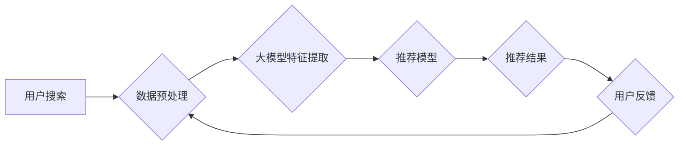

                 

## AI 大模型在电商搜索推荐中的挑战：如何处理冷启动问题

> 关键词：电商搜索推荐、冷启动问题、大模型、推荐算法、用户行为分析、数据稀疏性、迁移学习、知识图谱

## 1. 背景介绍

电商平台的搜索推荐系统是用户获取商品信息和完成购买的重要途径。近年来，随着深度学习技术的快速发展，基于大模型的搜索推荐系统逐渐成为行业主流。大模型凭借其强大的语义理解和泛化能力，能够提供更精准、个性化的推荐结果，显著提升用户体验和商业价值。

然而，大模型在电商搜索推荐场景中也面临着一些挑战，其中**冷启动问题**尤为突出。冷启动问题是指新用户、新商品或新场景下，推荐系统难以准确预测用户偏好，导致推荐结果不精准，甚至出现推荐偏差的情况。

对于电商平台来说，新用户和新商品的涌现是常态，因此有效解决冷启动问题至关重要。

## 2. 核心概念与联系

### 2.1  电商搜索推荐系统

电商搜索推荐系统旨在根据用户的搜索历史、浏览记录、购买行为等信息，推荐与用户需求相匹配的商品。

系统通常包含以下几个关键模块：

* **数据采集与预处理:** 收集用户行为数据，并进行清洗、转换、特征提取等预处理工作。
* **模型训练:** 利用机器学习算法，训练推荐模型，学习用户偏好和商品特征之间的关系。
* **推荐策略:** 根据用户请求和模型预测结果，选择合适的推荐策略，生成推荐列表。
* **评估与优化:** 定期评估推荐效果，并根据评估结果优化模型参数和推荐策略。

### 2.2  冷启动问题

冷启动问题是指推荐系统在面对新用户、新商品或新场景时，由于缺乏历史数据，难以准确预测用户偏好，导致推荐结果不精准。

**2.2.1  新用户冷启动:** 新用户没有历史行为数据，推荐系统无法了解其兴趣和偏好，导致推荐结果难以精准。

**2.2.2  新商品冷启动:** 新商品缺乏用户评价和购买数据，推荐系统无法准确评估其受欢迎程度，导致推荐结果可能出现偏差。

**2.2.3  新场景冷启动:** 当用户进入新的场景或使用新的设备时，推荐系统需要适应新的环境和用户行为模式，可能导致推荐结果不准确。

### 2.3  大模型在电商搜索推荐中的应用

大模型凭借其强大的语义理解和泛化能力，能够有效解决传统推荐算法在处理冷启动问题上的局限性。

大模型可以利用海量文本数据进行预训练，学习到丰富的语义知识和用户偏好模式，从而在面对新用户、新商品或新场景时，也能提供相对精准的推荐结果。

**2.3.1  语义理解:** 大模型可以理解用户搜索词的深层含义，并将其与商品信息进行关联，提高推荐的准确性。

**2.3.2  个性化推荐:** 大模型可以学习用户的个性化偏好，并根据用户的历史行为和上下文信息，提供更精准的推荐结果。

**2.3.3  跨域知识迁移:** 大模型可以将预训练的知识迁移到电商搜索推荐场景，帮助解决新商品和新用户的冷启动问题。

**2.3.4  多模态融合:** 大模型可以融合文本、图像、视频等多模态数据，提供更丰富的用户体验和更精准的推荐结果。

**Mermaid 流程图**



## 3. 核心算法原理 & 具体操作步骤

### 3.1  算法原理概述

针对电商搜索推荐中的冷启动问题，大模型可以结合多种算法原理，例如：

* **迁移学习:** 利用预训练的大模型，将已有的知识迁移到新的电商搜索推荐任务中，帮助解决新用户和新商品的冷启动问题。
* **知识图谱:** 建立商品、用户、品牌等实体之间的知识关系，丰富推荐系统的语义理解能力，提高推荐的准确性。
* **协同过滤:** 挖掘用户之间的相似性，以及商品之间的关联性，推荐与用户兴趣相似的商品。
* **深度学习:** 利用深度神经网络，学习用户行为和商品特征之间的复杂关系，提高推荐的精准度。

### 3.2  算法步骤详解

**3.2.1  迁移学习:**

1. **预训练:** 在海量文本数据上预训练大模型，学习到丰富的语义知识和用户偏好模式。
2. **微调:** 将预训练的大模型迁移到电商搜索推荐任务中，利用电商平台的特定数据进行微调，使其能够更好地理解电商场景下的用户需求和商品特征。
3. **预测:** 利用微调后的模型，对新用户和新商品进行推荐。

**3.2.2  知识图谱:**

1. **构建知识图谱:** 收集商品、用户、品牌等实体信息，并建立它们之间的知识关系，例如“商品A属于品牌B”、“用户C购买过商品A”。
2. **语义嵌入:** 将实体和关系映射到向量空间，使得语义相似的实体和关系之间的距离更近。
3. **推荐:** 利用知识图谱中的语义信息，为用户推荐相关的商品。

**3.2.3  协同过滤:**

1. **用户-商品交互矩阵:** 建立用户-商品交互矩阵，记录用户对商品的评分或购买行为。
2. **相似度计算:** 计算用户之间的相似度和商品之间的相似度。
3. **推荐:** 为用户推荐与其兴趣相似的商品，或者推荐与相似用户购买过的商品。

**3.2.4  深度学习:**

1. **数据预处理:** 对用户行为数据和商品特征数据进行预处理，例如特征提取、编码转换等。
2. **模型构建:** 利用深度神经网络，构建推荐模型，例如多层感知机、循环神经网络、图神经网络等。
3. **模型训练:** 利用训练数据训练推荐模型，学习用户行为和商品特征之间的复杂关系。
4. **预测:** 利用训练好的模型，对新用户和新商品进行推荐。

### 3.3  算法优缺点

| 算法 | 优点 | 缺点 |
|---|---|---|
| 迁移学习 | 能够有效解决冷启动问题，提高推荐的准确性 | 需要大量的预训练数据，微调过程可能需要较长时间 |
| 知识图谱 | 能够丰富推荐系统的语义理解能力，提高推荐的精准度 | 需要大量的知识工程投入，构建知识图谱的过程复杂 |
| 协同过滤 | 能够挖掘用户之间的相似性和商品之间的关联性，推荐与用户兴趣相似的商品 | 容易受到数据稀疏性的影响，对于新用户和新商品的推荐效果较差 |
| 深度学习 | 能够学习用户行为和商品特征之间的复杂关系，提高推荐的精准度 | 需要大量的训练数据，模型训练过程复杂，容易过拟合 |

### 3.4  算法应用领域

* **电商搜索推荐:** 为用户推荐相关的商品，提高用户体验和转化率。
* **内容推荐:** 为用户推荐相关的文章、视频、音乐等内容，提高用户粘性和活跃度。
* **个性化广告:** 为用户推荐相关的广告，提高广告点击率和转化率。
* **社交推荐:** 为用户推荐相关的用户和群组，提高用户社交互动。

## 4. 数学模型和公式 & 详细讲解 & 举例说明

### 4.1  数学模型构建

**4.1.1  协同过滤模型:**

协同过滤模型通常使用矩阵分解的方法，将用户-商品交互矩阵分解成两个低维矩阵，分别表示用户特征和商品特征。

假设用户集合为U，商品集合为I，用户-商品交互矩阵为R，则协同过滤模型可以表示为：

$$R_{u,i} \approx \mathbf{u}_u^T \mathbf{v}_i$$

其中，$R_{u,i}$表示用户u对商品i的评分或购买行为，$\mathbf{u}_u$表示用户u的特征向量，$\mathbf{v}_i$表示商品i的特征向量。

**4.1.2  深度学习模型:**

深度学习模型通常使用神经网络结构，例如多层感知机、循环神经网络、图神经网络等，学习用户行为和商品特征之间的复杂关系。

模型的输出通常是一个预测评分或概率值，表示用户对商品的偏好程度。

### 4.2  公式推导过程

**4.2.1  协同过滤模型的损失函数:**

协同过滤模型的损失函数通常使用均方误差，目标是最小化预测评分与真实评分之间的差异。

$$L = \frac{1}{2} \sum_{u \in U, i \in I} (R_{u,i} - \mathbf{u}_u^T \mathbf{v}_i)^2$$

**4.2.2  深度学习模型的损失函数:**

深度学习模型的损失函数根据具体的模型结构和任务目标而有所不同。

例如，对于分类任务，可以使用交叉熵损失函数；对于回归任务，可以使用均方误差损失函数。

### 4.3  案例分析与讲解

**4.3.1  协同过滤模型案例:**

假设有一个电商平台，用户集合为U={1, 2, 3, 4}, 商品集合为I={A, B, C, D}, 用户-商品交互矩阵为：

$$R = \begin{bmatrix}
5 & 4 & 3 & 2 \\
4 & 5 & 2 & 3 \\
3 & 2 & 5 & 4 \\
2 & 3 & 4 & 5
\end{bmatrix}$$

可以使用协同过滤模型将这个矩阵分解成两个低维矩阵，例如：

$$\mathbf{U} = \begin{bmatrix}
0.8 & 0.6 & 0.4 & 0.2 \\
0.6 & 0.8 & 0.2 & 0.4 \\
0.4 & 0.2 & 0.8 & 0.6 \\
0.2 & 0.4 & 0.6 & 0.8
\end{bmatrix}, \mathbf{V} = \begin{bmatrix}
0.8 & 0.6 & 0.4 & 0.2 \\
0.6 & 0.8 & 0.2 & 0.4 \\
0.4 & 0.2 & 0.8 & 0.6 \\
0.2 & 0.4 & 0.6 & 0.8
\end{bmatrix}$$

然后，可以使用这两个矩阵来预测用户对商品的评分。

**4.3.2  深度学习模型案例:**

可以使用深度学习模型学习用户行为和商品特征之间的复杂关系，例如，可以利用用户的浏览历史、购买记录、评分等数据，以及商品的类别、价格、描述等特征，训练一个推荐模型。

这个模型可以输出一个预测评分或概率值，表示用户对商品的偏好程度。

## 5. 项目实践：代码实例和详细解释说明

### 5.1  开发环境搭建

* **操作系统:** Linux/macOS
* **编程语言:** Python
* **深度学习框架:** TensorFlow/PyTorch
* **数据处理库:** Pandas/NumPy
* **评估指标:** RMSE/MAE

### 5.2  源代码详细实现

```python
import tensorflow as tf

# 定义模型结构
model = tf.keras.Sequential([
    tf.keras.layers.Embedding(input_dim=vocab_size, output_dim=embedding_dim),
    tf.keras.layers.LSTM(units=128),
    tf.keras.layers.Dense(units=1, activation='sigmoid')
])

# 编译模型
model.compile(optimizer='adam', loss='binary_crossentropy', metrics=['accuracy'])

# 训练模型
model.fit(x_train, y_train, epochs=10, batch_size=32)

# 评估模型
loss, accuracy = model.evaluate(x_test, y_test)
print('Loss:', loss)
print('Accuracy:', accuracy)
```

**代码解释:**

* **Embedding层:** 将用户和商品的ID转换为稠密的向量表示。
* **LSTM层:** 学习用户行为和商品特征之间的长期依赖关系。
* **Dense层:** 输出预测评分或概率值。
* **编译模型:** 选择优化器、损失函数和评估指标。
* **训练模型:** 使用训练数据训练模型。
* **评估模型:** 使用测试数据评估模型的性能。

### 5.3  代码解读与分析

* **Embedding层:** 将离散的用户和商品ID转换为稠密的向量表示，使得模型能够学习它们的语义关系。
* **LSTM层:** 利用循环神经网络的特性，学习用户行为和商品特征之间的长期依赖关系，例如，用户最近浏览过的商品可能会影响其对当前商品的偏好。
* **Dense层:** 将 LSTM 层的输出映射到预测评分或概率值。
* **优化器:** Adam 优化器是一种常用的优化算法，可以有效地更新模型参数。
* **损失函数:** Binary cross-entropy 损失函数适用于二分类问题，例如预测用户是否会点击商品。
* **评估指标:** RMSE 和 MAE 是常用的回归任务评估指标，可以衡量模型预测评分与真实评分之间的差异。

### 5.4  运行结果展示

运行代码后，可以得到模型的训练损失、测试损失、训练准确率和测试准确率等结果。

## 6. 实际应用场景

### 6.1  电商平台推荐系统

电商平台可以利用大模型和上述算法，构建更精准的推荐系统，为用户推荐更相关的商品，提高用户体验和转化率。

### 6.2  内容推荐系统

内容平台可以利用大模型，为用户推荐相关的文章、视频、音乐等内容，提高用户粘性和活跃度。

### 6.3  个性化广告系统

广告平台可以利用大模型，为用户推荐更精准的广告，提高广告点击率和转化率。

### 6.4  未来应用展望

随着大模型技术的不断发展，其在电商搜索推荐领域的应用场景将更加广泛，例如：

* **多模态融合:** 利用文本、图像、视频等多模态数据，提供更丰富的用户体验和更精准的推荐结果。
* **个性化定制:** 根据用户的个性化偏好，定制个性化的商品推荐和内容推荐。
* **场景化推荐:** 根据用户的场景和上下文信息，提供更精准的推荐结果。

## 7. 工具和资源推荐

### 7.1  学习资源推荐

* **书籍:**
    * 《深度学习》
    * 《自然语言处理》
    * 《推荐系统》
* **在线课程:**
    * Coursera
    * edX
    * Udacity
* **博客和论坛:**
    * Towards Data Science
    * Machine Learning Mastery
    * Stack Overflow

### 7.2  开发工具推荐

* **深度学习框架:** TensorFlow, PyTorch
* **数据处理库:** Pandas, NumPy
* **云计算平台:** AWS, Azure, Google Cloud

### 7.3  相关论文推荐

* **BERT:** Devlin et al., BERT: Pre-training of Deep Bidirectional Transformers for Language Understanding.
* **GPT-3:** Brown et al., Language Models are Few-Shot Learners.
* **Transformer:** Vaswani et al., Attention Is All You Need.

## 8. 总结：未来发展趋势与挑战

### 8.1  研究成果总结

大模型在电商搜索推荐领域取得了显著的成果，能够有效解决冷启动问题，提高推荐的准确性和个性化程度。

### 8.2  未来发展趋势

* **模型规模和能力的提升:** 大模型的规模和能力将继续提升，能够学习更复杂的知识和关系，提供更精准的推荐结果。
* **多模态融合:** 大模型将更加注重多模态数据的融合，利用文本、图像、视频等多模态数据，提供更丰富的用户体验和更精准的推荐结果。
* **个性化定制:** 大模型将更加注重用户的个性化需求，提供更加个性化的商品推荐和内容推荐。
* **场景化推荐:** 大模型将更加注重用户的场景和上下文信息，提供更加精准的场景化推荐。

### 8.3  面临的挑战

* **数据稀疏性:** 大模型需要大量的训练数据，而电商平台的数据往往存在稀疏性，如何有效利用稀疏数据是未来研究的重点。
* **模型可解释性:** 大模型的决策过程往往难以理解，如何提高模型的可解释性是未来研究的重点。
* **公平性与伦理问题:** 大模型的推荐结果可能存在偏见，如何保证推荐结果的公平性和伦理性是未来研究的重点。

### 8.4  研究展望

未来，大模型在电商搜索推荐领域将继续发挥重要作用，并不断突破新的技术边界。

## 9. 附录：常见问题与解答

### 9.1  常见问题

* **大模型的训练成本很高吗？**

是的，大模型的训练成本较高，需要大量的计算资源和时间。

* **大模型的部署成本高吗？**

大模型的部署成本也相对较高，需要强大的硬件支持。

* **大模型的推荐结果是否准确？**

大模型的推荐结果通常比传统算法更准确，但仍存在一定的误差。

* **大模型是否会存在偏见？**

是的，大模型的推荐结果可能存在偏见，需要进行公平性评估和缓解措施。

### 9.2  解答

* **大模型的训练成本可以通过利用云计算平台和分布式训练技术进行降低。**
* **大模型的部署成本可以通过模型压缩和量化技术进行降低。**
* **大模型的推荐结果可以通过不断的数据收集和模型调优进行提升。**
* **大模型的偏见可以通过数据清洗、算法设计和公平性评估进行缓解。**

作者：禅与计算机程序设计艺术 / Zen and the Art of Computer Programming


<end_of_turn>


