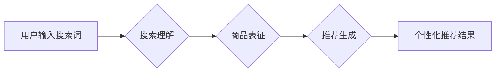

                 

## AI 大模型在电商搜索推荐中的用户体验优化策略：提高用户粘性和转化率

> 关键词：电商搜索推荐、AI大模型、用户体验、用户粘性、转化率、个性化推荐、自然语言处理、深度学习

## 1. 背景介绍

随着电商行业的蓬勃发展，用户对商品搜索和推荐的需求日益增长。传统的基于关键词匹配的搜索推荐系统难以满足用户个性化需求，往往导致搜索结果不精准，推荐内容不相关，从而影响用户体验，降低用户粘性和转化率。

近年来，人工智能（AI）技术，特别是深度学习技术，在自然语言处理（NLP）、计算机视觉等领域取得了突破性进展，为电商搜索推荐带来了新的机遇。AI大模型凭借其强大的学习能力和泛化能力，能够从海量用户数据中挖掘出隐藏的模式和关系，实现更精准、更个性化的搜索和推荐，从而提升用户体验，提高用户粘性和转化率。

## 2. 核心概念与联系

### 2.1  电商搜索推荐系统

电商搜索推荐系统是电商平台的核心功能之一，旨在帮助用户快速找到所需商品，并提供个性化的商品推荐。传统的电商搜索推荐系统主要基于以下技术：

* **关键词匹配:** 根据用户输入的关键词，从商品数据库中匹配出相关的商品。
* **协同过滤:** 基于用户的历史购买行为和商品的购买记录，推荐与用户兴趣相似的商品。
* **内容过滤:** 根据商品的属性和描述，推荐与用户偏好相符的商品。

### 2.2  AI大模型

AI大模型是指在海量数据上训练的深度学习模型，具有强大的学习能力和泛化能力。常见的AI大模型包括：

* **Transformer模型:** 擅长处理自然语言文本，例如BERT、GPT-3等。
* **图神经网络:** 擅长处理关系数据，例如知识图谱嵌入。
* **生成对抗网络:** 擅长生成新的数据，例如图像、文本等。

### 2.3  AI大模型在电商搜索推荐中的应用

AI大模型可以应用于电商搜索推荐系统的各个环节，例如：

* **搜索理解:** 利用Transformer模型对用户搜索词进行理解，提取用户意图和需求。
* **商品表征:** 利用深度学习模型对商品进行表征，提取商品的特征和属性。
* **推荐生成:** 利用协同过滤、内容过滤或其他推荐算法，结合AI大模型生成的商品表征，生成个性化的商品推荐。

**Mermaid 流程图**



## 3. 核心算法原理 & 具体操作步骤

### 3.1  算法原理概述

在电商搜索推荐系统中，AI大模型可以用于提升搜索结果的精准度和推荐结果的个性化程度。常用的算法包括：

* **BERT（Bidirectional Encoder Representations from Transformers）:** BERT是一种基于Transformer模型的预训练语言模型，能够理解用户搜索词的上下文语义，从而更准确地提取用户意图。
* **协同过滤算法:** 协同过滤算法基于用户的历史行为和商品的购买记录，推荐与用户兴趣相似的商品。AI大模型可以用于提升协同过滤算法的准确性，例如通过对用户行为进行聚类分析，找到用户兴趣相似的群体。
* **深度神经网络:** 深度神经网络可以用于学习商品的特征和属性，并根据用户的偏好进行商品推荐。例如，可以使用卷积神经网络（CNN）对商品图像进行特征提取，使用循环神经网络（RNN）对商品描述进行语义理解。

### 3.2  算法步骤详解

**BERT模型在电商搜索推荐中的应用步骤:**

1. **预训练:** 在海量文本数据上预训练BERT模型，使其能够理解自然语言文本的语义。
2. **微调:** 将预训练好的BERT模型微调到电商搜索推荐任务上，例如使用电商平台的用户搜索词和商品信息进行微调。
3. **搜索理解:** 将用户输入的搜索词作为输入，通过微调后的BERT模型进行处理，提取用户意图和需求。
4. **结果排序:** 根据BERT模型提取的用户意图和需求，对搜索结果进行排序，并将最相关的商品推荐给用户。

**协同过滤算法在电商搜索推荐中的应用步骤:**

1. **用户行为数据收集:** 收集用户的历史购买行为、浏览记录、评分等数据。
2. **用户相似度计算:** 利用机器学习算法计算用户之间的相似度，例如基于余弦相似度、皮尔逊相关系数等。
3. **商品推荐:** 根据用户的相似用户，推荐与相似用户购买过的商品。
4. **个性化推荐:** 利用AI大模型对用户行为进行聚类分析，找到用户兴趣相似的群体，并针对不同的群体进行个性化推荐。

### 3.3  算法优缺点

**BERT模型:**

* **优点:** 能够理解用户搜索词的上下文语义，提升搜索结果的精准度。
* **缺点:** 需要大量的训练数据和计算资源，训练时间较长。

**协同过滤算法:**

* **优点:** 能够根据用户的历史行为进行个性化推荐，推荐效果较好。
* **缺点:** 对于新用户或新商品，推荐效果较差，存在冷启动问题。

### 3.4  算法应用领域

BERT模型和协同过滤算法在电商搜索推荐系统中广泛应用，也适用于其他领域，例如：

* **新闻推荐:** 根据用户的阅读历史和兴趣，推荐相关的新闻文章。
* **音乐推荐:** 根据用户的听歌历史和音乐偏好，推荐相关的音乐作品。
* **电影推荐:** 根据用户的观影历史和电影偏好，推荐相关的电影作品。

## 4. 数学模型和公式 & 详细讲解 & 举例说明

### 4.1  数学模型构建

**协同过滤算法的数学模型:**

协同过滤算法的核心是计算用户之间的相似度和商品之间的相似度。常用的相似度度量方法包括余弦相似度和皮尔逊相关系数。

**余弦相似度:**

$$
\text{相似度} = \frac{\mathbf{u} \cdot \mathbf{v}}{\|\mathbf{u}\| \|\mathbf{v}\|}
$$

其中，$\mathbf{u}$ 和 $\mathbf{v}$ 分别表示两个用户的向量表示，$\cdot$ 表示点积，$\|\mathbf{u}\|$ 和 $\|\mathbf{v}\|$ 分别表示两个向量的模长。

**皮尔逊相关系数:**

$$
\text{相似度} = \frac{\sum_{i=1}^{n}(u_i - \bar{u})(v_i - \bar{v})}{\sqrt{\sum_{i=1}^{n}(u_i - \bar{u})^2} \sqrt{\sum_{i=1}^{n}(v_i - \bar{v})^2}}
$$

其中，$u_i$ 和 $v_i$ 分别表示两个用户对第 $i$ 个商品的评分，$\bar{u}$ 和 $\bar{v}$ 分别表示两个用户的平均评分。

### 4.2  公式推导过程

**余弦相似度的推导:**

余弦相似度本质上是两个向量的夹角余弦值。两个向量的夹角越小，余弦值越大，表示两个向量越相似。

**皮尔逊相关系数的推导:**

皮尔逊相关系数衡量的是两个变量之间的线性相关性。其值介于 -1 和 1 之间，其中 1 表示完全正相关，-1 表示完全负相关，0 表示不相关。

### 4.3  案例分析与讲解

**案例:** 假设有两个用户 A 和 B，他们对 5 个商品的评分如下：

| 商品 | 用户 A | 用户 B |
|---|---|---|
| 商品 1 | 5 | 4 |
| 商品 2 | 3 | 2 |
| 商品 3 | 4 | 5 |
| 商品 4 | 2 | 3 |
| 商品 5 | 5 | 4 |

我们可以使用余弦相似度和皮尔逊相关系数计算用户 A 和 B 的相似度。

**余弦相似度:**

$$
\text{相似度} = \frac{(5 \cdot 4 + 3 \cdot 2 + 4 \cdot 5 + 2 \cdot 3 + 5 \cdot 4) }{\sqrt{(5^2 + 3^2 + 4^2 + 2^2 + 5^2)} \sqrt{(4^2 + 2^2 + 5^2 + 3^2 + 4^2)}} \approx 0.87
$$

**皮尔逊相关系数:**

$$
\text{相似度} = \frac{\sum_{i=1}^{5}(A_i - \bar{A})(B_i - \bar{B})}{\sqrt{\sum_{i=1}^{5}(A_i - \bar{A})^2} \sqrt{\sum_{i=1}^{5}(B_i - \bar{B})^2}} \approx 0.85
$$

结果表明，用户 A 和 B 的相似度较高，说明他们具有相似的商品偏好。

## 5. 项目实践：代码实例和详细解释说明

### 5.1  开发环境搭建

* **操作系统:** Ubuntu 20.04
* **编程语言:** Python 3.8
* **深度学习框架:** TensorFlow 2.0
* **其他工具:** Jupyter Notebook、Git

### 5.2  源代码详细实现

```python
# 导入必要的库
import tensorflow as tf
from tensorflow.keras.layers import Embedding, Dense

# 定义协同过滤模型
class CollaborativeFilteringModel(tf.keras.Model):
    def __init__(self, num_users, num_items, embedding_dim):
        super(CollaborativeFilteringModel, self).__init__()
        self.user_embedding = Embedding(num_users, embedding_dim)
        self.item_embedding = Embedding(num_items, embedding_dim)
        self.dense = Dense(1, activation='sigmoid')

    def call(self, user_ids, item_ids):
        user_embeddings = self.user_embedding(user_ids)
        item_embeddings = self.item_embedding(item_ids)
        combined_embeddings = user_embeddings * item_embeddings
        predictions = self.dense(combined_embeddings)
        return predictions

# 训练模型
model = CollaborativeFilteringModel(num_users=1000, num_items=10000, embedding_dim=64)
model.compile(optimizer='adam', loss='binary_crossentropy', metrics=['accuracy'])
# ... 训练数据加载和模型训练 ...

# 预测用户对商品的评分
user_id = 123
item_id = 456
prediction = model.predict([[user_id], [item_id]])
print(prediction)
```

### 5.3  代码解读与分析

* **模型定义:** 代码定义了一个协同过滤模型，包含用户嵌入层、商品嵌入层和全连接层。
* **嵌入层:** 嵌入层将用户 ID 和商品 ID 映射到低维向量空间，使得用户和商品之间的关系能够被模型学习。
* **全连接层:** 全连接层将用户和商品的嵌入向量进行相乘，并输出预测评分。
* **模型训练:** 模型使用 Adam 优化器、二元交叉熵损失函数和准确率作为评估指标进行训练。
* **预测:** 模型可以根据用户的 ID 和商品的 ID 预测用户对商品的评分。

### 5.4  运行结果展示

模型训练完成后，可以将用户 ID 和商品 ID 输入模型，得到预测评分。预测评分可以用于推荐商品给用户。

## 6. 实际应用场景

### 6.1  电商平台商品推荐

AI大模型可以用于电商平台的商品推荐系统，例如：

* **个性化推荐:** 根据用户的历史购买行为、浏览记录、评分等数据，推荐与用户兴趣相似的商品。
* **新品推荐:** 推荐平台上最新的商品，帮助用户发现新产品。
* **关联推荐:** 根据用户购买的商品，推荐与之相关的商品，例如购买手机的用户，可能会推荐手机壳、充电器等配件。

### 6.2  搜索引擎结果排序

AI大模型可以用于搜索引擎的结果排序，例如：

* **理解用户意图:** 利用BERT模型对用户搜索词进行理解，提取用户真实意图。
* **提升搜索结果精准度:** 根据用户意图和搜索词的语义关系，对搜索结果进行排序，将最相关的结果排在前面。
* **个性化搜索结果:** 根据用户的搜索历史和偏好，个性化搜索结果。

### 6.3  内容平台内容推荐

AI大模型可以用于内容平台的内容推荐，例如：

* **新闻推荐:** 根据用户的阅读历史和兴趣，推荐相关的新闻文章。
* **音乐推荐:** 根据用户的听歌历史和音乐偏好，推荐相关的音乐作品。
* **视频推荐:** 根据用户的观看历史和视频偏好，推荐相关的视频作品。

### 6.4  未来应用展望

AI大模型在电商搜索推荐领域的应用前景广阔，未来可能应用于以下领域：

* **多模态推荐:** 将文本、图像、视频等多模态数据融合，实现更精准、更个性化的推荐。
* **实时推荐:** 利用实时数据流，实现对用户行为的实时分析和推荐。
* **跨平台推荐:** 将用户数据跨平台整合，实现更全面的用户画像和个性化推荐。

## 7. 工具和资源推荐

### 7.1  学习资源推荐

* **书籍:**
    * 《深度学习》
    * 《自然语言处理》
    * 《机器学习》
* **在线课程:**
    * Coursera: 深度学习
    * Udacity: 自然语言处理
    * edX: 机器学习
* **博客和网站:**
    * TensorFlow 官方博客
    * PyTorch 官方博客
    * Hugging Face

### 7.2  开发工具推荐

* **深度学习框架:** TensorFlow, PyTorch
* **自然语言处理库:** NLTK, SpaCy, Transformers
* **数据处理工具:** Pandas, NumPy

### 7.3  相关论文推荐

* BERT: Pre-training of Deep Bidirectional Transformers for Language Understanding
* Transformer: Attention Is All You Need
* Collaborative Filtering for Recommender Systems

## 8. 总结：未来发展趋势与挑战

### 8.1  研究成果总结

AI大模型在电商搜索推荐领域取得了显著成果，能够提升搜索结果的精准度和推荐结果的个性化程度，从而提高用户体验，提升电商平台的转化率。

### 8.2  未来发展趋势

* **多模态推荐:** 将文本、图像、视频等多模态数据融合，实现更精准、更个性化的推荐。
* **实时推荐:** 利用实时数据流，实现对用户行为的实时分析和推荐。
* **跨平台推荐:** 将用户数据跨平台整合，实现更全面的用户画像和个性化推荐。
* **可解释性:** 提升AI模型的可解释性，帮助用户理解推荐结果背后的逻辑。

### 8.3  面临的挑战

* **数据质量:** AI大模型的训练需要海量高质量的数据，而电商平台的数据往往存在噪声、缺失等问题。
* **模型复杂度:** AI大模型的训练和部署需要强大的计算资源和技术能力。
* **隐私保护:** AI大模型的训练和应用需要考虑用户隐私保护问题。

### 8.4  研究展望

未来，AI大模型在电商搜索推荐领域将继续发展，并应用于更多场景，为用户提供更智能、更便捷的购物体验。


## 9. 附录：常见问题与解答

**Q1: AI大模型的训练需要多少数据？**

A1: AI大模型的训练需要海量数据，通常需要百万甚至数十亿条数据。

**Q2: AI大模型的训练需要多少计算资源？**

A2: AI大模型的训练需要强大的计算资源，通常需要使用GPU集群进行训练。

**Q3: AI大模型的应用会侵犯用户隐私吗？**

A3: AI大模型的应用需要考虑用户隐私保护问题，需要采取措施保护用户数据安全。

**作者：禅与计算机程序设计艺术 / Zen and the Art of Computer Programming**<end_of_turn>

