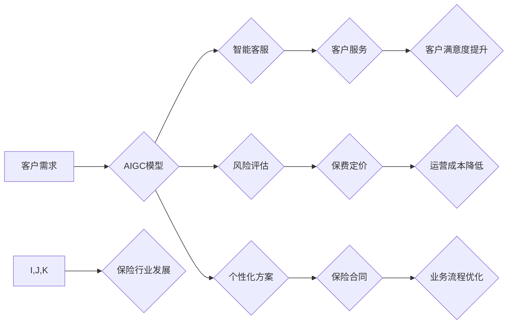

                 

## AIGC重塑保险行业格局

> 关键词：AIGC、保险、人工智能、自然语言处理、风险评估、智能客服、个性化服务、自动化流程

## 1. 背景介绍

保险行业作为传统金融领域的重要组成部分，长期以来面临着效率低下、服务体验差、风险控制难度大等挑战。随着人工智能（AI）技术的快速发展，特别是生成式人工智能（AIGC）的兴起，保险行业迎来了一次前所未有的变革机遇。AIGC能够利用大数据和机器学习算法，自动生成文本、图像、音频等多种内容，为保险行业提供全新的解决方案，重塑行业格局。

### 1.1  传统保险行业痛点

传统保险行业存在以下几个主要痛点：

* **高昂的运营成本:**  保险公司需要大量的人力资源进行业务处理、理赔审核等工作，成本高昂。
* **客户体验差:**  传统的保险服务流程复杂，客户需要填写大量表格，等待时间长，体验差。
* **风险评估难度大:**  传统的风险评估方法依赖于人工经验，难以准确评估风险，导致保费定价不合理。
* **欺诈风险高:**  传统的保险理赔流程容易受到欺诈行为的影响，给保险公司造成损失。

### 1.2  AIGC的颠覆性力量

AIGC技术能够有效解决传统保险行业面临的痛点，为行业带来以下颠覆性力量：

* **自动化流程:**  AIGC可以自动生成保险合同、理赔申请等文档，提高效率，降低成本。
* **个性化服务:**  AIGC可以根据客户的需求，提供个性化的保险方案和服务，提升客户体验。
* **精准风险评估:**  AIGC可以利用大数据和机器学习算法，对客户风险进行精准评估，提高保费定价的准确性。
* **智能欺诈检测:**  AIGC可以识别欺诈行为，降低欺诈风险。

## 2. 核心概念与联系

AIGC的核心概念是利用深度学习算法，训练模型能够生成人类难以区分的文本、图像、音频等内容。在保险行业，AIGC可以应用于多个环节，实现业务流程的自动化、智能化和个性化。

**AIGC在保险行业的应用架构**

## 3. 核心算法原理 & 具体操作步骤

### 3.1  算法原理概述

AIGC的核心算法是基于深度学习的生成式模型，主要包括以下几种类型：

* **Transformer模型:**  Transformer模型是一种强大的序列到序列模型，能够处理长文本序列，在自然语言生成任务中表现出色。
* **Generative Adversarial Networks (GANs):**  GANs是一种生成对抗网络，由生成器和鉴别器两部分组成，通过对抗训练，生成逼真的数据样本。
* **Variational Autoencoders (VAEs):**  VAEs是一种变分自编码器，能够学习数据的潜在表示，并生成新的数据样本。

### 3.2  算法步骤详解

AIGC算法的具体操作步骤如下：

1. **数据收集和预处理:**  收集大量相关数据，并进行清洗、格式化等预处理工作。
2. **模型训练:**  选择合适的生成式模型，并利用训练数据进行模型训练。
3. **模型评估:**  使用测试数据评估模型的生成效果，并进行调参优化。
4. **模型部署:**  将训练好的模型部署到生产环境中，用于生成新的内容。

### 3.3  算法优缺点

**优点:**

* 生成效果逼真，能够生成高质量的文本、图像、音频等内容。
* 可应用于多个领域，具有广泛的应用前景。
* 能够自动化流程，提高效率，降低成本。

**缺点:**

* 训练数据量大，训练成本高。
* 模型训练复杂，需要专业的技术人员。
* 存在生成内容的偏差和不准确性问题。

### 3.4  算法应用领域

AIGC算法在保险行业可以应用于以下领域：

* **智能客服:**  利用AIGC技术，开发智能客服机器人，能够自动回答客户常见问题，提供24小时在线服务。
* **风险评估:**  利用AIGC技术，分析客户的个人信息、行为数据等，进行精准的风险评估，提高保费定价的准确性。
* **个性化服务:**  根据客户的需求，利用AIGC技术生成个性化的保险方案和服务，提升客户体验。
* **欺诈检测:**  利用AIGC技术，识别欺诈行为，降低欺诈风险。

## 4. 数学模型和公式 & 详细讲解 & 举例说明

### 4.1  数学模型构建

AIGC算法的数学模型通常基于深度学习框架，例如TensorFlow或PyTorch。模型的结构通常包括多个神经网络层，例如卷积层、循环层、全连接层等。

### 4.2  公式推导过程

AIGC算法的训练过程涉及到许多数学公式，例如损失函数、梯度下降算法等。这些公式的推导过程比较复杂，需要一定的数学基础。

### 4.3  案例分析与讲解

例如，在训练一个文本生成模型时，可以使用交叉熵损失函数来衡量模型的生成效果。交叉熵损失函数的公式如下：

$$
Loss = -\sum_{i=1}^{N} y_i \log(\hat{y}_i)
$$

其中：

* $N$ 是文本序列的长度。
* $y_i$ 是真实标签。
* $\hat{y}_i$ 是模型预测的概率。

通过最小化交叉熵损失函数，模型可以学习到生成更符合真实文本分布的文本序列。

## 5. 项目实践：代码实例和详细解释说明

### 5.1  开发环境搭建

AIGC项目开发需要搭建相应的开发环境，包括安装深度学习框架、必要的库和工具等。

### 5.2  源代码详细实现

AIGC项目的源代码实现比较复杂，涉及到模型架构设计、数据处理、模型训练、模型评估等多个环节。

### 5.3  代码解读与分析

需要对源代码进行详细解读和分析，理解模型的结构、训练过程和运行机制。

### 5.4  运行结果展示

需要展示模型的运行结果，例如生成的文本、图像、音频等内容，并进行评估和分析。

## 6. 实际应用场景

### 6.1  智能客服

AIGC技术可以用于开发智能客服机器人，能够自动回答客户常见问题，提供24小时在线服务。例如，客户可以通过聊天机器人查询保单信息、报案理赔等。

### 6.2  风险评估

AIGC技术可以用于分析客户的个人信息、行为数据等，进行精准的风险评估，提高保费定价的准确性。例如，AIGC模型可以根据客户的驾驶记录、健康状况等信息，评估其驾驶风险或健康风险。

### 6.3  个性化服务

AIGC技术可以根据客户的需求，生成个性化的保险方案和服务，提升客户体验。例如，AIGC模型可以根据客户的年龄、职业、生活方式等信息，推荐合适的保险产品和服务。

### 6.4  未来应用展望

AIGC技术在保险行业的应用前景广阔，未来可能应用于以下领域：

* **自动生成保险合同:**  AIGC可以根据客户的需求，自动生成个性化的保险合同。
* **智能理赔:**  AIGC可以自动处理理赔申请，提高理赔效率。
* **欺诈检测:**  AIGC可以识别欺诈行为，降低欺诈风险。
* **预测性维护:**  AIGC可以分析保险产品的使用情况，预测潜在的风险，进行预防性维护。

## 7. 工具和资源推荐

### 7.1  学习资源推荐

* **书籍:**  《深度学习》、《自然语言处理》
* **在线课程:**  Coursera、edX、Udacity等平台上的深度学习和自然语言处理课程。
* **博客和论坛:**  机器学习和人工智能相关的博客和论坛，例如Towards Data Science、Machine Learning Mastery等。

### 7.2  开发工具推荐

* **深度学习框架:**  TensorFlow、PyTorch、Keras等。
* **自然语言处理库:**  NLTK、spaCy、Gensim等。
* **代码编辑器:**  VS Code、Atom、Sublime Text等。

### 7.3  相关论文推荐

* **Transformer模型:**  Attention Is All You Need
* **GANs:**  Generative Adversarial Nets
* **VAEs:**  Auto-Encoding Variational Bayes

## 8. 总结：未来发展趋势与挑战

### 8.1  研究成果总结

AIGC技术在保险行业应用取得了显著成果，例如智能客服、风险评估、个性化服务等方面取得了突破。

### 8.2  未来发展趋势

未来AIGC技术在保险行业将继续发展，主要趋势包括：

* **模型更加强大:**  模型规模将进一步扩大，性能将得到提升。
* **应用场景更加广泛:**  AIGC技术将应用于更多保险领域的场景。
* **数据安全和隐私保护:**  随着AIGC技术的应用，数据安全和隐私保护将成为更加重要的议题。

### 8.3  面临的挑战

AIGC技术在保险行业应用还面临一些挑战，例如：

* **数据质量:**  AIGC模型的训练需要大量高质量的数据，而保险行业的内部数据往往存在格式不统一、质量参差不齐等问题。
* **模型解释性:**  AIGC模型的决策过程往往是复杂的，难以解释，这可能会导致客户对模型的信任度降低。
* **伦理问题:**  AIGC技术可能会带来一些伦理问题，例如算法偏见、数据隐私等。

### 8.4  研究展望

未来需要进一步研究AIGC技术在保险行业的应用，解决上述挑战，推动AIGC技术在保险行业得到更加广泛的应用。

## 9. 附录：常见问题与解答

### 9.1  AIGC技术与传统保险技术相比有哪些优势？

AIGC技术能够自动化流程，提高效率，降低成本；能够提供个性化服务，提升客户体验；能够精准评估风险，提高保费定价的准确性；能够识别欺诈行为，降低欺诈风险。

### 9.2  AIGC技术在保险行业应用有哪些风险？

AIGC技术应用存在数据安全和隐私保护风险、模型解释性问题、伦理问题等风险。

### 9.3  如何解决AIGC技术在保险行业应用中的挑战？

需要加强数据质量控制，提高模型解释性，制定相应的伦理规范，加强监管和监督。

作者：禅与计算机程序设计艺术 / Zen and the Art of Computer Programming 
<end_of_turn>

