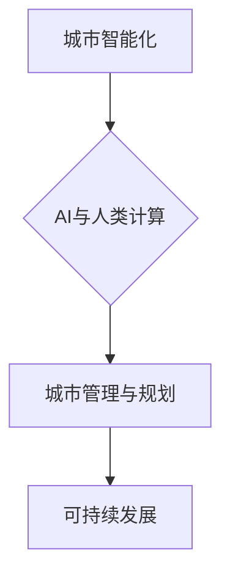

                 

## AI与人类计算：打造可持续发展的城市管理与规划

> 关键词：人工智能、城市规划、可持续发展、人类计算、数据驱动、优化算法、机器学习、深度学习、城市智能化

## 1. 背景介绍

城市化进程的加速和人口规模的不断增长，给城市管理和规划带来了前所未有的挑战。传统的人工管理模式难以应对日益复杂的城市问题，例如交通拥堵、资源短缺、环境污染、公共安全等。 

人工智能（AI）技术的快速发展为城市管理和规划提供了新的机遇。AI能够通过分析海量数据，识别城市发展趋势，预测未来问题，并提供智能化的解决方案。 

然而，AI技术本身并不能完全解决城市问题。城市管理和规划需要结合人类的智慧和经验，才能实现可持续发展。因此，将AI与人类计算相结合，形成一种协同的智能化管理模式，是未来城市发展的必然趋势。

## 2. 核心概念与联系

**2.1 人工智能（AI）**

人工智能是指模拟人类智能行为的计算机系统。AI技术涵盖了多个领域，例如机器学习、深度学习、自然语言处理、计算机视觉等。

**2.2 人类计算**

人类计算是指利用人类的智慧、经验和创造力来解决问题。人类计算的特点是灵活、适应性强、具有洞察力和判断能力。

**2.3 AI与人类计算的协同**

将AI与人类计算相结合，可以发挥各自的优势，形成一种互补的智能化管理模式。AI可以提供数据分析、预测和决策支持，而人类可以提供战略规划、创意设计和伦理判断。

**2.4 城市智能化**

城市智能化是指利用信息技术和人工智能技术，提升城市管理效率、提高城市服务水平、改善城市生活环境，实现城市可持续发展。

**2.5  城市管理与规划**

城市管理与规划是指对城市发展进行规划、组织和控制，以实现城市的可持续发展。

**2.6  核心概念关系图**



## 3. 核心算法原理 & 具体操作步骤

**3.1 算法原理概述**

城市管理和规划中常用的AI算法包括：

* **机器学习算法:** 用于从数据中学习模式和规律，例如预测人口增长、交通流量、能源需求等。
* **深度学习算法:** 用于处理复杂的数据，例如图像识别、语音识别、自然语言处理等。
* **优化算法:** 用于寻找最优的解决方案，例如城市交通规划、资源分配、公共设施布局等。

**3.2 算法步骤详解**

以机器学习算法为例，其基本步骤包括：

1. **数据收集:** 收集城市相关数据，例如人口数据、交通数据、环境数据等。
2. **数据预处理:** 对收集到的数据进行清洗、转换、特征提取等处理，使其适合机器学习算法的训练。
3. **模型选择:** 选择合适的机器学习算法模型，例如线性回归、逻辑回归、决策树、支持向量机等。
4. **模型训练:** 使用训练数据训练机器学习模型，使其能够学习数据中的模式和规律。
5. **模型评估:** 使用测试数据评估模型的性能，例如准确率、召回率、F1-score等。
6. **模型部署:** 将训练好的模型部署到实际应用场景中，例如预测城市交通流量、识别城市环境污染等。

**3.3 算法优缺点**

* **优点:** 能够自动学习数据模式，提高预测精度，自动化处理大量数据。
* **缺点:** 需要大量的数据进行训练，对数据质量要求高，解释性较差，容易受到数据偏差的影响。

**3.4 算法应用领域**

* **城市交通规划:** 预测交通流量、优化交通信号灯控制、规划公共交通路线等。
* **城市环境管理:** 监测空气质量、水质、噪音等环境指标，预测环境污染风险等。
* **城市资源管理:** 优化能源分配、水资源利用、垃圾处理等。
* **城市安全管理:** 预警犯罪风险、监控公共安全等。

## 4. 数学模型和公式 & 详细讲解 & 举例说明

**4.1 数学模型构建**

城市管理和规划问题通常可以用数学模型来描述。例如，城市交通流量模型可以描述城市道路上的车辆流量，并预测交通拥堵情况。

**4.2 公式推导过程**

交通流量模型的推导过程通常涉及以下公式：

* **流量平衡方程:** 描述道路上车辆流量的输入和输出关系。
* **速度-流量关系:** 描述车辆速度和流量之间的关系。
* **拥堵模型:** 描述车辆流量超过道路容量时产生的拥堵情况。

**4.3 案例分析与讲解**

例如，我们可以使用交通流量模型来预测城市高峰时段的交通拥堵情况。通过收集历史交通数据，我们可以训练一个机器学习模型，并使用该模型预测未来高峰时段的交通流量。

**举例说明:**

假设我们有一个城市道路网络，其中每个道路都有一个流量容量。我们可以使用以下公式来描述道路上的车辆流量：

$$
Q_i = \sum_{j \in \text{in}(i)} Q_{ij} - \sum_{k \in \text{out}(i)} Q_{ik}
$$

其中：

* $Q_i$ 是道路 $i$ 上的流量。
* $Q_{ij}$ 是从道路 $j$ 到道路 $i$ 的流量。
* $\text{in}(i)$ 是连接到道路 $i$ 的入方向道路的集合。
* $\text{out}(i)$ 是连接到道路 $i$ 的出方向道路的集合。

这个公式描述了道路上车辆流量的输入和输出关系。我们可以使用这个公式来构建一个城市交通流量模型，并预测未来交通拥堵情况。

## 5. 项目实践：代码实例和详细解释说明

**5.1 开发环境搭建**

* 操作系统: Ubuntu 20.04
* Python 版本: 3.8
* 必要的库: pandas, numpy, scikit-learn, matplotlib

**5.2 源代码详细实现**

```python
import pandas as pd
from sklearn.linear_model import LinearRegression

# 数据加载
data = pd.read_csv('traffic_data.csv')

# 数据预处理
X = data[['hour', 'weekday']]
y = data['traffic_volume']

# 模型训练
model = LinearRegression()
model.fit(X, y)

# 模型评估
# ...

# 模型预测
# ...
```

**5.3 代码解读与分析**

* 代码首先加载交通数据，并进行数据预处理，将时间和星期作为特征，交通流量作为目标变量。
* 然后，使用线性回归模型训练模型，并评估模型性能。
* 最后，使用训练好的模型预测未来交通流量。

**5.4 运行结果展示**

运行结果可以展示模型的预测精度，以及预测的未来交通流量情况。

## 6. 实际应用场景

**6.1 交通管理**

* 预测交通流量，优化交通信号灯控制，缓解交通拥堵。
* 预警交通事故风险，提高交通安全。
* 智能导航，提供最优路线规划。

**6.2 环境管理**

* 监测空气质量、水质、噪音等环境指标，预测环境污染风险。
* 优化资源分配，减少环境污染。
* 推广绿色出行，减少碳排放。

**6.3 城市规划**

* 预测人口增长、城市发展趋势，优化城市规划布局。
* 规划公共设施，提高城市服务水平。
* 促进城市可持续发展。

**6.4 未来应用展望**

* 更智能化的城市管理系统，能够更加精准地预测城市问题，并提供更有效的解决方案。
* 更广泛的AI应用场景，例如城市医疗、教育、文化等领域。
* 人机协作更加紧密，AI辅助人类决策，实现城市管理的智慧化升级。

## 7. 工具和资源推荐

**7.1 学习资源推荐**

* **书籍:**
    * 《深度学习》
    * 《机器学习实战》
    * 《人工智能：一种现代方法》
* **在线课程:**
    * Coursera: 深度学习
    * edX: 机器学习
    * Udacity: AI Nanodegree

**7.2 开发工具推荐**

* **Python:** 广泛应用于AI开发，拥有丰富的库和工具。
* **TensorFlow:** Google开发的开源深度学习框架。
* **PyTorch:** Facebook开发的开源深度学习框架。
* **Jupyter Notebook:** 用于交互式编程和数据可视化的工具。

**7.3 相关论文推荐**

* **《Attention Is All You Need》**
* **《Generative Adversarial Networks》**
* **《Deep Learning》**

## 8. 总结：未来发展趋势与挑战

**8.1 研究成果总结**

AI技术在城市管理和规划领域取得了显著的成果，例如交通流量预测、环境污染监测、城市规划优化等。

**8.2 未来发展趋势**

* **更智能化的城市管理系统:** AI将更加深入地融入城市管理系统，实现更加精准的预测和决策。
* **更广泛的AI应用场景:** AI将应用于更多城市管理领域，例如医疗、教育、文化等。
* **人机协作更加紧密:** AI将辅助人类决策，实现城市管理的智慧化升级。

**8.3 面临的挑战**

* **数据质量问题:** AI算法对数据质量要求高，需要确保数据的准确性和完整性。
* **算法解释性问题:** 一些AI算法的决策过程难以解释，这可能会导致信任问题。
* **伦理问题:** AI技术的发展需要考虑伦理问题，例如数据隐私、算法偏见等。

**8.4 研究展望**

未来研究方向包括：

* 开发更鲁棒、更解释性的AI算法。
* 构建更加完善的城市数据平台，提高数据质量和共享能力。
* 研究AI技术在城市管理中的伦理问题，制定相应的规范和政策。


## 9. 附录：常见问题与解答

**9.1 如何选择合适的AI算法？**

选择合适的AI算法需要根据具体应用场景和数据特点进行选择。例如，对于预测连续数值的场景，可以使用回归算法；对于分类问题，可以使用分类算法。

**9.2 如何评估AI模型的性能？**

常用的评估指标包括准确率、召回率、F1-score等。

**9.3 如何解决AI算法的解释性问题？**

可以使用可解释AI技术，例如LIME、SHAP等，来解释AI模型的决策过程。


作者：禅与计算机程序设计艺术 / Zen and the Art of Computer Programming 
<end_of_turn>

