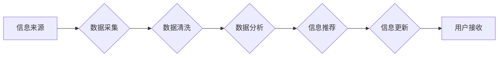

                 

## AI在实时信息更新中的作用

> 关键词：人工智能、实时信息更新、机器学习、自然语言处理、数据流处理、知识图谱、推荐系统、事件驱动架构

## 1. 背景介绍

在当今信息爆炸的时代，实时信息更新已成为人们获取信息和做出决策的关键。传统的信息更新方式往往存在延迟、效率低、难以处理海量数据等问题。人工智能（AI）技术的快速发展为实时信息更新带来了新的机遇和挑战。AI算法能够高效地处理海量数据，识别信息中的关键点，并根据用户需求进行个性化推荐，从而实现更加精准、高效、实时的信息更新。

## 2. 核心概念与联系

### 2.1  实时信息更新

实时信息更新是指信息从产生到用户接收之间的时间间隔极短，几乎可以忽略不计。它要求信息处理系统能够快速地捕捉、处理和传递信息，以满足用户对即时信息的渴求。

### 2.2  人工智能

人工智能是指模拟人类智能行为的计算机系统。它涵盖了多个领域，包括机器学习、深度学习、自然语言处理、计算机视觉等。

### 2.3  核心概念联系

AI技术在实时信息更新中发挥着至关重要的作用。通过结合机器学习、自然语言处理等技术，AI系统能够：

* **实时捕捉信息：** 利用网络爬虫、传感器数据等方式，实时采集来自各种来源的信息。
* **智能分析信息：** 利用机器学习算法对信息进行分类、聚类、识别等分析，提取关键信息和趋势。
* **个性化推荐信息：** 根据用户的兴趣、行为等信息，推荐用户感兴趣的实时信息。
* **自动更新信息：** 利用事件驱动架构，自动更新用户的信息流，确保信息及时准确。

**Mermaid 流程图**



## 3. 核心算法原理 & 具体操作步骤

### 3.1  算法原理概述

实时信息更新的核心算法主要包括：

* **数据流处理算法：** 用于处理高速、连续的数据流，例如Apache Kafka、Apache Flink等。
* **机器学习算法：** 用于分析数据、识别模式、进行预测，例如分类算法、聚类算法、推荐算法等。
* **自然语言处理算法：** 用于理解和处理自然语言文本，例如文本分类、情感分析、关键词提取等。

### 3.2  算法步骤详解

1. **数据采集：** 从各种信息来源（例如网络、传感器、数据库等）采集实时数据。
2. **数据清洗：** 对采集到的数据进行清洗、格式化、去噪等处理，确保数据质量。
3. **数据分析：** 利用机器学习算法对数据进行分析，提取关键信息、识别趋势、进行预测等。
4. **信息推荐：** 根据用户的兴趣、行为等信息，利用推荐算法推荐用户感兴趣的实时信息。
5. **信息更新：** 利用事件驱动架构，自动更新用户的实时信息流，确保信息及时准确。

### 3.3  算法优缺点

**优点：**

* **实时性：** 可以实现信息从产生到用户接收之间的极短延迟。
* **效率：** 可以高效地处理海量数据，提高信息处理效率。
* **个性化：** 可以根据用户的需求进行个性化推荐，提升用户体验。

**缺点：**

* **复杂性：** 实时信息更新系统通常比较复杂，需要整合多种技术和平台。
* **成本：** 建设和维护实时信息更新系统需要一定的成本投入。
* **安全：** 需要确保实时信息的安全性和可靠性。

### 3.4  算法应用领域

实时信息更新技术广泛应用于各个领域，例如：

* **新闻资讯：** 提供实时新闻报道、事件追踪、个性化新闻推荐等。
* **金融市场：** 提供实时股票行情、市场分析、交易提醒等。
* **社交媒体：** 提供实时消息推送、动态更新、个性化内容推荐等。
* **物联网：** 提供实时设备数据采集、分析、控制等。

## 4. 数学模型和公式 & 详细讲解 & 举例说明

### 4.1  数学模型构建

在实时信息更新系统中，可以使用数学模型来描述信息流的特性、用户行为模式以及推荐算法的运作机制。例如，可以使用马尔科夫链模型来描述用户在不同信息流中的跳转行为，可以使用协同过滤算法来预测用户对信息的兴趣。

### 4.2  公式推导过程

协同过滤算法是一种常用的推荐算法，它基于用户的历史行为数据来预测用户对新信息的兴趣。协同过滤算法的核心公式是：

$$
r_{ui} = \frac{\sum_{j \in N(u)} s_{uj} \cdot s_{uj} }{\sum_{j \in N(u)} s_{uj}^2}
$$

其中：

* $r_{ui}$ 表示用户 $u$ 对物品 $i$ 的评分。
* $s_{uj}$ 表示用户 $u$ 对物品 $j$ 的评分。
* $N(u)$ 表示与用户 $u$ 具有相似兴趣的用户集合。

### 4.3  案例分析与讲解

假设有一个电影推荐系统，用户 $A$ 对电影 $X$ 和 $Y$ 都评分为 5 分，用户 $B$ 对电影 $Y$ 和 $Z$ 都评分为 4 分。如果我们想预测用户 $A$ 对电影 $Z$ 的评分，可以使用协同过滤算法。

首先，我们需要找到与用户 $A$ 具有相似兴趣的用户，例如用户 $B$。然后，我们可以使用公式计算用户 $A$ 对电影 $Z$ 的评分预测值。

## 5. 项目实践：代码实例和详细解释说明

### 5.1  开发环境搭建

为了实现实时信息更新系统，我们可以使用以下开发环境：

* **操作系统：** Linux 或 macOS
* **编程语言：** Python 或 Java
* **数据流处理框架：** Apache Kafka 或 Apache Flink
* **机器学习库：** scikit-learn 或 TensorFlow
* **数据库：** MongoDB 或 PostgreSQL

### 5.2  源代码详细实现

以下是一个使用 Python 和 Apache Kafka 实现实时新闻推荐系统的简单代码示例：

```python
from kafka import KafkaConsumer
from sklearn.feature_extraction.text import TfidfVectorizer
from sklearn.metrics.pairwise import cosine_similarity

# Kafka消费者配置
consumer = KafkaConsumer('news_topic', bootstrap_servers=['localhost:9092'])

# TF-IDF向量化器
vectorizer = TfidfVectorizer()

# 用户新闻兴趣数据
user_interests = {
    'user1': ['科技', '财经'],
    'user2': ['体育', '娱乐'],
}

# 从Kafka主题中获取新闻数据
for message in consumer:
    news_text = message.value.decode('utf-8')

    # 将新闻文本向量化
    news_vector = vectorizer.transform([news_text])

    # 计算新闻与用户兴趣的相似度
    for user, interests in user_interests.items():
        user_vector = vectorizer.transform(interests)
        similarity = cosine_similarity(news_vector, user_vector)[0][0]

        # 如果相似度较高，则推荐新闻给用户
        if similarity > 0.8:
            print(f'推荐新闻给用户 {user}: {news_text}')
```

### 5.3  代码解读与分析

这段代码首先定义了一个 Kafka 消费者，用于从名为 `news_topic` 的主题中获取新闻数据。然后，使用 TF-IDF 向量化器将新闻文本转换为向量表示。接着，遍历用户兴趣数据，计算新闻向量与用户兴趣向量的余弦相似度。如果相似度较高，则将新闻推荐给用户。

### 5.4  运行结果展示

当代码运行时，会从 Kafka 主题中获取新闻数据，并根据用户兴趣进行推荐。推荐结果将以文本形式打印到控制台。

## 6. 实际应用场景

### 6.1  新闻资讯

实时信息更新技术可以用于构建新闻资讯平台，提供实时新闻报道、事件追踪、个性化新闻推荐等功能。例如，可以根据用户的兴趣爱好，实时推送相关新闻，并提供事件的实时更新和分析。

### 6.2  金融市场

实时信息更新技术可以用于构建金融市场平台，提供实时股票行情、市场分析、交易提醒等功能。例如，可以根据用户的投资策略，实时推送股票行情和交易建议，并提供市场风险预警。

### 6.3  社交媒体

实时信息更新技术可以用于构建社交媒体平台，提供实时消息推送、动态更新、个性化内容推荐等功能。例如，可以根据用户的社交关系和兴趣爱好，实时推送相关消息和内容，并提供个性化推荐。

### 6.4  未来应用展望

随着人工智能技术的不断发展，实时信息更新技术将有更广泛的应用场景。例如，可以用于构建智能家居系统、智能医疗系统、智能交通系统等，为人们提供更加便捷、高效、智能的服务。

## 7. 工具和资源推荐

### 7.1  学习资源推荐

* **书籍：**
    * 《深度学习》
    * 《机器学习实战》
    * 《自然语言处理入门》
* **在线课程：**
    * Coursera
    * edX
    * Udacity

### 7.2  开发工具推荐

* **数据流处理框架：** Apache Kafka、Apache Flink
* **机器学习库：** scikit-learn、TensorFlow
* **数据库：** MongoDB、PostgreSQL

### 7.3  相关论文推荐

* **《Attention Is All You Need》**
* **《BERT: Pre-training of Deep Bidirectional Transformers for Language Understanding》**
* **《Recurrent Neural Networks for Sequence Learning》**

## 8. 总结：未来发展趋势与挑战

### 8.1  研究成果总结

AI技术在实时信息更新领域取得了显著成果，例如：

* **实时数据分析：** 利用机器学习算法，可以实时分析海量数据，识别趋势和异常情况。
* **个性化推荐：** 利用协同过滤算法、内容推荐算法等，可以根据用户的兴趣和行为，提供个性化的信息推荐。
* **事件驱动架构：** 利用事件驱动架构，可以实现信息更新的自动化和实时性。

### 8.2  未来发展趋势

未来，实时信息更新技术将朝着以下方向发展：

* **更智能的推荐：** 利用深度学习算法，可以实现更精准、更个性化的信息推荐。
* **更实时的数据处理：** 利用流式处理技术，可以实现更低延迟、更实时的数据处理。
* **更安全的系统：** 利用安全技术，可以确保实时信息更新系统的安全性和可靠性。

### 8.3  面临的挑战

实时信息更新技术也面临着一些挑战：

* **数据质量：** 实时信息更新系统依赖于高质量的数据，数据清洗和预处理是一个重要的挑战。
* **系统复杂性：** 实时信息更新系统通常比较复杂，需要整合多种技术和平台，系统设计和维护是一个挑战。
* **隐私安全：** 实时信息更新系统需要处理大量用户数据，如何保护用户隐私是一个重要的挑战。

### 8.4  研究展望

未来，我们需要继续研究以下问题：

* 如何提高实时信息更新系统的智能化水平？
* 如何降低实时信息更新系统的延迟和成本？
* 如何更好地保护用户隐私和数据安全？


## 9. 附录：常见问题与解答

### 9.1  常见问题

* **什么是实时信息更新？**

实时信息更新是指信息从产生到用户接收之间的时间间隔极短，几乎可以忽略不计。

* **AI技术在实时信息更新中有什么作用？**

AI技术可以帮助实时信息更新系统实现更智能的分析、推荐和更新。

* **如何构建一个实时信息更新系统？**

构建一个实时信息更新系统需要整合多种技术和平台，例如数据流处理框架、机器学习库、数据库等。

### 9.2  解答

* **实时信息更新系统有哪些应用场景？**

实时信息更新技术广泛应用于新闻资讯、金融市场、社交媒体等领域。

* **实时信息更新系统面临哪些挑战？**

实时信息更新系统面临数据质量、系统复杂性、隐私安全等挑战。


作者：禅与计算机程序设计艺术 / Zen and the Art of Computer Programming 
<end_of_turn>

