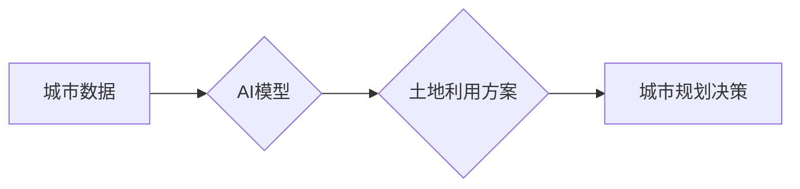

                 

## AI在智能城市规划中的应用：优化土地使用

> 关键词：人工智能、智能城市、土地利用规划、机器学习、深度学习、优化算法、城市发展

## 1. 背景介绍

随着全球人口的持续增长和城市化进程的加速，土地资源日益紧张，如何合理规划和利用土地资源已成为城市发展面临的重大挑战。传统土地利用规划方法往往依赖于经验和主观判断，难以适应快速变化的城市环境和复杂的需求。人工智能（AI）技术的快速发展为智能城市规划提供了新的思路和方法。

AI技术能够通过对海量数据进行分析和学习，识别城市发展趋势和土地利用模式，并提出更科学、高效的土地利用方案。在智能城市规划中，AI技术可以应用于多个领域，例如：

* **土地需求预测:** 利用历史数据和社会经济指标，预测未来城市土地需求，为土地利用规划提供依据。
* **土地资源评估:** 对不同土地类型进行评估，确定其价值和利用潜力，为土地开发和利用提供指导。
* **土地利用优化:** 通过优化算法，寻找最优的土地利用方案，最大化土地资源的利用效率。
* **城市交通规划:** 结合交通数据和土地利用信息，优化城市交通网络，缓解交通拥堵问题。
* **环境保护:** 评估土地利用对环境的影响，制定相应的保护措施，实现可持续发展。

## 2. 核心概念与联系

**2.1 核心概念**

* **智能城市:**  智能城市是指利用信息技术和通信技术，提升城市管理效率、提高居民生活质量、促进城市可持续发展的一种新型城市模式。
* **土地利用规划:**  土地利用规划是指根据城市发展规划和土地资源状况，合理安排土地用途，协调土地利用与城市发展的关系，实现土地资源的优化配置和可持续利用。
* **人工智能 (AI):** 人工智能是指模拟人类智能行为的计算机系统，包括机器学习、深度学习、自然语言处理等技术。

**2.2 架构图**



**2.3 联系**

AI技术可以帮助智能城市更好地实现土地利用规划的目标。通过对城市数据进行分析和学习，AI模型可以识别城市发展趋势和土地利用模式，并提出更科学、高效的土地利用方案。这些方案可以为城市规划决策提供依据，帮助城市管理者做出更明智的决策，从而实现土地资源的优化配置和可持续利用。

## 3. 核心算法原理 & 具体操作步骤

**3.1 算法原理概述**

在AI驱动的土地利用规划中，常用的算法包括机器学习算法、深度学习算法和优化算法。

* **机器学习算法:**  例如回归算法、分类算法和聚类算法，可以用于预测土地需求、评估土地资源和识别土地利用模式。
* **深度学习算法:**  例如卷积神经网络 (CNN) 和循环神经网络 (RNN)，可以用于处理复杂的数据，例如遥感图像和地理信息系统 (GIS) 数据，并进行更精细的土地利用分析。
* **优化算法:**  例如遗传算法、模拟退火算法和粒子群算法，可以用于寻找最优的土地利用方案，最大化土地资源的利用效率。

**3.2 算法步骤详解**

以机器学习算法为例，其具体操作步骤如下：

1. **数据收集:** 收集城市相关数据，例如人口数据、经济数据、土地利用数据、交通数据等。
2. **数据预处理:** 对收集到的数据进行清洗、转换和特征工程，使其适合机器学习算法的训练。
3. **模型选择:** 根据具体任务选择合适的机器学习算法，例如线性回归、逻辑回归、支持向量机等。
4. **模型训练:** 利用训练数据训练选择的机器学习模型，调整模型参数，使其能够准确预测或分类土地利用信息。
5. **模型评估:** 利用测试数据评估模型的性能，例如准确率、召回率、F1-score等。
6. **模型部署:** 将训练好的模型部署到实际应用场景中，用于预测土地需求、评估土地资源或识别土地利用模式。

**3.3 算法优缺点**

* **优点:** 能够处理海量数据，识别复杂模式，提高土地利用规划的效率和准确性。
* **缺点:** 需要大量的训练数据，算法模型的解释性较差，容易受到数据质量的影响。

**3.4 算法应用领域**

* **土地需求预测:**  预测未来城市土地需求，为土地利用规划提供依据。
* **土地资源评估:**  对不同土地类型进行评估，确定其价值和利用潜力。
* **土地利用优化:**  寻找最优的土地利用方案，最大化土地资源的利用效率。
* **城市交通规划:**  结合交通数据和土地利用信息，优化城市交通网络。
* **环境保护:**  评估土地利用对环境的影响，制定相应的保护措施。

## 4. 数学模型和公式 & 详细讲解 & 举例说明

**4.1 数学模型构建**

在AI驱动的土地利用规划中，常用的数学模型包括线性规划模型、整数规划模型和混合整数规划模型。

* **线性规划模型:**  用于解决资源分配问题，例如土地分配问题。
* **整数规划模型:**  用于解决整数变量的优化问题，例如土地利用类型选择问题。
* **混合整数规划模型:**  用于解决既包含整数变量又包含连续变量的优化问题，例如土地利用规划和交通规划的综合优化问题。

**4.2 公式推导过程**

以线性规划模型为例，其目标函数和约束条件如下：

* **目标函数:**  最大化土地利用效益，例如土地价值总和或土地利用效率。
* **约束条件:**  包括土地资源限制、人口需求限制、交通网络限制等。

**目标函数:**  $Z = \sum_{i=1}^{n} w_i x_i$

**约束条件:**

* $\sum_{i=1}^{n} a_{ij} x_i \leq b_j$  (j = 1, 2, ..., m)
* $x_i \geq 0$  (i = 1, 2, ..., n)

其中：

* $Z$ 为目标函数值
* $w_i$ 为土地类型 $i$ 的权重
* $x_i$ 为土地类型 $i$ 的利用面积
* $a_{ij}$ 为土地类型 $i$ 对资源 $j$ 的消耗系数
* $b_j$ 为资源 $j$ 的总量

**4.3 案例分析与讲解**

假设一个城市需要规划土地利用，目标是最大化土地价值。

* **数据:**  收集了不同土地类型的价值、土地资源的总量、人口需求等数据。
* **模型:**  建立线性规划模型，目标函数为最大化土地价值总和，约束条件为土地资源限制和人口需求限制。
* **求解:**  利用线性规划算法求解模型，得到最优的土地利用方案。

## 5. 项目实践：代码实例和详细解释说明

**5.1 开发环境搭建**

* **操作系统:**  Linux 或 Windows
* **编程语言:**  Python
* **库依赖:**  pandas, numpy, scikit-learn, matplotlib

**5.2 源代码详细实现**

```python
import pandas as pd
from sklearn.linear_model import LinearRegression

# 数据加载
data = pd.read_csv('land_use_data.csv')

# 数据预处理
X = data[['population', 'economy']]
y = data['land_value']

# 模型训练
model = LinearRegression()
model.fit(X, y)

# 模型预测
new_data = pd.DataFrame({'population': [100000], 'economy': [100000000]})
predicted_value = model.predict(new_data)

# 结果展示
print(f'预测土地价值: {predicted_value[0]}')
```

**5.3 代码解读与分析**

* 代码首先加载土地利用数据，并进行数据预处理，将特征数据和目标数据分离。
* 然后，使用线性回归模型训练模型，并利用训练好的模型对新数据进行预测。
* 最后，打印预测的土地价值。

**5.4 运行结果展示**

运行代码后，将输出预测的土地价值。

## 6. 实际应用场景

**6.1 城市规划案例**

AI技术可以帮助城市规划者制定更科学、高效的土地利用规划方案。例如，可以利用AI模型预测未来城市土地需求，并根据人口增长、经济发展等因素，优化土地分配方案，确保城市土地资源的合理利用。

**6.2 土地资源评估案例**

AI技术可以帮助评估不同土地类型的价值和利用潜力。例如，可以利用遥感图像和GIS数据，识别不同土地类型的特征，并结合土地市场价格等信息，进行土地资源评估，为土地开发和利用提供指导。

**6.3 交通规划案例**

AI技术可以帮助优化城市交通网络，缓解交通拥堵问题。例如，可以利用交通数据和土地利用信息，预测交通流量变化，并根据预测结果，调整交通信号灯控制策略，优化道路交通流。

**6.4 未来应用展望**

随着AI技术的不断发展，其在智能城市规划中的应用将更加广泛和深入。例如，可以利用更先进的深度学习算法，进行更精细的土地利用分析，识别土地利用模式和趋势，为城市规划提供更精准的决策依据。

## 7. 工具和资源推荐

**7.1 学习资源推荐**

* **书籍:**
    * 《人工智能：一种现代方法》
    * 《深度学习》
    * 《机器学习实战》
* **在线课程:**
    * Coursera: 人工智能课程
    * edX: 深度学习课程
    * Udacity: 机器学习工程师课程

**7.2 开发工具推荐**

* **Python:**  Python 是 AI 开发最常用的编程语言，拥有丰富的 AI 库和工具。
* **TensorFlow:**  TensorFlow 是 Google 开发的开源深度学习框架，支持多种硬件平台。
* **PyTorch:**  PyTorch 是 Facebook 开发的开源深度学习框架，以其灵活性和易用性而闻名。
* **scikit-learn:**  scikit-learn 是 Python 的机器学习库，提供多种经典机器学习算法。

**7.3 相关论文推荐**

* **Urban land use planning with deep learning:**  https://arxiv.org/abs/1809.04727
* **A review of machine learning applications in urban planning:**  https://www.sciencedirect.com/science/article/pii/S0308518X1930142X
* **Optimizing land use planning with genetic algorithms:**  https://www.researchgate.net/publication/228943691_Optimizing_Land_Use_Planning_with_Genetic_Algorithms

## 8. 总结：未来发展趋势与挑战

**8.1 研究成果总结**

AI技术在智能城市规划中的应用取得了显著成果，例如土地需求预测、土地资源评估、交通规划等领域都取得了突破。

**8.2 未来发展趋势**

* **更精细的土地利用分析:**  利用更先进的深度学习算法，进行更精细的土地利用分析，识别土地利用模式和趋势，为城市规划提供更精准的决策依据。
* **更智能的城市规划决策:**  结合AI技术和专家经验，开发更智能的城市规划决策系统，实现城市规划的自动化和智能化。
* **更可持续的城市发展:**  利用AI技术，评估土地利用对环境的影响，制定相应的保护措施，实现城市的可持续发展。

**8.3 面临的挑战**

* **数据质量问题:**  AI模型的性能依赖于数据质量，而城市规划数据往往存在不完整、不准确等问题。
* **算法解释性问题:**  一些AI算法的决策过程难以解释，这可能会导致城市规划决策缺乏透明度和可信度。
* **伦理和社会问题:**  AI技术在城市规划中的应用可能会带来伦理和社会问题，例如数据隐私、算法偏见等，需要引起重视和解决。

**8.4 研究展望**

未来，AI技术在智能城市规划中的应用将继续深入发展，需要加强多学科交叉研究，解决数据质量、算法解释性和伦理等问题，推动AI技术在城市规划领域的健康发展。

## 9. 附录：常见问题与解答

**9.1 如何获取城市规划数据？**

城市规划数据可以从政府部门、研究机构、商业数据提供商等渠道获取。

**9.2 如何评估AI模型的性能？**

常用的评估指标包括准确率、召回率、F1-score等。

**9.3 如何解决AI模型的算法解释性问题？**

可以使用可解释机器学习 (XAI) 技术，例如LIME、SHAP等，解释AI模型的决策过程。


作者：禅与计算机程序设计艺术 / Zen and the Art of Computer Programming 
<end_of_turn>

