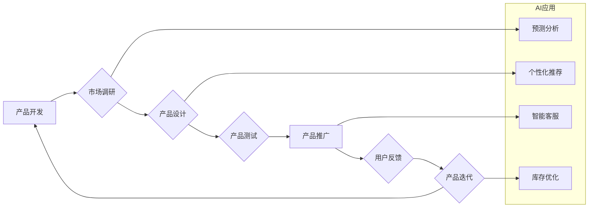

                 

## AI在电商产品生命周期管理中的应用

> 关键词：人工智能、电商、产品生命周期、预测分析、个性化推荐、库存优化、营销策略

## 1. 背景介绍

电子商务行业竞争日益激烈，产品生命周期缩短，消费者需求更加多元化。传统电商企业难以应对快速变化的市场环境，需要借助人工智能（AI）技术来提升运营效率和用户体验。AI在电商产品生命周期管理中的应用，可以帮助企业从产品研发、营销推广、销售服务到售后维护等各个环节，实现智能化、数据化和个性化管理。

## 2. 核心概念与联系

### 2.1 产品生命周期

产品生命周期是指产品从诞生到淘汰的全过程，通常分为四个阶段：

* **开发阶段:**  产品概念形成、市场调研、产品设计和开发。
* **推广阶段:**  产品上市、市场推广、销售渠道建设。
* **成熟阶段:**  产品销售稳定，市场份额扩大，竞争加剧。
* **衰退阶段:**  产品需求下降，销售额减少，最终被淘汰。

### 2.2  人工智能

人工智能是指模拟人类智能行为的计算机系统，包括学习、推理、决策、感知和语言理解等能力。在电商领域，AI技术主要应用于以下几个方面：

* **预测分析:**  利用历史数据和机器学习算法，预测未来市场需求、产品销量、用户行为等。
* **个性化推荐:**  根据用户的购买历史、浏览记录、兴趣偏好等信息，推荐个性化的产品和服务。
* **智能客服:**  利用自然语言处理技术，提供智能化的客户服务，例如回答常见问题、处理订单、提供售后支持。
* **库存优化:**  利用预测分析和机器学习算法，优化库存管理，减少库存积压和缺货情况。

### 2.3 AI在电商产品生命周期管理中的应用

AI技术可以应用于电商产品生命周期管理的各个阶段，帮助企业提升运营效率和用户体验。

**流程图：**



## 3. 核心算法原理 & 具体操作步骤

### 3.1  算法原理概述

在电商产品生命周期管理中，常用的AI算法包括：

* **机器学习:**  利用算法从数据中学习，发现模式和规律，进行预测和分类。
* **深度学习:**  一种更高级的机器学习算法，利用多层神经网络，可以处理更复杂的数据和任务。
* **自然语言处理:**  处理和理解人类语言，例如文本分类、情感分析、机器翻译等。

### 3.2  算法步骤详解

以预测产品销量的机器学习算法为例，其步骤如下：

1. **数据收集:**  收集历史销售数据、市场数据、用户数据等相关信息。
2. **数据预处理:**  清洗、转换和格式化数据，使其适合模型训练。
3. **特征工程:**  提取数据中的特征，例如产品类别、价格、季节、促销活动等，这些特征可以影响产品销量。
4. **模型选择:**  选择合适的机器学习算法，例如线性回归、决策树、支持向量机等。
5. **模型训练:**  利用训练数据训练模型，调整模型参数，使其能够准确预测产品销量。
6. **模型评估:**  利用测试数据评估模型的预测精度，例如使用均方误差、R-squared等指标。
7. **模型部署:**  将训练好的模型部署到生产环境中，用于实时预测产品销量。

### 3.3  算法优缺点

**优点:**

* **准确性高:**  机器学习算法可以学习数据中的复杂模式，提高预测准确性。
* **自动化程度高:**  模型训练和预测过程可以自动化，减少人工干预。
* **可扩展性强:**  可以处理海量数据，适应不断变化的市场环境。

**缺点:**

* **数据依赖性强:**  模型的准确性取决于训练数据的质量和数量。
* **解释性差:**  一些机器学习算法的决策过程难以解释，难以理解模型的内部机制。
* **维护成本高:**  模型需要定期更新和维护，以适应不断变化的数据和市场环境。

### 3.4  算法应用领域

* **产品需求预测:**  预测未来市场对特定产品的需求量。
* **库存优化:**  根据预测需求，优化库存水平，减少库存积压和缺货情况。
* **价格优化:**  根据市场需求和竞争情况，动态调整产品价格。
* **营销策略制定:**  根据用户画像和行为分析，制定个性化的营销策略。

## 4. 数学模型和公式 & 详细讲解 & 举例说明

### 4.1  数学模型构建

在电商产品生命周期管理中，常用的数学模型包括：

* **S型曲线模型:**  描述产品生命周期的发展趋势，包括推广阶段的快速增长、成熟阶段的稳定增长和衰退阶段的下降。
* **Logistic回归模型:**  用于预测用户是否会购买产品，根据用户的特征和行为数据，计算用户购买概率。
* **协同过滤模型:**  用于个性化推荐，根据用户的购买历史和相似用户的购买行为，推荐用户可能感兴趣的产品。

### 4.2  公式推导过程

以S型曲线模型为例，其公式如下：

$$
P(t) = \frac{L}{1 + e^{-k(t-t_0)}}
$$

其中：

* $P(t)$ 是产品在时间 $t$ 时的销量。
* $L$ 是产品的最终销量。
* $k$ 是增长率。
* $t_0$ 是产品生命周期的拐点时间。

### 4.3  案例分析与讲解

假设一家电商企业销售一款新产品，其S型曲线模型参数如下：

* $L = 10000$
* $k = 0.5$
* $t_0 = 60$

则产品的销量预测公式为：

$$
P(t) = \frac{10000}{1 + e^{-0.5(t-60)}}
$$

根据公式，我们可以预测产品在不同时间点的销量。例如，在产品发布后的第30天，销量为：

$$
P(30) = \frac{10000}{1 + e^{-0.5(30-60)}} \approx 2500
$$

## 5. 项目实践：代码实例和详细解释说明

### 5.1  开发环境搭建

* **操作系统:**  Windows/macOS/Linux
* **编程语言:**  Python
* **机器学习库:**  Scikit-learn
* **数据处理库:**  Pandas
* **可视化库:**  Matplotlib

### 5.2  源代码详细实现

```python
import pandas as pd
from sklearn.linear_model import LinearRegression

# 加载数据
data = pd.read_csv('sales_data.csv')

# 提取特征和目标变量
X = data[['product_category', 'price', 'season', 'promotion']]
y = data['sales']

# 创建线性回归模型
model = LinearRegression()

# 训练模型
model.fit(X, y)

# 预测未来销量
future_data = pd.DataFrame({
    'product_category': ['A', 'B', 'C'],
    'price': [100, 200, 300],
    'season': ['Spring', 'Summer', 'Autumn'],
    'promotion': [True, False, True]
})
future_sales = model.predict(future_data)

# 打印预测结果
print(future_sales)
```

### 5.3  代码解读与分析

* **数据加载:**  使用Pandas库加载销售数据。
* **特征提取:**  提取产品类别、价格、季节和促销活动等特征，以及目标变量销量。
* **模型创建:**  使用Scikit-learn库创建线性回归模型。
* **模型训练:**  使用训练数据训练模型，学习特征和目标变量之间的关系。
* **模型预测:**  使用训练好的模型预测未来销量的值。

### 5.4  运行结果展示

运行代码后，将输出未来销量的预测值。

## 6. 实际应用场景

### 6.1 产品开发阶段

* **市场调研:**  利用AI分析用户评论、社交媒体数据等，了解市场对特定产品类型的需求和偏好。
* **产品设计:**  根据用户画像和市场趋势，设计更符合用户需求的产品。

### 6.2 推广阶段

* **个性化推荐:**  根据用户的购买历史和浏览记录，推荐个性化的产品和促销活动。
* **智能客服:**  利用自然语言处理技术，提供智能化的客户服务，例如回答常见问题、处理订单、提供售后支持。

### 6.3 成熟阶段

* **库存优化:**  利用预测分析和机器学习算法，优化库存水平，减少库存积压和缺货情况。
* **价格优化:**  根据市场需求和竞争情况，动态调整产品价格，提高利润率。

### 6.4 未来应用展望

* **增强现实 (AR) 和虚拟现实 (VR) 应用:**  利用AR/VR技术，为用户提供更沉浸式的购物体验，例如虚拟试衣、虚拟家居布置等。
* **个性化营销:**  利用AI分析用户的行为数据和偏好，进行更精准的个性化营销，例如推送个性化的广告、优惠券等。
* **供应链管理:**  利用AI优化供应链管理，提高效率和降低成本。

## 7. 工具和资源推荐

### 7.1 学习资源推荐

* **书籍:**
    * 《深度学习》
    * 《机器学习实战》
    * 《Python机器学习》
* **在线课程:**
    * Coursera
    * edX
    * Udacity

### 7.2 开发工具推荐

* **Python:**  Python是一种流行的编程语言，广泛应用于机器学习和数据科学领域。
* **Scikit-learn:**  Scikit-learn是一个开源的机器学习库，提供各种机器学习算法和工具。
* **TensorFlow:**  TensorFlow是一个开源的深度学习框架，可以用于构建和训练复杂的深度学习模型。

### 7.3 相关论文推荐

* **《Attention Is All You Need》**
* **《BERT: Pre-training of Deep Bidirectional Transformers for Language Understanding》**
* **《Generative Adversarial Networks》**

## 8. 总结：未来发展趋势与挑战

### 8.1 研究成果总结

AI在电商产品生命周期管理中的应用取得了显著成果，例如预测分析、个性化推荐、智能客服等，帮助企业提升运营效率和用户体验。

### 8.2 未来发展趋势

* **更精准的预测:**  利用更先进的机器学习算法和数据分析技术，实现更精准的预测，例如预测用户购买行为、产品生命周期等。
* **更个性化的体验:**  利用AI分析用户的行为数据和偏好，提供更个性化的购物体验，例如推荐个性化的产品、提供个性化的服务等。
* **更智能的运营:**  利用AI自动完成一些重复性任务，例如库存管理、价格调整等，释放人力资源，提高运营效率。

### 8.3 面临的挑战

* **数据质量:**  AI算法的准确性依赖于数据质量，需要不断收集和清洗数据，保证数据的准确性和完整性。
* **算法解释性:**  一些AI算法的决策过程难以解释，难以理解模型的内部机制，需要开发更可解释的算法。
* **伦理问题:**  AI技术应用需要考虑伦理问题，例如数据隐私、算法偏见等，需要制定相应的规范和制度。

### 8.4 研究展望

未来，AI技术将继续在电商产品生命周期管理中发挥重要作用，推动电商行业向智能化、数据化和个性化发展。


## 9. 附录：常见问题与解答

**Q1:  AI在电商产品生命周期管理中有哪些应用场景？**

**A1:**  AI可以应用于电商产品生命周期管理的各个阶段，例如市场调研、产品设计、推广、销售、售后等。

**Q2:  如何选择合适的AI算法？**

**A2:**  选择合适的AI算法需要根据具体应用场景和数据特点进行选择。例如，预测销量可以使用线性回归、决策树等算法，个性化推荐可以使用协同过滤算法等。

**Q3:  如何保证AI算法的准确性？**

**A3:**  保证AI算法的准确性需要从数据质量、算法选择、模型训练等方面入手。需要收集高质量的数据，选择合适的算法，并进行充分的模型训练和评估。


作者：禅与计算机程序设计艺术 / Zen and the Art of Computer Programming 
<end_of_turn>

