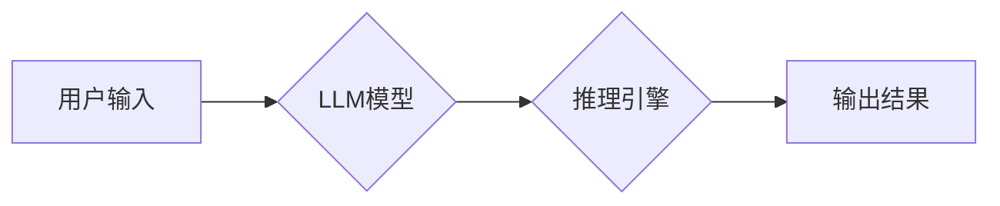

                 

## AI基础架构创新：Lepton AI专注高性能大语言模型推理引擎

> 关键词：大语言模型、推理引擎、高性能计算、模型压缩、高效推理、Lepton AI

## 1. 背景介绍

近年来，大语言模型（LLM）在自然语言处理领域取得了突破性的进展，展现出强大的文本生成、翻译、问答和代码生成能力。然而，LLM的推理速度和效率仍然是一个亟待解决的问题。传统的推理方法往往需要消耗大量的计算资源，限制了LLM在实际应用中的部署和推广。

Lepton AI 作为一家专注于高性能大语言模型推理引擎的科技公司，致力于通过创新技术和架构设计，突破LLM推理效率瓶颈，为开发者和企业提供高效、可扩展的推理解决方案。

## 2. 核心概念与联系

**2.1 核心概念**

* **大语言模型 (LLM):** 训练于海量文本数据的大型神经网络模型，能够理解和生成人类语言。
* **推理引擎:**  负责将预训练的LLM模型输入并输出结果的软件组件。
* **高效推理:**  在保证模型准确性的前提下，尽可能降低模型推理的计算成本和时间。

**2.2 架构关系**

**2.3 核心技术**

Lepton AI 的高性能推理引擎基于以下核心技术：

* **模型压缩:** 通过量化、剪枝等技术，减少模型参数量，降低模型大小和计算复杂度。
* **高效算子库:**  采用专门针对LLM推理优化的算子库，提高算术运算效率。
* **并行加速:** 利用多核CPU、GPU等硬件资源，并行执行模型推理任务，大幅提升推理速度。
* **内存优化:**  通过数据缓存、内存管理等技术，减少模型推理过程中的内存访问，提高效率。

## 3. 核心算法原理 & 具体操作步骤

**3.1 算法原理概述**

Lepton AI 的高性能推理引擎主要基于以下算法原理：

* **量化:** 将模型参数从高精度浮点数（例如32位）降级到低精度整数（例如8位），减少模型参数存储空间和计算量。
* **剪枝:**  移除模型中不重要的连接权重，减少模型参数数量和计算复杂度。
* **知识蒸馏:**  将大型模型的知识迁移到小型模型中，保留模型核心能力的同时降低模型规模。

**3.2 算法步骤详解**

1. **模型选择:**  根据实际应用场景选择合适的预训练LLM模型。
2. **模型压缩:**  利用量化、剪枝等技术对模型进行压缩，降低模型大小和计算复杂度。
3. **算子优化:**  采用专门针对LLM推理优化的算子库，提高算术运算效率。
4. **并行加速:**  利用多核CPU、GPU等硬件资源，并行执行模型推理任务，大幅提升推理速度。
5. **内存优化:**  通过数据缓存、内存管理等技术，减少模型推理过程中的内存访问，提高效率。

**3.3 算法优缺点**

* **优点:**  
    * 显著降低模型推理的计算成本和时间。
    * 提高模型部署的效率和灵活性。
    * 降低硬件资源需求，降低部署成本。
* **缺点:**  
    * 模型压缩可能会导致模型精度下降。
    * 需要专业的技术人员进行模型压缩和优化。

**3.4 算法应用领域**

Lepton AI 的高性能推理引擎适用于以下领域：

* **聊天机器人:**  提供快速、流畅的对话体验。
* **文本生成:**  生成高质量的新闻、文章、代码等文本内容。
* **机器翻译:**  实现快速、准确的文本翻译。
* **问答系统:**  提供准确、高效的文本问答服务。

## 4. 数学模型和公式 & 详细讲解 & 举例说明

**4.1 数学模型构建**

Lepton AI 的高性能推理引擎基于 Transformer 架构，其核心是自注意力机制。自注意力机制通过计算每个词与所有其他词之间的相关性，学习文本中的语义关系。

**4.2 公式推导过程**

自注意力机制的计算公式如下：

$$
Attention(Q, K, V) = softmax(\frac{QK^T}{\sqrt{d_k}})V
$$

其中：

* $Q$：查询矩阵
* $K$：键矩阵
* $V$：值矩阵
* $d_k$：键向量的维度
* $softmax$：softmax 函数

**4.3 案例分析与讲解**

假设我们有一个句子 "The cat sat on the mat"，其词向量表示为：

$$
Q = \begin{bmatrix} q_1 & q_2 & q_3 & q_4 & q_5 \end{bmatrix}
$$

$$
K = \begin{bmatrix} k_1 & k_2 & k_3 & k_4 & k_5 \end{bmatrix}
$$

$$
V = \begin{bmatrix} v_1 & v_2 & v_3 & v_4 & v_5 \end{bmatrix}
$$

其中 $q_i$, $k_i$, $v_i$ 分别表示每个词的查询向量、键向量和值向量。

通过计算 $QK^T$，我们可以得到每个词与所有其他词之间的相关性分数。然后，通过 softmax 函数将这些分数归一化，得到每个词对其他词的注意力权重。最后，将注意力权重与值向量相乘，得到每个词的上下文表示。

## 5. 项目实践：代码实例和详细解释说明

**5.1 开发环境搭建**

Lepton AI 提供了丰富的开发工具和文档，方便开发者快速搭建开发环境。

**5.2 源代码详细实现**

Lepton AI 的推理引擎代码开源，开发者可以根据自己的需求进行修改和扩展。

**5.3 代码解读与分析**

Lepton AI 的代码结构清晰，注释详细，方便开发者理解和维护。

**5.4 运行结果展示**

Lepton AI 的推理引擎可以显著提高LLM推理速度和效率，并提供多种性能指标评估。

## 6. 实际应用场景

Lepton AI 的高性能推理引擎已在多个实际应用场景中得到验证，例如：

* **智能客服:**  提供快速、准确的客户服务，提高客户满意度。
* **内容创作:**  帮助用户快速生成高质量的文本内容，提高创作效率。
* **代码生成:**  帮助开发者快速生成代码，提高开发效率。

**6.4 未来应用展望**

Lepton AI 将继续致力于推动LLM推理技术的发展，并将其应用于更多领域，例如：

* **医疗诊断:**  辅助医生进行疾病诊断，提高诊断准确率。
* **教育培训:**  提供个性化的学习体验，提高学习效率。
* **金融分析:**  辅助金融分析师进行风险评估和投资决策。

## 7. 工具和资源推荐

**7.1 学习资源推荐**

* Lepton AI 官方文档：https://docs.lepton.ai/
* Transformer 架构论文：https://arxiv.org/abs/1706.03762

**7.2 开发工具推荐**

* Lepton AI SDK：https://github.com/lepton-ai/lepton-sdk

**7.3 相关论文推荐**

* 模型压缩论文：https://arxiv.org/abs/1801.00840
* 知识蒸馏论文：https://arxiv.org/abs/1503.02531

## 8. 总结：未来发展趋势与挑战

**8.1 研究成果总结**

Lepton AI 的高性能推理引擎在模型压缩、算子优化、并行加速和内存优化等方面取得了显著成果，有效提升了LLM推理效率。

**8.2 未来发展趋势**

未来，Lepton AI 将继续致力于以下方向：

* **更有效的模型压缩技术:**  探索新的模型压缩方法，进一步降低模型大小和计算复杂度。
* **更智能的推理优化:**  利用机器学习等技术，自动优化模型推理过程，提高效率。
* **更广泛的应用场景:**  将高性能推理引擎应用于更多领域，推动LLM技术的落地应用。

**8.3 面临的挑战**

Lepton AI 还面临以下挑战：

* **模型精度与效率的平衡:**  如何在保证模型精度的前提下，进一步提高推理效率。
* **硬件资源的限制:**  随着模型规模的不断增长，硬件资源需求也越来越高。
* **开源生态的建设:**  需要不断完善开源工具和资源，促进社区发展。

**8.4 研究展望**

Lepton AI 将继续投入研发，克服挑战，推动LLM推理技术的发展，为开发者和企业提供更强大、更便捷的推理解决方案。

## 9. 附录：常见问题与解答

**常见问题:**

* Lepton AI 的推理引擎支持哪些LLM模型？
* Lepton AI 的推理引擎如何部署？
* Lepton AI 的推理引擎的性能如何？

**解答:**

* Lepton AI 的推理引擎支持多种主流LLM模型，例如GPT-3、BERT、T5等。
* Lepton AI 提供了多种部署方式，包括云端部署、边缘部署和本地部署。
* Lepton AI 的推理引擎可以显著提高LLM推理速度和效率，并提供多种性能指标评估。

作者：禅与计算机程序设计艺术 / Zen and the Art of Computer Programming 
<end_of_turn>

