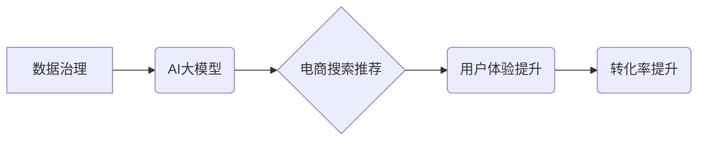

                 

## AI大模型助力电商搜索推荐业务的数据治理能力提升路线图优化方案设计与实现

> 关键词：AI大模型、电商搜索推荐、数据治理、数据质量、模型可解释性、数据安全

## 1. 背景介绍

在当今数据爆炸的时代，电商平台面临着海量商品信息、用户行为数据和市场动态变化的挑战。传统的搜索推荐算法难以有效应对这些挑战，导致用户体验下降、转化率降低。而近年来，随着深度学习技术的飞速发展，AI大模型的出现为电商搜索推荐业务带来了新的机遇。

AI大模型，例如Transformer、BERT等，凭借其强大的语义理解和学习能力，能够从海量数据中挖掘更深层的用户需求和商品特征，从而实现更精准、更个性化的搜索推荐。然而，AI大模型的应用也带来了新的挑战，例如数据质量、模型可解释性、数据安全等。

数据治理是确保数据质量、安全和一致性的关键环节，对于AI大模型的应用至关重要。电商平台需要建立完善的数据治理体系，才能充分发挥AI大模型的潜力，提升搜索推荐业务的数据治理能力。

## 2. 核心概念与联系

### 2.1 数据治理

数据治理是指对数据生命周期进行全面的管理，包括数据质量、数据安全、数据隐私、数据标准化、数据可信度等方面。其目标是确保数据能够被正确、有效地收集、存储、处理和使用。

### 2.2 AI大模型

AI大模型是指在海量数据上训练的深度学习模型，具有强大的泛化能力和学习能力。例如，GPT-3、BERT、LaMDA等都是著名的AI大模型。

### 2.3 电商搜索推荐

电商搜索推荐是指根据用户的搜索行为和历史购买记录，推荐相关商品的业务。传统的搜索推荐算法主要依赖于关键词匹配和协同过滤等技术，而AI大模型能够通过理解用户需求和商品特征，实现更精准、更个性化的推荐。

**数据治理与AI大模型在电商搜索推荐业务中的关系**



数据治理为AI大模型的训练和应用提供高质量的数据，确保模型的准确性和可靠性。AI大模型则通过对数据进行深度学习，提升电商搜索推荐的精准度和个性化程度，最终提升用户体验和转化率。

## 3. 核心算法原理 & 具体操作步骤

### 3.1 算法原理概述

在电商搜索推荐业务中，常用的AI大模型算法包括：

* **Transformer模型:** Transformer模型是一种基于注意力机制的深度学习模型，能够有效捕捉文本序列中的长距离依赖关系，适用于理解用户搜索意图和商品描述。
* **BERT模型:** BERT模型是一种预训练语言模型，通过在大量的文本数据上进行训练，学习了丰富的语言知识，能够理解用户搜索词的语义和上下文信息。
* **协同过滤算法:** 协同过滤算法通过分析用户历史行为和商品购买记录，推荐与用户兴趣相似的商品。

### 3.2 算法步骤详解

以Transformer模型为例，其在电商搜索推荐业务中的具体操作步骤如下：

1. **数据预处理:** 将用户搜索词和商品描述进行清洗、分词、词向量化等预处理操作。
2. **模型训练:** 使用Transformer模型训练，输入预处理后的数据，输出商品推荐结果。
3. **模型评估:** 使用测试数据评估模型的性能，例如准确率、召回率、点击率等指标。
4. **模型部署:** 将训练好的模型部署到线上环境，实时进行商品推荐。

### 3.3 算法优缺点

**Transformer模型的优点:**

* 能够有效捕捉文本序列中的长距离依赖关系。
* 具有强大的语义理解能力。
* 可以进行个性化推荐。

**Transformer模型的缺点:**

* 训练成本高。
* 模型参数量大，部署成本高。
* 对数据质量要求高。

### 3.4 算法应用领域

Transformer模型在电商搜索推荐业务之外，还广泛应用于其他领域，例如：

* 自然语言处理
* 机器翻译
* 文本摘要
* 情感分析

## 4. 数学模型和公式 & 详细讲解 & 举例说明

### 4.1 数学模型构建

Transformer模型的核心是注意力机制，其数学模型可以表示为：

$$
Attention(Q, K, V) = softmax(\frac{QK^T}{\sqrt{d_k}})V
$$

其中：

* $Q$：查询矩阵
* $K$：键矩阵
* $V$：值矩阵
* $d_k$：键向量的维度
* $softmax$：softmax函数

### 4.2 公式推导过程

注意力机制的目的是计算查询向量与键向量的相关性，并根据相关性对值向量进行加权求和。

* $QK^T$：计算查询向量与键向量的点积，得到一个得分矩阵。
* $\frac{QK^T}{\sqrt{d_k}}$：对得分矩阵进行归一化，使得每个元素的范围在0到1之间。
* $softmax$：对归一化后的得分矩阵进行softmax操作，得到每个键向量的权重。
* $V$：使用权重对值向量进行加权求和，得到最终的输出向量。

### 4.3 案例分析与讲解

假设用户搜索了关键词“智能手机”，其查询向量为$Q$。电商平台的商品数据库中包含了大量商品信息，每个商品都有一个键向量$K$和值向量$V$。

通过注意力机制，可以计算出用户搜索词与每个商品键向量的相关性，并根据相关性对商品值向量进行加权求和。最终得到一个商品推荐列表，其中排名靠前的商品与用户搜索词的相关性更高。

## 5. 项目实践：代码实例和详细解释说明

### 5.1 开发环境搭建

* Python 3.7+
* TensorFlow 2.0+
* PyTorch 1.0+
* CUDA Toolkit 10.2+

### 5.2 源代码详细实现

```python
# 导入必要的库
import tensorflow as tf

# 定义Transformer模型
class Transformer(tf.keras.Model):
    def __init__(self, vocab_size, embedding_dim, num_heads, num_layers):
        super(Transformer, self).__init__()
        self.embedding = tf.keras.layers.Embedding(vocab_size, embedding_dim)
        self.transformer_layers = tf.keras.layers.StackedRNNCells([
            tf.keras.layers.MultiHeadAttention(num_heads=num_heads, key_dim=embedding_dim)
            for _ in range(num_layers)
        ])

    def call(self, inputs):
        # 将输入词嵌入到向量空间
        embedded_inputs = self.embedding(inputs)
        # 通过Transformer层进行编码
        encoded_outputs = self.transformer_layers(embedded_inputs)
        return encoded_outputs

# 实例化Transformer模型
model = Transformer(vocab_size=10000, embedding_dim=128, num_heads=8, num_layers=6)

# 训练模型
model.compile(optimizer='adam', loss='mse')
model.fit(x_train, y_train, epochs=10)

# 使用模型进行预测
predictions = model.predict(x_test)
```

### 5.3 代码解读与分析

* 代码首先导入必要的库，然后定义Transformer模型的类。
* 模型的构造函数中，定义了词嵌入层、多头注意力层和堆叠的RNN单元。
* 模型的`call`方法中，将输入词嵌入到向量空间，然后通过Transformer层进行编码，得到最终的输出向量。
* 代码最后实例化了Transformer模型，并使用Adam优化器和均方误差损失函数进行训练。

### 5.4 运行结果展示

训练完成后，可以使用测试数据对模型进行评估，并展示预测结果。

## 6. 实际应用场景

AI大模型在电商搜索推荐业务中的应用场景非常广泛，例如：

* **商品搜索推荐:** 根据用户的搜索词，推荐相关商品。
* **个性化推荐:** 根据用户的历史购买记录和浏览行为，推荐个性化的商品。
* **新品推荐:** 推荐新上市的商品。
* **促销活动推荐:** 推荐正在进行的促销活动。

### 6.4 未来应用展望

未来，AI大模型在电商搜索推荐业务中的应用将更加深入，例如：

* **多模态推荐:** 将文本、图像、视频等多模态数据融合，实现更精准的推荐。
* **实时推荐:** 基于用户的实时行为，进行动态的商品推荐。
* **解释性推荐:** 解释AI模型推荐的原因，提升用户信任度。

## 7. 工具和资源推荐

### 7.1 学习资源推荐

* **书籍:**
    * 《深度学习》
    * 《自然语言处理》
    * 《Transformer模型》
* **在线课程:**
    * Coursera
    * edX
    * Udacity

### 7.2 开发工具推荐

* **TensorFlow:** 开源深度学习框架
* **PyTorch:** 开源深度学习框架
* **HuggingFace:** 提供预训练模型和工具

### 7.3 相关论文推荐

* 《Attention Is All You Need》
* 《BERT: Pre-training of Deep Bidirectional Transformers for Language Understanding》
* 《Transformer-XL: Attentive Language Models Beyond a Fixed-Length Context》

## 8. 总结：未来发展趋势与挑战

### 8.1 研究成果总结

AI大模型在电商搜索推荐业务中取得了显著的成果，例如：

* 提升了推荐精准度和个性化程度。
* 降低了用户搜索成本。
* 提升了用户体验和转化率。

### 8.2 未来发展趋势

未来，AI大模型在电商搜索推荐业务的发展趋势包括：

* **多模态推荐:** 将文本、图像、视频等多模态数据融合，实现更精准的推荐。
* **实时推荐:** 基于用户的实时行为，进行动态的商品推荐。
* **解释性推荐:** 解释AI模型推荐的原因，提升用户信任度。

### 8.3 面临的挑战

AI大模型在电商搜索推荐业务中也面临着一些挑战，例如：

* **数据质量:** AI大模型对数据质量要求高，需要确保数据准确、完整、一致。
* **模型可解释性:** AI模型的决策过程往往难以理解，需要提高模型的可解释性。
* **数据安全:** AI模型训练和应用过程中需要保护用户隐私和数据安全。

### 8.4 研究展望

未来，需要进一步研究以下问题：

* 如何提高AI大模型对低质量数据的鲁棒性。
* 如何设计更可解释的AI模型。
* 如何保障AI模型在电商搜索推荐业务中的数据安全。

## 9. 附录：常见问题与解答

* **Q1: AI大模型的训练成本很高吗？**

A1: 确实，AI大模型的训练成本较高，需要大量的计算资源和时间。

* **Q2: 如何评估AI大模型的性能？**

A2: 可以使用准确率、召回率、点击率等指标来评估AI大模型的性能。

* **Q3: 如何保障AI模型在电商搜索推荐业务中的数据安全？**

A3: 需要采取以下措施保障数据安全：

    * 数据脱敏
    * 加密传输
    * 访问控制


作者：禅与计算机程序设计艺术 / Zen and the Art of Computer Programming 
<end_of_turn>

