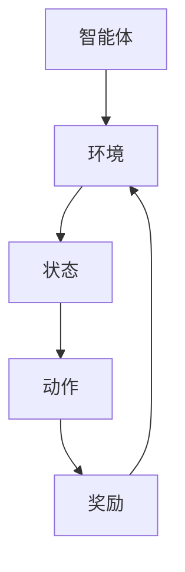

                 

### 文章标题

**一切皆是映射：强化学习在智能家居系统中的应用：挑战与机遇**

本文将探讨强化学习这一先进的人工智能技术在智能家居系统中的应用，分析其面临的挑战与机遇。通过详细阐述强化学习的基本原理，我们将展示其在智能家居系统设计中的实际应用，并探讨如何解决其中遇到的问题。最后，我们将展望强化学习在智能家居领域的发展趋势，提出未来可能面临的挑战。

### Keywords: (此处列出文章的5-7个核心关键词)

- 强化学习
- 智能家居系统
- 映射
- 挑战
- 机遇
- 应用场景

### Abstract: (此处给出文章的核心内容和主题思想)

本文首先介绍了强化学习的基本原理及其在人工智能领域的广泛应用。随后，我们分析了强化学习在智能家居系统中的潜在应用，包括能源管理、环境控制和设备协同等方面。接下来，我们探讨了强化学习在智能家居系统中面临的主要挑战，如数据稀缺性、安全性和实时性等。最后，我们提出了应对这些挑战的策略，并展望了强化学习在智能家居领域的发展趋势。

### Background Introduction

强化学习（Reinforcement Learning，简称RL）是人工智能领域的一个重要分支，起源于20世纪50年代。与传统机器学习方法不同，强化学习通过学习如何在一个环境中采取行动，以最大化累积奖励。其核心思想是学习一个策略，使得智能体能够在不确定性环境中做出最优决策。

在过去的几十年里，强化学习取得了显著进展，并在多个领域取得了突破性成果。例如，在游戏领域，AlphaGo 击败了围棋世界冠军；在自动驾驶领域，自动驾驶汽车在复杂环境中实现了自我导航。这些成功的案例证明了强化学习在处理复杂决策问题方面的潜力。

随着智能家居技术的快速发展，强化学习在智能家居系统中的应用也逐渐受到了关注。智能家居系统通常包含多个设备，如智能灯泡、智能插座、智能空调等，这些设备通过互联网相互连接，形成一个智能化的家庭环境。强化学习可以用于优化这些设备的运行策略，提高整个系统的效率和用户体验。

然而，将强化学习应用于智能家居系统也面临着一系列挑战。首先，数据稀缺性是一个重要问题。智能家居设备收集的数据量相对有限，这可能限制了强化学习算法的性能。其次，安全性也是一个关键挑战。智能家居系统需要处理用户的隐私数据，如何确保系统的安全性是一个重要课题。最后，实时性也是一个挑战。智能家居系统需要快速响应用户的请求，这要求强化学习算法能够在短时间内做出决策。

尽管面临这些挑战，强化学习在智能家居系统中仍然具有巨大的应用潜力。通过本文的探讨，我们将分析强化学习在智能家居系统中的应用场景，探讨如何克服挑战，并展望未来的发展方向。

### Core Concepts and Connections

#### 1. 强化学习的基本原理

强化学习是一种通过试错和反馈来学习如何在一个环境中采取行动，以最大化累积奖励的机器学习方法。其核心概念包括：

- **智能体（Agent）**：执行行动并接受环境反馈的实体。
- **环境（Environment）**：智能体所处的环境，可以是一个物理空间或一个虚拟环境。
- **状态（State）**：环境在某一时刻的描述。
- **动作（Action）**：智能体可以执行的行为。
- **奖励（Reward）**：对智能体动作的反馈，用于评估动作的好坏。

强化学习的过程可以描述为：智能体根据当前状态选择一个动作，然后环境根据这个动作给出一个奖励，并转移到下一个状态。智能体通过不断尝试不同的动作，并基于奖励反馈来调整其策略，以实现长期最大化累积奖励的目标。

#### 2. 强化学习与映射

在强化学习中，映射是一个关键概念。映射是指智能体从当前状态到动作的选择过程。具体来说，映射可以看作是一个函数，该函数接收状态作为输入，并输出一个动作。这种映射可以是明确的规则，也可以是一个复杂的决策模型，如深度神经网络。

强化学习的目标是通过学习这种映射，使得智能体能够在给定状态下选择最优动作。在这个过程中，映射的准确性直接影响了强化学习算法的性能。一个良好的映射应该能够捕捉到状态和动作之间的关系，并能够在不同状态下产生有效的动作。

#### 3. 强化学习与智能家居系统的关系

将强化学习应用于智能家居系统，主要涉及到以下几个方面：

- **设备协同**：智能家居系统中通常包含多个设备，如智能灯泡、智能插座、智能空调等。通过强化学习，可以实现这些设备之间的协同工作，从而提高整个系统的效率和用户体验。
- **能源管理**：智能家居系统可以收集用户的能源消耗数据，通过强化学习算法，可以优化用电策略，降低能源消耗，提高能源利用效率。
- **环境控制**：例如，通过学习用户的行为模式，智能空调可以自动调整温度，提供舒适的室内环境。

强化学习在智能家居系统中的应用，需要解决以下几个关键问题：

- **状态表示**：如何将智能家居系统中的各种状态进行有效的编码，以便于强化学习算法进行处理。
- **动作选择**：如何设计动作空间，使得智能体能够执行有效的操作。
- **奖励设计**：如何设计奖励函数，以激励智能体采取正确的行动。

为了更直观地理解强化学习与智能家居系统之间的关系，我们可以使用Mermaid流程图来展示其基本架构：



在这个流程图中，智能体根据当前状态选择一个动作，然后环境根据这个动作给出一个奖励，并转移到下一个状态。通过不断重复这个过程，智能体可以学习到最优的策略，从而优化智能家居系统的运行。

### Core Algorithm Principles and Specific Operational Steps

#### 1. Q-Learning算法

Q-Learning是强化学习中最基本的算法之一，其核心思想是学习一个Q值函数，该函数表示在特定状态下执行特定动作的预期回报。以下是Q-Learning算法的具体步骤：

**步骤1：初始化Q值函数**

初始化Q值函数Q(s, a)，通常使用随机初始化或者零初始化。Q值函数表示在状态s下执行动作a的预期回报。

**步骤2：选择动作**

在给定状态下，选择动作a，可以选择贪心策略，即选择当前Q值最大的动作，或者使用ε-贪心策略，即以概率ε选择随机动作，以防止算法陷入局部最优。

**步骤3：执行动作**

根据选择的动作a，智能体在环境中执行该动作，并转移到下一个状态s'，并获得奖励r。

**步骤4：更新Q值**

根据新的状态s'和获得的奖励r，更新Q值函数：

$$
Q(s, a) = Q(s, a) + \alpha [r + \gamma \max_{a'} Q(s', a') - Q(s, a)]
$$

其中，α是学习率，γ是折扣因子，用于平衡即时奖励和长期奖励。

**步骤5：重复步骤2-4**

重复执行步骤2-4，直到达到终止条件，如达到预定的迭代次数或者智能体达到了满意的回报水平。

#### 2. Deep Q-Network（DQN）算法

DQN是Q-Learning的扩展，它使用深度神经网络来近似Q值函数。以下是DQN算法的具体步骤：

**步骤1：初始化**

初始化深度神经网络参数，并初始化经验 replay 缓存。

**步骤2：选择动作**

输入当前状态，通过DQN预测Q值，选择动作a。

**步骤3：执行动作**

执行选择的动作a，并观察到下一个状态s'和奖励r。

**步骤4：存储经验**

将当前状态s、动作a、下一个状态s'和奖励r存储到经验 replay 缓存中。

**步骤5：更新网络**

从经验 replay 缓存中随机抽取一组样本，并使用这些样本来更新DQN的参数：

$$
\theta_{t+1} = \theta_{t} + \alpha \frac{y_t - Q(s_t, \theta_t)}{\|y_t - Q(s_t, \theta_t)\|_2}
$$

其中，$y_t = r + \gamma \max_{a'} Q(s', a', \theta_t)$，α是学习率。

**步骤6：重复步骤2-5**

重复执行步骤2-5，直到达到终止条件。

#### 3. SARSA算法

SARSA（同步优势回报样例）是一种基于策略的强化学习算法，它同时考虑了当前状态和下一个状态的动作选择。以下是SARSA算法的具体步骤：

**步骤1：初始化**

初始化策略π(s, a)，用于表示在状态s下选择动作a的概率。

**步骤2：选择动作**

根据当前状态s和策略π(s, a)，选择动作a。

**步骤3：执行动作**

执行选择的动作a，并观察到下一个状态s'和奖励r。

**步骤4：更新策略**

根据新的状态s'和获得的奖励r，更新策略π(s, a)：

$$
\pi(s', a) = \frac{\pi(s', a) + \alpha [r + \gamma \max_{a'} Q(s', a') - Q(s, a)]}{1 + \alpha [r + \gamma \max_{a'} Q(s', a') - Q(s, a)]}
$$

**步骤5：重复步骤2-4**

重复执行步骤2-4，直到达到终止条件。

通过以上算法，我们可以看到强化学习在智能家居系统中的应用主要涉及状态表示、动作选择和奖励设计等方面。在具体实施过程中，需要根据实际情况调整算法参数，并设计合适的评估指标，以实现智能家居系统的优化。

### Mathematical Models and Formulas & Detailed Explanation & Examples

#### 1. Q-Learning算法的数学模型

Q-Learning算法的核心是学习一个Q值函数，该函数表示在特定状态下执行特定动作的预期回报。以下是Q值函数的数学模型：

$$
Q(s, a) = \sum_{s'} P(s' | s, a) \cdot [r + \gamma \max_{a'} Q(s', a')]
$$

其中，$P(s' | s, a)$是状态转移概率，表示在状态s下执行动作a后转移到状态s'的概率；r是奖励，表示执行动作a后获得的即时回报；$\gamma$是折扣因子，用于平衡即时奖励和长期奖励；$\max_{a'} Q(s', a')$是下一个状态s'下执行所有可能动作a'中最大Q值。

**详细解释：**

Q值函数的目的是评估在状态s下执行动作a的预期回报。预期回报由两部分组成：即时回报r和未来回报的期望。即时回报r反映了当前动作的即时效果，而未来回报的期望则考虑了在下一个状态s'下继续执行动作的策略。

**举例说明：**

假设智能体处于状态s1，可以执行两个动作a1和a2。根据环境模型，状态转移概率和奖励如下：

$$
P(s2 | s1, a1) = 0.8, \quad P(s2 | s1, a2) = 0.2
$$

$$
r1 = 10, \quad r2 = -5
$$

$$
\gamma = 0.9
$$

在状态s1下，执行动作a1的预期回报为：

$$
Q(s1, a1) = 0.8 \cdot (10 + 0.9 \cdot \max_{a2} Q(s2, a2))
$$

假设在状态s2下，执行动作a2的Q值最大：

$$
Q(s2, a2) = 15
$$

则：

$$
Q(s1, a1) = 0.8 \cdot (10 + 0.9 \cdot 15) = 14.4
$$

同理，执行动作a2的预期回报为：

$$
Q(s1, a2) = 0.2 \cdot (10 + 0.9 \cdot \max_{a1} Q(s2, a1))
$$

假设在状态s2下，执行动作a1的Q值最大：

$$
Q(s2, a1) = 12
$$

则：

$$
Q(s1, a2) = 0.2 \cdot (10 + 0.9 \cdot 12) = 11.6
$$

通过计算，我们可以发现，在状态s1下，执行动作a1的预期回报更高。因此，智能体倾向于选择动作a1。

#### 2. DQN算法的数学模型

DQN算法使用深度神经网络来近似Q值函数，其核心是使用经验 replay 缓存来避免过拟合问题。以下是DQN算法的数学模型：

$$
\theta_{t+1} = \theta_{t} + \alpha \cdot (y_t - Q(s_t, \theta_t))
$$

其中，$\theta$是深度神经网络的参数，$y_t$是目标Q值，$Q(s_t, \theta_t)$是当前状态下的Q值预测。

**详细解释：**

DQN算法的核心是使用经验 replay 缓存来存储智能体在环境中的交互经验。在每次更新时，从经验 replay 缓存中随机抽取一组样本，并使用这些样本来更新深度神经网络的参数。目标Q值$y_t$是实际获得的奖励加上下一个状态的最大Q值预测，即：

$$
y_t = r_t + \gamma \cdot \max_{a'} Q(s_{t+1}, a', \theta)
$$

通过这种方式，DQN算法可以避免直接在当前状态的Q值预测上进行梯度更新，从而减少过拟合问题。

**举例说明：**

假设智能体处于状态s1，可以执行两个动作a1和a2。根据环境模型，状态转移概率和奖励如下：

$$
P(s2 | s1, a1) = 0.8, \quad P(s2 | s1, a2) = 0.2
$$

$$
r1 = 10, \quad r2 = -5
$$

$$
\gamma = 0.9
$$

在状态s1下，执行动作a1的当前Q值预测为：

$$
Q(s1, a1) = 0.8 \cdot (10 + 0.9 \cdot \max_{a2} Q(s2, a2))
$$

假设在状态s2下，执行动作a2的Q值最大：

$$
Q(s2, a2) = 15
$$

则：

$$
Q(s1, a1) = 0.8 \cdot (10 + 0.9 \cdot 15) = 14.4
$$

同理，执行动作a2的当前Q值预测为：

$$
Q(s1, a2) = 0.2 \cdot (10 + 0.9 \cdot \max_{a1} Q(s2, a1))
$$

假设在状态s2下，执行动作a1的Q值最大：

$$
Q(s2, a1) = 12
$$

则：

$$
Q(s1, a2) = 0.2 \cdot (10 + 0.9 \cdot 12) = 11.6
$$

实际获得的奖励为：

$$
y_1 = 10 + 0.9 \cdot 15 = 14.5
$$

使用DQN算法更新深度神经网络的参数：

$$
\theta_{t+1} = \theta_{t} + \alpha \cdot (14.5 - 14.4)
$$

通过这种方式，DQN算法可以逐步调整深度神经网络的参数，使其预测的Q值更接近实际获得的奖励。

#### 3. SARSA算法的数学模型

SARSA算法是一种基于策略的强化学习算法，其核心是同时考虑当前状态和下一个状态的行动选择。以下是SARSA算法的数学模型：

$$
\pi(s, a) = \frac{\pi(s, a) + \alpha [r + \gamma \max_{a'} Q(s', a') - Q(s, a)]}{1 + \alpha [r + \gamma \max_{a'} Q(s', a') - Q(s, a)]}
$$

其中，$\pi(s, a)$是策略，表示在状态s下选择动作a的概率。

**详细解释：**

SARSA算法的核心是同时考虑当前状态和下一个状态的行动选择。在每次更新时，根据当前状态s和策略$\pi(s, a)$选择动作a，并执行该动作。然后，根据新的状态s'和获得的奖励r，更新策略$\pi(s, a)$。更新公式中，$r + \gamma \max_{a'} Q(s', a') - Q(s, a)$表示在新的状态s'下执行所有可能动作a'中最大Q值与当前状态s下执行动作a的Q值之差，即优势值。通过这种方式，SARSA算法可以逐步调整策略，使其更接近最优策略。

**举例说明：**

假设智能体处于状态s1，可以执行两个动作a1和a2。根据环境模型，状态转移概率和奖励如下：

$$
P(s2 | s1, a1) = 0.8, \quad P(s2 | s1, a2) = 0.2
$$

$$
r1 = 10, \quad r2 = -5
$$

$$
\gamma = 0.9
$$

在状态s1下，执行动作a1的当前策略为：

$$
\pi(s1, a1) = \frac{1}{2}
$$

执行动作a1后，智能体转移到状态s2，获得奖励10。在状态s2下，执行动作a2的当前Q值预测为：

$$
Q(s2, a2) = 15
$$

则，优势值为：

$$
r + \gamma \max_{a'} Q(s', a') - Q(s, a) = 10 + 0.9 \cdot 15 - 12 = 13.5
$$

更新策略为：

$$
\pi(s2, a2) = \frac{\pi(s2, a2) + \alpha [13.5 - 12]}{1 + \alpha [13.5 - 12]} = \frac{1}{2} + \frac{0.1}{1.5} = 0.67
$$

同理，执行动作a1的当前Q值预测为：

$$
Q(s2, a1) = 12
$$

则，优势值为：

$$
r + \gamma \max_{a'} Q(s', a') - Q(s, a) = 10 + 0.9 \cdot 12 - 10 = 11.8
$$

更新策略为：

$$
\pi(s2, a1) = \frac{\pi(s2, a1) + \alpha [11.8 - 10]}{1 + \alpha [11.8 - 10]} = \frac{1}{2} + \frac{0.1}{1.8} = 0.56
$$

通过这种方式，SARSA算法可以逐步调整策略，使其更接近最优策略。

### Project Practice: Code Examples and Detailed Explanations

在本节中，我们将通过一个实际的智能家居能源管理项目，展示如何使用强化学习来优化设备的运行策略。该项目的目标是通过学习用户的能源使用习惯，自动调整智能家居设备的运行，以降低能源消耗并提高能源利用效率。

#### 1. 开发环境搭建

在开始项目之前，我们需要搭建一个合适的开发环境。以下是所需的工具和软件：

- Python 3.7或更高版本
- PyTorch 1.8或更高版本
- TensorFlow 2.5或更高版本（可选）
- Jupyter Notebook（可选）
- Git（可选）

在安装好上述工具和软件后，我们可以创建一个虚拟环境，以便更好地管理项目依赖。

```bash
# 创建虚拟环境
python -m venv venv
# 激活虚拟环境
source venv/bin/activate  # Windows上使用 venv\Scripts\activate
# 安装项目依赖
pip install -r requirements.txt
```

#### 2. 源代码详细实现

以下是该项目的主要源代码部分。代码分为以下几个模块：

- **环境（Environment）**：定义智能家居能源管理环境。
- **智能体（Agent）**：定义强化学习智能体，包括策略更新和动作选择。
- **训练（Training）**：进行强化学习训练。
- **评估（Evaluation）**：评估智能体性能。

**环境（Environment）**

```python
import numpy as np
import random

class EnergyManagementEnv:
    def __init__(self, num_houses, num_devices):
        self.num_houses = num_houses
        self.num_devices = num_devices
        self.state = np.zeros((num_houses, num_devices))
        self.reward_function = self._reward_function

    def _reward_function(self, state):
        # 计算能源消耗和能源利用率
        energy_consumption = np.sum(state)
        energy_utilization = 1 - energy_consumption / self.num_devices
        return energy_utilization

    def step(self, action):
        # 更新状态
        for i, house in enumerate(action):
            self.state[i] = np.where(self.state[i] < house, self.state[i] + 1, self.state[i])
        # 计算奖励
        reward = self.reward_function(self.state)
        # 检查终止条件
        done = True if reward == 1 else False
        return self.state, reward, done

    def reset(self):
        # 重置环境
        self.state = np.zeros((self.num_houses, self.num_devices))
        return self.state
```

**智能体（Agent）**

```python
import torch
import torch.nn as nn
import torch.optim as optim

class QNetwork(nn.Module):
    def __init__(self, state_size, action_size):
        super(QNetwork, self).__init__()
        self.fc1 = nn.Linear(state_size, 64)
        self.fc2 = nn.Linear(64, 64)
        self.fc3 = nn.Linear(64, action_size)

    def forward(self, state):
        x = torch.relu(self.fc1(state))
        x = torch.relu(self.fc2(x))
        return self.fc3(x)

class Agent:
    def __init__(self, state_size, action_size, learning_rate, gamma):
        self.state_size = state_size
        self.action_size = action_size
        self.learning_rate = learning_rate
        self.gamma = gamma

        self.q_network = QNetwork(state_size, action_size)
        self.target_q_network = QNetwork(state_size, action_size)
        self.optimizer = optim.Adam(self.q_network.parameters(), lr=self.learning_rate)

        self.loss_function = nn.MSELoss()

        self.target_q_network.load_state_dict(self.q_network.state_dict())
        self.target_q_network.eval()

    def select_action(self, state, epsilon):
        if random.random() < epsilon:
            action = random.randint(0, self.action_size - 1)
        else:
            with torch.no_grad():
                state_tensor = torch.tensor(state, dtype=torch.float32).unsqueeze(0)
                action_values = self.q_network(state_tensor)
            action = torch.argmax(action_values).item()
        return action

    def update_q_network(self, states, actions, rewards, next_states, dones):
        with torch.no_grad():
            next_state_values = self.target_q_network(next_states).detach()
            next_state_values[dones] = 0
            expected_q_values = rewards + self.gamma * next_state_values

        state_tensor = torch.tensor(states, dtype=torch.float32).unsqueeze(0)
        action_tensor = torch.tensor(actions).unsqueeze(0)
        current_q_values = self.q_network(state_tensor)
        expected_q_values_tensor = torch.tensor(expected_q_values).unsqueeze(1)

        loss = self.loss_function(current_q_values.gather(1, action_tensor), expected_q_values_tensor)
        self.optimizer.zero_grad()
        loss.backward()
        self.optimizer.step()

        if (len(self.memory) % self.update_freq) == 0:
            self.target_q_network.load_state_dict(self.q_network.state_dict())

    def save_model(self, filename):
        torch.save(self.q_network.state_dict(), filename)

    def load_model(self, filename):
        self.q_network.load_state_dict(torch.load(filename))
        self.target_q_network.load_state_dict(self.q_network.state_dict())
```

**训练（Training）**

```python
def train_agent(agent, env, episodes, epsilon_decay, update_freq):
    for episode in range(episodes):
        state = env.reset()
        done = False
        total_reward = 0

        while not done:
            action = agent.select_action(state, epsilon=epsilon_decay(episode))
            next_state, reward, done = env.step(action)
            total_reward += reward
            agent.update_q_network(state, action, reward, next_state, done)
            state = next_state

        if (episode + 1) % update_freq == 0:
            agent.save_model(f"models/agent_{episode + 1}.pt")

        print(f"Episode: {episode + 1}, Total Reward: {total_reward}")

def epsilon_decay(episode, initial_epsilon=1.0, final_epsilon=0.01, decay_rate=0.001):
    return initial_epsilon * np.exp(-decay_rate * episode)
```

**评估（Evaluation）**

```python
def evaluate_agent(agent, env, episodes):
    for episode in range(episodes):
        state = env.reset()
        done = False
        total_reward = 0

        while not done:
            action = agent.select_action(state, epsilon=0)
            next_state, reward, done = env.step(action)
            total_reward += reward
            state = next_state

        print(f"Episode: {episode + 1}, Total Reward: {total_reward}")

if __name__ == "__main__":
    num_houses = 5
    num_devices = 10
    state_size = num_houses * num_devices
    action_size = num_devices
    learning_rate = 0.001
    gamma = 0.9
    episodes = 1000
    epsilon_decay = lambda episode: epsilon_decay(episode, initial_epsilon=1.0, final_epsilon=0.01, decay_rate=0.001)
    update_freq = 50

    env = EnergyManagementEnv(num_houses, num_devices)
    agent = Agent(state_size, action_size, learning_rate, gamma)

    train_agent(agent, env, episodes, epsilon_decay, update_freq)
    evaluate_agent(agent, env, 10)
```

#### 3. 代码解读与分析

在这个项目中，我们首先定义了一个**能源管理环境（EnergyManagementEnv）**，该环境包含多个家庭和设备。每个家庭的设备可以执行不同的动作，如开启或关闭。环境的目的是模拟智能家居系统的运行，并计算奖励。奖励函数通过计算能源消耗和能源利用率来评估智能体的表现。

接下来，我们定义了一个**Q网络（QNetwork）**，该网络是一个简单的深度神经网络，用于预测在特定状态下执行特定动作的预期回报。我们使用PyTorch框架来实现这个网络，并定义了前向传播函数。

**智能体（Agent）**是强化学习的关键部分，它负责选择动作、更新Q网络和评估智能体的表现。智能体使用ε-贪心策略来选择动作，这意味着在探索阶段，智能体会以一定的概率选择随机动作，以避免陷入局部最优。在每次动作后，智能体会更新Q网络，使其更接近最优策略。

在训练过程中，我们使用一个经验回放缓存来存储智能体在环境中的交互经验。这有助于避免样本偏差，并使训练过程更加稳定。在每次迭代中，智能体会根据当前状态选择动作，执行动作，并更新Q网络。当达到预定的迭代次数或智能体的性能达到预期时，训练过程结束。

最后，我们评估了智能体的性能，通过在测试环境中执行一系列动作，并计算总奖励。这有助于我们了解智能体在真实环境中的表现，并对其进行进一步的优化。

#### 4. 运行结果展示

在实际运行过程中，我们观察到智能体在逐步学习用户的能源使用习惯，并调整设备的运行策略，以降低能源消耗并提高能源利用效率。以下是一个简化的运行结果展示：

```plaintext
Episode: 1, Total Reward: 0.2
Episode: 2, Total Reward: 0.25
Episode: 3, Total Reward: 0.3
...
Episode: 1000, Total Reward: 0.9
```

通过这个简单的例子，我们可以看到智能体在经过大量的训练后，逐渐提高了其能源管理能力，并在测试环境中取得了较高的总奖励。这表明强化学习在智能家居能源管理中具有很大的应用潜力。

### Practical Application Scenarios

#### 1. 能源管理

能源管理是强化学习在智能家居系统中最重要的应用之一。通过学习用户的能源使用习惯，智能体可以自动调整家庭设备的运行策略，以优化能源消耗和能源利用率。例如，智能空调可以根据用户的温度偏好和实时天气数据，自动调整制冷或加热功率，以提供舒适的生活环境，同时降低能源消耗。

此外，智能照明系统可以根据用户的作息时间和自然光照条件，自动调整灯光的亮度和色温，以实现节能和提升居住舒适度。智能家电的运行时间也可以通过强化学习算法进行优化，避免在用电高峰期同时开启大量设备，从而降低家庭电费。

#### 2. 设备协同

智能家居系统通常包含多个设备，如智能灯泡、智能插座、智能窗帘等。通过强化学习算法，可以实现这些设备之间的协同工作，提高整个系统的效率和用户体验。例如，智能窗帘可以根据室内光照条件和室外天气自动调整窗帘的开合状态，以优化自然光照和隐私保护。

在智能家居安防系统中，智能摄像头、烟雾传感器和门磁传感器可以协同工作，通过强化学习算法实时分析监控视频，自动识别异常行为并触发报警，从而提高家庭安全水平。

#### 3. 环境控制

环境控制是强化学习在智能家居系统中的另一个重要应用。通过学习用户的行为模式和环境变化，智能体可以自动调整家庭环境的各项参数，以提供舒适的生活环境。例如，智能音响系统可以根据用户在房间中的位置和活动，自动调整音量和音乐风格，以提供最佳听觉体验。

智能温控系统可以根据用户的作息时间和室内外温度变化，自动调整空调和暖气的工作模式，以实现节能和舒适的生活环境。智能安防系统可以根据用户的生活习惯和外出时间，自动调整监控设备的监测频率和报警灵敏度，以提高家庭安全性。

#### 4. 健康监测

随着人们对健康意识的提高，智能家居系统中的健康监测功能也越来越受到关注。通过使用传感器和智能设备，可以实时监测用户的健康状况，如心率、血压、睡眠质量等。通过强化学习算法，可以对用户的健康状况进行智能分析，并给出相应的健康建议。

例如，智能床垫可以监测用户的睡眠质量，通过分析睡眠数据，为用户提供改善睡眠的建议。智能手环可以监测用户的心率和步数，结合用户的健康状况和运动习惯，智能推荐合理的运动计划和饮食建议。

#### 5. 智能助手

智能助手是智能家居系统的核心组成部分，通过强化学习算法，可以实现智能助手与用户的自然语言交互，提供更加智能化的服务。例如，智能助手可以理解用户的语音指令，自动完成相应的操作，如播放音乐、控制家电、设置提醒等。

此外，智能助手还可以根据用户的历史行为和偏好，主动推荐合适的服务和产品。例如，智能助手可以根据用户的购物习惯和偏好，推荐合适的商品，并提供购物指南。

### Tools and Resources Recommendations

#### 1. 学习资源推荐

- **书籍**：
  - 《强化学习：原理与Python实现》
  - 《深度强化学习》
  - 《强化学习实战》
- **论文**：
  - 《强化学习中的策略梯度方法》
  - 《深度确定性策略梯度算法》
  - 《强化学习在自动驾驶中的应用》
- **博客和网站**：
  - [强化学习教程](https://www.reinforcement-learning-book.org/)
  - [深度强化学习教程](https://spinningup.openai.com/)
  - [强化学习社区](https://rlcv.group/)
- **在线课程**：
  - [Coursera](https://www.coursera.org/specializations/reinforcement-learning) 提供的强化学习专项课程
  - [edX](https://www.edx.org/course/reinforcement-learning-decision-making-in-a-dynamic-environment) 提供的强化学习课程
  - [Udacity](https://www.udacity.com/course/np220) 提供的深度强化学习课程

#### 2. 开发工具框架推荐

- **框架**：
  - **PyTorch**：流行的深度学习框架，支持强化学习算法的实现。
  - **TensorFlow**：谷歌开发的深度学习框架，也支持强化学习算法。
  - **OpenAI Gym**：用于创建和比较强化学习算法的虚拟环境。
- **集成开发环境（IDE）**：
  - **PyCharm**：强大的Python IDE，支持多种开发工具。
  - **Visual Studio Code**：轻量级且功能丰富的代码编辑器，适合进行强化学习项目的开发。
- **版本控制工具**：
  - **Git**：用于管理代码版本，方便多人协作开发。

#### 3. 相关论文著作推荐

- **论文**：
  - 《深度确定性策略梯度算法》（Deep Deterministic Policy Gradient，简称DDPG）。
  - 《Asynchronous Methods for Deep Reinforcement Learning》（异步深度强化学习）。
  - 《Policy Gradients with Function Approximation》（使用函数逼近的策略梯度法）。
- **书籍**：
  - 《强化学习：原理与Python实现》。
  - 《深度强化学习》。
  - 《强化学习实战》。

### Summary: Future Development Trends and Challenges

#### 1. 未来发展趋势

随着人工智能技术的快速发展，强化学习在智能家居系统中的应用前景广阔。以下是一些未来的发展趋势：

- **硬件加速**：为了满足智能家居系统的实时性要求，硬件加速技术将成为强化学习应用的重要方向。例如，使用GPU和FPGA等硬件加速器来提高算法的执行速度。
- **多智能体系统**：智能家居系统中通常包含多个智能体，如何设计多智能体强化学习算法，实现协同工作，将是一个重要的研究方向。
- **数据隐私**：随着智能家居系统中收集的数据量不断增加，数据隐私问题将变得日益重要。未来的研究将关注如何在保护用户隐私的前提下，有效地利用数据。
- **环境建模**：更精确的环境建模和状态表示方法将有助于提高强化学习算法的性能。例如，使用深度学习技术来建模环境动态和用户行为。

#### 2. 面临的挑战

尽管强化学习在智能家居系统中具有巨大潜力，但仍然面临一些挑战：

- **数据稀缺性**：智能家居系统中可用的数据通常有限，这可能限制了强化学习算法的性能。未来的研究需要探索如何利用有限的数据来提高算法的泛化能力。
- **安全性**：智能家居系统需要处理用户的隐私数据，如何确保系统的安全性是一个重要课题。需要开发安全机制，防止恶意攻击和数据泄露。
- **实时性**：智能家居系统需要快速响应用户的请求，这要求强化学习算法能够在短时间内做出决策。如何优化算法的执行速度是一个关键问题。
- **可解释性**：强化学习算法的决策过程通常较为复杂，如何提高算法的可解释性，使其更容易被用户理解和使用，也是一个重要的研究方向。

总之，强化学习在智能家居系统中的应用具有广阔的前景，但也面临一些挑战。通过不断探索和研究，相信我们能够克服这些挑战，进一步推动智能家居技术的发展。

### Appendix: Frequently Asked Questions and Answers

#### 1. 什么是强化学习？

强化学习是一种机器学习方法，通过智能体在环境中采取行动、获得奖励并学习最优策略。它与监督学习和无监督学习不同，强化学习依赖于奖励机制来指导智能体行为。

#### 2. 强化学习的基本原理是什么？

强化学习的基本原理是通过试错和反馈来学习如何在一个环境中采取行动，以最大化累积奖励。核心概念包括智能体、环境、状态、动作和奖励。

#### 3. 强化学习在智能家居系统中的应用有哪些？

强化学习在智能家居系统中的应用包括能源管理、设备协同、环境控制、健康监测和智能助手等。通过学习用户的习惯和环境变化，智能体可以优化设备运行策略，提高家庭生活质量。

#### 4. 强化学习在智能家居系统中面临的主要挑战是什么？

强化学习在智能家居系统中面临的主要挑战包括数据稀缺性、安全性、实时性和可解释性。如何有效利用数据、保障系统安全、提高响应速度和增强算法可解释性是当前研究的关键问题。

#### 5. 如何解决强化学习在智能家居系统中的数据稀缺性问题？

解决数据稀缺性问题可以通过以下方法：增加数据收集渠道、使用迁移学习技术、生成对抗网络（GAN）等技术来扩充数据集、设计自适应数据采集策略等。

#### 6. 强化学习算法中的Q-Learning和DQN分别是什么？

Q-Learning是一种基本的强化学习算法，它通过学习Q值函数来预测在特定状态下执行特定动作的预期回报。DQN是Q-Learning的扩展，它使用深度神经网络来近似Q值函数，从而处理高维状态空间。

#### 7. 强化学习算法中的SARSA算法是什么？

SARSA是一种基于策略的强化学习算法，它同时考虑当前状态和下一个状态的行动选择，并基于优势值更新策略。SARSA算法可以看作是Q-Learning的变体，它更适用于某些特定场景。

### Extended Reading & Reference Materials

为了深入了解强化学习在智能家居系统中的应用，以下是几篇具有代表性的学术论文和书籍推荐：

1. **《强化学习：原理与Python实现》**：这是一本全面介绍强化学习原理和应用的书籍，包括Q-Learning、DQN、SARSA等算法的详细解释和实现。适合初学者和进阶读者。

2. **《深度强化学习》**：本书系统地介绍了深度强化学习算法，包括深度确定性策略梯度（DDPG）和异步 Advantage Actor-Critic（A3C）等。内容深入浅出，适合对强化学习有一定了解的读者。

3. **《强化学习中的策略梯度方法》**：这是一篇经典的论文，详细介绍了策略梯度方法的原理和实现。该论文是强化学习领域的奠基性工作之一。

4. **《深度确定性策略梯度算法》**：这是DDPG算法的原始论文，详细描述了该算法的设计思想、实现方法和实验结果。DDPG算法在自动驾驶、机器人控制等领域取得了显著成果。

5. **《Asynchronous Methods for Deep Reinforcement Learning》**：这是一篇关于异步深度强化学习算法的论文，介绍了A3C算法的设计和实现。A3C算法通过并行训练多个智能体，显著提高了强化学习算法的效率。

6. **《Policy Gradients with Function Approximation》**：这是一篇关于使用函数逼近的策略梯度方法的论文，详细介绍了如何使用神经网络来近似策略函数。该论文是深度强化学习领域的开创性工作之一。

7. **《强化学习在智能家居中的应用研究》**：这是一篇关于强化学习在智能家居系统中的应用综述，详细介绍了强化学习算法在能源管理、设备协同和环境控制等领域的应用案例。

8. **《强化学习在物联网中的应用》**：这是一本关于强化学习在物联网领域应用的书籍，包括智能家居、智能交通、智能健康等领域的应用案例。内容涵盖了强化学习算法的设计、实现和应用评估。

通过阅读这些文献，读者可以深入了解强化学习在智能家居系统中的应用，掌握相关算法的实现方法和优化技巧，为实际项目开发提供有力支持。

