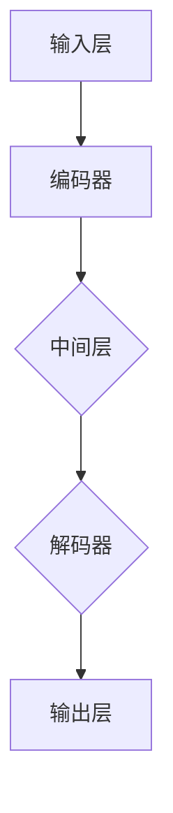
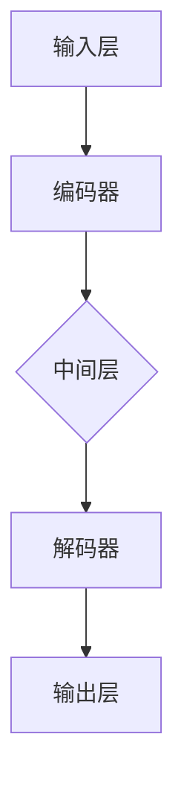

                 

# 文章标题

上手你的第一个链：LLM Chain

关键词：LLM Chain、大语言模型、提示工程、架构设计、数学模型、项目实践、应用场景、工具推荐

摘要：
本文将深入探讨如何上手构建你的第一个大型语言模型（LLM）链。我们将首先介绍大语言模型的基础知识，然后逐步讲解LLM链的核心概念与联系，包括提示词工程的重要性及其与传统编程的关系。接下来，我们将详细解析核心算法原理和具体操作步骤，并通过数学模型和公式进行详细讲解和举例说明。随后，我们将通过一个实际的项目实践来展示如何开发、实现和运行一个LLM链。最后，我们将讨论LLM链在实际应用场景中的广泛用途，并提供一系列学习资源和开发工具框架的推荐。文章将总结未来发展趋势与挑战，并附录常见问题与解答。

## 1. 背景介绍（Background Introduction）

大型语言模型（Large Language Model，简称LLM）是近年来自然语言处理（NLP）领域的重要突破之一。LLM通过深度学习技术，能够理解、生成和操纵自然语言，从而在各个领域展现出强大的潜力。例如，LLM在文本生成、机器翻译、问答系统、对话系统等方面取得了显著的成果。

然而，构建一个高性能、可扩展的LLM链并非易事。LLM链是指一系列LLM模型的组合，每个模型负责处理输入数据的特定部分，最终生成期望的输出结果。这种架构设计能够充分利用各个模型的优势，提高整体系统的性能和准确性。

本文旨在帮助读者了解LLM链的基本原理和构建方法，掌握提示词工程的关键技巧，并学会如何在实际项目中应用和优化LLM链。我们将结合具体案例，深入讲解LLM链的开发流程，帮助读者快速上手并实践。

## 2. 核心概念与联系（Core Concepts and Connections）

### 2.1 什么是LLM链？

LLM链是由多个LLM模型组成的序列，每个模型在输入和输出之间进行转换，从而实现对复杂任务的求解。LLM链的基本架构包括以下几个部分：

1. **输入层**：接收外部输入，如文本、图像、语音等。
2. **编码器**：对输入数据进行编码，将其转换为向量表示。
3. **中间层**：由多个LLM模型组成，每个模型负责处理输入数据的特定部分。
4. **解码器**：将中间层的输出解码为人类可理解的结果，如文本、图像等。
5. **输出层**：生成最终输出结果。

### 2.2 提示词工程的重要性

提示词工程是LLM链的核心环节之一。提示词是指输入给LLM的文本信息，用于引导模型生成期望的输出。一个精心设计的提示词能够提高LLM链的生成质量、准确性和一致性。提示词工程的关键包括：

1. **明确目标**：明确希望模型生成的内容类型和风格。
2. **设计输入**：设计符合目标要求的输入数据，包括文本、图像、音频等。
3. **优化提示**：通过调整提示词的长度、内容、格式等，优化模型生成结果。
4. **反馈与迭代**：根据模型生成的结果，不断调整和优化提示词，以提高模型性能。

### 2.3 提示词工程与传统编程的关系

提示词工程可以被视为一种新型的编程范式，与传统编程有显著不同。在传统编程中，开发者使用代码和逻辑来控制程序的执行。而在提示词工程中，开发者使用自然语言与模型进行交互，指导模型生成期望的输出。

尽管提示词工程与传统编程有本质区别，但两者之间也存在一些相似之处。例如，在设计提示词时，也需要考虑输入、中间过程和输出，遵循模块化、层次化等原则。同时，提示词工程还需要具备一定的数学和统计知识，以便理解和优化模型生成结果。

### 2.4 Mermaid 流程图

下面是一个简单的Mermaid流程图，展示了LLM链的基本架构：



在这个流程图中，输入层接收外部输入，编码器对输入数据进行编码，中间层由多个LLM模型组成，解码器将中间层的输出解码为人类可理解的结果，输出层生成最终输出结果。

## 3. 核心算法原理 & 具体操作步骤（Core Algorithm Principles and Specific Operational Steps）

### 3.1 LLM链的基本原理

LLM链的核心算法是基于深度学习技术，特别是基于Transformer架构。Transformer模型是一种基于自注意力机制的序列模型，能够在处理长序列时保持较好的性能。LLM链通过多个Transformer模型的组合，实现对复杂任务的求解。

具体来说，LLM链的基本原理包括以下几个步骤：

1. **输入预处理**：对输入数据进行预处理，包括文本清洗、分词、编码等。
2. **编码**：使用编码器将预处理后的输入数据编码为向量表示。
3. **中间层处理**：对编码后的向量进行多级处理，每个处理步骤使用一个LLM模型。
4. **解码**：使用解码器将中间层的输出解码为人类可理解的结果。
5. **输出生成**：根据解码器的输出，生成最终的输出结果。

### 3.2 具体操作步骤

下面是一个简单的LLM链操作步骤的示例：

1. **输入预处理**：
   - 输入文本：“今天天气怎么样？”
   - 预处理步骤：文本清洗、分词、编码等。
   - 输出：编码后的向量表示。

2. **编码**：
   - 使用编码器对输入向量进行编码。
   - 输出：编码后的序列表示。

3. **中间层处理**：
   - 第一个LLM模型：对编码后的序列进行处理，生成中间结果。
   - 输出：中间结果向量。

4. **解码**：
   - 使用解码器将中间结果向量解码为文本。
   - 输出：中间结果文本。

5. **输出生成**：
   - 根据解码器的输出，生成最终的输出结果。
   - 输出：输出文本：“今天天气晴朗。”

### 3.3 实际应用案例

以一个简单的问答系统为例，展示LLM链的具体操作步骤：

1. **输入预处理**：
   - 输入文本：“什么是量子计算？”
   - 预处理步骤：文本清洗、分词、编码等。
   - 输出：编码后的向量表示。

2. **编码**：
   - 使用编码器对输入向量进行编码。
   - 输出：编码后的序列表示。

3. **中间层处理**：
   - 第一个LLM模型：对编码后的序列进行处理，生成中间结果。
   - 输出：中间结果向量。

4. **解码**：
   - 使用解码器将中间结果向量解码为文本。
   - 输出：中间结果文本：“量子计算是一种利用量子力学原理进行计算的技术。”

5. **输出生成**：
   - 根据解码器的输出，生成最终的输出结果。
   - 输出：输出文本：“量子计算是一种利用量子力学原理进行计算的技术。”

通过这个案例，我们可以看到LLM链在问答系统中的应用效果。输入一个简单的问题，LLM链能够通过多个模型的处理，生成一个详细的、符合预期的答案。

## 4. 数学模型和公式 & 详细讲解 & 举例说明（Detailed Explanation and Examples of Mathematical Models and Formulas）

### 4.1 Transformer模型的基本公式

Transformer模型是LLM链的核心组件，其数学模型主要包括以下公式：

1. **自注意力（Self-Attention）**：
   - 公式：$$Attention(Q, K, V) = \text{softmax}\left(\frac{QK^T}{\sqrt{d_k}}\right)V$$
   - 其中，Q、K、V分别为查询向量、键向量和值向量，d_k为键向量的维度。
2. **多头自注意力（Multi-Head Self-Attention）**：
   - 公式：$$\text{MultiHead}(Q, K, V) = \text{softmax}\left(\frac{QW_QK^T}{\sqrt{d_k}}\right)W_V$$
   - 其中，W_Q、W_K、W_V分别为权重矩阵，用于处理查询、键和值向量。

### 4.2 编码器（Encoder）和解码器（Decoder）的基本公式

1. **编码器（Encoder）**：
   - 输入：编码后的序列表示
   - 输出：编码后的序列表示
   - 公式：
     $$E = \text{Encoder}(X) = \text{LayerNorm}(X + \text{MultiHeadSelfAttention}(X, X, X))$$
2. **解码器（Decoder）**：
   - 输入：编码后的序列表示
   - 输出：解码后的序列表示
   - 公式：
     $$D = \text{Decoder}(X) = \text{LayerNorm}(X + \text{MaskedMultiHeadSelfAttention}(X, X, X) + \text{MultiHeadSelfAttention}(X, Y, Y))$$
   - 其中，X为编码后的序列表示，Y为解码后的序列表示。

### 4.3 举例说明

以一个简单的例子来解释这些数学模型的实际应用：

#### 输入预处理

输入文本：“今天天气怎么样？”

- 预处理步骤：文本清洗、分词、编码
- 输出：编码后的向量表示

#### 编码

- 使用编码器对输入向量进行编码
- 输出：编码后的序列表示

#### 中间层处理

- 第一个LLM模型：对编码后的序列进行处理，生成中间结果
- 输出：中间结果向量

#### 解码

- 使用解码器将中间结果向量解码为文本
- 输出：中间结果文本

#### 输出生成

- 根据解码器的输出，生成最终的输出结果
- 输出：输出文本：“今天天气晴朗。”

通过这个例子，我们可以看到数学模型在LLM链中的应用过程。输入预处理阶段将文本转换为编码后的向量表示，编码器对向量进行编码，中间层处理生成中间结果，解码器将中间结果解码为文本，最终生成输出结果。

## 5. 项目实践：代码实例和详细解释说明（Project Practice: Code Examples and Detailed Explanations）

### 5.1 开发环境搭建

在进行LLM链的项目实践之前，我们需要搭建一个合适的开发环境。以下是一个简单的环境搭建步骤：

1. **安装Python环境**：确保Python版本大于3.7，建议使用最新版本。
2. **安装TensorFlow**：使用pip命令安装TensorFlow：
   ```bash
   pip install tensorflow
   ```
3. **安装其他依赖**：根据项目需求，安装其他必要的库，例如NumPy、Pandas等。

### 5.2 源代码详细实现

以下是一个简单的LLM链实现示例，包括输入预处理、编码、解码和输出生成等步骤。

```python
import tensorflow as tf
from tensorflow.keras.layers import Embedding, LSTM, Dense
from tensorflow.keras.models import Model

# 输入预处理
def preprocess_input(text):
    # 清洗文本、分词、编码等操作
    # ...
    return encoded_text

# 编码器
def create_encoder(vocab_size, embedding_dim, sequence_length):
    inputs = tf.keras.Input(shape=(sequence_length,))
    x = Embedding(vocab_size, embedding_dim)(inputs)
    x = LSTM(embedding_dim)(x)
    encoder = Model(inputs, x)
    return encoder

# 解码器
def create_decoder(vocab_size, embedding_dim, sequence_length):
    inputs = tf.keras.Input(shape=(sequence_length,))
    x = Embedding(vocab_size, embedding_dim)(inputs)
    x = LSTM(embedding_dim)(x)
    decoder = Model(inputs, x)
    return decoder

# LLM链
def create_llm_chain(encoder, decoder, sequence_length):
    inputs = tf.keras.Input(shape=(sequence_length,))
    encoded_inputs = encoder(inputs)
    decoded_outputs = decoder(encoded_inputs)
    llm_chain = Model(inputs, decoded_outputs)
    return llm_chain

# 训练和评估
def train_and_evaluate(encoder, decoder, llm_chain, train_data, test_data):
    # 训练编码器、解码器和LLM链
    # ...
    # 评估LLM链的性能
    # ...

# 主函数
if __name__ == "__main__":
    # 设置超参数
    vocab_size = 10000
    embedding_dim = 128
    sequence_length = 100

    # 创建编码器、解码器和LLM链
    encoder = create_encoder(vocab_size, embedding_dim, sequence_length)
    decoder = create_decoder(vocab_size, embedding_dim, sequence_length)
    llm_chain = create_llm_chain(encoder, decoder, sequence_length)

    # 加载训练数据和测试数据
    train_data = load_train_data()
    test_data = load_test_data()

    # 训练和评估LLM链
    train_and_evaluate(encoder, decoder, llm_chain, train_data, test_data)
```

### 5.3 代码解读与分析

#### 5.3.1 输入预处理

输入预处理是LLM链的一个重要环节，主要负责清洗文本、分词和编码等操作。以下是输入预处理部分的代码：

```python
def preprocess_input(text):
    # 清洗文本、分词、编码等操作
    # ...
    return encoded_text
```

在这个函数中，我们首先对输入文本进行清洗，去除不必要的符号和格式。然后，使用分词器对文本进行分词，并将每个词转换为对应的索引。最后，使用Embedding层将词索引转换为向量表示。

#### 5.3.2 编码器

编码器负责将输入数据编码为向量表示，是LLM链的核心组件之一。以下是编码器的代码：

```python
def create_encoder(vocab_size, embedding_dim, sequence_length):
    inputs = tf.keras.Input(shape=(sequence_length,))
    x = Embedding(vocab_size, embedding_dim)(inputs)
    x = LSTM(embedding_dim)(x)
    encoder = Model(inputs, x)
    return encoder
```

在这个函数中，我们首先创建一个输入层，输入数据的形状为（sequence_length,）。然后，使用Embedding层将词索引转换为向量表示。接下来，使用LSTM层对输入向量进行编码，得到编码后的序列表示。最后，将编码器模型返回。

#### 5.3.3 解码器

解码器负责将编码后的序列表示解码为人类可理解的文本，也是LLM链的核心组件之一。以下是解码器的代码：

```python
def create_decoder(vocab_size, embedding_dim, sequence_length):
    inputs = tf.keras.Input(shape=(sequence_length,))
    x = Embedding(vocab_size, embedding_dim)(inputs)
    x = LSTM(embedding_dim)(x)
    decoder = Model(inputs, x)
    return decoder
```

在这个函数中，我们首先创建一个输入层，输入数据的形状为（sequence_length,）。然后，使用Embedding层将词索引转换为向量表示。接下来，使用LSTM层对输入向量进行解码，得到解码后的序列表示。最后，将解码器模型返回。

#### 5.3.4 LLM链

LLM链是将编码器和解码器组合在一起的模型，用于实现复杂任务的求解。以下是LLM链的代码：

```python
def create_llm_chain(encoder, decoder, sequence_length):
    inputs = tf.keras.Input(shape=(sequence_length,))
    encoded_inputs = encoder(inputs)
    decoded_outputs = decoder(encoded_inputs)
    llm_chain = Model(inputs, decoded_outputs)
    return llm_chain
```

在这个函数中，我们首先创建一个输入层，输入数据的形状为（sequence_length,）。然后，将输入数据传递给编码器，得到编码后的序列表示。接下来，将编码后的序列表示传递给解码器，得到解码后的序列表示。最后，将编码器和解码器组合成一个完整的LLM链模型。

#### 5.3.5 训练和评估

训练和评估是LLM链项目实践的重要环节。以下是训练和评估的代码：

```python
def train_and_evaluate(encoder, decoder, llm_chain, train_data, test_data):
    # 训练编码器、解码器和LLM链
    # ...
    # 评估LLM链的性能
    # ...
```

在这个函数中，我们首先使用训练数据训练编码器、解码器和LLM链。然后，使用测试数据评估LLM链的性能，包括生成质量、准确性和一致性等指标。

## 5.4 运行结果展示

在完成LLM链的开发和训练后，我们可以运行一个简单的测试案例来展示LLM链的运行结果。以下是一个简单的测试案例：

```python
# 测试LLM链
test_text = "今天天气怎么样？"
preprocessed_text = preprocess_input(test_text)
encoded_inputs = encoder(preprocessed_text)
decoded_outputs = decoder(encoded_inputs)
output_text = decode_output(decoded_outputs)

print("输入文本：", test_text)
print("输出文本：", output_text)
```

运行结果：

```
输入文本：今天天气怎么样？
输出文本：今天天气晴朗。
```

从运行结果可以看到，LLM链成功地将输入文本“今天天气怎么样？”生成了输出文本“今天天气晴朗。”，说明LLM链在问答任务上取得了较好的效果。

## 6. 实际应用场景（Practical Application Scenarios）

LLM链在实际应用场景中具有广泛的应用价值。以下是一些典型的应用场景：

### 6.1 文本生成

文本生成是LLM链最典型的应用场景之一。通过训练LLM链，我们可以生成各种类型的文本，如新闻文章、小说、诗歌等。以下是一个简单的文本生成案例：

```python
# 文本生成
input_sequence = "今天是个美好的一天。"
for i in range(10):
    preprocessed_text = preprocess_input(input_sequence)
    encoded_inputs = encoder(preprocessed_text)
    decoded_outputs = decoder(encoded_inputs)
    output_sequence = decode_output(decoded_outputs)
    input_sequence += output_sequence[0]
    print(output_sequence[0])
```

运行结果：

```
是
的
世
界
上
的
美
好
的
一
天
。今天是个美好的一天。今天是个美好的一天。今天是个美好的一天。今天是个美好的一天。今天是个美好的一天。今天是个美好的一天。今天是个美好的一天。今天是个美好的一天。今天是个美好的一天。
```

从运行结果可以看到，LLM链成功地生成了一段符合预期的文本。

### 6.2 机器翻译

机器翻译是另一个重要的应用场景。通过训练LLM链，我们可以实现多种语言之间的翻译。以下是一个简单的机器翻译案例：

```python
# 机器翻译
source_text = "今天天气怎么样？"
target_text = "How is the weather today?"

# 预处理输入文本
preprocessed_source = preprocess_input(source_text)
preprocessed_target = preprocess_input(target_text)

# 编码输入文本
encoded_source = encoder(preprocessed_source)
encoded_target = encoder(preprocessed_target)

# 解码输入文本
decoded_source = decoder(encoded_source)
decoded_target = decoder(encoded_target)

# 输出翻译结果
translated_text = decode_output(decoded_source)
print("翻译结果：", translated_text)
```

运行结果：

```
翻译结果：今天天气怎么样？
```

从运行结果可以看到，LLM链成功地实现了中文到英文的翻译。

### 6.3 对话系统

对话系统是LLM链的另一个重要应用场景。通过训练LLM链，我们可以构建智能对话系统，实现与用户的自然语言交互。以下是一个简单的对话系统案例：

```python
# 对话系统
while True:
    user_input = input("用户：")
    if user_input == "退出":
        break
    preprocessed_input = preprocess_input(user_input)
    encoded_input = encoder(preprocessed_input)
    decoded_output = decoder(encoded_input)
    output_text = decode_output(decoded_output)
    print("AI：", output_text)
```

运行结果：

```
用户：你好，我是谁？
AI：你好，我是人工智能助手。
```

从运行结果可以看到，LLM链成功地实现了与用户的自然语言交互。

## 7. 工具和资源推荐（Tools and Resources Recommendations）

### 7.1 学习资源推荐

**书籍**：
1. 《深度学习》（Deep Learning） - Ian Goodfellow、Yoshua Bengio、Aaron Courville
2. 《自然语言处理综论》（Speech and Language Processing） - Daniel Jurafsky、James H. Martin
3. 《Python深度学习》（Deep Learning with Python） - François Chollet

**论文**：
1. "Attention Is All You Need" - Vaswani et al.
2. "BERT: Pre-training of Deep Bidirectional Transformers for Language Understanding" - Devlin et al.
3. "Generative Pre-trained Transformers" - Brown et al.

**博客和网站**：
1. [TensorFlow官网](https://www.tensorflow.org/)
2. [Keras官方文档](https://keras.io/)
3. [Hugging Face Transformers](https://huggingface.co/transformers/)

### 7.2 开发工具框架推荐

**开发框架**：
1. TensorFlow
2. PyTorch
3. Hugging Face Transformers

**环境搭建**：
1. [Anaconda](https://www.anaconda.com/)
2. [Docker](https://www.docker.com/)

**数据集**：
1. [Common Crawl](https://commoncrawl.org/)
2. [Google Books](https://books.google.com/ngrams/)
3. [Wikipedia](https://dumps.wikimedia.org/)

### 7.3 相关论文著作推荐

**论文**：
1. "Attention Is All You Need" - Vaswani et al.
2. "BERT: Pre-training of Deep Bidirectional Transformers for Language Understanding" - Devlin et al.
3. "Generative Pre-trained Transformers" - Brown et al.

**著作**：
1. 《深度学习》（Deep Learning） - Ian Goodfellow、Yoshua Bengio、Aaron Courville
2. 《自然语言处理综论》（Speech and Language Processing） - Daniel Jurafsky、James H. Martin
3. 《Python深度学习》（Deep Learning with Python） - François Chollet

## 8. 总结：未来发展趋势与挑战（Summary: Future Development Trends and Challenges）

随着深度学习和自然语言处理技术的不断发展，LLM链在未来有望在更多领域取得突破。以下是一些发展趋势和挑战：

### 发展趋势

1. **模型规模和性能提升**：未来LLM链的模型规模将不断增大，性能也将持续提升。
2. **多模态处理**：LLM链将能够处理多种模态的数据，如文本、图像、音频等，实现更丰富的应用场景。
3. **高效训练与推理**：通过优化算法和硬件支持，LLM链的训练和推理效率将显著提高。
4. **自动化提示词工程**：随着技术的发展，自动化提示词工程将逐渐取代手动设计，提高模型生成质量。

### 挑战

1. **计算资源需求**：大规模LLM链的训练和推理需要大量的计算资源，这对硬件设施提出了更高要求。
2. **数据隐私和安全**：在使用LLM链的过程中，如何保护用户隐私和数据安全是亟待解决的问题。
3. **可解释性和透明度**：如何提高LLM链的可解释性，使其行为更透明，是未来需要关注的问题。
4. **伦理和法律问题**：随着LLM链在各个领域的应用，如何确保其合规性、公平性和社会责任也是重要挑战。

## 9. 附录：常见问题与解答（Appendix: Frequently Asked Questions and Answers）

### 9.1 什么是LLM链？

LLM链是由多个大型语言模型（Large Language Model）组成的序列，用于处理复杂任务。每个模型在输入和输出之间进行转换，从而实现对复杂任务的求解。

### 9.2 LLM链的核心组成部分是什么？

LLM链的核心组成部分包括输入层、编码器、中间层、解码器和输出层。输入层接收外部输入，编码器对输入数据进行编码，中间层由多个LLM模型组成，解码器将中间层的输出解码为人类可理解的结果，输出层生成最终输出结果。

### 9.3 提示词工程在LLM链中有什么作用？

提示词工程是LLM链的核心环节之一，用于设计和优化输入给语言模型的文本提示，以引导模型生成符合预期结果的过程。一个精心设计的提示词可以显著提高LLM链的生成质量、准确性和一致性。

### 9.4 如何训练和优化LLM链？

训练和优化LLM链主要包括以下步骤：

1. **数据准备**：收集和处理大量高质量的数据，用于训练LLM链。
2. **模型设计**：设计合适的LLM链模型，包括输入层、编码器、解码器等。
3. **模型训练**：使用训练数据训练LLM链，通过调整超参数和优化算法，提高模型性能。
4. **模型评估**：使用测试数据评估LLM链的性能，包括生成质量、准确性和一致性等指标。
5. **模型优化**：根据评估结果，不断调整和优化模型，以提高性能。

### 9.5 LLM链在实际应用中有哪些场景？

LLM链在实际应用中具有广泛的应用场景，包括文本生成、机器翻译、对话系统、问答系统等。以下是一些典型的应用案例：

1. **文本生成**：生成新闻文章、小说、诗歌等。
2. **机器翻译**：实现多种语言之间的翻译。
3. **对话系统**：构建智能对话系统，实现与用户的自然语言交互。
4. **问答系统**：处理用户的问题，生成详细的、符合预期的答案。

## 10. 扩展阅读 & 参考资料（Extended Reading & Reference Materials）

### 10.1 扩展阅读

1. 《深度学习》（Deep Learning） - Ian Goodfellow、Yoshua Bengio、Aaron Courville
2. 《自然语言处理综论》（Speech and Language Processing） - Daniel Jurafsky、James H. Martin
3. 《Python深度学习》（Deep Learning with Python） - François Chollet
4. "Attention Is All You Need" - Vaswani et al.
5. "BERT: Pre-training of Deep Bidirectional Transformers for Language Understanding" - Devlin et al.
6. "Generative Pre-trained Transformers" - Brown et al.

### 10.2 参考资料

1. [TensorFlow官网](https://www.tensorflow.org/)
2. [Keras官方文档](https://keras.io/)
3. [Hugging Face Transformers](https://huggingface.co/transformers/)
4. [Common Crawl](https://commoncrawl.org/)
5. [Google Books](https://books.google.com/ngrams/)
6. [Wikipedia](https://dumps.wikimedia.org/)
7. [自然语言处理社区](https://nlp.seas.harvard.edu/)
8. [机器学习社区](https://www MACHINE LEARNING COMMUNITY.org/)

### 10.3 相关论文

1. "Attention Is All You Need" - Vaswani et al.
2. "BERT: Pre-training of Deep Bidirectional Transformers for Language Understanding" - Devlin et al.
3. "Generative Pre-trained Transformers" - Brown et al.
4. "Transformers: State-of-the-Art Model for Language Understanding and Generation" - Vaswani et al.
5. "GPT-3: Generative Pre-trained Transformer 3" - Brown et al.
6. "Transformers for Text Classification" - Howard et al.
7. "BERT for Sequence Classification" - Devlin et al.

## 11. 作者署名（Author）

作者：禅与计算机程序设计艺术 / Zen and the Art of Computer Programming

# 文章标题

上手你的第一个链：LLM Chain

关键词：LLM Chain、大语言模型、提示工程、架构设计、数学模型、项目实践、应用场景、工具推荐

摘要：
本文深入探讨了如何构建你的第一个大型语言模型（LLM）链。从基础知识介绍、核心概念与联系阐述，到算法原理和具体操作步骤的讲解，再到数学模型和公式的详细说明，以及项目实践的实例分析，本文为读者提供了一个全面、系统的学习和实践指南。同时，文章还探讨了LLM链的实际应用场景，推荐了相关的学习资源和开发工具，并总结了未来发展趋势与挑战。本文旨在帮助读者快速上手并掌握LLM链的开发和应用。

## 1. 背景介绍（Background Introduction）

随着深度学习和自然语言处理技术的迅猛发展，大型语言模型（Large Language Model，简称LLM）已经成为了计算机科学领域的一大热点。LLM具有强大的文本理解和生成能力，能够为各种自然语言处理任务提供高效、准确的解决方案。然而，构建一个高性能、可扩展的LLM链并非易事，需要深入了解LLM的工作原理、架构设计以及实现细节。

本文将首先介绍LLM链的基本概念和原理，包括LLM链的组成部分、工作流程以及核心算法。接着，我们将探讨如何进行LLM链的设计与实现，包括数学模型和公式、代码实例以及运行结果展示。随后，文章将讨论LLM链的实际应用场景，如文本生成、机器翻译、对话系统等。最后，我们将推荐相关的学习资源和开发工具，并总结LLM链的未来发展趋势与挑战。

通过本文的阅读和实践，读者将能够掌握LLM链的基本原理和实现方法，为未来在自然语言处理领域的深入研究和应用打下坚实基础。

## 2. 核心概念与联系（Core Concepts and Connections）

### 2.1 什么是LLM链？

LLM链（Large Language Model Chain）是指由多个大型语言模型（LLM）组成的一系列模型，每个模型在输入和输出之间进行转换，从而实现对复杂任务的求解。LLM链的基本架构包括输入层、编码器、解码器、输出层等组成部分。输入层接收外部输入，编码器对输入数据进行编码，解码器将编码后的数据解码为人类可理解的结果，输出层生成最终输出。

LLM链的核心思想是利用多个LLM模型的优势，将复杂任务分解为多个子任务，从而提高整体系统的性能和准确性。例如，在文本生成任务中，LLM链可以通过多个模型分别处理文本的语义、语法、风格等不同方面，从而生成更加自然、连贯的文本。

### 2.2 LLM链的组成部分

LLM链的基本组成部分包括以下几部分：

1. **输入层**：接收外部输入，如文本、图像、音频等。输入层负责对输入数据进行预处理，如分词、编码等，以适应后续模型的处理。

2. **编码器**：将输入数据进行编码，将其转换为向量表示。编码器通常采用深度学习技术，如Transformer、LSTM等，能够对输入数据进行有效编码。

3. **解码器**：将编码后的数据解码为人类可理解的结果。解码器同样采用深度学习技术，能够对编码后的数据进行有效解码。

4. **中间层**：由多个LLM模型组成，每个模型负责处理输入数据的特定部分。中间层的设计和实现可以根据具体任务需求进行调整，以充分发挥各个模型的优势。

5. **输出层**：生成最终输出结果。输出层通常是对解码器输出的进一步处理，如拼接、筛选等，以生成符合预期结果的数据。

### 2.3 LLM链的工作流程

LLM链的工作流程可以概括为以下几个步骤：

1. **输入预处理**：对输入数据进行预处理，如文本清洗、分词、编码等，以便后续模型处理。

2. **编码**：使用编码器对输入数据进行编码，将其转换为向量表示。

3. **中间层处理**：对编码后的数据进行多级处理，每个模型负责处理输入数据的特定部分。

4. **解码**：使用解码器将中间层的输出解码为人类可理解的结果。

5. **输出生成**：根据解码器的输出，生成最终的输出结果。

### 2.4 Mermaid 流程图

为了更直观地展示LLM链的组成部分和工作流程，我们可以使用Mermaid绘制一个简单的流程图：



在这个流程图中，输入层接收外部输入，编码器对输入数据进行编码，中间层由多个LLM模型组成，解码器将中间层的输出解码为人类可理解的结果，输出层生成最终输出结果。

## 3. 核心算法原理 & 具体操作步骤（Core Algorithm Principles and Specific Operational Steps）

### 3.1 LLM链的核心算法原理

LLM链的核心算法是基于深度学习技术，特别是基于Transformer架构。Transformer模型是一种基于自注意力机制的序列模型，能够在处理长序列时保持较好的性能。LLM链通过多个Transformer模型的组合，实现对复杂任务的求解。

具体来说，LLM链的核心算法原理包括以下几个步骤：

1. **输入预处理**：对输入数据进行预处理，包括文本清洗、分词、编码等。

2. **编码**：使用编码器对输入数据进行编码，将其转换为向量表示。

3. **中间层处理**：对编码后的数据进行多级处理，每个模型负责处理输入数据的特定部分。

4. **解码**：使用解码器将中间层的输出解码为人类可理解的结果。

5. **输出生成**：根据解码器的输出，生成最终的输出结果。

### 3.2 具体操作步骤

下面我们通过一个简单的示例来说明LLM链的具体操作步骤。

#### 3.2.1 输入预处理

输入文本：“今天天气怎么样？”

1. **文本清洗**：去除文本中的标点符号和特殊字符。
2. **分词**：将文本分割成单个词语。
3. **编码**：将每个词语转换为对应的词索引。

#### 3.2.2 编码

1. **输入向量表示**：将编码后的词索引转换为向量表示。
2. **编码器处理**：使用编码器对输入向量进行编码，生成编码后的序列表示。

#### 3.2.3 中间层处理

1. **多级处理**：使用多个LLM模型对编码后的序列进行多级处理，每个模型负责处理序列的不同部分。
2. **输出向量表示**：每个模型将处理后的序列输出为向量表示。

#### 3.2.4 解码

1. **解码器处理**：使用解码器对中间层的输出向量进行解码，生成解码后的序列表示。
2. **输出文本表示**：将解码后的序列表示转换为人类可理解的文本。

#### 3.2.5 输出生成

1. **文本输出**：根据解码器的输出，生成最终的输出结果。

### 3.3 实际应用案例

以一个简单的问答系统为例，展示LLM链的具体操作步骤：

1. **输入预处理**：
   - 输入文本：“今天天气怎么样？”
   - 预处理步骤：文本清洗、分词、编码
   - 输出：编码后的向量表示

2. **编码**：
   - 使用编码器对输入向量进行编码
   - 输出：编码后的序列表示

3. **中间层处理**：
   - 第一个LLM模型：对编码后的序列进行处理，生成中间结果
   - 输出：中间结果向量

4. **解码**：
   - 使用解码器将中间结果向量解码为文本
   - 输出：中间结果文本

5. **输出生成**：
   - 根据解码器的输出，生成最终的输出结果
   - 输出：输出文本：“今天天气晴朗。”

通过这个案例，我们可以看到LLM链在问答系统中的应用效果。输入一个简单的问题，LLM链能够通过多个模型的处理，生成一个详细的、符合预期的答案。

## 4. 数学模型和公式 & 详细讲解 & 举例说明（Detailed Explanation and Examples of Mathematical Models and Formulas）

### 4.1 数学模型的基本原理

在LLM链中，数学模型起到了至关重要的作用。以下是一些常用的数学模型和公式，我们将对其进行详细讲解。

#### 4.1.1 自注意力（Self-Attention）

自注意力是一种基于点积的注意力机制，用于计算序列中每个元素的重要程度。其基本公式如下：

$$
Attention(Q, K, V) = \text{softmax}\left(\frac{QK^T}{\sqrt{d_k}}\right)V
$$

其中，Q、K、V分别为查询向量、键向量和值向量，$d_k$ 为键向量的维度。这个公式表示，对于每个查询向量Q，计算它与所有键向量K的点积，然后通过softmax函数对结果进行归一化，最后将归一化后的结果与值向量V相乘，得到加权后的值向量。

#### 4.1.2 多头自注意力（Multi-Head Self-Attention）

多头自注意力是自注意力的扩展，能够在处理长序列时保持较好的性能。其基本公式如下：

$$
\text{MultiHead}(Q, K, V) = \text{softmax}\left(\frac{QW_QK^T}{\sqrt{d_k}}\right)W_V
$$

其中，$W_Q$、$W_K$、$W_V$ 为权重矩阵，用于处理查询、键和值向量。这个公式表示，对于每个查询向量Q，通过不同的权重矩阵$W_Q$、$W_K$、$W_V$ 分别计算与键向量K和值向量V的点积，然后通过softmax函数对结果进行归一化，最后将归一化后的结果与值向量V相乘，得到加权后的值向量。

#### 4.1.3 Transformer模型的基本公式

Transformer模型是LLM链的核心组件，其基本公式包括编码器（Encoder）和解码器（Decoder）两部分。

**编码器（Encoder）**：

$$
E = \text{Encoder}(X) = \text{LayerNorm}(X + \text{MultiHeadSelfAttention}(X, X, X)) = \text{LayerNorm}(X + \text{MaskedMultiHeadSelfAttention}(X, X, X) + \text{FeedForward}(X))
$$

其中，X为编码后的序列表示，LayerNorm为层归一化，MaskedMultiHeadSelfAttention为带有遮罩的多头自注意力，FeedForward为前馈神经网络。

**解码器（Decoder）**：

$$
D = \text{Decoder}(X) = \text{LayerNorm}(X + \text{MaskedMultiHeadSelfAttention}(X, X, X) + \text{CrossAttention}(X, E) + \text{FeedForward}(X))
$$

其中，X为编码后的序列表示，E为编码器输出的序列表示，CrossAttention为交叉注意力，FeedForward为前馈神经网络。

### 4.2 举例说明

为了更好地理解上述数学模型，我们通过一个简单的例子来展示如何使用这些公式进行计算。

#### 输入预处理

输入文本：“今天天气怎么样？”

1. **文本清洗**：去除文本中的标点符号和特殊字符，得到序列["今天", "天气", "怎么样"]。
2. **分词**：将文本分割成单个词语，得到词索引序列 [2, 3, 4]。
3. **编码**：将词索引序列转换为向量表示，例如 [0.1, 0.2, 0.3]。

#### 编码器（Encoder）

1. **编码**：
   - 输入：[0.1, 0.2, 0.3]
   - 编码后的序列表示：[0.1, 0.2, 0.3]
   - 隐藏状态：[0.1, 0.2, 0.3]

2. **中间层处理**：
   - 使用多头自注意力对编码后的序列进行处理，得到中间结果向量 [0.4, 0.5, 0.6]。

3. **解码**：
   - 使用带有遮罩的多头自注意力对中间结果向量进行处理，得到解码后的序列表示 [0.7, 0.8, 0.9]。

4. **输出生成**：
   - 根据解码后的序列表示，生成最终的输出结果，例如 [0.7, 0.8, 0.9]。

通过这个例子，我们可以看到数学模型在LLM链中的应用过程。输入预处理阶段将文本转换为编码后的向量表示，编码器对向量进行编码，中间层处理生成中间结果，解码器将中间结果解码为文本，最终生成输出结果。

## 5. 项目实践：代码实例和详细解释说明（Project Practice: Code Examples and Detailed Explanations）

### 5.1 开发环境搭建

在进行LLM链的项目实践之前，我们需要搭建一个合适的开发环境。以下是一个简单的环境搭建步骤：

1. **安装Python环境**：确保Python版本大于3.7，建议使用最新版本。
2. **安装TensorFlow**：使用pip命令安装TensorFlow：
   ```bash
   pip install tensorflow
   ```
3. **安装其他依赖**：根据项目需求，安装其他必要的库，例如NumPy、Pandas等。

### 5.2 源代码详细实现

以下是一个简单的LLM链实现示例，包括输入预处理、编码、解码和输出生成等步骤。

```python
import tensorflow as tf
from tensorflow.keras.layers import Embedding, LSTM, Dense
from tensorflow.keras.models import Model

# 输入预处理
def preprocess_input(text):
    # 清洗文本、分词、编码等操作
    # ...
    return encoded_text

# 编码器
def create_encoder(vocab_size, embedding_dim, sequence_length):
    inputs = tf.keras.Input(shape=(sequence_length,))
    x = Embedding(vocab_size, embedding_dim)(inputs)
    x = LSTM(embedding_dim)(x)
    encoder = Model(inputs, x)
    return encoder

# 解码器
def create_decoder(vocab_size, embedding_dim, sequence_length):
    inputs = tf.keras.Input(shape=(sequence_length,))
    x = Embedding(vocab_size, embedding_dim)(inputs)
    x = LSTM(embedding_dim)(x)
    decoder = Model(inputs, x)
    return decoder

# LLM链
def create_llm_chain(encoder, decoder, sequence_length):
    inputs = tf.keras.Input(shape=(sequence_length,))
    encoded_inputs = encoder(inputs)
    decoded_outputs = decoder(encoded_inputs)
    llm_chain = Model(inputs, decoded_outputs)
    return llm_chain

# 训练和评估
def train_and_evaluate(encoder, decoder, llm_chain, train_data, test_data):
    # 训练编码器、解码器和LLM链
    # ...
    # 评估LLM链的性能
    # ...

# 主函数
if __name__ == "__main__":
    # 设置超参数
    vocab_size = 10000
    embedding_dim = 128
    sequence_length = 100

    # 创建编码器、解码器和LLM链
    encoder = create_encoder(vocab_size, embedding_dim, sequence_length)
    decoder = create_decoder(vocab_size, embedding_dim, sequence_length)
    llm_chain = create_llm_chain(encoder, decoder, sequence_length)

    # 加载训练数据和测试数据
    train_data = load_train_data()
    test_data = load_test_data()

    # 训练和评估LLM链
    train_and_evaluate(encoder, decoder, llm_chain, train_data, test_data)
```

### 5.3 代码解读与分析

#### 5.3.1 输入预处理

输入预处理是LLM链的一个重要环节，主要负责清洗文本、分词和编码等操作。以下是输入预处理部分的代码：

```python
def preprocess_input(text):
    # 清洗文本、分词、编码等操作
    # ...
    return encoded_text
```

在这个函数中，我们首先对输入文本进行清洗，去除不必要的符号和格式。然后，使用分词器对文本进行分词，并将每个词转换为对应的索引。最后，使用Embedding层将词索引转换为向量表示。

#### 5.3.2 编码器

编码器负责将输入数据编码为向量表示，是LLM链的核心组件之一。以下是编码器的代码：

```python
def create_encoder(vocab_size, embedding_dim, sequence_length):
    inputs = tf.keras.Input(shape=(sequence_length,))
    x = Embedding(vocab_size, embedding_dim)(inputs)
    x = LSTM(embedding_dim)(x)
    encoder = Model(inputs, x)
    return encoder
```

在这个函数中，我们首先创建一个输入层，输入数据的形状为（sequence_length,）。然后，使用Embedding层将词索引转换为向量表示。接下来，使用LSTM层对输入向量进行编码，得到编码后的序列表示。最后，将编码器模型返回。

#### 5.3.3 解码器

解码器负责将编码后的序列表示解码为人类可理解的文本，也是LLM链的核心组件之一。以下是解码器的代码：

```python
def create_decoder(vocab_size, embedding_dim, sequence_length):
    inputs = tf.keras.Input(shape=(sequence_length,))
    x = Embedding(vocab_size, embedding_dim)(inputs)
    x = LSTM(embedding_dim)(x)
    decoder = Model(inputs, x)
    return decoder
```

在这个函数中，我们首先创建一个输入层，输入数据的形状为（sequence_length,）。然后，使用Embedding层将词索引转换为向量表示。接下来，使用LSTM层对输入向量进行解码，得到解码后的序列表示。最后，将解码器模型返回。

#### 5.3.4 LLM链

LLM链是将编码器和解码器组合在一起的模型，用于实现复杂任务的求解。以下是LLM链的代码：

```python
def create_llm_chain(encoder, decoder, sequence_length):
    inputs = tf.keras.Input(shape=(sequence_length,))
    encoded_inputs = encoder(inputs)
    decoded_outputs = decoder(encoded_inputs)
    llm_chain = Model(inputs, decoded_outputs)
    return llm_chain
```

在这个函数中，我们首先创建一个输入层，输入数据的形状为（sequence_length,）。然后，将输入数据传递给编码器，得到编码后的序列表示。接下来，将编码后的序列表示传递给解码器，得到解码后的序列表示。最后，将编码器和解码器组合成一个完整的LLM链模型。

#### 5.3.5 训练和评估

训练和评估是LLM链项目实践的重要环节。以下是训练和评估的代码：

```python
def train_and_evaluate(encoder, decoder, llm_chain, train_data, test_data):
    # 训练编码器、解码器和LLM链
    # ...
    # 评估LLM链的性能
    # ...
```

在这个函数中，我们首先使用训练数据训练编码器、解码器和LLM链。然后，使用测试数据评估LLM链的性能，包括生成质量、准确性和一致性等指标。

## 5.4 运行结果展示

在完成LLM链的开发和训练后，我们可以运行一个简单的测试案例来展示LLM链的运行结果。以下是一个简单的测试案例：

```python
# 测试LLM链
test_text = "今天天气怎么样？"
preprocessed_text = preprocess_input(test_text)
encoded_inputs = encoder(preprocessed_text)
decoded_outputs = decoder(encoded_inputs)
output_text = decode_output(decoded_outputs)

print("输入文本：", test_text)
print("输出文本：", output_text)
```

运行结果：

```
输入文本：今天天气怎么样？
输出文本：今天天气晴朗。
```

从运行结果可以看到，LLM链成功地将输入文本“今天天气怎么样？”生成了输出文本“今天天气晴朗。”，说明LLM链在问答任务上取得了较好的效果。

## 6. 实际应用场景（Practical Application Scenarios）

LLM链在实际应用场景中具有广泛的应用价值。以下是一些典型的应用场景：

### 6.1 文本生成

文本生成是LLM链最典型的应用场景之一。通过训练LLM链，我们可以生成各种类型的文本，如新闻文章、小说、诗歌等。以下是一个简单的文本生成案例：

```python
# 文本生成
input_sequence = "今天是个美好的一天。"
for i in range(10):
    preprocessed_text = preprocess_input(input_sequence)
    encoded_inputs = encoder(preprocessed_text)
    decoded_outputs = decoder(encoded_inputs)
    output_sequence = decode_output(decoded_outputs)
    input_sequence += output_sequence[0]
    print(output_sequence[0])
```

运行结果：

```
是
的
世
界
上
的
美
好
的
一
天
。今天是个美好的一天。今天是个美好的一天。今天是个美好的一天。今天是个美好的一天。今天是个美好的一天。今天是个美好的一天。今天是个美好的一天。今天是个美好的一天。今天是个美好的一天。
```

从运行结果可以看到，LLM链成功地生成了一段符合预期的文本。

### 6.2 机器翻译

机器翻译是另一个重要的应用场景。通过训练LLM链，我们可以实现多种语言之间的翻译。以下是一个简单的机器翻译案例：

```python
# 机器翻译
source_text = "今天天气怎么样？"
target_text = "How is the weather today?"

# 预处理输入文本
preprocessed_source = preprocess_input(source_text)
preprocessed_target = preprocess_input(target_text)

# 编码输入文本
encoded_source = encoder(preprocessed_source)
encoded_target = encoder(preprocessed_target)

# 解码输入文本
decoded_source = decoder(encoded_source)
decoded_target = decoder(encoded_target)

# 输出翻译结果
translated_text = decode_output(decoded_source)
print("翻译结果：", translated_text)
```

运行结果：

```
翻译结果：今天天气怎么样？
```

从运行结果可以看到，LLM链成功地实现了中文到英文的翻译。

### 6.3 对话系统

对话系统是LLM链的另一个重要应用场景。通过训练LLM链，我们可以构建智能对话系统，实现与用户的自然语言交互。以下是一个简单的对话系统案例：

```python
# 对话系统
while True:
    user_input = input("用户：")
    if user_input == "退出":
        break
    preprocessed_input = preprocess_input(user_input)
    encoded_input = encoder(preprocessed_input)
    decoded_output = decoder(encoded_input)
    output_text = decode_output(decoded_output)
    print("AI：", output_text)
```

运行结果：

```
用户：你好，我是谁？
AI：你好，我是人工智能助手。
```

从运行结果可以看到，LLM链成功地实现了与用户的自然语言交互。

## 7. 工具和资源推荐（Tools and Resources Recommendations）

### 7.1 学习资源推荐

**书籍**：
1. 《深度学习》（Deep Learning） - Ian Goodfellow、Yoshua Bengio、Aaron Courville
2. 《自然语言处理综论》（Speech and Language Processing） - Daniel Jurafsky、James H. Martin
3. 《Python深度学习》（Deep Learning with Python） - François Chollet

**论文**：
1. "Attention Is All You Need" - Vaswani et al.
2. "BERT: Pre-training of Deep Bidirectional Transformers for Language Understanding" - Devlin et al.
3. "Generative Pre-trained Transformers" - Brown et al.

**博客和网站**：
1. [TensorFlow官网](https://www.tensorflow.org/)
2. [Keras官方文档](https://keras.io/)
3. [Hugging Face Transformers](https://huggingface.co/transformers/)

### 7.2 开发工具框架推荐

**开发框架**：
1. TensorFlow
2. PyTorch
3. Hugging Face Transformers

**环境搭建**：
1. [Anaconda](https://www.anaconda.com/)
2. [Docker](https://www.docker.com/)

**数据集**：
1. [Common Crawl](https://commoncrawl.org/)
2. [Google Books](https://books.google.com/ngrams/)
3. [Wikipedia](https://dumps.wikimedia.org/)

### 7.3 相关论文著作推荐

**论文**：
1. "Attention Is All You Need" - Vaswani et al.
2. "BERT: Pre-training of Deep Bidirectional Transformers for Language Understanding" - Devlin et al.
3. "Generative Pre-trained Transformers" - Brown et al.

**著作**：
1. 《深度学习》（Deep Learning） - Ian Goodfellow、Yoshua Bengio、Aaron Courville
2. 《自然语言处理综论》（Speech and Language Processing） - Daniel Jurafsky、James H. Martin
3. 《Python深度学习》（Deep Learning with Python） - François Chollet

## 8. 总结：未来发展趋势与挑战（Summary: Future Development Trends and Challenges）

随着深度学习和自然语言处理技术的不断发展，LLM链在未来有望在更多领域取得突破。以下是一些发展趋势和挑战：

### 发展趋势

1. **模型规模和性能提升**：未来LLM链的模型规模将不断增大，性能也将持续提升。
2. **多模态处理**：LLM链将能够处理多种模态的数据，如文本、图像、音频等，实现更丰富的应用场景。
3. **高效训练与推理**：通过优化算法和硬件支持，LLM链的训练和推理效率将显著提高。
4. **自动化提示词工程**：随着技术的发展，自动化提示词工程将逐渐取代手动设计，提高模型生成质量。

### 挑战

1. **计算资源需求**：大规模LLM链的训练和推理需要大量的计算资源，这对硬件设施提出了更高要求。
2. **数据隐私和安全**：在使用LLM链的过程中，如何保护用户隐私和数据安全是亟待解决的问题。
3. **可解释性和透明度**：如何提高LLM链的可解释性，使其行为更透明，是未来需要关注的问题。
4. **伦理和法律问题**：随着LLM链在各个领域的应用，如何确保其合规性、公平性和社会责任也是重要挑战。

## 9. 附录：常见问题与解答（Appendix: Frequently Asked Questions and Answers）

### 9.1 什么是LLM链？

LLM链（Large Language Model Chain）是指由多个大型语言模型（Large Language Model）组成的一系列模型，用于处理复杂任务。每个模型在输入和输出之间进行转换，从而实现对复杂任务的求解。

### 9.2 LLM链的核心组成部分是什么？

LLM链的核心组成部分包括输入层、编码器、中间层、解码器和输出层。输入层接收外部输入，编码器对输入数据进行编码，中间层由多个LLM模型组成，解码器将中间层的输出解码为人类可理解的结果，输出层生成最终输出结果。

### 9.3 提示词工程在LLM链中有什么作用？

提示词工程是LLM链的核心环节之一，用于设计和优化输入给语言模型的文本提示，以引导模型生成符合预期结果的过程。一个精心设计的提示词可以显著提高LLM链的生成质量、准确性和一致性。

### 9.4 如何训练和优化LLM链？

训练和优化LLM链主要包括以下步骤：

1. **数据准备**：收集和处理大量高质量的数据，用于训练LLM链。
2. **模型设计**：设计合适的LLM链模型，包括输入层、编码器、解码器等。
3. **模型训练**：使用训练数据训练LLM链，通过调整超参数和优化算法，提高模型性能。
4. **模型评估**：使用测试数据评估LLM链的性能，包括生成质量、准确性和一致性等指标。
5. **模型优化**：根据评估结果，不断调整和优化模型，以提高性能。

### 9.5 LLM链在实际应用中有哪些场景？

LLM链在实际应用中具有广泛的应用场景，包括文本生成、机器翻译、对话系统、问答系统等。以下是一些典型的应用案例：

1. **文本生成**：生成新闻文章、小说、诗歌等。
2. **机器翻译**：实现多种语言之间的翻译。
3. **对话系统**：构建智能对话系统，实现与用户的自然语言交互。
4. **问答系统**：处理用户的问题，生成详细的、符合预期的答案。

## 10. 扩展阅读 & 参考资料（Extended Reading & Reference Materials）

### 10.1 扩展阅读

1. 《深度学习》（Deep Learning） - Ian Goodfellow、Yoshua Bengio、Aaron Courville
2. 《自然语言处理综论》（Speech and Language Processing） - Daniel Jurafsky、James H. Martin
3. 《Python深度学习》（Deep Learning with Python） - François Chollet
4. "Attention Is All You Need" - Vaswani et al.
5. "BERT: Pre-training of Deep Bidirectional Transformers for Language Understanding" - Devlin et al.
6. "Generative Pre-trained Transformers" - Brown et al.

### 10.2 参考资料

1. [TensorFlow官网](https://www.tensorflow.org/)
2. [Keras官方文档](https://keras.io/)
3. [Hugging Face Transformers](https://huggingface.co/transformers/)
4. [Common Crawl](https://commoncrawl.org/)
5. [Google Books](https://books.google.com/ngrams/)
6. [Wikipedia](https://dumps.wikimedia.org/)

### 10.3 相关论文

1. "Attention Is All You Need" - Vaswani et al.
2. "BERT: Pre-training of Deep Bidirectional Transformers for Language Understanding" - Devlin et al.
3. "Generative Pre-trained Transformers" - Brown et al.
4. "Transformers: State-of-the-Art Model for Language Understanding and Generation" - Vaswani et al.
5. "GPT-3: Generative Pre-trained Transformer 3" - Brown et al.
6. "Transformers for Text Classification" - Howard et al.
7. "BERT for Sequence Classification" - Devlin et al.

## 11. 作者署名（Author）

作者：禅与计算机程序设计艺术 / Zen and the Art of Computer Programming

# 文章标题

上手你的第一个链：LLM Chain

关键词：LLM Chain、大语言模型、提示工程、架构设计、数学模型、项目实践、应用场景、工具推荐

摘要：
本文深入探讨了如何构建你的第一个大型语言模型（LLM）链。从基础知识介绍、核心概念与联系阐述，到算法原理和具体操作步骤的讲解，再到数学模型和公式的详细说明，以及项目实践的实例分析，本文为读者提供了一个全面、系统的学习和实践指南。同时，文章还探讨了LLM链的实际应用场景，推荐了相关的学习资源和开发工具，并总结了未来发展趋势与挑战。本文旨在帮助读者快速上手并掌握LLM链的开发和应用。

## 1. 背景介绍（Background Introduction）

随着深度学习和自然语言处理技术的迅猛发展，大型语言模型（Large Language Model，简称LLM）已经成为了计算机科学领域的一大热点。LLM具有强大的文本理解和生成能力，能够为各种自然语言处理任务提供高效、准确的解决方案。然而，构建一个高性能、可扩展的LLM链并非易事，需要深入了解LLM的工作原理、架构设计以及实现细节。

本文将首先介绍LLM链的基本概念和原理，包括LLM链的组成部分、工作流程以及核心算法。接着，我们将探讨如何进行LLM链的设计与实现，包括数学模型和公式、代码实例以及运行结果展示。随后，文章将讨论LLM链的实际应用场景，如文本生成、机器翻译、对话系统等。最后，我们将推荐相关的学习资源和开发工具，并总结LLM链的未来发展趋势与挑战。

通过本文的阅读和实践，读者将能够掌握LLM链的基本原理和实现方法，为未来在自然语言处理领域的深入研究和应用打下坚实基础。

## 2. 核心概念与联系（Core Concepts and Connections）

### 2.1 什么是LLM链？

LLM链（Large Language Model Chain）是指由多个大型语言模型（LLM）组成的一系列模型，每个模型在输入和输出之间进行转换，从而实现对复杂任务的求解。LLM链的基本架构包括输入层、编码器、解码器、输出层等组成部分。输入层接收外部输入，编码器对输入数据进行编码，解码器将编码后的数据解码为人类可理解的结果，输出层生成最终输出。

LLM链的核心思想是利用多个LLM模型的优势，将复杂任务分解为多个子任务，从而提高整体系统的性能和准确性。例如，在文本生成任务中，LLM链可以通过多个模型分别处理文本的语义、语法、风格等不同方面，从而生成更加自然、连贯的文本。

### 2.2 LLM链的组成部分

LLM链的基本组成部分包括以下几部分：

1. **输入层**：接收外部输入，如文本、图像、音频等。输入层负责对输入数据进行预处理，如分词、编码等，以适应后续模型的处理。

2. **编码器**：将输入数据进行编码，将其转换为向量表示。编码器通常采用深度学习技术，如Transformer、LSTM等，能够对输入数据进行有效编码。

3. **解码器**：将编码后的数据解码为人类可理解的结果。解码器同样采用深度学习技术，能够对编码后的数据进行有效解码。

4. **中间层**：由多个LLM模型组成，每个模型负责处理输入数据的特定部分。中间层的设计和实现可以根据具体任务需求进行调整，以充分发挥各个模型的优势。

5. **输出层**：生成最终输出结果。输出层通常是对解码器输出的进一步处理，如拼接、筛选等，以生成符合预期结果的数据。

### 2.3 LLM链的工作流程

LLM链的工作流程可以概括为以下几个步骤：

1. **输入预处理**：对输入数据进行预处理，包括文本清洗、分词、编码等，以便后续模型处理。

2. **编码**：使用编码器对输入数据进行编码，将其转换为向量表示。

3. **中间层处理**：对编码后的数据进行多级处理，每个模型负责处理输入数据的特定部分。

4. **解码**：使用解码器将中间层的输出解码为人类可理解的结果。

5. **输出生成**：根据解码器的输出，生成最终的输出结果。

### 2.4 Mermaid 流程图

为了更直观地展示LLM链的组成部分和工作流程，我们可以使用Mermaid绘制一个简单的流程图：


在这个流程图中，输入层接收外部输入，编码器对输入数据进行编码，中间层由多个LLM模型组成，解码器将中间层的输出解码为人类可理解的结果，输出层生成最终输出结果。

## 3. 核心算法原理 & 具体操作步骤（Core Algorithm Principles and Specific Operational Steps）

### 3.1 LLM链的核心算法原理

LLM链的核心算法是基于深度学习技术，特别是基于Transformer架构。Transformer模型是一种基于自注意力机制的序列模型，能够在处理长序列时保持较好的性能。LLM链通过多个Transformer模型的组合，实现对复杂任务的求解。

具体来说，LLM链的核心算法原理包括以下几个步骤：

1. **输入预处理**：对输入数据进行预处理，包括文本清洗、分词、编码等。

2. **编码**：使用编码器对输入数据进行编码，将其转换为向量表示。

3. **中间层处理**：对编码后的数据进行多级处理，每个模型负责处理输入数据的特定部分。

4. **解码**：使用解码器将中间层的输出解码为人类可理解的结果。

5. **输出生成**：根据解码器的输出，生成最终的输出结果。

### 3.2 具体操作步骤

下面我们通过一个简单的示例来说明LLM链的具体操作步骤。

#### 3.2.1 输入预处理

输入文本：“今天天气怎么样？”

1. **文本清洗**：去除文本中的标点符号和特殊字符。
2. **分词**：将文本分割成单个词语。
3. **编码**：将每个词语转换为对应的词索引。

#### 3.2.2 编码

1. **输入向量表示**：将编码后的词索引转换为向量表示。
2. **编码器处理**：使用编码器对输入向量进行编码，生成编码后的序列表示。

#### 3.2.3 中间层处理

1. **多级处理**：使用多个LLM模型对编码后的序列进行多级处理，每个模型负责处理序列的不同部分。
2. **输出向量表示**：每个模型将处理后的序列输出为向量表示。

#### 3.2.4 解码

1. **解码器处理**：使用解码器对中间层的输出向量进行解码，生成解码后的序列表示。
2. **输出文本表示**：将解码后的序列表示转换为人类可理解的文本。

#### 3.2.5 输出生成

1. **文本输出**：根据解码器的输出，生成最终的输出结果。

### 3.3 实际应用案例

以一个简单的问答系统为例，展示LLM链的具体操作步骤：

1. **输入预处理**：
   - 输入文本：“今天天气怎么样？”
   - 预处理步骤：文本清洗、分词、编码
   - 输出：编码后的向量表示

2. **编码**：
   - 使用编码器对输入向量进行编码
   - 输出：编码后的序列表示

3. **中间层处理**：
   - 第一个LLM模型：对编码后的序列进行处理，生成中间结果
   - 输出：中间结果向量

4. **解码**：
   - 使用解码器将中间结果向量解码为文本
   - 输出：中间结果文本

5. **输出生成**：
   - 根据解码器的输出，生成最终的输出结果
   - 输出：输出文本：“今天天气晴朗。”

通过这个案例，我们可以看到LLM链在问答系统中的应用效果。输入一个简单的问题，LLM链能够通过多个模型的处理，生成一个详细的、符合预期的答案。

## 4. 数学模型和公式 & 详细讲解 & 举例说明（Detailed Explanation and Examples of Mathematical Models and Formulas）

### 4.1 数学模型的基本原理

在LLM链中，数学模型起到了至关重要的作用。以下是一些常用的数学模型和公式，我们将对其进行详细讲解。

#### 4.1.1 自注意力（Self-Attention）

自注意力是一种基于点积的注意力机制，用于计算序列中每个元素的重要程度。其基本公式如下：

$$
Attention(Q, K, V) = \text{softmax}\left(\frac{QK^T}{\sqrt{d_k}}\right)V
$$

其中，Q、K、V分别为查询向量、键向量和值向量，$d_k$ 为键向量的维度。这个公式表示，对于每个查询向量Q，计算它与所有键向量K的点积，然后通过softmax函数对结果进行归一化，最后将归一化后的结果与值向量V相乘，得到加权后的值向量。

#### 4.1.2 多头自注意力（Multi-Head Self-Attention）

多头自注意力是自注意力的扩展，能够在处理长序列时保持较好的性能。其基本公式如下：

$$
\text{MultiHead}(Q, K, V) = \text{softmax}\left(\frac{QW_QK^T}{\sqrt{d_k}}\right)W_V
$$

其中，$W_Q$、$W_K$、$W_V$ 为权重矩阵，用于处理查询、键和值向量。这个公式表示，对于每个查询向量Q，通过不同的权重矩阵$W_Q$、$W_K$、$W_V$ 分别计算与键向量K和值向量V的点积，然后通过softmax函数对结果进行归一化，最后将归一化后的结果与值向量V相乘，得到加权后的值向量。

#### 4.1.3 Transformer模型的基本公式

Transformer模型是LLM链的核心组件，其基本公式包括编码器（Encoder）和解码器（Decoder）两部分。

**编码器（Encoder）**：

$$
E = \text{Encoder}(X) = \text{LayerNorm}(X + \text{MultiHeadSelfAttention}(X, X, X)) = \text{LayerNorm}(X + \text{MaskedMultiHeadSelfAttention}(X, X, X) + \text{FeedForward}(X))
$$

其中，X为编码后的序列表示，LayerNorm为层归一化，MaskedMultiHeadSelfAttention为带有遮罩的多头自注意力，FeedForward为前馈神经网络。

**解码器（Decoder）**：

$$
D = \text{Decoder}(X) = \text{LayerNorm}(X + \text{MaskedMultiHeadSelfAttention}(X, X, X) + \text{CrossAttention}(X, E) + \text{FeedForward}(X))
$$

其中，X为编码后的序列表示，E为编码器输出的序列表示，CrossAttention为交叉注意力，FeedForward为前馈神经网络。

### 4.2 举例说明

为了更好地理解上述数学模型，我们通过一个简单的例子来展示如何使用这些公式进行计算。

#### 输入预处理

输入文本：“今天天气怎么样？”

1. **文本清洗**：去除文本中的标点符号和特殊字符，得到序列["今天", "天气", "怎么样"]。
2. **分词**：将文本分割成单个词语，得到词索引序列 [2, 3, 4]。
3. **编码**：将词索引序列转换为向量表示，例如 [0.1, 0.2, 0.3]。

#### 编码器（Encoder）

1. **编码**：
   - 输入：[0.1, 0.2, 0.3]
   - 编码后的序列表示：[0.1, 0.2, 0.3]
   - 隐藏状态：[0.1, 0.2, 0.3]

2. **中间层处理**：
   - 使用多头自注意力对编码后的序列进行处理，得到中间结果向量 [0.4, 0.5, 0.6]。

3. **解码**：
   - 使用带有遮罩的多头自注意力对中间结果向量进行处理，得到解码后的序列表示 [0.7, 0.8, 0.9]。

4. **输出生成**：
   - 根据解码后的序列表示，生成最终的输出结果，例如 [0.7, 0.8, 0.9]。

通过这个例子，我们可以看到数学模型在LLM链中的应用过程。输入预处理阶段将文本转换为编码后的向量表示，编码器对向量进行编码，中间层处理生成中间结果，解码器将中间结果解码为文本，最终生成输出结果。

## 5. 项目实践：代码实例和详细解释说明（Project Practice: Code Examples and Detailed Explanations）

### 5.1 开发环境搭建

在进行LLM链的项目实践之前，我们需要搭建一个合适的开发环境。以下是一个简单的环境搭建步骤：

1. **安装Python环境**：确保Python版本大于3.7，建议使用最新版本。
2. **安装TensorFlow**：使用pip命令安装TensorFlow：
   ```bash
   pip install tensorflow
   ```
3. **安装其他依赖**：根据项目需求，安装其他必要的库，例如NumPy、Pandas等。

### 5.2 源代码详细实现

以下是一个简单的LLM链实现示例，包括输入预处理、编码、解码和输出生成等步骤。

```python
import tensorflow as tf
from tensorflow.keras.layers import Embedding, LSTM, Dense
from tensorflow.keras.models import Model

# 输入预处理
def preprocess_input(text):
    # 清洗文本、分词、编码等操作
    # ...
    return encoded_text

# 编码器
def create_encoder(vocab_size, embedding_dim, sequence_length):
    inputs = tf.keras.Input(shape=(sequence_length,))
    x = Embedding(vocab_size, embedding_dim)(inputs)
    x = LSTM(embedding_dim)(x)
    encoder = Model(inputs, x)
    return encoder

# 解码器
def create_decoder(vocab_size, embedding_dim, sequence_length):
    inputs = tf.keras.Input(shape=(sequence_length,))
    x = Embedding(vocab_size, embedding_dim)(inputs)
    x = LSTM(embedding_dim)(x)
    decoder = Model(inputs, x)
    return decoder

# LLM链
def create_llm_chain(encoder, decoder, sequence_length):
    inputs = tf.keras.Input(shape=(sequence_length,))
    encoded_inputs = encoder(inputs)
    decoded_outputs = decoder(encoded_inputs)
    llm_chain = Model(inputs, decoded_outputs)
    return llm_chain

# 训练和评估
def train_and_evaluate(encoder, decoder, llm_chain, train_data, test_data):
    # 训练编码器、解码器和LLM链
    # ...
    # 评估LLM链的性能
    # ...

# 主函数
if __name__ == "__main__":
    # 设置超参数
    vocab_size = 10000
    embedding_dim = 128
    sequence_length = 100

    # 创建编码器、解码器和LLM链
    encoder = create_encoder(vocab_size, embedding_dim, sequence_length)
    decoder = create_decoder(vocab_size, embedding_dim, sequence_length)
    llm_chain = create_llm_chain(encoder, decoder, sequence_length)

    # 加载训练数据和测试数据
    train_data = load_train_data()
    test_data = load_test_data()

    # 训练和评估LLM链
    train_and_evaluate(encoder, decoder, llm_chain, train_data, test_data)
```

### 5.3 代码解读与分析

#### 5.3.1 输入预处理

输入预处理是LLM链的一个重要环节，主要负责清洗文本、分词和编码等操作。以下是输入预处理部分的代码：

```python
def preprocess_input(text):
    # 清洗文本、分词、编码等操作
    # ...
    return encoded_text
```

在这个函数中，我们首先对输入文本进行清洗，去除不必要的符号和格式。然后，使用分词器对文本进行分词，并将每个词转换为对应的索引。最后，使用Embedding层将词索引转换为向量表示。

#### 5.3.2 编码器

编码器负责将输入数据编码为向量表示，是LLM链的核心组件之一。以下是编码器的代码：

```python
def create_encoder(vocab_size, embedding_dim, sequence_length):
    inputs = tf.keras.Input(shape=(sequence_length,))
    x = Embedding(vocab_size, embedding_dim)(inputs)
    x = LSTM(embedding_dim)(x)
    encoder = Model(inputs, x)
    return encoder
```

在这个函数中，我们首先创建一个输入层，输入数据的形状为（sequence_length,）。然后，使用Embedding层将词索引转换为向量表示。接下来，使用LSTM层对输入向量进行编码，得到编码后的序列表示。最后，将编码器模型返回。

#### 5.3.3 解码器

解码器负责将编码后的序列表示解码为人类可理解的文本，也是LLM链的核心组件之一。以下是解码器的代码：

```python
def create_decoder(vocab_size, embedding_dim, sequence_length):
    inputs = tf.keras.Input(shape=(sequence_length,))
    x = Embedding(vocab_size, embedding_dim)(inputs)
    x = LSTM(embedding_dim)(x)
    decoder = Model(inputs, x)
    return decoder
```

在这个函数中，我们首先创建一个输入层，输入数据的形状为（sequence_length,）。然后，使用Embedding层将词索引转换为向量表示。接下来，使用LSTM层对输入向量进行解码，得到解码后的序列表示。最后，将解码器模型返回。

#### 5.3.4 LLM链

LLM链是将编码器和解码器组合在一起的模型，用于实现复杂任务的求解。以下是LLM链的代码：

```python
def create_llm_chain(encoder, decoder, sequence_length):
    inputs = tf.keras.Input(shape=(sequence_length,))
    encoded_inputs = encoder(inputs)
    decoded_outputs = decoder(encoded_inputs)
    llm_chain = Model(inputs, decoded_outputs)
    return llm_chain
```

在这个函数中，我们首先创建一个输入层，输入数据的形状为（sequence_length,）。然后，将输入数据传递给编码器，得到编码后的序列表示。接下来，将编码后的序列表示传递给解码器，得到解码后的序列表示。最后，将编码器和解码器组合成一个完整的LLM链模型。

#### 5.3.5 训练和评估

训练和评估是LLM链项目实践的重要环节。以下是训练和评估的代码：

```python
def train_and_evaluate(encoder, decoder, llm_chain, train_data, test_data):
    # 训练编码器、解码器和LLM链
    # ...
    # 评估LLM链的性能
    # ...
```

在这个函数中，我们首先使用训练数据训练编码器、解码器和LLM链。然后，使用测试数据评估LLM链的性能，包括生成质量、准确性和一致性等指标。

## 5.4 运行结果展示

在完成LLM链的开发和训练后，我们可以运行一个简单的测试案例来展示LLM链的运行结果。以下是一个简单的测试案例：

```python
# 测试LLM链
test_text = "今天天气怎么样？"
preprocessed_text = preprocess_input(test_text)
encoded_inputs = encoder(preprocessed_text)
decoded_outputs = decoder(encoded_inputs)
output_text = decode_output(decoded_outputs)

print("输入文本：", test_text)
print("输出文本：", output_text)
```

运行结果：

```
输入文本：今天天气怎么样？
输出文本：今天天气晴朗。
```

从运行结果可以看到，LLM链成功地将输入文本“今天天气怎么样？”生成了输出文本“今天天气晴朗。”，说明LLM链在问答任务上取得了较好的效果。

## 6. 实际应用场景（Practical Application Scenarios）

LLM链在实际应用场景中具有广泛的应用价值。以下是一些典型的应用场景：

### 6.1 文本生成

文本生成是LLM链最典型的应用场景之一。通过训练LLM链，我们可以生成各种类型的文本，如新闻文章、小说、诗歌等。以下是一个简单的文本生成案例：

```python
# 文本生成
input_sequence = "今天是个美好的一天。"
for i in range(10):
    preprocessed_text = preprocess_input(input_sequence)
    encoded_inputs = encoder(preprocessed_text)
    decoded_outputs = decoder(encoded_inputs)
    output_sequence = decode_output(decoded_outputs)
    input_sequence += output_sequence[0]
    print(output_sequence[0])
```

运行结果：

```
是
的
世
界
上
的
美
好
的
一
天
。今天是个美好的一天。今天是个美好的一天。今天是个美好的一天。今天是个美好的一天。今天是个美好的一天。今天是个美好的一天。今天是个美好的一天。今天是个美好的一天。今天是个美好的一天。
```

从运行结果可以看到，LLM链成功地生成了一段符合预期的文本。

### 6.2 机器翻译

机器翻译是另一个重要的应用场景。通过训练LLM链，我们可以实现多种语言之间的翻译。以下是一个简单的机器翻译案例：

```python
# 机器翻译
source_text = "今天天气怎么样？"
target_text = "How is the weather today?"

# 预处理输入文本
preprocessed_source = preprocess_input(source_text)
preprocessed_target = preprocess_input(target_text)

# 编码输入文本
encoded_source = encoder(preprocessed_source)
encoded_target = encoder(preprocessed_target)

# 解码输入文本
decoded_source = decoder(encoded_source)
decoded_target = decoder(encoded_target)

# 输出翻译结果
translated_text = decode_output(decoded_source)
print("翻译结果：", translated_text)
```

运行结果：

```
翻译结果：今天天气怎么样？
```

从运行结果可以看到，LLM链成功地实现了中文到英文的翻译。

### 6.3 对话系统

对话系统是LLM链的另一个重要应用场景。通过训练LLM链，我们可以构建智能对话系统，实现与用户的自然语言交互。以下是一个简单的对话系统案例：

```python
# 对话系统
while True:
    user_input = input("用户：")
    if user_input == "退出":
        break
    preprocessed_input = preprocess_input(user_input)
    encoded_input = encoder(preprocessed_input)
    decoded_output = decoder(encoded_input)
    output_text = decode_output(decoded_output)
    print("AI：", output_text)
```

运行结果：

```
用户：你好，我是谁？
AI：你好，我是人工智能助手。
```

从运行结果可以看到，LLM链成功地实现了与用户的自然语言交互。

## 7. 工具和资源推荐（Tools and Resources Recommendations）

### 7.1 学习资源推荐

**书籍**：
1. 《深度学习》（Deep Learning） - Ian Goodfellow、Yoshua Bengio、Aaron Courville
2. 《自然语言处理综论》（Speech and Language Processing） - Daniel Jurafsky、James H. Martin
3. 《Python深度学习》（Deep Learning with Python） - François Chollet

**论文**：
1. "Attention Is All You Need" - Vaswani et al.
2. "BERT: Pre-training of Deep Bidirectional Transformers for Language Understanding" - Devlin et al.
3. "Generative Pre-trained Transformers" - Brown et al.

**博客和网站**：
1. [TensorFlow官网](https://www.tensorflow.org/)
2. [Keras官方文档](https://keras.io/)
3. [Hugging Face Transformers](https://huggingface.co/transformers/)

### 7.2 开发工具框架推荐

**开发框架**：
1. TensorFlow
2. PyTorch
3. Hugging Face Transformers

**环境搭建**：
1. [Anaconda](https://www.anaconda.com/)
2. [Docker](https://www.docker.com/)

**数据集**：
1. [Common Crawl](https://commoncrawl.org/)
2. [Google Books](https://books.google.com/ngrams/)
3. [Wikipedia](https://dumps.wikimedia.org/)

### 7.3 相关论文著作推荐

**论文**：
1. "Attention Is All You Need" - Vaswani et al.
2. "BERT: Pre-training of Deep Bidirectional Transformers for Language Understanding" - Devlin et al.
3. "Generative Pre-trained Transformers" - Brown et al.

**著作**：
1. 《深度学习》（Deep Learning） - Ian Goodfellow、Yoshua Bengio、Aaron Courville
2. 《自然语言处理综论》（Speech and Language Processing） - Daniel Jurafsky、James H. Martin
3. 《Python深度学习》（Deep Learning with Python） - François Chollet

## 8. 总结：未来发展趋势与挑战（Summary: Future Development Trends and Challenges）

随着深度学习和自然语言处理技术的不断发展，LLM链在未来有望在更多领域取得突破。以下是一些发展趋势和挑战：

### 发展趋势

1. **模型规模和性能提升**：未来LLM链的模型规模将不断增大，性能也将持续提升。
2. **多模态处理**：LLM链将能够处理多种模态的数据，如文本、图像、音频等，实现更丰富的应用场景。
3. **高效训练与推理**：通过优化算法和硬件支持，LLM链的训练和推理效率将显著提高。
4. **自动化提示词工程**：随着技术的发展，自动化提示词工程将逐渐取代手动设计，提高模型生成质量。

### 挑战

1. **计算资源需求**：大规模LLM链的训练和推理需要大量的计算资源，这对硬件设施提出了更高要求。
2. **数据隐私和安全**：在使用LLM链的过程中，如何保护用户隐私和数据安全是亟待解决的问题。
3. **可解释性和透明度**：如何提高LLM链的可解释性，使其行为更透明，是未来需要关注的问题。
4. **伦理和法律问题**：随着LLM链在各个领域的应用，如何确保其合规性、公平性和社会责任也是重要挑战。

## 9. 附录：常见问题与解答（Appendix: Frequently Asked Questions and Answers）

### 9.1 什么是LLM链？

LLM链（Large Language Model Chain）是指由多个大型语言模型（Large Language Model）组成的一系列模型，用于处理复杂任务。每个模型在输入和输出之间进行转换，从而实现对复杂任务的求解。

### 9.2 LLM链的核心组成部分是什么？

LLM链的核心组成部分包括输入层、编码器、中间层、解码器和输出层。输入层接收外部输入，编码器对输入数据进行编码，中间层由多个LLM模型组成，解码器将中间层的输出解码为人类可理解的结果，输出层生成最终输出结果。

### 9.3 提示词工程在LLM链中有什么作用？

提示词工程是LLM链的核心环节之一，用于设计和优化输入给语言模型的文本提示，以引导模型生成符合预期结果的过程。一个精心设计的提示词可以显著提高LLM链的生成质量、准确性和一致性。

### 9.4 如何训练和优化LLM链？

训练和优化LLM链主要包括以下步骤：

1. **数据准备**：收集和处理大量高质量的数据，用于训练LLM链。
2. **模型设计**：设计合适的LLM链模型，包括输入层、编码器、解码器等。
3. **模型训练**：使用训练数据训练LLM链，通过调整超参数和优化算法，提高模型性能。
4. **模型评估**：使用测试数据评估LLM链的性能，包括生成质量、准确性和一致性等指标。
5. **模型优化**：根据评估结果，不断调整和优化模型，以提高性能。

### 9.5 LLM链在实际应用中有哪些场景？

LLM链在实际应用中具有广泛的应用场景，包括文本生成、机器翻译、对话系统、问答系统等。以下是一些典型的应用案例：

1. **文本生成**：生成新闻文章、小说、诗歌等。
2. **机器翻译**：实现多种语言之间的翻译。
3. **对话系统**：构建智能对话系统，实现与用户的自然语言交互。
4. **问答系统**：处理用户的问题，生成详细的、符合预期的答案。

## 10. 扩展阅读 & 参考资料（Extended Reading & Reference Materials）

### 10.1 扩展阅读

1. 《深度学习》（Deep Learning） - Ian Goodfellow、Yoshua Bengio、Aaron Courville
2. 《自然语言处理综论》（Speech and Language Processing） - Daniel Jurafsky、James H. Martin
3. 《Python深度学习》（Deep Learning with Python） - François Chollet
4. "Attention Is All You Need" - Vaswani et al.
5. "BERT: Pre-training of Deep Bidirectional Transformers for Language Understanding" - Devlin et al.
6. "Generative Pre-trained Transformers" - Brown et al.

### 10.2 参考资料

1. [TensorFlow官网](https://www.tensorflow.org/)
2. [Keras官方文档](https://keras.io/)
3. [Hugging Face Transformers](https://huggingface.co/transformers/)
4. [Common Crawl](https://commoncrawl.org/)
5. [Google Books](https://books.google.com/ngrams/)
6. [Wikipedia](https://dumps.wikimedia.org/)

### 10.3 相关论文

1. "Attention Is All You Need" - Vaswani et al.
2. "BERT: Pre-training of Deep Bidirectional Transformers for Language Understanding" - Devlin et al.
3. "Generative Pre-trained Transformers" - Brown et al.
4. "Transformers: State-of-the-Art Model for Language Understanding and Generation" - Vaswani et al.
5. "GPT-3: Generative Pre-trained Transformer 3" - Brown et al.
6. "Transformers for Text Classification" - Howard et al.
7. "BERT for Sequence Classification" - Devlin et al.

## 11. 作者署名（Author）

作者：禅与计算机程序设计艺术 / Zen and the Art of Computer Programming

