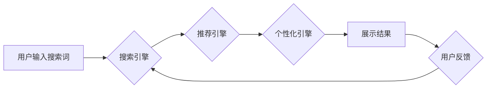

                 

## AI大模型赋能电商搜索推荐的业务创新方法论培训课程开发

> 关键词：AI大模型、电商搜索、推荐系统、业务创新、深度学习、Transformer

### 1. 背景介绍

电子商务行业竞争日益激烈，用户需求日益多元化，如何提升用户体验、提高转化率成为电商平台面临的重大挑战。搜索推荐系统作为电商平台的核心功能之一，直接影响着用户购物决策和平台商业效益。传统基于规则和协同过滤的搜索推荐算法已难以满足用户个性化需求和海量商品数据处理能力。

近年来，深度学习技术蓬勃发展，特别是Transformer模型的出现，为电商搜索推荐带来了新的机遇。AI大模型凭借其强大的语义理解、知识表示和泛化能力，能够有效提升搜索推荐的精准度、个性化程度和用户体验。

### 2. 核心概念与联系

#### 2.1  电商搜索推荐系统

电商搜索推荐系统旨在帮助用户快速找到所需商品，并根据用户的兴趣和偏好提供个性化的商品推荐。它通常由以下几个模块组成：

* **搜索引擎:** 处理用户搜索词，并返回相关商品结果。
* **推荐引擎:** 基于用户行为、商品特征等数据，推荐用户可能感兴趣的商品。
* **个性化引擎:** 根据用户的历史行为、偏好等信息，对搜索结果和推荐结果进行个性化排序和展示。
* **评价和反馈机制:** 收集用户对搜索结果和推荐结果的评价和反馈，用于模型训练和优化。

#### 2.2  AI大模型

AI大模型是指在海量数据上训练的深度学习模型，具有强大的泛化能力和语义理解能力。常见的AI大模型包括BERT、GPT、T5等。

#### 2.3  AI大模型赋能电商搜索推荐

AI大模型可以应用于电商搜索推荐系统的各个模块，提升系统的整体性能。

* **搜索引擎:** 利用BERT等模型对用户搜索词进行语义理解，提升搜索结果的准确性和相关性。
* **推荐引擎:** 利用GPT等模型生成个性化的商品推荐文案，提升用户点击率和转化率。
* **个性化引擎:** 利用T5等模型对用户行为进行分析，个性化排序和展示搜索结果和推荐结果。

**Mermaid 流程图**



### 3. 核心算法原理 & 具体操作步骤

#### 3.1  算法原理概述

AI大模型赋能电商搜索推荐的核心算法原理是利用深度学习模型对海量数据进行训练，学习用户行为、商品特征等知识，并根据学习到的知识进行预测和推荐。常见的算法包括：

* **Transformer模型:** Transformer模型是一种基于注意力机制的深度学习模型，能够有效捕捉文本序列中的长距离依赖关系，适用于语义理解和文本生成任务。
* **协同过滤算法:** 协同过滤算法通过分析用户历史行为和商品购买记录，预测用户可能感兴趣的商品。
* **内容基元匹配算法:** 内容基元匹配算法通过分析商品描述、用户搜索词等文本信息，匹配用户需求和商品特征，推荐相关商品。

#### 3.2  算法步骤详解

**以Transformer模型为例，其训练步骤如下：**

1. **数据预处理:** 收集用户行为数据、商品信息数据等，并进行清洗、格式化和编码。
2. **模型构建:** 根据任务需求选择合适的Transformer模型架构，并设置模型参数。
3. **模型训练:** 利用训练数据对模型进行训练，优化模型参数，使其能够准确预测用户需求和商品特征。
4. **模型评估:** 利用测试数据对模型进行评估，衡量模型的性能，例如准确率、召回率、F1-score等。
5. **模型部署:** 将训练好的模型部署到生产环境，用于实时处理用户请求和生成推荐结果。

#### 3.3  算法优缺点

**Transformer模型的优点:**

* 强大的语义理解能力
* 能够捕捉长距离依赖关系
* 泛化能力强

**Transformer模型的缺点:**

* 训练成本高
* 模型参数量大
* 训练数据量要求高

#### 3.4  算法应用领域

Transformer模型广泛应用于自然语言处理、计算机视觉、语音识别等领域，在电商搜索推荐领域，可以用于：

* **搜索结果排序:** 根据用户搜索词和商品信息，对搜索结果进行排序，提升搜索结果的准确性和相关性。
* **商品推荐:** 根据用户的历史行为、偏好等信息，推荐用户可能感兴趣的商品。
* **个性化广告:** 根据用户的兴趣和行为，个性化展示广告，提升广告点击率和转化率。

### 4. 数学模型和公式 & 详细讲解 & 举例说明

#### 4.1  数学模型构建

Transformer模型的核心是注意力机制，它通过计算词语之间的相关性，赋予每个词语不同的权重，从而更好地理解文本语义。

**注意力机制的数学公式:**

$$
Attention(Q, K, V) = softmax(\frac{QK^T}{\sqrt{d_k}})V
$$

其中：

* $Q$：查询矩阵
* $K$：键矩阵
* $V$：值矩阵
* $d_k$：键向量的维度
* $softmax$：softmax函数

#### 4.2  公式推导过程

注意力机制的公式可以理解为计算每个词语与其他词语之间的相关性，并根据相关性赋予每个词语不同的权重。

* $QK^T$：计算查询矩阵和键矩阵的点积，得到每个词语与其他词语之间的相关性得分。
* $\frac{QK^T}{\sqrt{d_k}}$：对相关性得分进行归一化，使得所有得分在0到1之间。
* $softmax$：对归一化后的得分进行softmax操作，得到每个词语的权重。
* $V$：将权重与值矩阵相乘，得到每个词语的加权和，即最终的注意力输出。

#### 4.3  案例分析与讲解

例如，在翻译句子“The cat sat on the mat”时，注意力机制可以帮助模型理解“cat”与“sat”之间的关系，以及“mat”与“on”之间的关系，从而更好地翻译句子。

### 5. 项目实践：代码实例和详细解释说明

#### 5.1  开发环境搭建

* Python 3.6+
* TensorFlow/PyTorch
* CUDA/cuDNN

#### 5.2  源代码详细实现

```python
# 使用BERT模型进行商品搜索推荐
from transformers import AutoTokenizer, AutoModel

# 加载预训练模型
tokenizer = AutoTokenizer.from_pretrained("bert-base-uncased")
model = AutoModel.from_pretrained("bert-base-uncased")

# 用户搜索词
query = "手机"

# 将搜索词转换为BERT输入格式
input_ids = tokenizer.encode(query, add_special_tokens=True)

# 将输入数据送入模型进行推理
outputs = model(input_ids=input_ids)

# 获取模型输出的语义表示
embeddings = outputs.last_hidden_state[:, 0, :]

# 使用余弦相似度计算商品与搜索词的相似度
# ...

# 根据相似度排序商品，返回推荐结果
```

#### 5.3  代码解读与分析

* 代码首先加载预训练的BERT模型和Tokenizer。
* 然后将用户搜索词转换为BERT输入格式。
* 将输入数据送入模型进行推理，获取模型输出的语义表示。
* 使用余弦相似度计算商品与搜索词的相似度，并根据相似度排序商品，返回推荐结果。

#### 5.4  运行结果展示

运行代码后，将返回与用户搜索词语义相似的商品列表，并根据相似度进行排序。

### 6. 实际应用场景

AI大模型赋能电商搜索推荐的应用场景广泛，例如：

* **个性化商品推荐:** 根据用户的浏览历史、购买记录、兴趣爱好等信息，推荐个性化的商品。
* **精准搜索结果:** 利用AI大模型对用户搜索词进行语义理解，提升搜索结果的准确性和相关性。
* **智能客服:** 利用AI大模型构建智能客服系统，自动回答用户常见问题，提升用户体验。
* **商品分类和标签:** 利用AI大模型对商品进行分类和标签，提升商品搜索和发现效率。

### 6.4  未来应用展望

未来，AI大模型在电商搜索推荐领域将有更广泛的应用，例如：

* **多模态搜索推荐:** 将文本、图像、视频等多模态数据融合，实现更精准的商品搜索和推荐。
* **实时个性化推荐:** 利用实时用户行为数据，实现更精准的个性化推荐。
* **跨平台搜索推荐:** 实现用户在不同平台（例如网站、APP、社交媒体）上的统一搜索和推荐体验。

### 7. 工具和资源推荐

#### 7.1  学习资源推荐

* **深度学习框架:** TensorFlow, PyTorch
* **自然语言处理库:** Hugging Face Transformers
* **在线课程:** Coursera, edX, Udemy

#### 7.2  开发工具推荐

* **IDE:** VS Code, PyCharm
* **云平台:** AWS, Azure, GCP

#### 7.3  相关论文推荐

* BERT: Pre-training of Deep Bidirectional Transformers for Language Understanding
* GPT-3: Language Models are Few-Shot Learners
* T5: Text-to-Text Transfer Transformer

### 8. 总结：未来发展趋势与挑战

#### 8.1  研究成果总结

AI大模型赋能电商搜索推荐取得了显著成果，提升了搜索结果的准确性和相关性，个性化推荐效果显著。

#### 8.2  未来发展趋势

未来，AI大模型在电商搜索推荐领域将继续发展，主要趋势包括：

* **模型规模和能力提升:** 模型参数量将继续增加，模型能力将进一步提升。
* **多模态融合:** 将文本、图像、视频等多模态数据融合，实现更精准的商品搜索和推荐。
* **实时个性化推荐:** 利用实时用户行为数据，实现更精准的个性化推荐。

#### 8.3  面临的挑战

AI大模型在电商搜索推荐领域也面临一些挑战，例如：

* **数据隐私和安全:** AI模型训练需要大量用户数据，如何保护用户隐私和数据安全是一个重要问题。
* **模型解释性和可信度:** AI模型的决策过程往往是复杂的，如何提高模型的解释性和可信度是一个重要的研究方向。
* **模型部署和维护成本:** 大型AI模型的部署和维护成本较高，需要进一步降低成本。

#### 8.4  研究展望

未来，需要进一步研究如何解决AI大模型在电商搜索推荐领域面临的挑战，例如：

* 研究隐私保护的AI模型训练方法。
* 研究可解释性AI模型，提高模型的透明度和可信度。
* 研究高效的AI模型部署和维护方法。


### 9. 附录：常见问题与解答

**Q1: AI大模型训练需要多少数据？**

A1: AI大模型训练需要海量数据，通常需要数十亿甚至上百亿条数据。

**Q2: 如何评估AI大模型的性能？**

A2: AI大模型的性能可以评估指标包括准确率、召回率、F1-score等。

**Q3: 如何部署AI大模型？**

A3: AI大模型可以部署到云平台、边缘设备等。

**Q4: 如何保护用户隐私？**

A4: 可以采用数据脱敏、联邦学习等方法保护用户隐私。


作者：禅与计算机程序设计艺术 / Zen and the Art of Computer Programming 
<end_of_turn>

