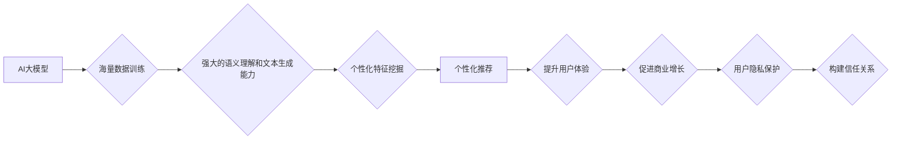

                 

## AI大模型：改善电商平台用户体验个性化与隐私保护平衡的新思路

> 关键词：AI大模型、电商平台、用户体验、个性化推荐、隐私保护、联邦学习、差分隐私

## 1. 背景介绍

随着电商平台的蓬勃发展，用户体验的个性化已经成为提升用户粘性和促进商业增长的关键因素。传统的推荐系统主要依赖用户历史行为数据，但这种方法存在着数据孤岛、冷启动问题以及用户隐私泄露的风险。近年来，大规模人工智能模型的出现为电商平台个性化推荐提供了新的思路和可能性。

AI大模型，特别是基于Transformer架构的模型，凭借其强大的语义理解和文本生成能力，能够从海量用户数据中挖掘更深层的个性化特征，提供更精准、更智能的推荐服务。然而，AI大模型的训练和应用也面临着用户隐私保护的挑战。如何平衡个性化推荐与用户隐私保护，是电商平台亟需解决的关键问题。

## 2. 核心概念与联系

### 2.1  AI大模型

AI大模型是指在海量数据上训练的具有强大泛化能力的深度学习模型。它们通常拥有数亿甚至数十亿的参数，能够学习复杂的模式和关系，并应用于各种自然语言处理任务，例如文本分类、机器翻译、问答系统等。

### 2.2  个性化推荐

个性化推荐是指根据用户的兴趣、偏好、行为等信息，为用户提供定制化的商品或服务推荐。传统的个性化推荐系统主要依赖协同过滤、内容过滤等方法，但这些方法存在着数据稀疏、冷启动等问题。

### 2.3  隐私保护

用户隐私保护是指保护用户的个人信息不被未经授权的访问、使用或披露。在电商平台，用户隐私信息包括但不限于姓名、地址、购买历史、浏览记录等。

**核心概念与联系流程图:**



## 3. 核心算法原理 & 具体操作步骤

### 3.1  算法原理概述

基于AI大模型的个性化推荐系统通常采用以下核心算法：

* **Transformer模型:** Transformer模型是一种基于注意力机制的深度学习模型，能够有效地捕捉文本序列中的长距离依赖关系，从而实现更精准的语义理解和文本生成。

* **自监督学习:** 自监督学习是一种无需人工标注数据就能训练模型的方法。在电商平台，可以利用用户浏览历史、购买记录等数据进行自监督学习，训练模型学习用户兴趣和偏好的表示。

* **联邦学习:** 联邦学习是一种分布式机器学习方法，能够在不共享原始数据的情况下，联合训练模型。这对于保护用户隐私至关重要。

### 3.2  算法步骤详解

1. **数据收集和预处理:** 收集用户行为数据，例如浏览记录、购买历史、评价信息等，并进行清洗、格式化和特征提取。

2. **模型训练:** 利用Transformer模型和自监督学习方法，在用户行为数据上训练个性化推荐模型。

3. **模型部署:** 将训练好的模型部署到电商平台，并根据用户的实时行为数据进行个性化推荐。

4. **模型评估和优化:** 定期评估模型的推荐效果，并根据评估结果进行模型优化和更新。

### 3.3  算法优缺点

**优点:**

* **精准度高:** 基于AI大模型的推荐系统能够从海量数据中挖掘更深层的用户特征，提供更精准的推荐。
* **个性化强:** 可以根据用户的兴趣、偏好、行为等信息，提供个性化的商品或服务推荐。
* **可扩展性强:** 可以轻松扩展到新的用户和商品，并适应不断变化的用户需求。

**缺点:**

* **数据依赖性强:** 需要大量的用户行为数据才能训练出有效的模型。
* **计算资源消耗大:** 训练AI大模型需要大量的计算资源和时间。
* **隐私保护挑战:** 需要采取有效的措施来保护用户隐私信息。

### 3.4  算法应用领域

* **电商平台:** 提供个性化商品推荐、用户画像分析、营销策略优化等服务。
* **内容平台:** 提供个性化内容推荐、用户兴趣分析、内容创作指导等服务。
* **社交媒体:** 提供个性化好友推荐、兴趣小组匹配、内容过滤等服务。

## 4. 数学模型和公式 & 详细讲解 & 举例说明

### 4.1  数学模型构建

在基于AI大模型的个性化推荐系统中，常用的数学模型包括：

* **用户-商品评分矩阵:** 用来表示用户对商品的评分，其中每个元素代表用户对商品的评分。

* **嵌入向量:** 将用户和商品映射到低维向量空间，以便进行相似度计算。

* **注意力机制:** 用于计算用户对不同商品的关注程度，并根据关注程度调整推荐结果。

### 4.2  公式推导过程

**用户嵌入向量:**

$$
u_i = \text{Embedding}(user_i)
$$

**商品嵌入向量:**

$$
v_j = \text{Embedding}(product_j)
$$

**用户-商品评分预测:**

$$
\hat{r}_{ij} = f(u_i, v_j)
$$

其中，$f$ 是一个评分预测函数，例如点积或多层感知机。

**注意力机制:**

$$
\alpha_{ij} = \frac{exp(score(u_i, v_j))}{\sum_{k=1}^{N} exp(score(u_i, v_k))}
$$

其中，$score(u_i, v_j)$ 是用户$u_i$对商品$v_j$的评分，$N$ 是商品总数。

### 4.3  案例分析与讲解

假设有一个电商平台，用户$u_1$对服装类商品感兴趣，用户$u_2$对电子产品类商品感兴趣。

利用用户行为数据训练AI大模型，可以得到用户$u_1$和用户$u_2$的嵌入向量。

当用户$u_1$浏览服装类商品时，模型会根据注意力机制计算用户对不同服装的关注程度，并推荐用户最感兴趣的服装。

当用户$u_2$浏览电子产品类商品时，模型会根据注意力机制计算用户对不同电子产品的关注程度，并推荐用户最感兴趣的电子产品。

## 5. 项目实践：代码实例和详细解释说明

### 5.1  开发环境搭建

* **操作系统:** Ubuntu 20.04
* **编程语言:** Python 3.8
* **深度学习框架:** TensorFlow 2.0
* **其他工具:** Git, Jupyter Notebook

### 5.2  源代码详细实现

```python
# 导入必要的库
import tensorflow as tf

# 定义用户-商品评分矩阵
ratings = tf.constant([[5, 4, 3],
                      [3, 5, 4],
                      [4, 3, 5]])

# 定义用户嵌入向量
user_embeddings = tf.Variable(tf.random.normal([3, 10]))

# 定义商品嵌入向量
item_embeddings = tf.Variable(tf.random.normal([3, 10]))

# 定义评分预测函数
def predict_rating(user_id, item_id):
  user_embedding = user_embeddings[user_id]
  item_embedding = item_embeddings[item_id]
  return tf.reduce_sum(user_embedding * item_embedding)

# 预测用户对商品的评分
predicted_rating = predict_rating(0, 0)
print(predicted_rating)
```

### 5.3  代码解读与分析

* 代码首先导入必要的库，包括TensorFlow深度学习框架。
* 然后定义用户-商品评分矩阵，用户嵌入向量和商品嵌入向量。
* 定义评分预测函数，该函数使用点积计算用户和商品的嵌入向量的相似度，作为评分预测值。
* 最后使用代码预测用户对商品的评分。

### 5.4  运行结果展示

运行代码后，会输出用户对商品的预测评分。

## 6. 实际应用场景

### 6.1  电商平台个性化推荐

基于AI大模型的个性化推荐系统可以为电商平台用户提供更精准、更智能的商品推荐，提升用户体验和转化率。

### 6.2  内容平台个性化内容推荐

内容平台可以利用AI大模型分析用户兴趣和偏好，推荐个性化的内容，例如新闻、视频、文章等。

### 6.3  社交媒体个性化好友推荐

社交媒体平台可以利用AI大模型分析用户社交关系和兴趣爱好，推荐个性化的好友，拓展用户社交圈。

### 6.4  未来应用展望

随着AI技术的不断发展，AI大模型在电商平台、内容平台、社交媒体等领域的应用场景将更加广泛。

## 7. 工具和资源推荐

### 7.1  学习资源推荐

* **书籍:**

    * 《深度学习》
    * 《自然语言处理》

* **在线课程:**

    * Coursera: 深度学习
    * Udacity: 自然语言处理

### 7.2  开发工具推荐

* **深度学习框架:** TensorFlow, PyTorch
* **编程语言:** Python
* **云计算平台:** AWS, Azure, GCP

### 7.3  相关论文推荐

* **Attention Is All You Need**
* **BERT: Pre-training of Deep Bidirectional Transformers for Language Understanding**

## 8. 总结：未来发展趋势与挑战

### 8.1  研究成果总结

基于AI大模型的个性化推荐系统取得了显著的成果，能够提供更精准、更智能的推荐服务，提升用户体验和商业价值。

### 8.2  未来发展趋势

* **模型规模和能力的提升:** 未来，AI大模型的规模和能力将进一步提升，能够学习更复杂的模式和关系，提供更精准的个性化推荐。
* **多模态融合:** 将文本、图像、视频等多模态数据融合到个性化推荐系统中，提供更丰富的用户体验。
* **隐私保护技术的增强:** 随着用户隐私意识的增强，隐私保护技术将成为个性化推荐系统的重要发展方向。

### 8.3  面临的挑战

* **数据安全和隐私保护:** 如何保护用户隐私信息，防止数据泄露和滥用，是AI大模型应用面临的重大挑战。
* **模型解释性和可信度:** AI大模型的决策过程通常是复杂的，难以解释，这可能会导致用户对推荐结果的信任度降低。
* **公平性和偏见:** AI大模型可能会学习到数据中的偏见，导致推荐结果不公平，需要采取措施来 mitigate 这些偏见。

### 8.4  研究展望

未来，研究人员将继续探索AI大模型在个性化推荐领域的应用，并致力于解决上述挑战，推动AI技术在电商平台等领域的健康发展。

## 9. 附录：常见问题与解答

* **Q1: AI大模型的训练需要多少数据？**

* **A1:** AI大模型的训练需要大量的用户行为数据，通常需要百万甚至数十亿条数据才能训练出有效的模型。

* **Q2: 如何保护用户隐私信息？**

* **A2:** 可以采用联邦学习、差分隐私等技术来保护用户隐私信息，避免数据泄露和滥用。

* **Q3: AI大模型的推荐结果是否准确？**

* **A3:** AI大模型的推荐结果通常比传统的推荐系统更准确，但仍然存在一定的误差。

* **Q4: 如何评估AI大模型的推荐效果？**

* **A4:** 可以使用准确率、召回率、NDCG等指标来评估AI大模型的推荐效果。


作者：禅与计算机程序设计艺术 / Zen and the Art of Computer Programming 
<end_of_turn>

