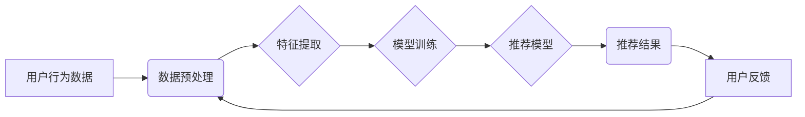

                 

## AI如何改善电商平台的跨类目交叉销售与向上销售

> 关键词：人工智能、电商平台、交叉销售、向上销售、推荐系统、协同过滤、深度学习、用户画像

## 1. 背景介绍

电商平台的竞争日益激烈，提高用户购买转化率和客单价成为平台运营的关键。交叉销售和向上销售是提升电商平台收入的重要策略，通过向用户推荐相关或更高价值的产品，可以有效地增加销售额。传统电商平台依靠规则引擎和人工干预进行推荐，效率低下且难以满足用户个性化需求。

随着人工智能技术的快速发展，AI算法能够从海量用户数据中挖掘出更精准的关联关系，为用户提供更个性化、更有效的推荐，从而显著提升交叉销售和向上销售的效率。

## 2. 核心概念与联系

### 2.1 跨类目交叉销售

跨类目交叉销售是指向用户推荐不同类目、但具有相关性的产品。例如，用户购买了笔记本电脑，平台可以推荐鼠标、键盘、电脑包等相关产品。

### 2.2 向上销售

向上销售是指向用户推荐价格更高、功能更强大的产品。例如，用户购买了普通版手机，平台可以推荐旗舰版手机。

### 2.3 AI推荐系统

AI推荐系统利用机器学习算法从用户行为、产品特征等数据中学习用户偏好，并根据学习到的知识为用户推荐相关产品。

**AI推荐系统架构**



## 3. 核心算法原理 & 具体操作步骤

### 3.1 算法原理概述

AI推荐系统常用的算法包括：

* **协同过滤:** 基于用户对商品的评分或购买行为，预测用户对其他商品的兴趣。
* **内容过滤:** 基于商品的特征和描述，推荐与用户兴趣相符的商品。
* **基于知识的推荐:** 基于商品之间的关系和用户偏好，推荐相关商品。
* **深度学习:** 利用深度神经网络从海量数据中学习用户偏好，进行更精准的推荐。

### 3.2 算法步骤详解

**协同过滤算法步骤:**

1. **数据收集:** 收集用户对商品的评分或购买行为数据。
2. **数据预处理:** 处理缺失值、异常值等问题。
3. **用户相似度计算:** 计算用户之间的相似度，例如使用余弦相似度或皮尔逊相关系数。
4. **商品相似度计算:** 计算商品之间的相似度，例如使用余弦相似度或Jaccard系数。
5. **推荐生成:** 根据用户相似度和商品相似度，推荐用户可能感兴趣的商品。

**内容过滤算法步骤:**

1. **商品特征提取:** 从商品描述、属性等信息中提取特征。
2. **用户兴趣建模:** 根据用户历史行为，构建用户兴趣模型。
3. **推荐生成:** 根据商品特征和用户兴趣模型，推荐与用户兴趣相符的商品。

### 3.3 算法优缺点

| 算法 | 优点 | 缺点 |
|---|---|---|
| 协同过滤 | 能够发现用户隐性偏好，推荐个性化商品 | 需要大量用户数据，容易陷入冷启动问题 |
| 内容过滤 | 不需要用户行为数据，能够推荐新商品 | 容易陷入“同质化推荐”问题 |
| 基于知识的推荐 | 可以利用商品之间的关系进行推荐，推荐结果更合理 | 需要构建商品知识图谱，数据维护成本高 |
| 深度学习 | 能够从海量数据中学习更复杂的模式，推荐结果更精准 | 需要大量数据和计算资源，模型解释性差 |

### 3.4 算法应用领域

AI推荐系统广泛应用于电商平台、视频网站、音乐平台等领域，例如：

* **商品推荐:** 向用户推荐相关或个性化的商品。
* **内容推荐:** 向用户推荐相关或个性化的视频、文章、音乐等内容。
* **广告推荐:** 向用户推荐相关的广告。

## 4. 数学模型和公式 & 详细讲解 & 举例说明

### 4.1 数学模型构建

协同过滤算法的核心是用户-商品评分矩阵，其中每个元素表示用户对商品的评分。

**用户-商品评分矩阵:**

```
用户1  商品1  商品2  商品3
用户2  评分1  评分2  评分3
用户3  评分4  评分5  评分6
```

### 4.2 公式推导过程

**余弦相似度:**

$$
\text{相似度} = \frac{\mathbf{u} \cdot \mathbf{v}}{\|\mathbf{u}\| \|\mathbf{v}\|}
$$

其中：

* $\mathbf{u}$ 和 $\mathbf{v}$ 是两个用户的评分向量。
* $\cdot$ 表示向量点积。
* $\|\mathbf{u}\|$ 和 $\|\mathbf{v}\|$ 是两个向量的模长。

### 4.3 案例分析与讲解

假设有两个用户，用户1的评分向量为 [5, 4, 3]，用户2的评分向量为 [4, 5, 2]。

则它们的余弦相似度为：

$$
\text{相似度} = \frac{(5 \times 4) + (4 \times 5) + (3 \times 2)}{\sqrt{5^2 + 4^2 + 3^2} \sqrt{4^2 + 5^2 + 2^2}} = \frac{46}{\sqrt{50} \sqrt{45}} \approx 0.89
$$

该结果表明用户1和用户2的评分偏好相似度较高。

## 5. 项目实践：代码实例和详细解释说明

### 5.1 开发环境搭建

* Python 3.x
* scikit-learn
* pandas
* numpy

### 5.2 源代码详细实现

```python
import pandas as pd
from sklearn.metrics.pairwise import cosine_similarity

# 加载用户-商品评分数据
data = pd.read_csv('ratings.csv')

# 构建用户-商品评分矩阵
user_item_matrix = data.pivot_table(index='user_id', columns='item_id', values='rating')

# 计算用户之间的余弦相似度
user_similarity = cosine_similarity(user_item_matrix)

# 获取用户1的相似用户
user1_id = 1
similar_users = user_similarity[user1_id].argsort()[:-6:-1]  # 排序获取前5个相似用户

# 推荐商品
recommended_items = []
for user_id in similar_users:
    user_ratings = user_item_matrix.loc[user_id].dropna()
    recommended_items.extend(user_ratings.index)

# 去除用户1已经购买过的商品
recommended_items = [item for item in recommended_items if item not in data[data['user_id'] == user1_id]['item_id'].values]

# 输出推荐结果
print(f'推荐给用户 {user1_id} 的商品：{recommended_items}')
```

### 5.3 代码解读与分析

* 代码首先加载用户-商品评分数据，并构建用户-商品评分矩阵。
* 然后使用余弦相似度计算用户之间的相似度。
* 根据用户1的相似用户，推荐用户1可能感兴趣的商品。
* 最后去除用户1已经购买过的商品，输出最终的推荐结果。

### 5.4 运行结果展示

运行代码后，会输出用户1可能感兴趣的商品列表。

## 6. 实际应用场景

AI推荐系统在电商平台的实际应用场景非常广泛，例如：

* **商品推荐:** 向用户推荐相关或个性化的商品，例如亚马逊的“你可能也喜欢”推荐。
* **交叉销售:** 向用户推荐与当前商品相关的其他商品，例如购买笔记本电脑后推荐鼠标、键盘等配件。
* **向上销售:** 向用户推荐价格更高、功能更强大的商品，例如购买普通版手机后推荐旗舰版手机。
* **个性化营销:** 根据用户的兴趣和购买行为，进行个性化的营销推广。

### 6.4 未来应用展望

未来，AI推荐系统将更加智能化、个性化和精准化。例如：

* **多模态推荐:** 利用文本、图像、视频等多模态数据进行推荐。
* **实时推荐:** 基于用户的实时行为，进行动态的推荐。
* **解释性推荐:** 明确推荐结果背后的逻辑，提高用户信任度。

## 7. 工具和资源推荐

### 7.1 学习资源推荐

* **书籍:**
    * 《推荐系统实践》
    * 《深度学习》
* **在线课程:**
    * Coursera: Recommender Systems
    * Udacity: Deep Learning Nanodegree

### 7.2 开发工具推荐

* **Python:** 
    * scikit-learn
    * TensorFlow
    * PyTorch
* **Spark:** 
    * MLlib

### 7.3 相关论文推荐

* **协同过滤:**
    * Collaborative Filtering: A User-Based Approach
* **内容过滤:**
    * Content-Based Recommendation Systems
* **深度学习推荐:**
    * Deep Learning for Recommender Systems

## 8. 总结：未来发展趋势与挑战

### 8.1 研究成果总结

AI推荐系统在电商平台的应用取得了显著成果，能够有效提升用户体验和商业效益。

### 8.2 未来发展趋势

未来，AI推荐系统将更加智能化、个性化和精准化，并融合更多新技术，例如多模态学习、强化学习和联邦学习。

### 8.3 面临的挑战

AI推荐系统也面临一些挑战，例如：

* **数据稀疏性:** 用户-商品评分数据往往是稀疏的，难以训练出准确的推荐模型。
* **冷启动问题:** 新用户和新商品难以获得准确的推荐。
* **公平性问题:** 推荐结果可能存在偏见，需要保证推荐的公平性和公正性。

### 8.4 研究展望

未来研究将重点关注解决以上挑战，并探索更先进的推荐算法和技术，以构建更加智能、高效和公平的AI推荐系统。

## 9. 附录：常见问题与解答

* **Q1: 如何解决数据稀疏性问题？**

* **A1:** 可以使用矩阵分解、协同过滤等算法，从稀疏数据中挖掘出潜在的关联关系。

* **Q2: 如何解决冷启动问题？**

* **A2:** 可以利用用户画像、商品特征等信息进行推荐，或者使用基于内容过滤的推荐算法。

* **Q3: 如何保证推荐结果的公平性？**

* **A3:** 可以使用公平性度量指标，例如公平性损失函数，来评估推荐结果的公平性。


作者：禅与计算机程序设计艺术 / Zen and the Art of Computer Programming 
<end_of_turn>

