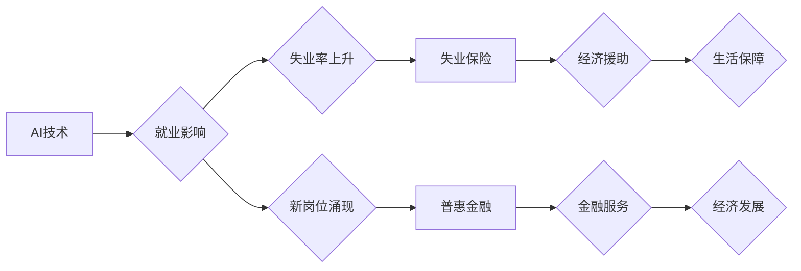

                 

## AI技术的就业影响治理:失业保险和普惠金融

> 关键词：人工智能、就业影响、失业保险、普惠金融、社会保障、经济转型、技术治理、伦理问题

## 1. 背景介绍

人工智能 (AI) 技术的飞速发展正在深刻地改变着全球经济和社会结构。AI 驱动的自动化正在取代越来越多的传统工作岗位，引发了关于 AI 对就业的影响的广泛关注和讨论。一方面，AI 技术创造了新的就业机会，推动了经济增长和社会进步。另一方面，AI 也导致了某些行业和职业的失业率上升，加剧了社会不平等和经济不稳定。

面对 AI 带来的挑战，各国政府和国际组织纷纷寻求有效应对措施，以减轻 AI 对就业的影响，保障社会公平正义。其中，失业保险和普惠金融作为重要的社会保障制度，在 AI 时代发挥着越来越重要的作用。

## 2. 核心概念与联系

**2.1 失业保险**

失业保险是政府为失业人员提供经济援助的社会保障制度。其主要目标是帮助失业人员维持基本生活水平，并为他们提供职业培训和再就业服务，使其能够尽快回归到社会生产生活中。

**2.2 普惠金融**

普惠金融是指为低收入人群、微小企业和农村地区提供金融服务的体系。其主要目标是通过降低金融服务的门槛和成本，提高金融服务的普惠性和包容性，促进经济发展和社会公平。

**2.3 AI 与 失业保险/普惠金融 的联系**

AI 技术的应用可以对失业保险和普惠金融体系产生深远的影响：

* **提高效率和精准性:** AI 可以帮助政府更有效地识别失业风险，并精准地分配失业救济金。
* **优化服务体验:** AI 驱动的聊天机器人和虚拟助手可以为失业人员提供更便捷、更个性化的服务。
* **促进金融包容:** AI 可以帮助金融机构更好地评估低收入人群的信用风险，从而为他们提供更公平、更便捷的金融服务。

**2.4  核心概念关系流程图**



## 3. 核心算法原理 & 具体操作步骤

**3.1 算法原理概述**

在 AI 技术应用于失业保险和普惠金融领域时，常用的算法包括：

* **机器学习:** 用于预测失业风险、识别潜在的欺诈行为、个性化推荐金融产品等。
* **自然语言处理:** 用于理解失业人员的需求，提供更精准的咨询和服务。
* **深度学习:** 用于分析海量数据，发现隐藏的就业趋势和金融风险。

**3.2 算法步骤详解**

以机器学习算法为例，其应用于失业保险的具体步骤如下：

1. **数据收集:** 收集失业人员的个人信息、工作历史、技能水平、经济状况等数据。
2. **数据预处理:** 对收集到的数据进行清洗、转换、编码等处理，使其适合机器学习算法的训练。
3. **模型选择:** 根据具体需求选择合适的机器学习算法，例如逻辑回归、支持向量机、决策树等。
4. **模型训练:** 使用训练数据训练选择的机器学习模型，使其能够学习到失业风险的预测规律。
5. **模型评估:** 使用测试数据评估模型的预测准确率、召回率、F1-score等指标。
6. **模型部署:** 将训练好的模型部署到生产环境中，用于实时预测失业风险。

**3.3 算法优缺点**

* **优点:** 能够提高失业风险预测的准确性，帮助政府更精准地分配失业救济金。
* **缺点:** 需要大量的数据进行训练，且模型的预测结果可能受到数据偏差的影响。

**3.4 算法应用领域**

* **失业风险预测:** 预测哪些人群更容易失业，以便政府提前提供帮助。
* **失业救济金分配:** 根据失业风险预测结果，精准地分配失业救济金。
* **职业培训推荐:** 根据失业人员的技能水平和就业市场需求，推荐合适的职业培训课程。

## 4. 数学模型和公式 & 详细讲解 & 举例说明

**4.1 数学模型构建**

失业风险预测模型可以采用逻辑回归模型，其数学表达式如下：

$$
P(Y=1|X) = \frac{1}{1 + e^{-(β_0 + β_1X_1 + β_2X_2 + ... + β_nX_n)}}
$$

其中：

* $P(Y=1|X)$ 表示失业风险为 1 的概率，即失业的概率。
* $X_1, X_2, ..., X_n$ 表示失业风险的预测因素，例如年龄、教育水平、工作经验等。
* $β_0, β_1, β_2, ..., β_n$ 表示模型参数，需要通过训练数据进行估计。

**4.2 公式推导过程**

逻辑回归模型的推导过程基于最大似然估计原理。其目标是找到一组参数，使得模型预测的失业风险概率与实际失业情况的分布尽可能一致。

**4.3 案例分析与讲解**

假设我们想要预测某个人是否会失业，其特征包括年龄、教育水平和工作经验。通过训练数据，我们估计出模型参数如下：

* $β_0 = -2$
* $β_1 = 0.1$
* $β_2 = 0.05$
* $β_3 = -0.02$

其中，$β_1$ 表示年龄每增加 1 岁，失业风险概率增加 0.1 倍；$β_2$ 表示教育水平每提高 1 个等级，失业风险概率增加 0.05 倍；$β_3$ 表示工作经验每增加 1 年，失业风险概率减少 0.02 倍。

## 5. 项目实践：代码实例和详细解释说明

**5.1 开发环境搭建**

* Python 3.x
* scikit-learn 库
* pandas 库
* matplotlib 库

**5.2 源代码详细实现**

```python
import pandas as pd
from sklearn.linear_model import LogisticRegression
from sklearn.model_selection import train_test_split
from sklearn.metrics import accuracy_score

# 加载数据
data = pd.read_csv('unemployment_data.csv')

# 划分训练集和测试集
X = data[['age', 'education', 'experience']]
y = data['unemployment']
X_train, X_test, y_train, y_test = train_test_split(X, y, test_size=0.2, random_state=42)

# 创建逻辑回归模型
model = LogisticRegression()

# 训练模型
model.fit(X_train, y_train)

# 预测测试集结果
y_pred = model.predict(X_test)

# 计算模型准确率
accuracy = accuracy_score(y_test, y_pred)
print(f'模型准确率: {accuracy}')
```

**5.3 代码解读与分析**

* 代码首先加载数据，并划分训练集和测试集。
* 然后创建逻辑回归模型，并使用训练集训练模型。
* 最后使用测试集预测结果，并计算模型的准确率。

**5.4 运行结果展示**

运行代码后，会输出模型的准确率。

## 6. 实际应用场景

**6.1 失业保险体系优化**

* AI 可以帮助政府更精准地识别失业风险，并为高风险人群提供提前预警和帮助。
* AI 可以帮助政府优化失业救济金的分配方案，确保资金能够真正流向需要帮助的人群。
* AI 可以帮助政府提供个性化的职业培训和再就业服务，帮助失业人员尽快回归到社会生产生活中。

**6.2 普惠金融服务扩展**

* AI 可以帮助金融机构更好地评估低收入人群的信用风险，从而为他们提供更公平、更便捷的金融服务。
* AI 可以帮助金融机构开发更精准的金融产品，满足低收入人群的个性化需求。
* AI 可以帮助金融机构降低运营成本，提高金融服务的普惠性和包容性。

**6.3 未来应用展望**

* AI 技术将进一步推动失业保险和普惠金融体系的智能化和数字化转型。
* AI 将帮助政府和金融机构更好地应对 AI 带来的就业挑战，保障社会公平正义。
* AI 将为低收入人群和失业人员提供更多机会，促进经济发展和社会进步。

## 7. 工具和资源推荐

**7.1 学习资源推荐**

* **在线课程:** Coursera, edX, Udacity 等平台提供 AI、机器学习、自然语言处理等方面的在线课程。
* **书籍:** 《深度学习》、《机器学习实战》、《自然语言处理入门》等书籍。
* **开源项目:** TensorFlow, PyTorch, scikit-learn 等开源项目。

**7.2 开发工具推荐**

* **Python:** 作为 AI 开发的主要编程语言，Python 提供丰富的库和工具。
* **Jupyter Notebook:** 用于编写和运行 Python 代码，并可视化数据和模型结果。
* **云计算平台:** AWS, Azure, GCP 等云计算平台提供 AI 开发和部署所需的资源和服务。

**7.3 相关论文推荐**

* **AI 伦理:** "On the Dangers of Stochastic Parrots: Can Language Models Be Too Big?"
* **AI 与就业:** "The Future of Employment: How Susceptible Are Jobs to Computerisation?"
* **AI 与金融:** "Artificial Intelligence in Finance: Opportunities and Challenges"

## 8. 总结：未来发展趋势与挑战

**8.1 研究成果总结**

AI 技术在失业保险和普惠金融领域的应用取得了显著成果，能够提高效率、精准性、公平性和包容性。

**8.2 未来发展趋势**

* AI 技术将更加智能化、自动化和个性化。
* AI 将与其他技术融合，例如区块链、大数据、云计算等，形成更强大的协同效应。
* AI 将在更多领域应用，例如教育、医疗、养老等。

**8.3 面临的挑战**

* **数据隐私和安全:** AI 的应用需要大量的数据，如何保护数据隐私和安全是一个重要的挑战。
* **算法偏见:** AI 算法可能存在偏见，导致不公平的结果，需要采取措施消除算法偏见。
* **伦理问题:** AI 的应用引发了伦理问题，例如责任归属、透明度、可解释性等，需要进行深入探讨和规范。

**8.4 研究展望**

* 研究更安全、更可靠、更公平的 AI 算法。
* 研究 AI 与人类的协同工作模式。
* 研究 AI 的伦理问题，并制定相应的规范和政策。

## 9. 附录：常见问题与解答

**9.1 如何评估 AI 模型的准确性？**

可以使用准确率、召回率、F1-score等指标评估 AI 模型的准确性。

**9.2 如何解决 AI 算法的偏见问题？**

可以通过数据预处理、算法设计、模型评估等环节采取措施解决 AI 算法的偏见问题。

**9.3 AI 技术对就业市场的影响如何？**

AI 技术既会带来新的就业机会，也会导致某些行业和职业的失业率上升。需要政府和社会采取措施，帮助人们适应 AI 时代带来的变化。


作者：禅与计算机程序设计艺术 / Zen and the Art of Computer Programming 
<end_of_turn>

