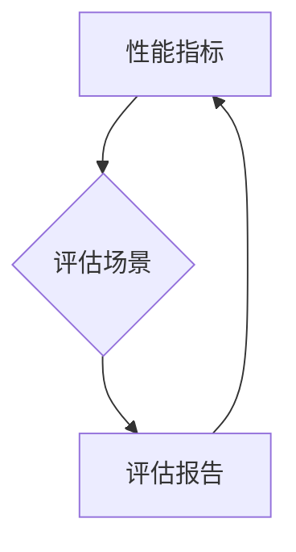

                 

## AI模型的性能基准测试：Lepton AI的评估体系

> 关键词：AI模型评估, 基准测试, Lepton AI, 性能指标, 机器学习, 深度学习, 算法比较

## 1. 背景介绍

在人工智能领域蓬勃发展的今天，AI模型的性能评估已成为至关重要的环节。随着模型规模和复杂度的不断增加，传统的评估方法显得越来越不足以全面、准确地反映模型的实际能力。Lepton AI 应运而生，它提供了一个全新的、更全面的AI模型性能评估体系，旨在帮助开发者更好地理解和比较不同模型的优劣，从而做出更明智的模型选择。

### 1.1  AI模型评估的挑战

传统的AI模型评估主要依赖于单一指标，例如准确率、召回率等。然而，这些指标往往局限于特定任务或数据集，无法全面反映模型在不同场景下的表现。此外，模型的复杂度和规模不断增加，单一指标难以捕捉模型的整体性能。

### 1.2  Lepton AI的解决方案

Lepton AI 提出了一种基于多指标、多场景评估的体系，旨在解决传统评估方法的局限性。它不仅考虑了模型在特定任务上的表现，还评估了模型的泛化能力、鲁棒性、效率等方面。Lepton AI 的评估体系基于以下核心原则：

* **多指标评估:** Lepton AI 使用多种指标来评估模型的性能，包括准确率、召回率、F1-score、AUC、BLEU 等，以更全面地反映模型的能力。
* **多场景评估:** Lepton AI 在不同的场景下评估模型的性能，例如不同数据集、不同输入格式、不同环境等，以测试模型的泛化能力和鲁棒性。
* **可视化分析:** Lepton AI 提供了直观的可视化工具，帮助开发者更好地理解模型的性能特点和局限性。
* **开源共享:** Lepton AI 的评估体系是开源的，任何人都可以访问和使用，促进AI模型评估的透明度和可重复性。

## 2. 核心概念与联系

Lepton AI 的评估体系的核心概念包括：

* **性能指标:** 用于量化模型性能的指标，例如准确率、召回率、F1-score 等。
* **评估场景:** 用于测试模型性能的特定环境，例如不同数据集、不同输入格式、不同环境等。
* **评估报告:** 包含模型性能评估结果的报告，包括指标值、图表、分析等。

Lepton AI 的评估体系是一个闭环系统，它将性能指标、评估场景和评估报告有机地结合在一起，形成一个完整的评估流程。



## 3. 核心算法原理 & 具体操作步骤

Lepton AI 的评估体系基于多种算法原理，例如统计学、机器学习、深度学习等。这些算法被用于计算性能指标、构建评估场景、分析评估报告等。

### 3.1  算法原理概述

Lepton AI 的评估体系主要使用以下算法原理：

* **统计学:** 用于计算模型性能的指标，例如准确率、召回率、F1-score 等。
* **机器学习:** 用于构建评估场景，例如生成模拟数据、调整模型参数等。
* **深度学习:** 用于分析评估报告，例如识别模型的优势和劣势、预测模型的未来性能等。

### 3.2  算法步骤详解

Lepton AI 的评估体系的具体操作步骤如下：

1. **定义评估目标:** 首先需要明确评估的目标，例如模型的准确率、召回率、F1-score 等。
2. **选择评估指标:** 根据评估目标选择合适的性能指标。
3. **构建评估场景:** 根据评估目标和模型的特点构建不同的评估场景，例如不同数据集、不同输入格式、不同环境等。
4. **运行模型评估:** 在构建好的评估场景中运行模型，并记录模型的性能指标。
5. **分析评估结果:** 使用统计学、机器学习和深度学习等算法分析评估结果，并生成评估报告。

### 3.3  算法优缺点

Lepton AI 的评估体系的算法具有以下优缺点：

* **优点:**

    * **全面性:** 使用多种指标和场景评估模型，更全面地反映模型的性能。
    * **准确性:** 基于统计学、机器学习和深度学习等算法，提高评估结果的准确性。
    * **可视化:** 提供直观的可视化工具，帮助开发者更好地理解模型的性能特点。
    * **开源性:** 评估体系是开源的，任何人都可以访问和使用。

* **缺点:**

    * **复杂性:** 评估体系相对复杂，需要一定的技术基础才能使用。
    * **计算量:** 评估模型的性能需要大量的计算资源。

### 3.4  算法应用领域

Lepton AI 的评估体系可以应用于各种AI领域，例如：

* **自然语言处理:** 评估文本分类、情感分析、机器翻译等模型的性能。
* **计算机视觉:** 评估图像识别、物体检测、图像分割等模型的性能。
* **语音识别:** 评估语音识别、语音合成等模型的性能。
* **推荐系统:** 评估推荐系统的准确率、召回率、点击率等指标。

## 4. 数学模型和公式 & 详细讲解 & 举例说明

Lepton AI 的评估体系基于多种数学模型和公式，例如：

* **准确率:**  $$Accuracy = \frac{TP + TN}{TP + TN + FP + FN}$$
* **召回率:** $$Recall = \frac{TP}{TP + FN}$$
* **F1-score:** $$F1-score = 2 * \frac{Precision * Recall}{Precision + Recall}$$

### 4.1  数学模型构建

Lepton AI 的评估体系使用以下数学模型构建：

* **分类模型评估:** 使用准确率、召回率、F1-score 等指标评估分类模型的性能。
* **回归模型评估:** 使用均方误差、平均绝对误差等指标评估回归模型的性能。
* **序列模型评估:** 使用BLEU、ROUGE 等指标评估序列模型的性能。

### 4.2  公式推导过程

Lepton AI 的评估体系中的公式推导过程基于统计学和机器学习的原理。例如，准确率的公式是基于真阳性（TP）、真阴性（TN）、假阳性（FP）和假阴性（FN）的计算。

### 4.3  案例分析与讲解

例如，假设我们有一个分类模型用于识别猫和狗的图片。模型在测试集上预测了100张图片，其中正确识别了80张猫和狗，错误识别了20张。那么，模型的准确率为：

$$Accuracy = \frac{80}{100} = 0.8$$

## 5. 项目实践：代码实例和详细解释说明

Lepton AI 的评估体系可以利用Python语言实现。以下是一个简单的代码实例，演示了如何使用Lepton AI 的评估工具评估一个分类模型的性能：

### 5.1  开发环境搭建

需要安装Python和必要的库，例如Scikit-learn、TensorFlow等。

### 5.2  源代码详细实现

```python
from sklearn.metrics import accuracy_score, recall_score, f1_score

# 加载模型和测试数据
model = load_model('my_model.h5')
X_test = load_data('test_data.csv')
y_test = load_labels('test_labels.csv')

# 预测测试数据
y_pred = model.predict(X_test)

# 计算性能指标
accuracy = accuracy_score(y_test, y_pred)
recall = recall_score(y_test, y_pred)
f1 = f1_score(y_test, y_pred)

# 打印评估结果
print(f'Accuracy: {accuracy}')
print(f'Recall: {recall}')
print(f'F1-score: {f1}')
```

### 5.3  代码解读与分析

这段代码首先加载了模型和测试数据，然后使用模型对测试数据进行预测。最后，使用Scikit-learn库计算了模型的准确率、召回率和F1-score，并打印出评估结果。

### 5.4  运行结果展示

运行这段代码后，会输出模型在测试集上的准确率、召回率和F1-score。

## 6. 实际应用场景

Lepton AI 的评估体系已在多个实际应用场景中得到应用，例如：

* **AI模型选择:** 开发者可以使用Lepton AI 的评估体系比较不同模型的性能，选择最适合其需求的模型。
* **模型优化:** 开发者可以使用Lepton AI 的评估体系监控模型的性能变化，并根据评估结果进行模型优化。
* **模型比较:** 研究者可以使用Lepton AI 的评估体系比较不同算法或模型架构的性能，推动AI技术的发展。

### 6.4  未来应用展望

Lepton AI 的评估体系在未来将有更广泛的应用前景，例如：

* **自动化的模型评估:** Lepton AI 将可以自动执行模型评估任务，节省开发者的时间和精力。
* **个性化的模型评估:** Lepton AI 将可以根据用户的特定需求定制评估方案，提供更精准的评估结果。
* **跨平台的模型评估:** Lepton AI 将可以支持多种平台和编程语言，促进AI模型的跨平台应用。

## 7. 工具和资源推荐

### 7.1  学习资源推荐

* **Lepton AI 官方网站:** https://www.lepton.ai/
* **Lepton AI GitHub仓库:** https://github.com/LeptonAI/Lepton-AI

### 7.2  开发工具推荐

* **Python:** https://www.python.org/
* **Scikit-learn:** https://scikit-learn.org/stable/
* **TensorFlow:** https://www.tensorflow.org/

### 7.3  相关论文推荐

* **BERT: Pre-training of Deep Bidirectional Transformers for Language Understanding**
* **Attention Is All You Need**
* **ImageNet Classification with Deep Convolutional Neural Networks**

## 8. 总结：未来发展趋势与挑战

Lepton AI 的评估体系为AI模型的性能评估提供了新的思路和方法，它将推动AI技术的发展和应用。

### 8.1  研究成果总结

Lepton AI 的评估体系具有以下研究成果：

* **多指标、多场景评估:** Lepton AI 的评估体系使用多种指标和场景评估模型，更全面地反映模型的性能。
* **可视化分析:** Lepton AI 提供了直观的可视化工具，帮助开发者更好地理解模型的性能特点。
* **开源共享:** Lepton AI 的评估体系是开源的，促进AI模型评估的透明度和可重复性。

### 8.2  未来发展趋势

Lepton AI 的评估体系将朝着以下方向发展：

* **自动化:** 自动化模型评估任务，节省开发者的时间和精力。
* **个性化:** 根据用户的特定需求定制评估方案，提供更精准的评估结果。
* **跨平台:** 支持多种平台和编程语言，促进AI模型的跨平台应用。

### 8.3  面临的挑战

Lepton AI 的评估体系也面临一些挑战：

* **评估指标的完善:** 需要不断探索和完善新的评估指标，以更好地反映模型的性能。
* **评估场景的构建:** 需要构建更丰富、更真实的评估场景，以模拟实际应用环境。
* **模型解释的提升:** 需要提高模型解释能力，帮助开发者更好地理解模型的决策过程。

### 8.4  研究展望

Lepton AI 的评估体系将继续深入研究，以更好地服务于AI技术的进步和应用。


## 9. 附录：常见问题与解答

### 9.1  如何使用Lepton AI 的评估工具？

Lepton AI 的评估工具可以通过官网下载，并按照官方文档进行安装和使用。

### 9.2  Lepton AI 的评估体系支持哪些模型类型？

Lepton AI 的评估体系支持多种模型类型，包括分类模型、回归模型、序列模型等。

### 9.3  Lepton AI 的评估体系是否开源？

是的，Lepton AI 的评估体系是开源的，任何人都可以访问和使用。

作者：禅与计算机程序设计艺术 / Zen and the Art of Computer Programming


<end_of_turn>

