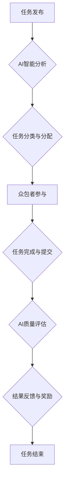

                 

## AI驱动的众包：全球协作的新时代

> 关键词：人工智能、众包、协作、自动化、机器学习、数据分析、全球化、未来趋势

### 1. 背景介绍

在当今数字时代，信息爆炸和全球化趋势日益加速，人类面临着前所未有的挑战和机遇。传统的工作模式和组织结构逐渐难以适应快速变化的社会需求。而人工智能（AI）技术的飞速发展，为我们提供了全新的解决方案，其中之一便是AI驱动的众包。

众包，即利用互联网平台，将任务分解成一个个小的单元，并通过公开招募全球范围内的参与者（众包者）来完成。这种模式具有成本低、效率高、资源灵活等优势，在各个领域得到了广泛应用。然而，传统的众包模式也存在一些问题，例如任务质量难以保证、参与者激励机制不完善、数据安全等。

AI技术的介入，为众包模式注入了新的活力。通过机器学习、自然语言处理等技术，AI可以自动识别和筛选优质的众包者，优化任务分配，提高任务完成效率和质量。同时，AI还可以帮助构建更完善的激励机制，保障数据安全，从而推动众包模式向更高效、更智能的方向发展。

### 2. 核心概念与联系

**2.1 核心概念**

* **人工智能 (AI):**  指模拟人类智能行为的计算机系统，包括机器学习、深度学习、自然语言处理等技术。
* **众包 (Crowdsourcing):** 利用互联网平台，将任务分解成一个个小的单元，并通过公开招募全球范围内的参与者（众包者）来完成。
* **AI驱动的众包:**  将人工智能技术应用于众包平台，实现任务自动化、智能分配、质量控制等功能，提升众包效率和质量。

**2.2 架构图**



**2.3 联系**

AI驱动的众包模式将AI技术与众包平台相结合，形成一个闭环系统。

* **任务发布:** 平台发布需要完成的任务，并提供相关信息。
* **AI智能分析:** AI系统对任务进行分析，识别任务类型、难度、所需技能等，并根据这些信息进行分类和分配。
* **任务分类与分配:** AI系统根据任务特点和众包者的能力进行匹配，将任务分配给最合适的参与者。
* **众包者参与:** 众包者接取任务，并根据任务要求完成工作。
* **任务完成与提交:** 众包者完成任务后，将结果提交到平台。
* **AI质量评估:** AI系统对提交的结果进行评估，判断其质量是否符合要求。
* **结果反馈与奖励:** 根据任务完成情况和质量，AI系统对众包者进行反馈和奖励。
* **任务结束:** 任务完成并得到确认后，平台结束任务。

### 3. 核心算法原理 & 具体操作步骤

**3.1 算法原理概述**

AI驱动的众包模式中，常用的算法包括：

* **机器学习算法:** 用于识别和筛选优质的众包者，预测任务完成时间和质量。
* **自然语言处理算法:** 用于理解任务描述，自动生成任务分配信息，以及对众包者提交的结果进行分析和评估。
* **推荐算法:** 用于根据众包者的历史行为和任务特点，推荐合适的任务。

**3.2 算法步骤详解**

1. **数据收集:** 收集众包者相关信息，例如个人资料、技能、历史任务完成情况等，以及任务相关信息，例如任务类型、难度、所需技能等。
2. **数据预处理:** 对收集到的数据进行清洗、转换和格式化，以便于算法训练和使用。
3. **模型训练:** 使用机器学习算法对预处理后的数据进行训练，建立预测模型。
4. **任务分配:** 根据任务特点和众包者的能力，利用推荐算法和机器学习模型，将任务分配给最合适的参与者。
5. **任务完成与评估:** 众包者完成任务后，AI系统对提交的结果进行评估，判断其质量是否符合要求。
6. **结果反馈与奖励:** 根据任务完成情况和质量，AI系统对众包者进行反馈和奖励。

**3.3 算法优缺点**

* **优点:** 提高任务完成效率和质量，降低成本，提高平台灵活性。
* **缺点:** 需要大量的数据进行训练，算法模型的准确性依赖于数据质量，存在算法偏差和公平性问题。

**3.4 算法应用领域**

* **数据标注:** AI驱动的众包平台可以用于标注图像、文本、音频等数据，为机器学习模型提供训练数据。
* **内容创作:** AI可以帮助众包者创作文章、视频、音乐等内容，并根据用户需求进行个性化定制。
* **软件测试:** AI驱动的众包平台可以用于测试软件的稳定性和功能性，发现潜在的bug。
* **市场调研:** AI可以帮助收集和分析用户反馈，了解市场需求和趋势。

### 4. 数学模型和公式 & 详细讲解 & 举例说明

**4.1 数学模型构建**

AI驱动的众包平台可以构建一个基于概率和决策论的数学模型，用于预测任务完成时间、质量和成本。

* **任务完成时间预测模型:** 可以使用回归模型，例如线性回归或支持向量回归，预测任务完成时间。
* **任务质量评估模型:** 可以使用分类模型，例如逻辑回归或支持向量机，预测任务质量是否符合要求。
* **任务成本优化模型:** 可以使用优化算法，例如遗传算法或模拟退火算法，优化任务分配策略，降低平台成本。

**4.2 公式推导过程**

* **任务完成时间预测模型:**

假设任务完成时间为 $T$, 众包者能力为 $S$, 任务难度为 $D$, 则可以使用以下线性回归模型进行预测:

$$T = a + bS + cD$$

其中 $a$, $b$, $c$ 为模型参数，可以通过训练数据进行估计。

* **任务质量评估模型:**

假设任务质量为 $Q$, 众包者经验为 $E$, 任务复杂度为 $C$, 则可以使用以下逻辑回归模型进行预测:

$$P(Q = 1) = \frac{1}{1 + e^{-(a + bE + cC)}}$$

其中 $P(Q = 1)$ 为任务质量符合要求的概率， $a$, $b$, $c$ 为模型参数，可以通过训练数据进行估计。

**4.3 案例分析与讲解**

例如，一个AI驱动的众包平台用于标注图像数据。平台可以收集众包者的标注历史数据、技能水平、标注速度等信息，以及图像数据的复杂度、标签数量等信息。

通过训练机器学习模型，平台可以预测每个众包者标注特定图像数据的完成时间、质量和成本。然后，平台可以根据这些预测结果，将任务分配给最合适的参与者，并根据任务完成情况进行奖励。

### 5. 项目实践：代码实例和详细解释说明

**5.1 开发环境搭建**

* 操作系统: Ubuntu 20.04 LTS
* Python 版本: 3.8.10
* 必要的库: TensorFlow, PyTorch, scikit-learn, Flask

**5.2 源代码详细实现**

```python
# 任务分配模块
def allocate_task(task, workers):
    # 使用推荐算法和机器学习模型，根据任务特点和众包者的能力，分配任务
    # ...

# 任务质量评估模块
def evaluate_task(result):
    # 使用机器学习模型，评估任务结果的质量
    # ...

# 奖励机制模块
def reward_worker(worker, task, quality):
    # 根据任务完成情况和质量，对众包者进行奖励
    # ...

# 应用程序入口
if __name__ == "__main__":
    # 初始化平台
    # ...

    # 接收任务请求
    # ...

    # 分配任务
    # ...

    # 接收任务结果
    # ...

    # 评估任务质量
    # ...

    # 发放奖励
    # ...
```

**5.3 代码解读与分析**

* 任务分配模块: 使用推荐算法和机器学习模型，根据任务特点和众包者的能力，分配任务。
* 任务质量评估模块: 使用机器学习模型，评估任务结果的质量。
* 奖励机制模块: 根据任务完成情况和质量，对众包者进行奖励。

**5.4 运行结果展示**

运行上述代码，可以实现一个基本的AI驱动的众包平台。平台可以接收任务请求，分配任务给合适的众包者，评估任务结果质量，并对众包者进行奖励。

### 6. 实际应用场景

**6.1 数据标注**

AI驱动的众包平台可以用于标注图像、文本、音频等数据，为机器学习模型提供训练数据。例如，自动驾驶汽车的训练需要大量的标注数据，AI驱动的众包平台可以帮助快速收集和标注这些数据。

**6.2 内容创作**

AI可以帮助众包者创作文章、视频、音乐等内容，并根据用户需求进行个性化定制。例如，电商平台可以利用AI驱动的众包平台，生成个性化的产品推荐文案。

**6.3 软件测试**

AI驱动的众包平台可以用于测试软件的稳定性和功能性，发现潜在的bug。例如，移动应用的测试需要模拟各种用户场景，AI驱动的众包平台可以帮助快速完成这些测试。

**6.4 其他应用场景**

* 市场调研
* 翻译
* 问答系统
* 人工智能助手

**6.5 未来应用展望**

随着AI技术的不断发展，AI驱动的众包模式将有更广泛的应用场景。例如，

* **个性化学习:** AI可以根据用户的学习情况，推荐合适的学习资源，并提供个性化的学习指导。
* **医疗诊断:** AI可以辅助医生进行诊断，提高诊断的准确性和效率。
* **科学研究:** AI可以帮助科学家分析海量数据，加速科学研究的进程。

### 7. 工具和资源推荐

**7.1 学习资源推荐**

* **书籍:**
    * 《人工智能：一种现代方法》
    * 《深度学习》
    * 《机器学习实战》
* **在线课程:**
    * Coursera: 人工智能课程
    * edX: 深度学习课程
    * Udacity: 机器学习工程师课程

**7.2 开发工具推荐**

* **机器学习框架:** TensorFlow, PyTorch, scikit-learn
* **云计算平台:** AWS, Azure, Google Cloud
* **众包平台:** Amazon Mechanical Turk, Upwork, Fiverr

**7.3 相关论文推荐**

* **AI驱动的众包:**
    * "Crowdsourcing with Artificial Intelligence: A Survey"
    * "AI-Powered Crowdsourcing for Data Annotation"
* **机器学习:**
    * "Machine Learning: A Probabilistic Perspective"
    * "The Elements of Statistical Learning"

### 8. 总结：未来发展趋势与挑战

**8.1 研究成果总结**

AI驱动的众包模式在各个领域取得了显著的成果，例如提高了数据标注效率、降低了软件测试成本、加速了科学研究进程等。

**8.2 未来发展趋势**

* **更智能的算法:** 未来，AI算法将更加智能，能够更好地理解任务需求、预测众包者行为、优化任务分配策略。
* **更广泛的应用场景:** AI驱动的众包模式将应用于更多领域，例如个性化教育、医疗诊断、科学研究等。
* **更完善的激励机制:** 未来，AI驱动的众包平台将设计更完善的激励机制，吸引更多优质的众包者参与。

**8.3 面临的挑战**

* **数据安全:** AI驱动的众包平台需要处理大量敏感数据，如何保障数据安全是一个重要的挑战。
* **算法偏差:** AI算法可能会存在偏差，导致不公平的分配或评估结果。
* **伦理问题:** AI驱动的众包模式可能会带来一些伦理问题，例如工作机会的减少、隐私的侵犯等。

**8.4 研究展望**

未来，我们需要继续研究AI驱动的众包模式，解决其面临的挑战，并探索其更大的潜力。


### 9. 附录：常见问题与解答

**9.1 如何选择合适的众包者？**

AI驱动的众包平台可以根据任务特点和众包者的能力，推荐最合适的参与者。

**9.2 如何保证任务质量？**

AI驱动的众包平台可以使用机器学习模型，评估任务结果的质量，并对不合格的结果进行处理。

**9.3 如何激励众包者？**

AI驱动的众包平台可以设计更完善的激励机制，例如根据任务完成情况和质量进行奖励，提供学习和技能提升的机会等。


作者：禅与计算机程序设计艺术 / Zen and the Art of Computer Programming 
<end_of_turn>

