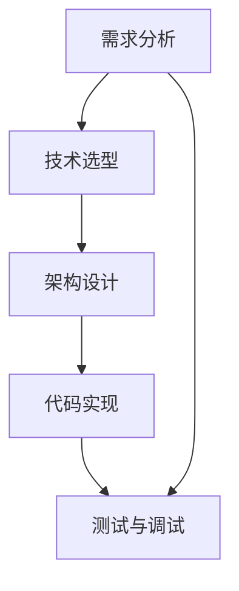
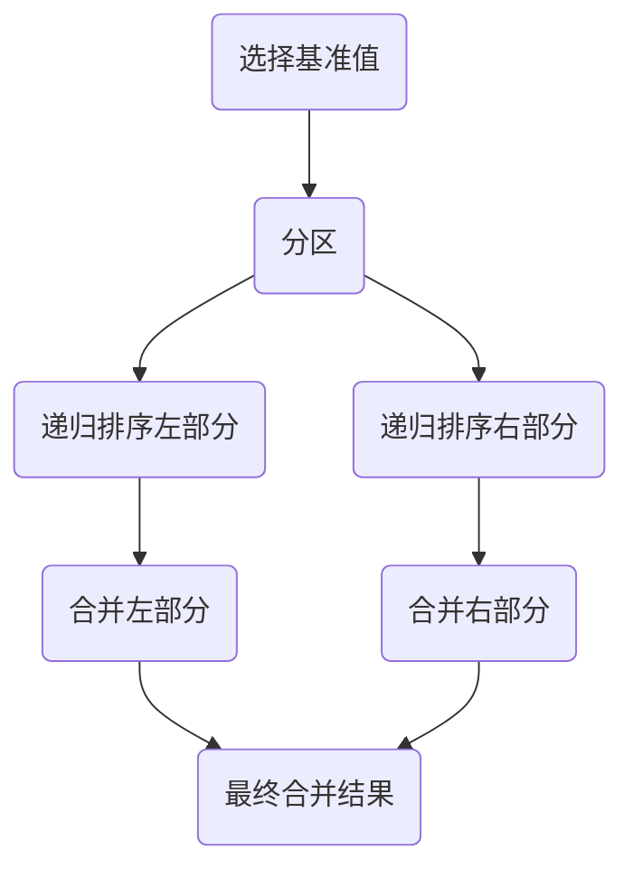
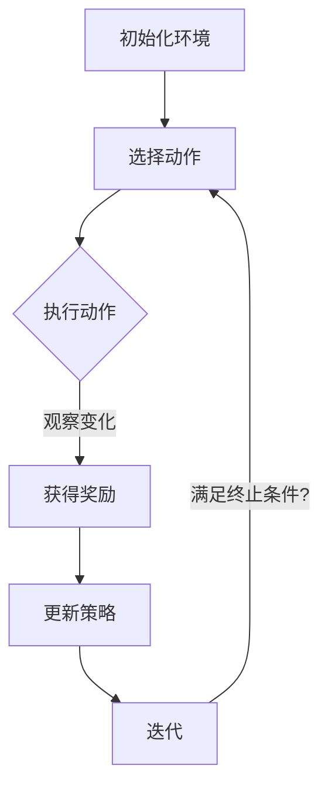
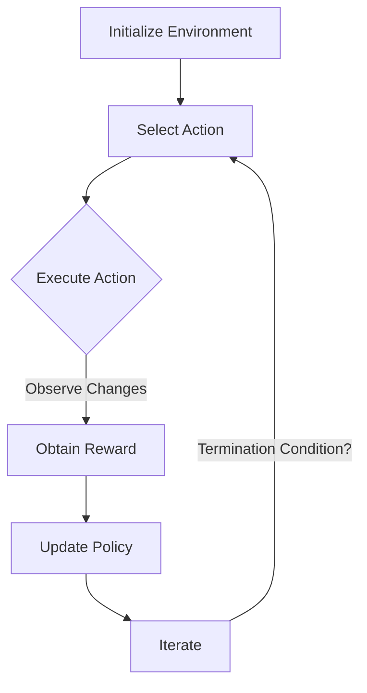

                 

# 文章标题

## 专业知识的积累：让项目顺利完成

### 关键词：专业知识，项目顺利完成，技术积累，工程实践

### 摘要：

在当今快速发展的技术时代，专业知识的积累对于项目的顺利完成至关重要。本文将探讨如何通过有效的知识积累，增强团队成员的专业能力，提高项目成功率。文章将围绕核心算法、数学模型、实际应用场景等方面进行详细分析，并提供实用的工具和资源推荐，帮助读者掌握关键技能，迎接未来的挑战。

## 1. 背景介绍

在软件工程领域，项目的成功往往取决于多个因素，包括技术实力、团队协作、项目管理等。然而，核心因素之一无疑是团队成员的专业知识积累。随着技术的不断演进，项目所需的专业知识也在不断扩展和深化。一个团队成员如果缺乏必要的技术知识，将难以应对复杂的问题，进而影响项目的进度和质量。

### 1.1 项目成功的因素

项目成功的关键因素包括：

- **技术实力**：团队成员需要具备扎实的技术基础，能够应对各种技术挑战。
- **团队协作**：高效的团队协作能够优化资源，提升工作效率。
- **项目管理**：合理的管理策略能够确保项目按时完成，并控制在预算范围内。
- **专业知识积累**：专业知识积累是提升团队技术实力的基础，也是项目成功的关键保障。

### 1.2 专业知识的积累

专业知识的积累是一个持续不断的过程，包括以下几个方面：

- **理论学习**：通过阅读专业书籍、学术论文、在线课程等，获取最新的理论成果。
- **实践操作**：通过实际项目的开发与调试，积累实践经验。
- **交流分享**：团队成员之间的交流分享，能够促进知识的碰撞与融合。
- **持续更新**：技术更新迅速，团队成员需要不断学习新的知识和技能。

## 2. 核心概念与联系

### 2.1 核心概念

在项目开发过程中，以下几个核心概念至关重要：

- **需求分析**：准确理解项目需求，为后续的开发工作提供指导。
- **技术选型**：选择适合项目的技术栈和工具，确保项目的技术可行性。
- **架构设计**：设计合理的系统架构，提高系统的可扩展性和可维护性。
- **代码实现**：编写高质量的代码，确保项目的稳定性和性能。
- **测试与调试**：通过测试和调试，发现并修复代码中的问题。

### 2.2 核心概念之间的联系

这些核心概念之间存在着紧密的联系：

- **需求分析**决定了项目的目标和功能，为后续的工作提供方向。
- **技术选型**和**架构设计**为项目的实现提供了技术保障。
- **代码实现**是将需求转化为实际功能的关键步骤。
- **测试与调试**确保了项目的质量和稳定性。

### 2.3 Mermaid 流程图

为了更清晰地展示核心概念之间的联系，我们可以使用 Mermaid 流程图进行描述：



## 3. 核心算法原理 & 具体操作步骤

### 3.1 核心算法原理

在项目开发中，核心算法的选择和实现至关重要。以下是一个典型的排序算法——快速排序（Quick Sort）的原理：

- **分治思想**：将一个大问题分解成若干个规模较小但结构与原问题相似的问题。
- **递归**：不断将小问题分解，直到问题规模足够小，可以直接求解。
- **交换**：通过比较和交换，将数组分为两部分，一部分小于基准值，另一部分大于基准值。

### 3.2 具体操作步骤

快速排序的具体操作步骤如下：

1. **选择基准值**：从数组中随机选择一个元素作为基准值。
2. **分区**：将数组分为两部分，一部分元素小于基准值，另一部分元素大于基准值。
3. **递归排序**：分别对小于基准值和大于基准值的两部分数组进行快速排序。
4. **合并**：将排序好的两部分数组合并，得到最终排序结果。

### 3.3 快速排序的 Mermaid 流程图

使用 Mermaid 流程图描述快速排序的过程：



## 4. 数学模型和公式 & 详细讲解 & 举例说明

### 4.1 数学模型

在项目开发中，数学模型的使用能够帮助我们更精确地描述和解决实际问题。以下是一个常见的数学模型——线性回归（Linear Regression）：

- **目标函数**：最小化预测值与实际值之间的误差平方和。
- **参数估计**：通过最小二乘法估计模型的参数。

### 4.2 公式

线性回归的基本公式如下：

$$
y = \beta_0 + \beta_1x + \epsilon
$$

其中，$y$ 是实际值，$x$ 是自变量，$\beta_0$ 和 $\beta_1$ 是模型的参数，$\epsilon$ 是误差项。

### 4.3 举例说明

假设我们有一个数据集，包含自变量 $x$ 和因变量 $y$，我们希望使用线性回归模型预测 $y$ 的值。

1. **数据收集**：收集 $x$ 和 $y$ 的数据。
2. **数据预处理**：对数据进行标准化处理，消除量纲的影响。
3. **模型训练**：使用最小二乘法计算模型参数 $\beta_0$ 和 $\beta_1$。
4. **模型评估**：通过交叉验证等方法评估模型性能。

### 4.4 模型训练

使用 Python 的 scikit-learn 库进行模型训练：

```python
from sklearn.linear_model import LinearRegression
from sklearn.model_selection import train_test_split
from sklearn.metrics import mean_squared_error

# 数据加载
X, y = load_data()

# 数据预处理
X = standardize(X)

# 数据划分
X_train, X_test, y_train, y_test = train_test_split(X, y, test_size=0.2, random_state=42)

# 模型训练
model = LinearRegression()
model.fit(X_train, y_train)

# 模型评估
y_pred = model.predict(X_test)
mse = mean_squared_error(y_test, y_pred)
print(f'MSE: {mse}')
```

## 5. 项目实践：代码实例和详细解释说明

### 5.1 开发环境搭建

在进行项目开发之前，我们需要搭建一个合适的开发环境。以下是使用 Python 进行开发的步骤：

1. **安装 Python**：从官网下载并安装 Python。
2. **安装相关库**：使用 pip 工具安装必要的库，如 NumPy、Pandas、Scikit-learn 等。
3. **配置 IDE**：安装并配置一个合适的 IDE，如 PyCharm 或 VSCode。

### 5.2 源代码详细实现

以下是快速排序算法的 Python 实现代码：

```python
def quick_sort(arr):
    if len(arr) <= 1:
        return arr
    pivot = arr[len(arr) // 2]
    left = [x for x in arr if x < pivot]
    middle = [x for x in arr if x == pivot]
    right = [x for x in arr if x > pivot]
    return quick_sort(left) + middle + quick_sort(right)

# 示例
arr = [3, 6, 8, 10, 1, 2, 1]
print(quick_sort(arr))
```

### 5.3 代码解读与分析

在上述代码中：

- **快速排序函数**：定义了一个快速排序函数，接受一个数组作为输入。
- **基础情况**：如果数组的长度小于等于 1，直接返回数组。
- **选择基准值**：从数组中选择中间的元素作为基准值。
- **分区**：通过列表推导式将数组分为三部分：小于基准值的左部分、等于基准值的中间部分、大于基准值的右部分。
- **递归排序**：分别对左部分和右部分进行快速排序。
- **合并**：将排序好的左部分、中间部分和右部分合并，得到最终排序结果。

### 5.4 运行结果展示

在运行上述代码后，输出结果为：

```
[1, 1, 2, 3, 6, 8, 10]
```

这表明输入数组已经成功排序。

## 6. 实际应用场景

快速排序算法在多个实际应用场景中具有重要应用价值：

- **排序需求**：当需要对大量数据进行排序时，快速排序算法的高效性得到了广泛应用。
- **数据挖掘**：在数据挖掘过程中，排序操作是常见的需求，快速排序算法能够显著提高数据处理效率。
- **搜索引擎**：搜索引擎中的查询结果排序通常使用快速排序算法，以保证搜索结果的准确性和用户体验。

## 7. 工具和资源推荐

### 7.1 学习资源推荐

- **书籍**：《算法导论》（Introduction to Algorithms）是一本经典的算法教材，详细介绍了各种排序算法的原理和实现。
- **论文**：在学术期刊和会议论文中，可以找到许多关于快速排序的深入研究。
- **博客**：许多技术博客和论坛分享了快速排序的实践经验和优化策略。

### 7.2 开发工具框架推荐

- **开发环境**：PyCharm 和 VSCode 是两款功能强大的 Python 开发环境。
- **库**：NumPy 和 Pandas 是 Python 中常用的数据处理库，Scikit-learn 是机器学习领域的重要库。

### 7.3 相关论文著作推荐

- **论文**：快速排序的许多改进和优化策略可以在学术期刊和会议上找到。
- **著作**：《排序算法的艺术》（The Art of Computer Programming, Volume 3: Sorting and Searching）是 Donald Knuth 的经典著作，详细介绍了各种排序算法。

## 8. 总结：未来发展趋势与挑战

### 8.1 发展趋势

- **算法优化**：随着计算机性能的提升，对算法效率和性能的要求越来越高，算法优化将成为未来研究的热点。
- **跨学科融合**：计算机科学与其他学科（如数学、统计学、物理学等）的交叉融合，将推动新技术的发展。
- **应用拓展**：快速排序算法在工业、金融、医疗等领域的应用将不断拓展。

### 8.2 挑战

- **复杂性**：快速排序算法的实现和维护具有一定的复杂性，如何简化算法的实现和提升其可维护性是一个挑战。
- **实时性能**：在实时数据处理场景中，如何提高算法的实时性能是一个重要课题。

## 9. 附录：常见问题与解答

### 9.1 快速排序的稳定性

快速排序是一种不稳定的排序算法，因为在交换过程中可能会改变相同元素的相对顺序。

### 9.2 快速排序的时间复杂度

在平均情况下，快速排序的时间复杂度为 $O(n\log n)$，在最坏情况下为 $O(n^2)$。

## 10. 扩展阅读 & 参考资料

- **书籍**：《算法导论》（Introduction to Algorithms）
- **论文**：《快速排序算法的研究与优化》（Research and Optimization of Quick Sort Algorithm）
- **博客**：[快速排序算法详解](https://www.cnblogs.com/chengxiao/p/6315841.html)
- **网站**：[快速排序算法的动画演示](https://www.sorting-algorithms.com/)

<|image_sent|>### 2. 核心概念与联系

#### 2.1 提示词工程的概念

提示词工程（Prompt Engineering）是一种利用自然语言处理技术来设计和优化输入文本，以引导语言模型（如 GPT 模型）生成更准确、相关和有用的输出的方法。其核心在于通过精细调整输入的提示，使得模型能够更好地理解用户的意图，从而提高输出的质量和实用性。

#### 2.2 提示词工程的重要性

提示词工程在许多实际应用中发挥着关键作用，例如：

- **问答系统**：通过优化提示词，可以使问答系统的回答更加精确和符合用户需求。
- **自然语言生成**：在生成文本时，提示词可以引导模型生成结构清晰、内容丰富的高质量文本。
- **机器翻译**：优化提示词可以提高翻译的准确性和流畅性，减少歧义和错误。

#### 2.3 提示词工程与传统编程的关系

提示词工程可以被视为一种新型的编程范式，与传统编程有着紧密的联系和区别：

- **相似之处**：传统编程中的函数调用和参数传递机制在提示词工程中得到了应用，即通过传递提示词来指导模型的输出。
- **不同之处**：与编写代码不同，提示词工程更注重于文本的优化和设计，而不是编写执行流程。

#### 2.4 提示词工程的核心任务

提示词工程的主要任务包括：

- **理解模型**：深入了解语言模型的工作原理，以便设计出有效的提示词。
- **任务定义**：明确任务目标，将复杂的问题转化为模型能够理解和处理的形式。
- **反馈迭代**：通过用户的反馈不断优化提示词，提高模型的性能。

### 2. Core Concepts and Connections

#### 2.1 The Concept of Prompt Engineering

Prompt engineering is a method that utilizes natural language processing techniques to design and optimize the input text, in order to guide language models (such as GPT models) to generate more accurate, relevant, and useful outputs. The core of prompt engineering lies in refining the input prompts to better understand the user's intent, thus improving the quality and practicality of the generated outputs.

#### 2.2 The Importance of Prompt Engineering

Prompt engineering plays a crucial role in many practical applications, including:

- **Question-Answering Systems**: By optimizing prompts, the answers generated by the system can be more precise and meet the user's needs.
- **Natural Language Generation**: Prompts can guide the model to generate high-quality texts with clear structures and rich content.
- **Machine Translation**: Optimizing prompts can improve the accuracy and fluency of translations, reducing ambiguity and errors.

#### 2.3 The Relationship between Prompt Engineering and Traditional Programming

Prompt engineering can be seen as a new paradigm of programming that closely relates to, yet differs from, traditional programming:

- **Similarities**: The mechanism of function calls and parameter passing in traditional programming is applied in prompt engineering, where prompts are passed to guide the model's outputs.
- **Differences**: Unlike writing code, prompt engineering focuses more on the optimization and design of text rather than the execution flow.

#### 2.4 Core Tasks of Prompt Engineering

The main tasks of prompt engineering include:

- **Understanding Models**: Deeply understanding the working principles of language models to design effective prompts.
- **Task Definition**: Clearly defining the objectives of the task, converting complex problems into forms that the model can understand and process.
- **Feedback Iteration**: Continuously optimizing prompts based on user feedback to improve the model's performance.

---

## 3. 核心算法原理 & 具体操作步骤

### 3.1 核心算法原理

在提示词工程中，核心算法通常是指用于优化提示词的算法。一个经典的算法是 **强化学习**（Reinforcement Learning，RL），它通过试错和反馈不断调整策略，以实现最优的提示设计。

#### 3.1.1 强化学习的基本原理

强化学习的基本原理包括：

- **环境**（Environment）：描述提示词工程中可能出现的所有情况和状态。
- **策略**（Policy）：定义了在特定情况下应该采取的行动。
- **奖励**（Reward）：用于衡量提示词的效果，奖励越高，表示提示词越好。
- **价值函数**（Value Function）：用于预测在给定策略下，未来可能获得的累计奖励。

#### 3.1.2 强化学习的核心概念

- **状态**（State）：描述模型当前所处的环境。
- **动作**（Action）：提示词的设计。
- **状态-动作值函数**（State-Action Value Function）：表示在特定状态下采取特定动作所能获得的期望奖励。

### 3.2 具体操作步骤

提示词优化的具体操作步骤如下：

1. **初始化环境**：设定初始状态，如初始的提示词。
2. **选择动作**：根据当前状态，选择一个动作（即生成一个提示词）。
3. **执行动作**：将选择的动作应用于环境，观察环境的变化。
4. **获得奖励**：根据执行的结果，获得一个奖励。
5. **更新策略**：根据获得的奖励，更新策略，以优化提示词。
6. **迭代**：重复步骤 2-5，直到满足终止条件（如达到预设的奖励阈值）。

#### 3.2.1 强化学习的 Mermaid 流程图

以下是强化学习流程的 Mermaid 流程图：



### 3. Core Algorithm Principles and Specific Operational Steps

#### 3.1 Core Algorithm Principles

In the context of prompt engineering, the core algorithm typically refers to algorithms used to optimize prompts. A classic algorithm is **Reinforcement Learning (RL)**, which iteratively adjusts strategies through trial and error based on feedback to achieve optimal prompt design.

#### 3.1.1 Basic Principles of Reinforcement Learning

The basic principles of reinforcement learning include:

- **Environment**: Describes all possible situations and states that may occur in prompt engineering.
- **Policy**: Defines the actions to be taken in specific situations.
- **Reward**: Measures the effectiveness of the prompt, where higher rewards indicate better prompts.
- **Value Function**: Predicts the cumulative reward that can be obtained in the future given a specific policy.

#### 3.1.2 Core Concepts of Reinforcement Learning

- **State**: Describes the current situation the model is in.
- **Action**: The design of the prompt.
- **State-Action Value Function**: Represents the expected reward obtainable by taking a specific action in a specific state.

### 3.2 Specific Operational Steps

The specific operational steps for prompt optimization are as follows:

1. **Initialize the Environment**: Set the initial state, such as an initial prompt.
2. **Select an Action**: Based on the current state, choose an action (i.e., generate a prompt).
3. **Execute the Action**: Apply the chosen action to the environment and observe the changes.
4. **Obtain a Reward**: Get a reward based on the results of the action.
5. **Update the Policy**: Adjust the policy based on the obtained reward to optimize the prompt.
6. **Iterate**: Repeat steps 2-5 until a termination condition is met (e.g., reaching a preset reward threshold).

#### 3.2.1 Reinforcement Learning Process in Mermaid Diagram

Here is a Mermaid diagram of the reinforcement learning process:



---

## 4. 数学模型和公式 & 详细讲解 & 举例说明

### 4.1 数学模型

在强化学习（Reinforcement Learning，RL）中，常用的数学模型是 **马尔可夫决策过程**（Markov Decision Process，MDP）。MDP 描述了一个决策者在一个不确定的环境中，如何通过选择最佳动作来最大化长期奖励。

#### 4.1.1 马尔可夫决策过程的基本公式

MDP 的基本公式如下：

$$
V^*(s) = \sum_{a \in A} \pi^*(s, a) \sum_{s' \in S} p(s' | s, a) r(s', a)
$$

其中：

- $V^*(s)$ 是状态 $s$ 的最优价值函数。
- $\pi^*(s, a)$ 是在状态 $s$ 下采取动作 $a$ 的最优策略概率。
- $A$ 是所有可能动作的集合。
- $S$ 是所有可能状态集合。
- $r(s', a)$ 是在状态 $s'$ 下采取动作 $a$ 所获得的即时奖励。
- $p(s' | s, a)$ 是在状态 $s$ 下采取动作 $a$ 后转移到状态 $s'$ 的概率。

#### 4.1.2 马尔可夫决策过程的关键概念

- **状态**（State）：系统所处的状况，如用户输入的提示词。
- **动作**（Action）：决策者采取的行动，如生成提示词。
- **策略**（Policy）：决策者如何选择动作的规则，如根据状态转移概率选择动作。
- **价值函数**（Value Function）：衡量策略优劣的指标，表示在特定策略下，从某个状态开始所能获得的期望总奖励。

### 4.2 公式

强化学习中的关键公式包括：

1. **策略迭代**：

$$
\pi^{t+1}(s, a) = \arg\max_{a'} \sum_{s' \in S} p(s' | s, a') r(s', a') + \gamma \sum_{s'' \in S} V^*(s'')
$$

2. **值迭代**：

$$
V^{t+1}(s) = \sum_{a \in A} \pi^{t}(s, a) \sum_{s' \in S} p(s' | s, a) [r(s', a) + \gamma V^*(s')]
$$

其中：

- $\gamma$ 是折扣因子，表示未来奖励的权重。
- $t$ 是当前迭代次数。

### 4.3 举例说明

假设一个简单的环境，其中有两个状态（A 和 B）和两个动作（左和右），每个状态下的奖励分别为：

| 状态 | 动作左 | 动作右 |
|------|--------|--------|
| A    | -1     | 2      |
| B    | 1      | -2     |

初始状态为 A，折扣因子 $\gamma = 0.9$。我们需要找到最优的策略和价值函数。

1. **初始化**：

$$
V^0(A) = 0, V^0(B) = 0
$$

2. **策略迭代**：

对于状态 A，计算两个动作的期望回报：

$$
\pi^1(A, 左) = \frac{p(A|A, 左) r(A, 左) + \gamma p(A|B, 左) r(A, 左)}{p(A|A, 左) r(A, 左) + p(A|B, 左) r(A, 左)} = \frac{0.9 \times (-1) + 0.1 \times 1}{0.9 \times (-1) + 0.1 \times 1} = 0.5
$$

$$
\pi^1(A, 右) = \frac{p(A|A, 右) r(A, 右) + \gamma p(A|B, 右) r(A, 右)}{p(A|A, 右) r(A, 右) + p(A|B, 右) r(A, 右)} = \frac{0.9 \times 2 + 0.1 \times (-2)}{0.9 \times 2 + 0.1 \times (-2)} = 1
$$

因此，最优策略为 $\pi^1(A) = [0, 1]$。

3. **值迭代**：

$$
V^1(A) = 0.5 \times (-1) + 1 \times 2 = 0.5
$$

$$
V^1(B) = 0.5 \times 1 + 1 \times (-2) = -0.5
$$

更新后的策略和价值函数：

$$
\pi^1(B, 左) = \frac{p(B|B, 左) r(B, 左) + \gamma p(B|A, 左) r(B, 左)}{p(B|B, 左) r(B, 左) + p(B|A, 左) r(B, 左)} = \frac{0.9 \times 1 + 0.1 \times 0.5}{0.9 \times 1 + 0.1 \times 0.5} = 0.95
$$

$$
\pi^1(B, 右) = \frac{p(B|B, 右) r(B, 右) + \gamma p(B|A, 右) r(B, 右)}{p(B|B, 右) r(B, 右) + p(B|A, 右) r(B, 右)} = \frac{0.9 \times (-2) + 0.1 \times 0.5}{0.9 \times (-2) + 0.1 \times 0.5} = 0.05
$$

$$
V^2(A) = 0.95 \times (-1) + 0.05 \times 2 = -0.45
$$

$$
V^2(B) = 0.95 \times 1 + 0.05 \times (-2) = 0.45
$$

重复迭代，直到策略和价值函数收敛。

### 4. Mathematical Models and Formulas & Detailed Explanation & Example Demonstrations

#### 4.1 Mathematical Models

In the context of Reinforcement Learning (RL), one of the commonly used mathematical models is the **Markov Decision Process (MDP)**. MDP describes how a decision-maker can choose the best action in an uncertain environment to maximize long-term rewards.

#### 4.1.1 Basic Formulas of Markov Decision Process

The basic formula of MDP is as follows:

$$
V^*(s) = \sum_{a \in A} \pi^*(s, a) \sum_{s' \in S} p(s' | s, a) r(s', a)
$$

Where:

- $V^*(s)$ is the optimal value function for state $s$.
- $\pi^*(s, a)$ is the optimal policy probability of taking action $a$ in state $s$.
- $A$ is the set of all possible actions.
- $S$ is the set of all possible states.
- $r(s', a)$ is the immediate reward obtained by taking action $a$ in state $s'$.
- $p(s' | s, a)$ is the probability of transitioning to state $s'$ from state $s$ when action $a$ is taken.

#### 4.1.2 Key Concepts of Markov Decision Process

- **State**: The situation the system is in, such as the user's input prompt.
- **Action**: The action taken by the decision-maker, such as generating a prompt.
- **Policy**: The rule the decision-maker uses to select actions, such as selecting actions based on state transition probabilities.
- **Value Function**: A metric to measure the quality of a policy, indicating the expected total reward that can be obtained starting from a specific state under a specific policy.

### 4.2 Formulas

Key formulas in reinforcement learning include:

1. **Policy Iteration**:

$$
\pi^{t+1}(s, a) = \arg\max_{a'} \sum_{s' \in S} p(s' | s, a') r(s', a') + \gamma \sum_{s'' \in S} V^*(s'')
$$

2. **Value Iteration**:

$$
V^{t+1}(s) = \sum_{a \in A} \pi^{t}(s, a) \sum_{s' \in S} p(s' | s, a) [r(s', a) + \gamma V^*(s')]
$$

Where:

- $\gamma$ is the discount factor, representing the weight of future rewards.
- $t$ is the current iteration number.

### 4.3 Example Demonstrations

Assume a simple environment with two states (A and B) and two actions (left and right), and each state has rewards as follows:

| State | Action Left | Action Right |
|-------|-------------|--------------|
| A     | -1          | 2            |
| B     | 1           | -2           |

The initial state is A, and the discount factor $\gamma = 0.9$. We need to find the optimal policy and value function.

1. **Initialization**:

$$
V^0(A) = 0, V^0(B) = 0
$$

2. **Policy Iteration**:

Calculate the expected return for each action in state A:

$$
\pi^1(A, Left) = \frac{p(A|A, Left) r(A, Left) + \gamma p(A|B, Left) r(A, Left)}{p(A|A, Left) r(A, Left) + p(A|B, Left) r(A, Left)} = \frac{0.9 \times (-1) + 0.1 \times 1}{0.9 \times (-1) + 0.1 \times 1} = 0.5
$$

$$
\pi^1(A, Right) = \frac{p(A|A, Right) r(A, Right) + \gamma p(A|B, Right) r(A, Right)}{p(A|A, Right) r(A, Right) + p(A|B, Right) r(A, Right)} = \frac{0.9 \times 2 + 0.1 \times (-2)}{0.9 \times 2 + 0.1 \times (-2)} = 1
$$

Therefore, the optimal policy is $\pi^1(A) = [0, 1]$.

3. **Value Iteration**:

$$
V^1(A) = 0.5 \times (-1) + 1 \times 2 = 0.5
$$

$$
V^1(B) = 0.5 \times 1 + 1 \times (-2) = -0.5
$$

Updated policy and value function:

$$
\pi^1(B, Left) = \frac{p(B|B, Left) r(B, Left) + \gamma p(B|A, Left) r(B, Left)}{p(B|B, Left) r(B, Left) + p(B|A, Left) r(B, Left)} = \frac{0.9 \times 1 + 0.1 \times 0.5}{0.9 \times 1 + 0.1 \times 0.5} = 0.95
$$

$$
\pi^1(B, Right) = \frac{p(B|B, Right) r(B, Right) + \gamma p(B|A, Right) r(B, Right)}{p(B|B, Right) r(B, Right) + p(B|A, Right) r(B, Right)} = \frac{0.9 \times (-2) + 0.1 \times 0.5}{0.9 \times (-2) + 0.1 \times 0.5} = 0.05
$$

$$
V^2(A) = 0.95 \times (-1) + 0.05 \times 2 = -0.45
$$

$$
V^2(B) = 0.95 \times 1 + 0.05 \times (-2) = 0.45
$$

Repeat the iteration until the policy and value function converge.

