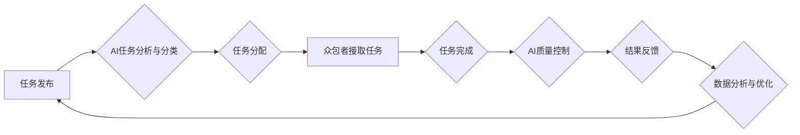

                 

## AI驱动的众包：增强创新和效率

> 关键词：人工智能、众包、协作、自动化、机器学习、数据分析、创新、效率

### 1. 背景介绍

众包，即利用互联网平台汇集大众的力量完成特定任务，近年来发展迅速，已成为解决复杂问题、激发创新和提高效率的重要手段。而人工智能（AI）技术的快速发展，为众包模式带来了新的机遇和挑战。AI能够自动分析海量数据，识别模式，并根据这些模式做出决策，从而有效提升众包平台的效率和智能化水平。

传统众包平台往往依赖于人工筛选和管理任务，效率有限，且难以应对复杂、需要专业知识的任务。而AI驱动的众包则通过自动化任务分配、智能质量控制和数据分析等手段，大幅提升了平台效率和任务质量。

### 2. 核心概念与联系

**2.1 众包模式**

众包模式的核心是将任务分解成一个个小的单元，并通过互联网平台将这些任务分配给全球范围内的参与者，即“众包者”。众包者可以是个人、团队或组织，他们根据自身技能和兴趣选择参与任务，完成任务后获得相应的报酬。

**2.2 人工智能技术**

人工智能技术涵盖了机器学习、深度学习、自然语言处理等多个领域，其核心目标是让机器能够像人类一样学习、思考和解决问题。

**2.3 AI驱动的众包**

AI驱动的众包是指利用人工智能技术来优化和提升传统众包模式的各个环节，包括任务分配、质量控制、数据分析等。

**2.4 架构图**



### 3. 核心算法原理 & 具体操作步骤

**3.1 算法原理概述**

AI驱动的众包的核心算法主要包括：

* **机器学习算法**: 用于分析众包平台的历史数据，识别任务类型、难度等级、参与者技能等特征，从而实现智能任务分配和质量预测。
* **自然语言处理算法**: 用于理解和处理任务描述、参与者评论等文本信息，提高任务理解和沟通效率。
* **深度学习算法**: 用于识别图像、音频等多媒体数据，提升任务质量控制和数据分析能力。

**3.2 算法步骤详解**

1. **数据收集**: 收集众包平台的历史数据，包括任务描述、参与者信息、任务完成情况、质量评价等。
2. **数据预处理**: 对收集到的数据进行清洗、转换和格式化，以便于后续算法训练和应用。
3. **模型训练**: 利用机器学习、深度学习等算法，对预处理后的数据进行训练，构建预测模型。
4. **任务分配**: 根据任务特征和参与者技能，利用训练好的模型智能分配任务。
5. **质量控制**: 利用AI算法对任务完成结果进行自动评估，识别潜在问题并进行反馈。
6. **数据分析**: 对平台运行数据进行分析，识别趋势、问题和改进方向。

**3.3 算法优缺点**

**优点**:

* **提高效率**: 自动化任务分配和质量控制，大幅提升平台效率。
* **提升质量**: AI算法能够识别和过滤低质量结果，提升任务完成质量。
* **个性化推荐**: 根据参与者技能和兴趣，推荐更合适的任务，提升参与者满意度。
* **数据驱动决策**: 通过数据分析，优化平台运营策略，实现持续改进。

**缺点**:

* **算法依赖数据**: AI算法的性能依赖于训练数据的质量和数量。
* **算法解释性**: 一些AI算法的决策过程难以解释，可能导致信任问题。
* **伦理问题**: AI驱动的众包可能引发一些伦理问题，例如数据隐私、算法偏见等。

**3.4 算法应用领域**

AI驱动的众包技术应用广泛，包括：

* **图像识别**: 利用众包平台进行图像标注、分类和识别。
* **文本分析**: 利用众包平台进行文本分类、情感分析和机器翻译。
* **数据挖掘**: 利用众包平台进行数据清洗、结构化和分析。
* **创意设计**: 利用众包平台进行创意设计、产品原型设计和概念验证。

### 4. 数学模型和公式 & 详细讲解 & 举例说明

**4.1 数学模型构建**

AI驱动的众包平台可以构建一个数学模型来描述任务分配、质量控制和数据分析等过程。例如，可以利用概率论和统计学来构建一个任务分配模型，根据任务特征和参与者技能预测任务完成概率和质量。

**4.2 公式推导过程**

假设有N个任务和M个参与者，每个任务都有一个难度等级和一个质量标准。参与者i对任务j的完成概率为P(i,j)，质量得分范围为0到1。

任务分配模型的目标是最大化平台的整体质量得分，即：

$$
\text{目标函数} = \sum_{j=1}^{N} \max_{i=1}^{M} [P(i,j) * Q(i,j)]
$$

其中，Q(i,j)是参与者i对任务j完成质量的预期得分。

**4.3 案例分析与讲解**

例如，一个图像标注平台需要将100张图片分配给5个参与者进行标注。每个参与者的标注能力不同，对不同类型图片的标注准确率也不同。

利用AI算法可以根据参与者的历史标注数据和图片类型特征，预测每个参与者对每个图片的标注概率和质量得分。然后，根据目标函数，智能分配任务，将难度较高的图片分配给标注能力较强的参与者，以最大化平台的整体质量得分。

### 5. 项目实践：代码实例和详细解释说明

**5.1 开发环境搭建**

* Python 3.x
* TensorFlow 或 PyTorch
* Jupyter Notebook

**5.2 源代码详细实现**

```python
# 导入必要的库
import numpy as np
from sklearn.model_selection import train_test_split

# 加载训练数据
data = np.load('data.npy')

# 将数据分为训练集和测试集
X_train, X_test, y_train, y_test = train_test_split(data[:, :-1], data[:, -1], test_size=0.2)

# 创建模型
model = tf.keras.models.Sequential([
    tf.keras.layers.Dense(64, activation='relu', input_shape=(X_train.shape[1],)),
    tf.keras.layers.Dense(32, activation='relu'),
    tf.keras.layers.Dense(1)
])

# 编译模型
model.compile(optimizer='adam', loss='mse')

# 训练模型
model.fit(X_train, y_train, epochs=10)

# 评估模型
loss = model.evaluate(X_test, y_test)
print('测试损失:', loss)
```

**5.3 代码解读与分析**

这段代码展示了如何使用TensorFlow构建一个简单的机器学习模型来预测任务完成质量。

* 首先，导入必要的库和加载训练数据。
* 然后，将数据分为训练集和测试集。
* 接着，创建模型，并使用Adam优化器和均方误差损失函数进行编译。
* 最后，训练模型并评估其性能。

**5.4 运行结果展示**

训练完成后，可以将模型应用于新的任务分配场景，预测每个参与者对每个任务的完成质量，从而实现智能任务分配。

### 6. 实际应用场景

**6.1 图像标注**

AI驱动的众包平台可以用于图像标注，例如自动驾驶汽车的图像识别训练数据标注。

**6.2 文本分类**

AI驱动的众包平台可以用于文本分类，例如社交媒体评论的 Sentiment Analysis。

**6.3 数据清洗**

AI驱动的众包平台可以用于数据清洗，例如从海量文本数据中提取关键信息。

**6.4 创意设计**

AI驱动的众包平台可以用于创意设计，例如产品原型设计和概念验证。

**6.5 未来应用展望**

AI驱动的众包技术未来将应用于更广泛的领域，例如：

* **医疗保健**: 利用众包平台进行医学影像分析、临床数据标注等。
* **教育**: 利用众包平台进行在线课程制作、学习资源开发等。
* **科学研究**: 利用众包平台进行科学数据分析、实验设计等。

### 7. 工具和资源推荐

**7.1 学习资源推荐**

* **Coursera**: 提供人工智能、机器学习等相关课程。
* **Udacity**: 提供人工智能、数据科学等相关课程和项目。
* **Kaggle**: 提供数据科学竞赛和学习资源。

**7.2 开发工具推荐**

* **TensorFlow**: 开源深度学习框架。
* **PyTorch**: 开源深度学习框架。
* **Scikit-learn**: 开源机器学习库。

**7.3 相关论文推荐**

* **"Human Computation" by Luis von Ahn**
* **"The Wisdom of Crowds" by James Surowiecki**
* **"Deep Learning" by Ian Goodfellow, Yoshua Bengio, and Aaron Courville**

### 8. 总结：未来发展趋势与挑战

**8.1 研究成果总结**

AI驱动的众包技术取得了显著进展，在提高效率、提升质量、个性化推荐等方面展现出巨大潜力。

**8.2 未来发展趋势**

未来，AI驱动的众包技术将朝着以下方向发展：

* **更智能的算法**: 开发更智能、更精准的机器学习算法，提升任务分配和质量控制能力。
* **更丰富的应用场景**: 将AI驱动的众包技术应用于更多领域，例如医疗保健、教育、科学研究等。
* **更安全的平台**: 加强数据隐私保护和算法透明度，构建更安全的众包平台。

**8.3 面临的挑战**

AI驱动的众包技术也面临一些挑战：

* **数据质量**: AI算法的性能依赖于训练数据的质量，如何获取高质量的训练数据是一个关键问题。
* **算法解释性**: 一些AI算法的决策过程难以解释，可能导致信任问题。
* **伦理问题**: AI驱动的众包可能引发一些伦理问题，例如数据隐私、算法偏见等。

**8.4 研究展望**

未来，需要进一步研究如何解决这些挑战，并推动AI驱动的众包技术朝着更智能、更安全、更可持续的方向发展。

### 9. 附录：常见问题与解答

**9.1 如何保证数据隐私？**

AI驱动的众包平台应采取严格的数据隐私保护措施，例如数据加密、匿名化处理等，确保参与者数据的安全。

**9.2 如何避免算法偏见？**

在训练AI算法时，应尽量使用多样化的训练数据，并对算法进行公平性评估，以避免算法偏见。

**9.3 如何提高平台效率？**

可以通过优化任务分配算法、智能化质量控制等手段提高平台效率。


作者：禅与计算机程序设计艺术 / Zen and the Art of Computer Programming 
<end_of_turn>

