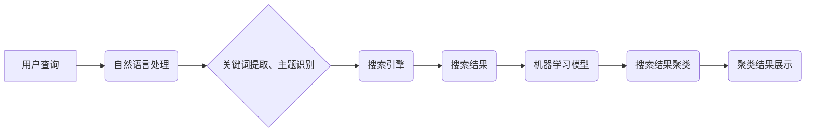

                 

## AI驱动的搜索结果聚类展示

> 关键词：搜索结果聚类、人工智能、机器学习、自然语言处理、信息检索、用户体验、推荐系统

## 1. 背景介绍

在信息爆炸的时代，海量数据无处不在，搜索引擎作为信息获取的主要入口，面临着如何有效地组织和呈现海量搜索结果的挑战。传统的搜索引擎主要依靠关键词匹配和排名算法，但对于用户提出的复杂查询，往往难以提供精准、有针对性的结果。

AI驱动的搜索结果聚类展示技术应运而生，它利用人工智能和机器学习算法，对搜索结果进行智能分析和分类，将相关结果进行聚合，并以更直观、易懂的方式呈现给用户，从而提升用户搜索体验和信息获取效率。

## 2. 核心概念与联系

### 2.1 搜索结果聚类

搜索结果聚类是指将搜索引擎返回的众多结果按照主题、内容相似度等特征进行分组，将同一主题或内容相关的结果聚合在一起，形成多个主题簇。

### 2.2 人工智能与机器学习

人工智能 (AI) 是模拟人类智能的计算机科学领域，而机器学习 (ML) 是人工智能的一个子领域，它通过算法学习数据中的模式和规律，从而实现对数据的分析、预测和决策。

### 2.3 自然语言处理 (NLP)

自然语言处理 (NLP) 是计算机科学的一个分支，它致力于使计算机能够理解、处理和生成人类语言。在搜索结果聚类中，NLP技术用于分析用户查询的语义，识别关键词和主题，从而更准确地进行结果聚类。

**核心概念架构图**



## 3. 核心算法原理 & 具体操作步骤

### 3.1 算法原理概述

搜索结果聚类算法通常基于以下原理：

* **相似度计算:** 算法首先需要计算搜索结果之间的相似度，常用的方法包括TF-IDF、余弦相似度、Jaccard系数等。
* **聚类算法:** 然后，使用聚类算法将相似度高的结果进行分组，常见的聚类算法包括K-means、层次聚类、DBSCAN等。
* **主题标签:** 对于每个聚类簇，算法可以根据簇内结果的共同特征，自动生成主题标签，方便用户理解和选择。

### 3.2 算法步骤详解

1. **数据预处理:** 对搜索结果进行清洗、去重、格式化等预处理操作，以便后续算法的执行。
2. **特征提取:** 从搜索结果中提取文本特征，例如关键词、词频、句子结构等，这些特征将用于计算结果之间的相似度。
3. **相似度计算:** 使用预先选择的相似度计算方法，计算每个搜索结果与其他结果之间的相似度。
4. **聚类算法:** 选择合适的聚类算法，将相似度高的结果进行分组，形成多个聚类簇。
5. **主题标签生成:** 对于每个聚类簇，根据簇内结果的共同特征，自动生成主题标签，方便用户理解和选择。
6. **结果展示:** 将聚类后的结果以直观、易懂的方式呈现给用户，例如使用卡片、列表、树形结构等。

### 3.3 算法优缺点

**优点:**

* 提升用户体验: 将相关结果聚合在一起，方便用户快速浏览和理解信息。
* 提高信息获取效率: 用户可以更快速地找到所需的信息，节省时间和精力。
* 增强搜索结果的个性化: 可以根据用户的历史搜索记录、兴趣偏好等信息，进行个性化的结果聚类和展示。

**缺点:**

* 算法复杂度高: 聚类算法的计算复杂度较高，需要强大的计算资源支持。
* 数据质量依赖: 聚类算法的性能依赖于数据质量，如果数据存在噪声或偏差，会影响聚类效果。
* 主题标签的准确性: 主题标签的生成需要依赖于算法的理解能力，如果主题标签不够准确，会影响用户体验。

### 3.4 算法应用领域

* 搜索引擎优化 (SEO): 帮助网站优化内容，提高搜索排名。
* 内容推荐系统: 为用户推荐相关内容，例如新闻、视频、商品等。
* 文档分类: 将大量文档进行分类，例如邮件分类、文献检索等。
* 社交网络分析: 分析用户之间的关系和兴趣，进行社交关系挖掘。

## 4. 数学模型和公式 & 详细讲解 & 举例说明

### 4.1 数学模型构建

搜索结果聚类算法通常基于距离度量和聚类算法的数学模型。

**距离度量:**

常用的距离度量方法包括欧氏距离、余弦相似度等。

* **欧氏距离:** 计算两个向量之间的直线距离。

$$
d(x, y) = \sqrt{\sum_{i=1}^{n}(x_i - y_i)^2}
$$

* **余弦相似度:** 计算两个向量的夹角余弦值。

$$
sim(x, y) = \frac{x \cdot y}{||x|| ||y||}
$$

**聚类算法:**

常见的聚类算法包括K-means、层次聚类等。

* **K-means:** 将数据点划分为K个簇，每个簇的中心点是该簇内所有数据点的平均值。

* **层次聚类:** 将数据点逐步聚合，形成树状结构的层次聚类。

### 4.2 公式推导过程

K-means算法的迭代过程可以总结为以下公式：

1. **初始化:** 随机选择K个数据点作为初始聚类中心。

2. **分配:** 将每个数据点分配到距离其最近的聚类中心所属的簇。

3. **更新:** 计算每个簇的中心点，并更新聚类中心的位置。

4. **重复:** 重复步骤2和3，直到聚类中心不再发生变化。

### 4.3 案例分析与讲解

假设我们有一组搜索结果，需要将其聚类成3个簇。我们可以使用K-means算法，并选择余弦相似度作为距离度量。

1. 随机选择3个搜索结果作为初始聚类中心。

2. 计算每个搜索结果与3个聚类中心的余弦相似度，并将每个搜索结果分配到距离其最近的聚类中心所属的簇。

3. 计算每个簇的中心点，并更新聚类中心的位置。

4. 重复步骤2和3，直到聚类中心不再发生变化。

最终，我们将得到3个聚类簇，每个簇包含相关主题的搜索结果。

## 5. 项目实践：代码实例和详细解释说明

### 5.1 开发环境搭建

* Python 3.x
* scikit-learn 库
* NLTK 库

### 5.2 源代码详细实现

```python
from sklearn.cluster import KMeans
from nltk.corpus import stopwords
from nltk.tokenize import word_tokenize

# 数据预处理
def preprocess_text(text):
    # 去除停用词
    stop_words = set(stopwords.words('english'))
    words = word_tokenize(text.lower())
    words = [word for word in words if word not in stop_words]
    return words

# 计算文本相似度
def calculate_similarity(text1, text2):
    # 使用余弦相似度计算文本相似度
    # ...

# 聚类
def cluster_results(results, num_clusters):
    # 将文本特征转换为向量
    # ...
    # 使用K-means算法进行聚类
    kmeans = KMeans(n_clusters=num_clusters)
    kmeans.fit(features)
    # 获取聚类结果
    labels = kmeans.labels_
    return labels

# 结果展示
def display_clusters(results, labels):
    # 将结果按照聚类标签进行分组
    # ...
    # 展示聚类结果
    # ...

# 示例代码
results = [
    "苹果手机",
    "华为手机",
    "三星手机",
    "苹果电脑",
    "华为电脑",
    "三星电脑",
]

# 预处理文本
processed_results = [preprocess_text(result) for result in results]

# 计算文本相似度
similarities = calculate_similarity(processed_results)

# 聚类
labels = cluster_results(processed_results, num_clusters=3)

# 展示聚类结果
display_clusters(results, labels)
```

### 5.3 代码解读与分析

* 数据预处理: 使用NLTK库对文本进行预处理，例如去除停用词、转换为小写等。
* 文本相似度计算: 使用余弦相似度计算文本之间的相似度。
* 聚类: 使用scikit-learn库中的K-means算法进行聚类。
* 结果展示: 将聚类结果按照标签进行分组，并以直观的方式展示给用户。

### 5.4 运行结果展示

运行上述代码，将得到3个聚类簇，每个簇包含相关主题的搜索结果。例如，第一个簇可能包含“苹果手机”、“苹果电脑”等结果，第二个簇可能包含“华为手机”、“华为电脑”等结果，第三个簇可能包含“三星手机”、“三星电脑”等结果。

## 6. 实际应用场景

### 6.1 搜索引擎优化 (SEO)

AI驱动的搜索结果聚类技术可以帮助网站优化内容，提高搜索排名。例如，可以分析用户搜索的关键词和主题，并根据这些信息调整网站内容，使其更符合用户的搜索意图。

### 6.2 内容推荐系统

AI驱动的搜索结果聚类技术可以用于构建个性化的内容推荐系统。例如，可以根据用户的历史搜索记录、兴趣偏好等信息，推荐与用户相关主题的内容。

### 6.3 文档分类

AI驱动的搜索结果聚类技术可以用于自动分类文档。例如，可以将大量的电子邮件进行分类，将与工作相关的邮件归类到“工作”文件夹，将与个人生活的邮件归类到“个人”文件夹。

### 6.4 未来应用展望

随着人工智能技术的不断发展，AI驱动的搜索结果聚类技术将有更广泛的应用场景。例如，可以用于：

* **智能问答:** 根据用户的自然语言问题，自动聚类相关信息，并生成准确的答案。
* **知识图谱构建:** 将搜索结果聚类成知识点，构建知识图谱，方便用户获取和理解知识。
* **个性化教育:** 根据学生的学习情况，自动聚类相关学习资源，提供个性化的学习方案。

## 7. 工具和资源推荐

### 7.1 学习资源推荐

* **书籍:**
    * "Introduction to Information Retrieval" by Manning, Raghavan, and Schütze
    * "Speech and Language Processing" by Jurafsky and Martin
* **在线课程:**
    * Coursera: Natural Language Processing Specialization
    * edX: Machine Learning

### 7.2 开发工具推荐

* **Python:** 
    * scikit-learn: 机器学习库
    * NLTK: 自然语言处理库
    * Gensim: 主题模型库
* **其他工具:**
    * Elasticsearch: 搜索引擎
    * Apache Solr: 搜索引擎

### 7.3 相关论文推荐

* "A Survey of Text Clustering Algorithms" by Jain, Murty, and Flynn
* "K-Means Clustering" by MacQueen
* "Latent Dirichlet Allocation" by Blei, Ng, and Jordan

## 8. 总结：未来发展趋势与挑战

### 8.1 研究成果总结

AI驱动的搜索结果聚类技术取得了显著的进展，能够有效地组织和呈现海量搜索结果，提升用户体验和信息获取效率。

### 8.2 未来发展趋势

* **更精准的主题识别:** 利用深度学习等先进算法，提高主题识别的准确性和细粒度。
* **个性化聚类:** 基于用户的历史搜索记录、兴趣偏好等信息，进行个性化的结果聚类和展示。
* **跨语言聚类:** 支持多语言搜索和聚类，满足全球用户的需求。

### 8.3 面临的挑战

* **数据质量:** 聚类算法的性能依赖于数据质量，如何处理噪声数据和偏差数据是一个挑战。
* **算法复杂度:** 一些聚类算法的计算复杂度较高，需要更高效的算法和计算资源支持。
* **解释性:** 许多聚类算法的决策过程难以解释，如何提高算法的透明度和可解释性是一个挑战。

### 8.4 研究展望

未来，AI驱动的搜索结果聚类技术将继续朝着更精准、个性化、跨语言的方向发展，为用户提供更智能、更便捷的搜索体验。


## 9. 附录：常见问题与解答

**Q1: 如何选择合适的聚类算法？**

**A1:** 选择合适的聚类算法取决于具体应用场景和数据特点。

* **K-means:** 适合数据分布较为均匀的情况。
* **层次聚类:** 适合数据规模较小的情况，可以生成层次结构的聚类结果。
* **DBSCAN:** 适合数据存在噪声和离群点的情况。

**Q2: 如何评估聚类效果？**

**A2:** 常用的聚类效果评估指标包括Silhouette score、Dunn index等。

**Q3: 如何处理文本数据中的停用词？**

**A3:** 可以使用NLTK库中的stopwords函数去除文本数据中的停用词。

**Q4: 如何提高主题识别的准确性？**

**A4:** 可以使用深度学习等先进算法，例如BERT、GPT等，进行主题识别。

**Q5: 如何进行跨语言聚类？**

**A5:** 可以使用多语言预训练模型，例如XLM-RoBERTa等，进行跨语言聚类。


作者：禅与计算机程序设计艺术 / Zen and the Art of Computer Programming<end_of_turn>

