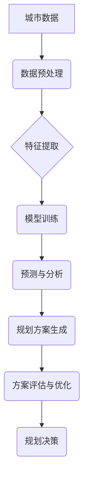

                 

## AI驱动的智能城市规划工具

> 关键词：人工智能、城市规划、机器学习、优化算法、数据分析、可视化、智能交通、可持续发展

## 1. 背景介绍

随着全球人口的快速增长和城市化的进程不断加速，城市面临着日益严峻的挑战，包括交通拥堵、资源短缺、环境污染等。传统城市规划方法往往难以应对这些复杂问题，需要更智能、更高效的解决方案。人工智能（AI）技术的快速发展为城市规划领域带来了新的机遇，为构建更加智慧、可持续的城市提供了强大的工具。

AI驱动的智能城市规划工具利用机器学习、数据分析、优化算法等技术，能够从海量城市数据中挖掘出隐藏的模式和趋势，并根据这些 insights 为城市规划提供数据驱动决策支持。这些工具可以帮助城市规划者更有效地解决城市发展面临的挑战，提高城市规划的效率和精准度。

## 2. 核心概念与联系

**2.1 核心概念**

* **人工智能 (AI):**  指模拟人类智能行为的计算机系统，包括机器学习、深度学习、自然语言处理等技术。
* **城市规划:**  指通过科学的规划和设计，合理利用城市空间资源，优化城市功能布局，提高城市居民生活质量的活动。
* **数据分析:**  指从数据中提取有价值的信息，用于理解现象、发现模式和做出决策。
* **优化算法:**  指用于寻找最优解的算法，例如遗传算法、模拟退火算法等。

**2.2 架构图**



**2.3 联系**

AI驱动的智能城市规划工具将以上核心概念有机结合，通过数据分析和机器学习技术，从城市数据中挖掘出城市发展趋势和潜在问题，并利用优化算法生成最佳的城市规划方案。

## 3. 核心算法原理 & 具体操作步骤

**3.1 算法原理概述**

AI驱动的智能城市规划工具通常采用以下核心算法：

* **机器学习:**  通过训练模型，从数据中学习城市发展规律和模式。常见的机器学习算法包括监督学习、无监督学习和强化学习。
* **优化算法:**  用于寻找最优的城市规划方案，例如遗传算法、模拟退火算法等。
* **数据挖掘:**  从海量城市数据中挖掘出有价值的信息，例如人口分布、交通流量、环境质量等。

**3.2 算法步骤详解**

1. **数据收集:**  收集城市相关数据，包括人口数据、交通数据、环境数据、地理数据等。
2. **数据预处理:**  对收集到的数据进行清洗、转换和格式化，使其适合模型训练。
3. **特征提取:**  从原始数据中提取关键特征，例如人口密度、交通拥堵程度、环境污染指数等。
4. **模型训练:**  利用机器学习算法，训练模型以预测城市发展趋势和潜在问题。
5. **规划方案生成:**  利用优化算法，根据模型预测结果和城市规划目标，生成多个城市规划方案。
6. **方案评估与优化:**  对生成的规划方案进行评估，并利用优化算法进一步优化方案，使其更符合城市规划目标。
7. **规划决策:**  根据方案评估结果，选择最优的规划方案，并将其付诸实施。

**3.3 算法优缺点**

* **优点:**
    * 数据驱动决策，提高规划精准度和效率。
    * 能够模拟城市发展趋势，预测潜在问题。
    * 优化算法可以生成多种方案，供决策者选择。
* **缺点:**
    * 需要大量高质量数据支持。
    * 模型训练需要专业技术和计算资源。
    * 算法结果可能受到数据偏差的影响。

**3.4 算法应用领域**

* **城市交通规划:**  优化交通流量，缓解交通拥堵。
* **城市土地利用规划:**  合理规划土地使用，促进城市可持续发展。
* **城市基础设施规划:**  规划和建设城市基础设施，例如水利、电力、通讯等。
* **城市环境规划:**  改善城市环境质量，促进绿色发展。

## 4. 数学模型和公式 & 详细讲解 & 举例说明

**4.1 数学模型构建**

城市规划问题通常可以建模为优化问题，目标是找到最优的城市布局方案，以最大化城市效益，例如经济效益、社会效益、环境效益等。

**4.2 公式推导过程**

例如，城市交通规划问题可以建模为最小化交通拥堵时间的问题。我们可以使用以下公式来表示交通拥堵时间：

$$T = \sum_{i=1}^{n} \frac{d_i}{v_i}$$

其中：

* $T$ 表示交通拥堵时间
* $n$ 表示道路数量
* $d_i$ 表示道路 $i$ 的长度
* $v_i$ 表示道路 $i$ 的平均速度

我们可以使用遗传算法或模拟退火算法来优化道路网络结构，以最小化交通拥堵时间。

**4.3 案例分析与讲解**

假设我们有一个城市，需要规划新的道路网络，以缓解交通拥堵。我们可以使用AI驱动的智能城市规划工具，收集城市交通数据，并使用机器学习算法训练模型，预测交通流量变化趋势。然后，我们可以使用优化算法生成多个道路网络方案，并根据交通拥堵时间、道路成本等因素进行评估，最终选择最优方案。

## 5. 项目实践：代码实例和详细解释说明

**5.1 开发环境搭建**

* 操作系统：Ubuntu 20.04
* Python 版本：3.8
* 必要的库：pandas, numpy, scikit-learn, matplotlib, seaborn

**5.2 源代码详细实现**

```python
import pandas as pd
from sklearn.model_selection import train_test_split
from sklearn.linear_model import LinearRegression

# 加载城市交通数据
data = pd.read_csv('traffic_data.csv')

# 选择特征和目标变量
features = ['road_length', 'average_speed']
target = 'traffic_time'

# 将数据划分为训练集和测试集
X_train, X_test, y_train, y_test = train_test_split(data[features], data[target], test_size=0.2)

# 训练线性回归模型
model = LinearRegression()
model.fit(X_train, y_train)

# 预测交通拥堵时间
y_pred = model.predict(X_test)

# 评估模型性能
print('模型性能:', model.score(X_test, y_test))
```

**5.3 代码解读与分析**

这段代码演示了如何使用机器学习算法预测城市交通拥堵时间。

1. 首先，我们加载城市交通数据，并选择特征和目标变量。
2. 然后，我们将数据划分为训练集和测试集，用于训练和评估模型。
3. 接下来，我们训练一个线性回归模型，并使用测试集数据评估模型性能。

**5.4 运行结果展示**

运行代码后，会输出模型性能指标，例如R-squared值。R-squared值表示模型对目标变量的解释能力，值越高表示模型性能越好。

## 6. 实际应用场景

**6.1 交通规划**

AI驱动的智能城市规划工具可以帮助城市规划者优化交通网络结构，缓解交通拥堵，提高交通效率。例如，可以预测交通流量变化趋势，优化信号灯控制策略，规划新的道路和公共交通线路。

**6.2 城市土地利用规划**

AI可以帮助城市规划者分析土地利用现状和未来需求，优化土地利用布局，促进城市可持续发展。例如，可以预测人口增长趋势，规划住宅、商业和工业用地，保护生态环境。

**6.3 基础设施规划**

AI可以帮助城市规划者规划和建设城市基础设施，例如水利、电力、通讯等。例如，可以预测未来能源需求，优化电力网络结构，规划新的水利设施。

**6.4 环境规划**

AI可以帮助城市规划者监测和改善城市环境质量。例如，可以预测空气污染程度，优化城市绿化布局，减少城市碳排放。

**6.5 未来应用展望**

随着人工智能技术的不断发展，AI驱动的智能城市规划工具将发挥越来越重要的作用。未来，这些工具将更加智能化、个性化和可视化，能够更好地服务于城市发展和居民生活。

## 7. 工具和资源推荐

**7.1 学习资源推荐**

* **书籍:**
    * 《城市规划与设计》
    * 《人工智能基础》
    * 《机器学习实战》
* **在线课程:**
    * Coursera: 城市规划
    * edX: 人工智能
    * Udacity: 机器学习

**7.2 开发工具推荐**

* **Python:**  广泛应用于数据分析和机器学习领域。
* **R:**  专门用于统计分析和数据可视化。
* **GIS软件:**  例如ArcGIS、QGIS，用于处理地理空间数据。

**7.3 相关论文推荐**

* **AI for Urban Planning: A Review**
* **Deep Learning for Urban Traffic Flow Prediction**
* **Optimization Algorithms for Urban Land Use Planning**

## 8. 总结：未来发展趋势与挑战

**8.1 研究成果总结**

AI驱动的智能城市规划工具已经取得了一定的成果，在交通规划、土地利用规划、基础设施规划等领域发挥了重要作用。

**8.2 未来发展趋势**

* **更智能的算法:**  开发更智能、更精准的机器学习算法，能够更好地预测城市发展趋势和潜在问题。
* **更丰富的应用场景:**  将AI技术应用于更多城市规划领域，例如城市安全、城市文化、城市旅游等。
* **更强的可视化能力:**  开发更强大的数据可视化工具，帮助城市规划者更好地理解城市数据和规划方案。

**8.3 面临的挑战**

* **数据质量:**  AI算法依赖于高质量的数据，而城市数据往往存在不完整、不准确、格式不统一等问题。
* **算法解释性:**  许多机器学习算法是黑箱模型，难以解释其决策过程，这可能会导致规划方案的可信度降低。
* **伦理问题:**  AI驱动的城市规划可能会带来一些伦理问题，例如数据隐私、算法偏见等，需要引起重视和解决。

**8.4 研究展望**

未来，AI驱动的智能城市规划工具将继续发展和完善，为构建更加智慧、可持续的城市做出更大的贡献。


## 9. 附录：常见问题与解答

**9.1 如何获取城市数据？**

城市数据可以从政府部门、学术机构、商业公司等渠道获取。例如，政府部门通常会发布城市人口、交通、环境等数据；学术机构会进行城市研究，并发布相关数据；商业公司会收集城市用户数据，例如移动位置数据、消费数据等。

**9.2 如何处理城市数据？**

城市数据通常存在不完整、不准确、格式不统一等问题，需要进行清洗、转换和格式化处理。可以使用Python等编程语言，结合数据处理库，例如pandas，进行数据处理。

**9.3 如何选择合适的AI算法？**

选择合适的AI算法取决于具体的城市规划问题和数据特点。例如，预测交通流量变化趋势可以使用时间序列分析算法；优化土地利用布局可以使用遗传算法或模拟退火算法。

**9.4 如何评估AI模型的性能？**

可以使用各种指标来评估AI模型的性能，例如准确率、召回率、F1-score、R-squared值等。选择合适的评估指标取决于具体的城市规划问题和数据特点。


作者：禅与计算机程序设计艺术 / Zen and the Art of Computer Programming 
<end_of_turn>

