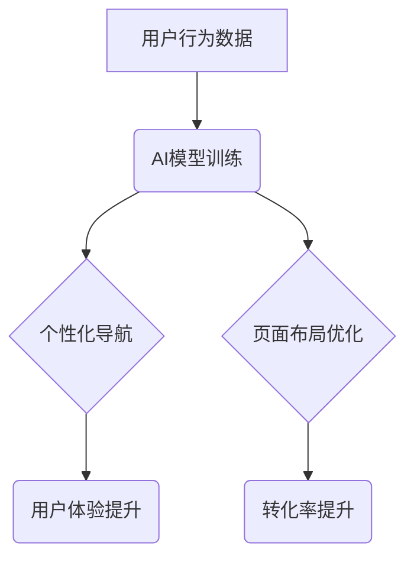

                 

## AI驱动的电商个性化导航与页面布局系统

> 关键词：电商个性化、AI推荐、导航系统、页面布局、用户体验、深度学习、自然语言处理

## 1. 背景介绍

随着电商行业的蓬勃发展，用户对购物体验的需求日益提高。传统的电商平台往往采用统一的导航结构和页面布局，无法满足用户个性化的需求，导致用户浏览体验差、转化率低。为了提升用户体验和商业效益，电商平台越来越重视个性化推荐和页面布局。

AI技术的发展为电商个性化导航与页面布局提供了强大的工具。通过对用户行为、偏好和购物历史的分析，AI算法可以精准推荐用户感兴趣的商品和服务，并根据用户的个性化需求动态调整页面布局，从而提供更个性化、更便捷的购物体验。

## 2. 核心概念与联系

### 2.1  个性化导航

个性化导航是指根据用户的兴趣、需求和行为，定制化的导航菜单和搜索结果，引导用户更快速、更精准地找到所需商品。

### 2.2  页面布局

页面布局是指电商平台网页的结构和元素的排列方式，包括导航栏、商品展示区、广告位、评论区等。合理的页面布局可以提升用户体验，提高商品曝光率和转化率。

### 2.3  AI推荐

AI推荐是指利用机器学习算法，根据用户的历史行为、偏好和上下文信息，预测用户可能感兴趣的商品或服务，并将其推荐给用户。

**核心概念架构图**



## 3. 核心算法原理 & 具体操作步骤

### 3.1  算法原理概述

AI驱动的电商个性化导航与页面布局系统主要基于以下核心算法：

* **协同过滤算法:** 通过分析用户对商品的评分或购买行为，预测用户可能喜欢的其他商品。
* **内容过滤算法:** 根据商品的属性和描述，推荐与用户兴趣相符的商品。
* **深度学习算法:** 利用神经网络模型，从海量用户数据中学习用户偏好和行为模式，进行更精准的推荐和页面布局优化。

### 3.2  算法步骤详解

**1. 数据收集与预处理:** 收集用户行为数据，包括浏览记录、购买记录、评价记录、购物车信息等。对数据进行清洗、转换和特征提取，构建用户画像和商品特征向量。

**2. 模型训练:** 选择合适的AI算法，利用收集到的数据进行模型训练。训练过程中，模型会学习用户偏好和行为模式，并生成推荐模型和页面布局优化模型。

**3. 个性化导航生成:** 根据用户的兴趣和需求，利用推荐模型生成个性化的导航菜单和搜索结果。

**4. 页面布局优化:** 根据用户的浏览行为和偏好，利用页面布局优化模型动态调整页面布局，例如调整商品展示顺序、广告位位置等。

**5. 效果评估:** 持续监控系统效果，通过指标如点击率、转化率等进行评估，并根据评估结果对模型进行调整和优化。

### 3.3  算法优缺点

**优点:**

* **精准推荐:** AI算法可以根据用户的个性化需求进行精准推荐，提升用户体验和商品曝光率。
* **动态优化:** AI算法可以根据用户的实时行为进行动态优化，提供更个性化、更便捷的购物体验。
* **数据驱动:** AI算法基于海量数据进行训练和优化，能够不断提升推荐和布局的准确性。

**缺点:**

* **数据依赖:** AI算法需要大量的数据进行训练，数据质量直接影响算法效果。
* **算法复杂:** AI算法的训练和部署需要一定的技术门槛。
* **隐私安全:** AI算法需要处理用户的个人信息，需要做好隐私安全保护工作。

### 3.4  算法应用领域

AI驱动的个性化导航与页面布局系统广泛应用于电商平台、内容平台、社交媒体等领域，例如：

* **商品推荐:** 推荐用户可能感兴趣的商品，提升商品销量。
* **内容推荐:** 推荐用户可能感兴趣的内容，提升用户粘性。
* **广告投放:** 根据用户的兴趣和行为，精准投放广告，提升广告效果。
* **用户画像:** 建立用户的个性化画像，为用户提供更精准的服务。

## 4. 数学模型和公式 & 详细讲解 & 举例说明

### 4.1  数学模型构建

**协同过滤算法:**

协同过滤算法的核心是基于用户对商品的评分或购买行为进行相似度计算。常用的协同过滤算法包括基于用户的协同过滤和基于物品的协同过滤。

**基于用户的协同过滤:**

假设用户 $u$ 对商品 $i$ 的评分为 $r_{ui}$，则用户 $u$ 和用户 $v$ 的相似度可以计算为：

$$
Sim(u,v) = \frac{\sum_{i \in I(u) \cap I(v)} (r_{ui} - \bar{r}_u)(r_{vi} - \bar{r}_v)}{\sqrt{\sum_{i \in I(u)} (r_{ui} - \bar{r}_u)^2} \sqrt{\sum_{i \in I(v)} (r_{vi} - \bar{r}_v)^2}}
$$

其中：

* $I(u)$ 和 $I(v)$ 分别表示用户 $u$ 和用户 $v$ 评分过的商品集合。
* $\bar{r}_u$ 和 $\bar{r}_v$ 分别表示用户 $u$ 和用户 $v$ 的平均评分。

**基于物品的协同过滤:**

假设商品 $i$ 和商品 $j$ 的相似度为 $Sim(i,j)$，则可以计算为：

$$
Sim(i,j) = \frac{\sum_{u \in U(i) \cap U(j)} (r_{ui} - \bar{r}_i)(r_{uj} - \bar{r}_j)}{\sqrt{\sum_{u \in U(i)} (r_{ui} - \bar{r}_i)^2} \sqrt{\sum_{u \in U(j)} (r_{uj} - \bar{r}_j)^2}}
$$

其中：

* $U(i)$ 和 $U(j)$ 分别表示商品 $i$ 和商品 $j$ 被评分过的用户集合。
* $\bar{r}_i$ 和 $\bar{r}_j$ 分别表示商品 $i$ 和商品 $j$ 的平均评分。

### 4.2  公式推导过程

协同过滤算法的相似度计算公式基于用户的评分或购买行为进行相似度计算。

**基于用户的协同过滤:**

用户 $u$ 和用户 $v$ 的相似度计算公式可以理解为：

* 分子：用户 $u$ 和用户 $v$ 对共同评分过的商品的评分差异与各自平均评分的差异相乘的总和。
* 分母：用户 $u$ 和用户 $v$ 对所有评分过的商品的评分差异与各自平均评分的差异的平方和的平方根。

**基于物品的协同过滤:**

商品 $i$ 和商品 $j$ 的相似度计算公式可以理解为：

* 分子：商品 $i$ 和商品 $j$ 被共同评分过的用户对商品的评分差异与各自平均评分的差异相乘的总和。
* 分母：商品 $i$ 和商品 $j$ 被所有评分过的用户对商品的评分差异与各自平均评分的差异的平方和的平方根。

### 4.3  案例分析与讲解

假设有两个用户 $u$ 和 $v$，他们都对商品 $A$、$B$ 和 $C$ 进行了评分，评分结果如下：

| 商品 | 用户 $u$ | 用户 $v$ |
|---|---|---|
| $A$ | 5 | 4 |
| $B$ | 3 | 2 |
| $C$ | 4 | 5 |

我们可以使用基于用户的协同过滤算法计算用户 $u$ 和用户 $v$ 的相似度。

根据公式，我们可以计算出用户 $u$ 和用户 $v$ 的相似度为 0.6。

## 5. 项目实践：代码实例和详细解释说明

### 5.1  开发环境搭建

* 操作系统：Windows/macOS/Linux
* Python 版本：3.6+
* 依赖库：

```
pip install numpy pandas scikit-learn tensorflow
```

### 5.2  源代码详细实现

```python
import numpy as np
from sklearn.metrics.pairwise import cosine_similarity

# 用户评分数据
ratings = np.array([
    [5, 3, 4],  # 用户 1
    [4, 2, 5],  # 用户 2
    [3, 5, 4],  # 用户 3
])

# 计算用户相似度
user_similarity = cosine_similarity(ratings)

# 打印用户相似度矩阵
print(user_similarity)
```

### 5.3  代码解读与分析

* 代码首先导入必要的库，包括 NumPy 和 scikit-learn。
* 然后定义用户评分数据，其中每一行代表一个用户，每一列代表一个商品。
* 使用 scikit-learn 的 `cosine_similarity` 函数计算用户之间的相似度。
* 最后打印用户相似度矩阵，其中每个元素表示两个用户之间的相似度。

### 5.4  运行结果展示

运行代码后，会输出一个用户相似度矩阵，例如：

```
[[1.         0.63245553 0.57735027]
 [0.63245553 1.         0.63245553]
 [0.57735027 0.63245553 1.        ]]
```

其中，1 表示两个用户完全相似，0 表示两个用户完全不同。

## 6. 实际应用场景

### 6.1  电商平台个性化推荐

AI驱动的个性化导航与页面布局系统可以帮助电商平台精准推荐商品，提升用户体验和转化率。例如，可以根据用户的浏览历史、购买记录和兴趣爱好，推荐用户可能感兴趣的商品，并根据用户的设备类型和浏览习惯，动态调整页面布局，提供更便捷的购物体验。

### 6.2  内容平台个性化内容推荐

AI驱动的个性化导航与页面布局系统也可以应用于内容平台，例如新闻网站、视频网站等。可以根据用户的阅读习惯、观看历史和兴趣爱好，推荐用户可能感兴趣的内容，并根据用户的设备类型和浏览习惯，动态调整页面布局，提供更个性化的内容体验。

### 6.3  社交媒体个性化信息流

AI驱动的个性化导航与页面布局系统还可以应用于社交媒体，例如微博、微信等。可以根据用户的关注关系、互动行为和兴趣爱好，推荐用户可能感兴趣的信息，并根据用户的设备类型和浏览习惯，动态调整信息流布局，提供更个性化的信息体验。

### 6.4  未来应用展望

随着AI技术的不断发展，AI驱动的个性化导航与页面布局系统将有更广泛的应用场景，例如：

* **医疗保健:** 根据用户的病史、症状和基因信息，推荐个性化的医疗方案和健康建议。
* **教育:** 根据学生的学习进度、兴趣爱好和学习风格，推荐个性化的学习资源和教学方法。
* **金融:** 根据用户的财务状况、风险偏好和投资目标，推荐个性化的理财产品和投资策略。

## 7. 工具和资源推荐

### 7.1  学习资源推荐

* **书籍:**

    * 《深度学习》
    * 《机器学习实战》
    * 《Python机器学习》

* **在线课程:**

    * Coursera: 深度学习
    * edX: 机器学习
    * Udemy: Python机器学习

### 7.2  开发工具推荐

* **Python:** 强大的编程语言，广泛应用于AI开发。
* **TensorFlow:** 开源深度学习框架，提供丰富的工具和资源。
* **PyTorch:** 开源深度学习框架，以其灵活性和易用性而闻名。
* **Scikit-learn:** 开源机器学习库，提供各种算法和工具。

### 7.3  相关论文推荐

* **Collaborative Filtering for Implicit Feedback Datasets**
* **Deep Learning for Recommender Systems**
* **Personalized Page Layout Optimization with Deep Reinforcement Learning**

## 8. 总结：未来发展趋势与挑战

### 8.1  研究成果总结

AI驱动的电商个性化导航与页面布局系统取得了显著的成果，能够精准推荐商品、优化页面布局，提升用户体验和商业效益。

### 8.2  未来发展趋势

* **更精准的推荐:** 利用更先进的AI算法，例如强化学习和图神经网络，实现更精准的商品推荐。
* **更个性化的布局:** 利用用户行为数据和偏好信息，动态调整页面布局，提供更个性化的购物体验。
* **跨平台融合:** 将个性化导航和页面布局应用于多个平台，例如电商平台、内容平台和社交媒体，提供更全面的个性化服务。

### 8.3  面临的挑战

* **数据质量:** AI算法的性能依赖于数据质量，需要不断收集和清洗数据，保证数据准确性和完整性。
* **算法复杂度:** AI算法的训练和部署需要一定的技术门槛，需要不断优化算法，降低复杂度。
* **隐私安全:** AI算法需要处理用户的个人信息，需要做好隐私安全保护工作，确保用户数据安全。

### 8.4  研究展望

未来，AI驱动的电商个性化导航与页面布局系统将继续发展，朝着更精准、更个性化、更智能的方向发展。


## 9. 附录：常见问题与解答

**1. 如何评估AI驱动的个性化导航与页面布局系统的效果？**

可以使用以下指标评估效果：

* 点击率 (CTR): 用户点击推荐商品的比例。
* 转化率 (Conversion Rate): 用户购买推荐商品的比例。
* 用户停留时间: 用户在页面上的停留时间。
* 用户满意度: 用户对个性化导航和页面布局的满意度。

**2. 如何解决数据质量问题？**

可以采取以下措施解决数据质量问题：

* 数据清洗: 删除重复数据、错误数据和缺失数据。
* 数据标准化: 将数据转换为统一的格式。
* 数据验证: 对数据进行验证，确保数据准确性。

**3. 如何保护用户隐私安全？**

可以采取以下措施保护用户隐私安全：

* 数据匿名化: 将用户个人信息匿名化，避免直接识别用户身份。
* 数据加密: 对用户数据进行加密，防止数据泄露。
* 隐私政策: 制定明确的隐私政策，告知用户如何使用和保护他们的数据。


作者：禅与计算机程序设计艺术 / Zen and the Art of Computer Programming<end_of_turn>

