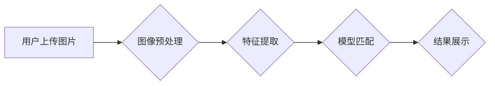

                 

## AI驱动的视觉搜索：图像识别技术在电商中的应用

> 关键词：视觉搜索、图像识别、深度学习、卷积神经网络、电商应用、商品推荐、用户体验

## 1. 背景介绍

随着移动互联网和智能手机的普及，用户对购物体验的需求越来越高。传统的文本搜索方式已经难以满足用户快速、精准地查找商品的需求。视觉搜索技术应运而生，它利用人工智能和计算机视觉技术，通过用户上传的图片或视频，识别图像内容并返回与之相关的商品信息。

视觉搜索技术在电商领域具有巨大的应用潜力，可以为用户提供更便捷、更直观的购物体验。例如，用户可以通过拍摄商品图片进行搜索，快速找到同款或相似商品；也可以通过上传服装图片，找到与之搭配的鞋子、包包等配件。

## 2. 核心概念与联系

**2.1 核心概念**

* **视觉搜索:** 利用图像识别技术，根据用户上传的图片或视频内容，识别图像中的物体、场景、文本等信息，并返回与之相关的商品信息或其他相关内容。
* **图像识别:**  利用计算机视觉技术，分析和理解图像内容，识别图像中的物体、场景、文本等信息。
* **深度学习:** 一种机器学习方法，利用多层神经网络模拟人类大脑的学习过程，能够学习复杂的图像特征。
* **卷积神经网络 (CNN):**  一种专门用于图像识别的深度学习模型，能够有效地提取图像中的特征。

**2.2 架构图**



**2.3 核心联系**

视觉搜索的核心是图像识别技术，而深度学习和卷积神经网络是图像识别技术的重要实现手段。

用户上传图片后，首先需要进行预处理，例如调整图片大小、颜色空间等。然后，利用卷积神经网络提取图片的特征，将特征向量与数据库中的商品特征向量进行匹配，找到与之最相似的商品信息，最后将结果展示给用户。

## 3. 核心算法原理 & 具体操作步骤

**3.1 算法原理概述**

视觉搜索的核心算法是基于深度学习的图像识别算法，主要包括以下步骤：

1. **图像预处理:** 对输入图像进行预处理，例如调整大小、归一化、去噪等，以提高算法的性能。
2. **特征提取:** 利用卷积神经网络提取图像的特征，例如边缘、纹理、形状等。
3. **特征匹配:** 将提取的特征向量与数据库中的商品特征向量进行比较，找到与之最相似的商品信息。
4. **结果展示:** 将匹配到的商品信息展示给用户。

**3.2 算法步骤详解**

1. **图像预处理:**

   * **尺寸调整:** 将图像调整为预设的大小，以满足模型输入要求。
   * **归一化:** 将图像像素值归一化到一定范围，例如[0, 1]，以提高算法的稳定性。
   * **去噪:** 去除图像中的噪声，以提高特征提取的准确性。

2. **特征提取:**

   * **卷积层:** 利用多个卷积核对图像进行卷积运算，提取图像的局部特征。
   * **池化层:** 对卷积层的输出进行池化操作，例如最大池化，降低特征向量的维度，提高算法的鲁棒性。
   * **全连接层:** 将池化层的输出连接到全连接层，进行分类或回归。

3. **特征匹配:**

   * **距离度量:** 使用欧氏距离、余弦相似度等距离度量方法计算特征向量之间的相似度。
   * **K最近邻搜索:** 根据相似度排序，找到与输入特征向量最相似的K个商品特征向量。

4. **结果展示:**

   * 将匹配到的商品信息展示给用户，例如商品名称、价格、图片等。
   * 可以根据用户需求，展示不同类型的商品信息，例如相似商品、推荐商品等。

**3.3 算法优缺点**

**优点:**

* **准确率高:** 深度学习算法能够学习复杂的图像特征，提高图像识别的准确率。
* **鲁棒性强:** 卷积神经网络具有强大的鲁棒性，能够抵抗图像噪声、光照变化等干扰。
* **可扩展性强:** 深度学习模型可以很容易地扩展到更大的数据集和更复杂的图像识别任务。

**缺点:**

* **训练成本高:** 深度学习模型需要大量的训练数据和计算资源，训练成本较高。
* **推理速度慢:** 深度学习模型的推理速度相对较慢，需要优化算法和硬件才能提高推理速度。
* **解释性差:** 深度学习模型的决策过程比较复杂，难以解释模型的决策结果。

**3.4 算法应用领域**

* **电商:** 商品搜索、商品推荐、视觉购物等。
* **医疗:** 病灶检测、疾病诊断、医学图像分析等。
* **安防:** 人脸识别、物体检测、视频监控等。
* **自动驾驶:** 路标识别、车辆检测、行人识别等。

## 4. 数学模型和公式 & 详细讲解 & 举例说明

**4.1 数学模型构建**

视觉搜索的核心数学模型是基于卷积神经网络的图像特征提取模型。

**4.2 公式推导过程**

卷积神经网络的数学模型主要包括以下公式：

* **卷积运算:**

$$
y_{i,j} = \sum_{m=0}^{M-1} \sum_{n=0}^{N-1} x_{i+m,j+n} * w_{m,n} + b
$$

其中：

* $x_{i,j}$ 是输入图像的像素值。
* $w_{m,n}$ 是卷积核的权重。
* $b$ 是偏置项。
* $y_{i,j}$ 是卷积层的输出值。

* **激活函数:**

$$
f(x) = \frac{1}{1 + e^{-x}}
$$

激活函数的作用是引入非线性，使神经网络能够学习更复杂的特征。

* **池化运算:**

$$
y_{i,j} = \max_{m=0}^{M-1} \max_{n=0}^{N-1} x_{i*M+m,j*N+n}
$$

池化运算的作用是降低特征向量的维度，提高算法的鲁棒性。

**4.3 案例分析与讲解**

假设我们有一个卷积神经网络模型，用于识别猫的图像。

* 输入图像是一个猫的图片。
* 卷积层提取了猫的特征，例如耳朵、眼睛、鼻子等。
* 激活函数将特征进行非线性变换，使特征更加丰富。
* 池化层降低了特征向量的维度，提高了算法的鲁棒性。
* 全连接层将特征向量进行分类，最终输出猫的概率。

## 5. 项目实践：代码实例和详细解释说明

**5.1 开发环境搭建**

* **操作系统:** Ubuntu 18.04
* **编程语言:** Python 3.6
* **深度学习框架:** TensorFlow 2.0
* **其他工具:** Jupyter Notebook、Git

**5.2 源代码详细实现**

```python
import tensorflow as tf

# 定义卷积神经网络模型
model = tf.keras.models.Sequential([
    tf.keras.layers.Conv2D(32, (3, 3), activation='relu', input_shape=(224, 224, 3)),
    tf.keras.layers.MaxPooling2D((2, 2)),
    tf.keras.layers.Conv2D(64, (3, 3), activation='relu'),
    tf.keras.layers.MaxPooling2D((2, 2)),
    tf.keras.layers.Flatten(),
    tf.keras.layers.Dense(10, activation='softmax')
])

# 编译模型
model.compile(optimizer='adam',
              loss='sparse_categorical_crossentropy',
              metrics=['accuracy'])

# 训练模型
model.fit(x_train, y_train, epochs=10)

# 评估模型
loss, accuracy = model.evaluate(x_test, y_test)
print('Loss:', loss)
print('Accuracy:', accuracy)
```

**5.3 代码解读与分析**

* 代码首先定义了一个卷积神经网络模型，包含卷积层、池化层、全连接层等。
* 然后，使用Adam优化器、交叉熵损失函数和准确率指标对模型进行编译。
* 最后，使用训练数据训练模型，并使用测试数据评估模型的性能。

**5.4 运行结果展示**

训练完成后，可以将模型保存下来，并使用新的图像进行预测。

## 6. 实际应用场景

**6.1 商品搜索**

用户可以通过上传图片搜索商品，例如搜索同款衣服、鞋子、包包等。

**6.2 商品推荐**

根据用户的浏览历史、购买记录等信息，推荐与用户兴趣相关的商品。

**6.3 视觉购物**

用户可以通过手机摄像头扫描商品，获取商品信息、价格、评价等。

**6.4 未来应用展望**

* **个性化推荐:** 基于用户的画像和偏好，提供更个性化的商品推荐。
* **虚拟试衣间:** 利用AR技术，让用户在手机上虚拟试穿衣服。
* **智能客服:** 利用视觉识别技术，帮助用户解决购物问题。

## 7. 工具和资源推荐

**7.1 学习资源推荐**

* **书籍:**

    * 《深度学习》
    * 《计算机视觉:算法与应用》

* **在线课程:**

    * Coursera: 深度学习
    * Udacity: 计算机视觉

**7.2 开发工具推荐**

* **深度学习框架:** TensorFlow, PyTorch, Keras
* **图像处理库:** OpenCV, Pillow

**7.3 相关论文推荐**

* 《ImageNet Classification with Deep Convolutional Neural Networks》
* 《AlexNet》

## 8. 总结：未来发展趋势与挑战

**8.1 研究成果总结**

视觉搜索技术近年来取得了长足的进步，图像识别算法的准确率不断提高，应用场景也越来越广泛。

**8.2 未来发展趋势**

* **模型更深更广:** 探索更深层次、更广范围的卷积神经网络模型，提高图像识别的准确率和泛化能力。
* **跨模态融合:** 将视觉信息与其他模态信息，例如文本、音频、视频等进行融合，提高搜索结果的准确性和丰富度。
* **边缘计算:** 将视觉搜索模型部署到边缘设备，降低延迟，提高实时性。

**8.3 面临的挑战**

* **数据标注:** 高质量的图像数据标注是训练视觉搜索模型的关键，但数据标注成本较高。
* **模型解释性:** 深度学习模型的决策过程比较复杂，难以解释模型的决策结果，这限制了模型的应用场景。
* **隐私安全:** 视觉搜索技术涉及到用户的个人信息，需要保障用户的隐私安全。

**8.4 研究展望**

未来，视觉搜索技术将继续朝着更智能、更便捷、更安全的方向发展，为用户提供更优质的购物体验。


## 9. 附录：常见问题与解答

**9.1 如何提高视觉搜索的准确率？**

* 使用更深层次、更广范围的卷积神经网络模型。
* 使用高质量的图像数据进行训练。
* 使用数据增强技术，增加训练数据的多样性。
* 使用迁移学习技术，利用预训练模型进行微调。

**9.2 如何解决视觉搜索的隐私安全问题？**

* 使用联邦学习技术，在不共享原始数据的情况下进行模型训练。
* 使用差分隐私技术，保护用户的隐私信息。
* 采用匿名化技术，隐藏用户的个人信息。


作者：禅与计算机程序设计艺术 / Zen and the Art of Computer Programming 
<end_of_turn>

