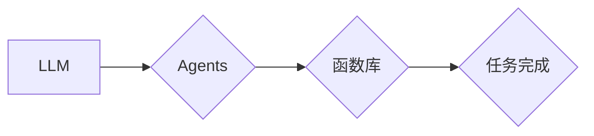

                 

## 1. 背景介绍

大型语言模型 (LLM) 近年来取得了令人瞩目的成就，在自然语言处理、文本生成、代码编写等领域展现出强大的能力。然而，LLM 的应用场景远不止于此。为了更好地将 LLM 的潜力释放出来，我们需要构建一个更灵活、更强大的操作系统，让 LLM 可以更有效地与外部世界交互，并完成更复杂的任务。

本篇文章将探讨一个名为 "Agents与函数库" 的 LLM 操作系统核心组件架构，旨在为 LLM 提供更强大的功能和更广泛的应用场景。

## 2. 核心概念与联系

### 2.1 Agents

在我们的架构中，"Agents" 代表着独立的智能实体，它们能够感知环境、设定目标、并采取行动以实现目标。每个 Agent 都可以拥有自己的知识库、行为策略和任务目标。

### 2.2 函数库

"函数库" 是 LLM 操作系统的另一个核心组件，它包含了一系列预定义的函数，这些函数可以帮助 Agent 完成各种任务，例如：

* **数据处理:**  文本分析、数据清洗、信息提取等。
* **逻辑推理:**  判断、推理、决策等。
* **外部交互:**  访问网络、控制设备、与其他系统通信等。

### 2.3 关系

Agents 和函数库之间存在着密切的联系。Agents 可以调用函数库中的函数来完成任务，而函数库中的函数可以根据 Agents 的需求进行定制化开发。

**Mermaid 流程图**



## 3. 核心算法原理 & 具体操作步骤

### 3.1 算法原理概述

我们的 Agents 与函数库架构基于以下核心算法原理：

* **代理理论:**  每个 Agent 都是一个独立的智能实体，它拥有自己的目标和行为策略。
* **函数式编程:**  函数库中的函数是独立的、可重用的代码块，可以被 Agents 调用以完成特定任务。
* **强化学习:**  Agents 可以通过与环境交互并学习奖励机制，不断优化自己的行为策略。

### 3.2 算法步骤详解

1. **Agent 初始化:**  创建一个新的 Agent 实例，并为其设定初始状态、目标和行为策略。
2. **环境感知:**  Agent 通过感知环境获取信息，例如文本数据、用户输入等。
3. **任务分解:**  Agent 将目标任务分解成一系列子任务。
4. **函数调用:**  Agent 调用函数库中的函数来完成子任务。
5. **结果反馈:**  函数执行完成后，Agent 收到结果反馈，并根据反馈更新自己的行为策略。
6. **循环迭代:**  Agent 持续感知环境、分解任务、调用函数、接收反馈，不断优化自己的行为策略，最终实现目标任务。

### 3.3 算法优缺点

**优点:**

* **灵活性:**  Agents 可以根据不同的任务和环境进行定制化开发。
* **可扩展性:**  函数库可以不断扩展，添加新的功能和能力。
* **可维护性:**  函数式编程使得代码更易于理解、维护和调试。

**缺点:**

* **复杂性:**  构建和维护 Agents 和函数库系统需要一定的技术难度。
* **效率:**  如果函数库过于庞大，可能会导致调用效率降低。

### 3.4 算法应用领域

* **智能客服:**  Agents 可以模拟客服人员，与用户进行对话，解答问题，处理投诉等。
* **个性化推荐:**  Agents 可以根据用户的喜好和行为数据，推荐个性化的商品、服务或内容。
* **自动化办公:**  Agents 可以自动化完成一些重复性的办公任务，例如邮件处理、文档生成等。
* **教育辅助:**  Agents 可以作为学生的学习伙伴，提供个性化的学习指导和反馈。

## 4. 数学模型和公式 & 详细讲解 & 举例说明

### 4.1 数学模型构建

我们使用马尔可夫决策过程 (MDP) 来建模 Agents 的行为决策过程。

* **状态空间:**  S，表示 Agent 能够处在的各种状态。
* **动作空间:**  A，表示 Agent 可以采取的各种动作。
* **转移概率:**  P(s' | s, a)，表示 Agent 从状态 s 执行动作 a 后转移到状态 s' 的概率。
* **奖励函数:**  R(s, a)，表示 Agent 在状态 s 执行动作 a 后获得的奖励。

### 4.2 公式推导过程

我们的目标是找到一个最优策略 π(s)，使得 Agent 在长期的交互过程中获得最大的总奖励。

我们可以使用动态规划算法来求解最优策略。Bellman 方程是动态规划算法的核心公式：

$$
V^*(s) = \max_a \left[ R(s, a) + \gamma \sum_{s'} P(s' | s, a) V^*(s') \right]
$$

其中：

* $V^*(s)$ 表示状态 s 的最优价值函数。
* $\gamma$ 是折扣因子，控制未来奖励的权重。

### 4.3 案例分析与讲解

假设我们有一个简单的 Agent，它需要在两个状态之间切换，每个状态都有一个对应的奖励值。

* 状态 1:  奖励值 = 1
* 状态 2:  奖励值 = -1

Agent 可以采取两个动作：

* 动作 1:  从状态 1 转移到状态 2
* 动作 2:  从状态 2 转移到状态 1

我们可以使用 Bellman 方程来计算每个状态的最优价值函数，并找到最优策略。

## 5. 项目实践：代码实例和详细解释说明

### 5.1 开发环境搭建

* Python 3.8+
* TensorFlow 或 PyTorch
* 其他必要的库，例如 NumPy、Pandas 等

### 5.2 源代码详细实现

```python
# 定义状态空间和动作空间
states = ["state1", "state2"]
actions = ["action1", "action2"]

# 定义转移概率矩阵
transition_matrix = {
    "state1": {"action1": 0.8, "action2": 0.2},
    "state2": {"action1": 0.2, "action2": 0.8},
}

# 定义奖励函数
reward_function = {
    "state1": {"action1": -1, "action2": 1},
    "state2": {"action1": 1, "action2": -1},
}

# 定义折扣因子
gamma = 0.9

# 定义动态规划算法
def bellman_equation(states, actions, transition_matrix, reward_function, gamma):
    # ... (代码实现 Bellman 方程)

# 调用动态规划算法
optimal_values = bellman_equation(states, actions, transition_matrix, reward_function, gamma)

# 打印最优价值函数
print(optimal_values)

# 根据最优价值函数构建最优策略
optimal_policy = {
    state: action for state, action in zip(states, optimal_values)
}

# 打印最优策略
print(optimal_policy)
```

### 5.3 代码解读与分析

* 代码首先定义了状态空间、动作空间、转移概率矩阵和奖励函数。
* 然后，代码实现了 Bellman 方程，并使用它来计算每个状态的最优价值函数。
* 最后，代码根据最优价值函数构建了最优策略。

### 5.4 运行结果展示

运行代码后，会输出每个状态的最优价值函数和最优策略。

## 6. 实际应用场景

### 6.1 智能客服

一个基于 Agents 与函数库的智能客服系统可以根据用户的输入，调用相应的函数库函数来理解用户需求，并提供准确的回复。例如，用户询问产品价格，Agent 可以调用价格查询函数获取价格信息，并将其返回给用户。

### 6.2 个性化推荐

一个基于 Agents 与函数库的个性化推荐系统可以根据用户的浏览历史、购买记录等数据，调用数据分析和推荐算法函数，推荐用户可能感兴趣的商品或服务。

### 6.3 自动化办公

一个基于 Agents 与函数库的自动化办公系统可以自动化完成一些重复性的办公任务，例如邮件处理、文档生成等。例如，Agent 可以调用邮件处理函数来筛选、分类和回复邮件，也可以调用文档生成函数来生成报告或合同。

### 6.4 未来应用展望

随着人工智能技术的不断发展，Agents 与函数库架构有望在更多领域得到应用，例如：

* **医疗诊断:**  Agents 可以辅助医生进行诊断，并提供个性化的治疗方案。
* **金融风险管理:**  Agents 可以识别和评估金融风险，并采取相应的措施进行风险控制。
* **城市智能管理:**  Agents 可以帮助城市管理者优化交通流量、能源消耗等资源分配。

## 7. 工具和资源推荐

### 7.1 学习资源推荐

* **书籍:**
    * 《Reinforcement Learning: An Introduction》 by Sutton and Barto
    * 《Deep Learning》 by Goodfellow, Bengio, and Courville
* **在线课程:**
    * Coursera: Reinforcement Learning Specialization
    * Udacity: Deep Learning Nanodegree

### 7.2 开发工具推荐

* **Python:**  一个流行的编程语言，广泛用于人工智能开发。
* **TensorFlow:**  一个开源的机器学习框架，支持深度学习模型的训练和部署。
* **PyTorch:**  另一个开源的机器学习框架，以其灵活性和易用性而闻名。

### 7.3 相关论文推荐

* **"Deep Reinforcement Learning with Double Q-learning"** by Hasselt et al.
* **"Proximal Policy Optimization Algorithms"** by Schulman et al.
* **"Asynchronous Methods for Deep Reinforcement Learning"** by Mnih et al.

## 8. 总结：未来发展趋势与挑战

### 8.1 研究成果总结

Agents 与函数库架构为 LLM 的应用提供了新的思路和可能性，它可以帮助 LLM 更灵活地与外部世界交互，并完成更复杂的任务。

### 8.2 未来发展趋势

* **更强大的函数库:**  随着人工智能技术的不断发展，函数库将会变得更加强大，能够支持更复杂的任务和应用场景。
* **更智能的 Agents:**  Agents 将会更加智能，能够更好地理解环境、设定目标和制定策略。
* **更广泛的应用场景:**  Agents 与函数库架构有望在更多领域得到应用，例如医疗、金融、教育等。

### 8.3 面临的挑战

* **算法复杂性:**  构建和维护 Agents 与函数库系统需要一定的算法复杂度，需要进一步的研究和优化。
* **数据安全:**  Agents 需要访问和处理大量数据，数据安全是一个重要的挑战。
* **伦理问题:**  随着 Agents 的智能化程度提高，伦理问题也需要得到重视。

### 8.4 研究展望

未来，我们将继续研究 Agents 与函数库架构，探索其更广泛的应用场景，并解决其面临的挑战。


## 9. 附录：常见问题与解答

**Q1:  Agents 与函数库架构与传统的 LLM 应用有什么区别？**

**A1:**  传统的 LLM 应用通常是将预训练的模型直接应用于特定的任务，而 Agents 与函数库架构则更加灵活，可以根据不同的任务和环境定制化开发 Agents 和函数库。

**Q2:  如何构建一个高效的函数库？**

**A2:**  构建一个高效的函数库需要考虑以下因素：

* **模块化设计:**  将函数库分解成多个独立的模块，方便维护和扩展。
* **代码复用:**  尽可能复用现有的代码，避免重复开发。
* **性能优化:**  对函数进行性能优化，提高调用效率。

**Q3:  如何保证 Agents 的安全性？**

**A3:**  保证 Agents 的安全性需要从多个方面考虑：

* **数据安全:**  保护 Agents 访问和处理的数据安全。
* **行为控制:**  限制 Agents 的行为范围，防止其做出不安全的行为。
* **审计机制:**  对 Agents 的行为进行审计，及时发现和处理潜在的安全问题。


作者：禅与计算机程序设计艺术 / Zen and the Art of Computer Programming 
<end_of_turn>

