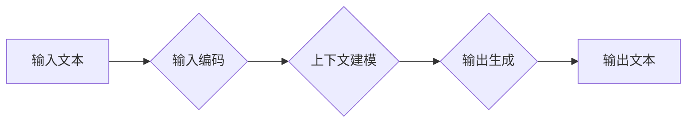

                 

## LLM 时刻：每个推理过程的重要性

> 关键词：LLM, 推理过程, 准确性, 效率, 可解释性, 优化, 训练数据

### 1. 背景介绍

大型语言模型 (LLM) 近年来取得了令人瞩目的成就，在文本生成、翻译、问答等领域展现出强大的能力。然而，LLM 的推理过程仍然是一个复杂且充满挑战的问题。 

LLM 的推理过程本质上是通过对输入文本进行一系列复杂的计算，最终生成输出文本。这些计算涉及到大量的参数和复杂的数学模型，因此推理过程往往耗时且资源密集。此外，LLM 的推理过程通常是不可解释的，这意味着我们很难理解模型是如何得出最终结果的。这对于一些需要透明度和可信度的应用场景来说是一个重大障碍。

### 2. 核心概念与联系

LLM 的推理过程可以概括为以下几个核心概念：

* **输入编码:** 将输入文本转换为模型可以理解的数字表示。
* **上下文建模:**  理解输入文本的语义和上下文关系。
* **输出生成:** 根据上下文信息生成输出文本。

这些概念之间相互关联，共同构成了 LLM 的推理流程。

**Mermaid 流程图:**



### 3. 核心算法原理 & 具体操作步骤

#### 3.1  算法原理概述

LLM 的推理过程主要基于**Transformer**架构，该架构利用**自注意力机制**和**多头注意力机制**来捕捉文本中的长距离依赖关系。

* **自注意力机制:**  允许模型关注输入序列中的不同位置，并计算每个词与其他词之间的相关性。
* **多头注意力机制:**  使用多个自注意力头来捕捉不同类型的语义信息。

通过这些机制，LLM 可以构建一个丰富的文本表示，并根据上下文信息生成准确的输出。

#### 3.2  算法步骤详解

1. **输入预处理:** 将输入文本转换为数字表示，例如使用词嵌入技术将每个词映射到一个向量。
2. **编码器:** 将预处理后的文本输入到编码器中，编码器通过多层 Transformer 结构对文本进行编码，生成每个词的上下文表示。
3. **解码器:** 将编码器输出的上下文表示输入到解码器中，解码器通过自回归的方式生成输出文本，每个词的生成都依赖于之前生成的词和上下文表示。
4. **输出解码:** 将解码器输出的数字表示转换为文本，例如使用词典反向映射。

#### 3.3  算法优缺点

**优点:**

* 能够捕捉长距离依赖关系，提高文本理解能力。
* 训练效率高，能够处理大量数据。
* 在各种自然语言处理任务中表现出色。

**缺点:**

* 推理过程耗时且资源密集。
* 模型参数量大，需要大量的计算资源进行训练和部署。
* 推理过程不可解释，难以理解模型的决策过程。

#### 3.4  算法应用领域

LLM 的推理过程在以下领域具有广泛的应用:

* **文本生成:**  例如，文章写作、故事创作、代码生成等。
* **机器翻译:**  将一种语言翻译成另一种语言。
* **问答系统:**  回答用户提出的问题。
* **对话系统:**  与用户进行自然语言对话。
* **文本摘要:**  生成文本的简短摘要。

### 4. 数学模型和公式 & 详细讲解 & 举例说明

#### 4.1  数学模型构建

LLM 的推理过程可以看作是一个概率模型，其目标是最大化输出文本的似然概率。

**公式:**

$$P(y|x) = \frac{exp(s(x,y))}{Z(x)}$$

其中:

* $P(y|x)$ 是给定输入 $x$ 时输出 $y$ 的概率。
* $s(x,y)$ 是输入 $x$ 和输出 $y$ 之间的得分函数。
* $Z(x)$ 是归一化因子，确保概率分布的总和为 1。

#### 4.2  公式推导过程

得分函数 $s(x,y)$ 通常使用 Transformer 架构中的注意力机制和 feed-forward 网络来计算。

**注意力机制:**

$$Attention(Q,K,V) = softmax(\frac{QK^T}{\sqrt{d_k}})V$$

其中:

* $Q$, $K$, $V$ 分别是查询矩阵、键矩阵和值矩阵。
* $d_k$ 是键向量的维度。

**feed-forward 网络:**

$$FFN(x) = \sigma(W_1x + b_1)W_2x + b_2$$

其中:

* $W_1$, $W_2$ 是权重矩阵。
* $b_1$, $b_2$ 是偏置项。
* $\sigma$ 是激活函数。

#### 4.3  案例分析与讲解

例如，在机器翻译任务中，输入文本 $x$ 是源语言文本，输出文本 $y$ 是目标语言文本。LLM 会使用注意力机制来捕捉源语言文本中的不同词之间的关系，并使用 feed-forward 网络来生成目标语言文本。

### 5. 项目实践：代码实例和详细解释说明

#### 5.1  开发环境搭建

* Python 3.7+
* PyTorch 或 TensorFlow
* CUDA 和 cuDNN (可选，用于 GPU 加速)

#### 5.2  源代码详细实现

以下是一个使用 PyTorch 实现简单文本生成器的代码示例:

```python
import torch
import torch.nn as nn

class TextGenerator(nn.Module):
    def __init__(self, vocab_size, embedding_dim, hidden_dim):
        super(TextGenerator, self).__init__()
        self.embedding = nn.Embedding(vocab_size, embedding_dim)
        self.lstm = nn.LSTM(embedding_dim, hidden_dim)
        self.fc = nn.Linear(hidden_dim, vocab_size)

    def forward(self, x):
        embedded = self.embedding(x)
        output, (hidden, cell) = self.lstm(embedded)
        output = self.fc(output[:, -1, :])
        return output

# ... (其他代码，例如数据加载、训练、评估等)
```

#### 5.3  代码解读与分析

* `TextGenerator` 类定义了一个简单的文本生成器模型。
* `embedding` 层将每个词映射到一个向量表示。
* `lstm` 层是一个 LSTM 网络，用于捕捉文本中的上下文信息。
* `fc` 层是一个全连接层，用于生成输出文本的概率分布。

#### 5.4  运行结果展示

训练好的模型可以用于生成新的文本。例如，给定一个起始词，模型可以根据上下文信息生成后续的词，最终生成一段完整的文本。

### 6. 实际应用场景

LLM 的推理过程在许多实际应用场景中发挥着重要作用。

* **聊天机器人:**  LLM 可以理解用户的自然语言输入，并生成自然流畅的回复。
* **搜索引擎:**  LLM 可以理解用户的搜索意图，并返回更相关的搜索结果。
* **文本摘要:**  LLM 可以自动生成文本的简短摘要，节省用户的时间。
* **代码生成:**  LLM 可以根据用户的需求生成代码，提高开发效率。

### 6.4  未来应用展望

随着 LLM 技术的不断发展，其推理过程将应用于更多领域，例如:

* **个性化教育:**  根据学生的学习情况生成个性化的学习内容。
* **医疗诊断:**  辅助医生进行疾病诊断。
* **法律服务:**  自动分析法律文件，提供法律建议。

### 7. 工具和资源推荐

#### 7.1  学习资源推荐

* **书籍:**
    * 《深度学习》 by Ian Goodfellow, Yoshua Bengio, and Aaron Courville
    * 《自然语言处理》 by Dan Jurafsky and James H. Martin
* **在线课程:**
    * Coursera: Natural Language Processing Specialization
    * Stanford CS224N: Natural Language Processing with Deep Learning

#### 7.2  开发工具推荐

* **PyTorch:**  一个开源的深度学习框架。
* **TensorFlow:**  另一个开源的深度学习框架。
* **Hugging Face Transformers:**  一个用于加载和使用预训练 LLM 的库。

#### 7.3  相关论文推荐

* **Attention Is All You Need** by Vaswani et al. (2017)
* **BERT: Pre-training of Deep Bidirectional Transformers for Language Understanding** by Devlin et al. (2018)
* **GPT-3: Language Models are Few-Shot Learners** by Brown et al. (2020)

### 8. 总结：未来发展趋势与挑战

#### 8.1  研究成果总结

LLM 的推理过程取得了显著的进展，在文本理解和生成方面展现出强大的能力。Transformer 架构和注意力机制是 LLM 推理过程的关键技术，推动了模型性能的提升。

#### 8.2  未来发展趋势

* **效率提升:**  研究更高效的推理算法，降低 LLM 推理过程的计算成本。
* **可解释性增强:**  开发可解释的 LLM 模型，帮助我们理解模型的决策过程。
* **多模态理解:**  研究能够理解多种模态数据 (例如文本、图像、音频) 的 LLM 模型。

#### 8.3  面临的挑战

* **数据规模:**  训练高性能的 LLM 需要大量的训练数据，数据获取和标注仍然是一个挑战。
* **计算资源:**  LLM 的训练和推理过程需要大量的计算资源，这对于资源有限的机构来说是一个障碍。
* **伦理问题:**  LLM 的应用可能带来一些伦理问题，例如信息操纵、偏见放大等，需要引起重视和解决。

#### 8.4  研究展望

未来，LLM 的推理过程将继续朝着更高效、更可解释、更强大方向发展，并在更多领域发挥重要作用。


### 9. 附录：常见问题与解答

* **Q: LLM 的推理过程为什么需要那么多的计算资源?**

* **A:** LLM 的模型参数量很大，需要大量的计算资源进行训练和推理。此外，LLM 的推理过程涉及到复杂的数学计算，例如注意力机制和 feed-forward 网络，这些计算也需要消耗大量的计算资源。

* **Q: 如何提高 LLM 的推理效率?**

* **A:**  一些方法可以提高 LLM 的推理效率，例如模型压缩、量化、并行推理等。

* **Q: 如何理解 LLM 的推理过程?**

* **A:**  研究可解释的 LLM 模型，例如使用注意力机制的可视化工具，可以帮助我们理解模型的决策过程。


作者：禅与计算机程序设计艺术 / Zen and the Art of Computer Programming 
<end_of_turn>

