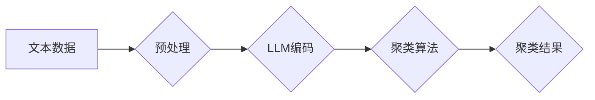

                 

## LLM与传统文本聚类方法的对比

> 关键词：LLM,文本聚类,自然语言处理,机器学习,深度学习,Transformer,K-means,层次聚类,主题模型

## 1. 背景介绍

文本聚类作为自然语言处理 (NLP) 中一项重要的任务，旨在将文本数据自动划分为若干个语义相似的簇。传统文本聚类方法主要依赖于文本特征工程和距离度量，例如 TF-IDF、Word2Vec 等，并利用 K-means、层次聚类等算法进行聚类。近年来，随着深度学习的兴起，基于 Transformer 架构的 Large Language Model (LLM) 涌现，其强大的语义理解能力和文本生成能力为文本聚类带来了新的机遇和挑战。

## 2. 核心概念与联系

### 2.1  传统文本聚类方法

传统文本聚类方法通常遵循以下步骤：

1. **文本预处理:** 清洗文本数据，去除停用词、标点符号等，并进行分词等操作。
2. **特征提取:** 将文本转换为数值向量，常用的方法包括 TF-IDF、Word2Vec 等。
3. **距离度量:** 计算不同文本之间的距离，常用的距离度量包括欧氏距离、余弦相似度等。
4. **聚类算法:** 利用 K-means、层次聚类等算法将文本数据聚类到不同的簇中。

### 2.2  LLM在文本聚类中的应用

LLM 拥有强大的语义理解能力，可以学习到文本数据的深层语义信息。将其应用于文本聚类，可以带来以下优势：

* **更丰富的语义表示:** LLM 可以学习到更丰富的文本语义信息，从而提高聚类的准确性。
* **无需人工特征工程:** LLM 可以自动学习文本特征，无需人工进行特征工程。
* **端到端训练:** LLM 可以进行端到端训练，简化了模型训练流程。

**Mermaid 流程图:**



## 3. 核心算法原理 & 具体操作步骤

### 3.1  算法原理概述

LLM 在文本聚类中的应用主要基于以下两种方法：

* **基于嵌入的聚类:** 将文本数据通过 LLM 编码成向量表示，然后利用传统的聚类算法 (如 K-means、层次聚类) 对向量进行聚类。
* **基于检索的聚类:** 利用 LLM 的检索能力，将每个文本与其他文本进行检索，根据检索结果进行聚类。

### 3.2  算法步骤详解

**基于嵌入的聚类:**

1. **文本预处理:** 对文本数据进行预处理，例如去除停用词、标点符号等。
2. **LLM编码:** 使用预训练的 LLM 将文本数据编码成向量表示。
3. **聚类算法:** 利用 K-means、层次聚类等聚类算法对编码后的文本向量进行聚类。
4. **结果输出:** 输出聚类结果，即每个文本所属的类别。

**基于检索的聚类:**

1. **文本预处理:** 对文本数据进行预处理。
2. **LLM检索:** 使用 LLM 对每个文本进行检索，检索其他文本与该文本的相似度。
3. **聚类算法:** 利用聚类算法 (如 K-means、层次聚类) 将文本根据检索结果进行聚类。
4. **结果输出:** 输出聚类结果。

### 3.3  算法优缺点

**基于嵌入的聚类:**

* **优点:** 
    * 能够利用 LLM 的强大的语义理解能力，学习到更丰富的文本语义信息。
    * 算法简单易实现。
* **缺点:** 
    * 需要大量的计算资源进行 LLM 编码。
    * 聚类结果可能受到 LLM 编码质量的影响。

**基于检索的聚类:**

* **优点:** 
    * 可以利用 LLM 的高效检索能力，快速进行聚类。
    * 不需要进行 LLM 编码，减少了计算资源消耗。
* **缺点:** 
    * 检索结果可能受到 LLM 参数设置的影响。
    * 聚类结果可能受到检索结果质量的影响。

### 3.4  算法应用领域

LLM 在文本聚类中的应用领域广泛，包括：

* **信息检索:** 将搜索结果进行聚类，提高用户体验。
* **文档分类:** 将文档自动分类到不同的类别，例如新闻分类、邮件分类等。
* **主题建模:** 从文本数据中提取主题，例如从新闻文章中提取新闻主题。
* **客户服务:** 将客户问题进行聚类，提高客服效率。

## 4. 数学模型和公式 & 详细讲解 & 举例说明

### 4.1  数学模型构建

**基于嵌入的聚类:**

假设文本集为 T = {t1, t2, ..., tn}，每个文本 t_i 可以被编码成一个向量 x_i ∈ R^d，其中 d 是词向量的维度。

聚类目标是将文本集 T 分成 k 个簇 C = {C1, C2, ...,Ck}，使得每个簇中的文本向量尽可能相似。

常用的聚类距离度量包括欧氏距离和余弦相似度。

**欧氏距离:**

$$
d(x_i, x_j) = ||x_i - x_j||_2
$$

**余弦相似度:**

$$
sim(x_i, x_j) = \frac{x_i \cdot x_j}{||x_i|| ||x_j||}
$$

**基于检索的聚类:**

假设文本集为 T = {t1, t2, ..., tn}，每个文本 t_i 可以被编码成一个向量 x_i ∈ R^d。

检索目标是找到与 t_i 最相似的文本 t_j ∈ T，即找到 argmax_{j} sim(x_i, x_j)。

常用的检索方法包括 BM25 和 TF-IDF。

### 4.2  公式推导过程

**K-means聚类算法:**

1. **初始化:** 随机选择 k 个文本作为初始聚类中心。
2. **分配:** 将每个文本分配到距离其最近的聚类中心所属的簇中。
3. **更新:** 更新每个聚类中心的坐标为该簇中所有文本的平均值。
4. **重复:** 重复步骤 2 和 3，直到聚类结果不再变化。

**层次聚类算法:**

1. **初始化:** 将每个文本作为一个独立的簇。
2. **合并:** 找到距离最近的两个簇，将它们合并成一个新的簇。
3. **重复:** 重复步骤 2，直到所有文本属于同一个簇。

### 4.3  案例分析与讲解

**案例:** 假设我们有一组文本数据，例如：

* 文本 1: “机器学习是一种人工智能技术。”
* 文本 2: “深度学习是机器学习的一种子集。”
* 文本 3: “自然语言处理是人工智能的一个领域。”

我们可以使用 K-means 聚类算法将这些文本聚类到两个簇中。

**步骤:**

1. 使用预训练的 LLM 将文本数据编码成向量表示。
2. 计算文本向量之间的欧氏距离。
3. 将每个文本分配到距离其最近的聚类中心所属的簇中。
4. 更新每个聚类中心的坐标为该簇中所有文本的平均值。
5. 重复步骤 3 和 4，直到聚类结果不再变化。

**结果:**

* 簇 1: 文本 1, 文本 2
* 簇 2: 文本 3

## 5. 项目实践：代码实例和详细解释说明

### 5.1  开发环境搭建

* Python 3.7+
* PyTorch 1.7+
* Transformers 4.10+
* scikit-learn 0.24+

### 5.2  源代码详细实现

```python
from transformers import AutoTokenizer, AutoModel
from sklearn.cluster import KMeans

# 加载预训练模型和词典
model_name = "bert-base-uncased"
tokenizer = AutoTokenizer.from_pretrained(model_name)
model = AutoModel.from_pretrained(model_name)

# 文本数据
texts = [
    "机器学习是一种人工智能技术。",
    "深度学习是机器学习的一种子集。",
    "自然语言处理是人工智能的一个领域。",
]

# 文本编码
encoded_texts = []
for text in texts:
    inputs = tokenizer(text, return_tensors="pt")
    outputs = model(**inputs)
    encoded_text = outputs.last_hidden_state[:, 0, :]
    encoded_texts.append(encoded_text)

# 聚类
kmeans = KMeans(n_clusters=2, random_state=42)
kmeans.fit(encoded_texts)

# 输出聚类结果
for i, text in enumerate(texts):
    print(f"文本: {text}")
    print(f"类别: {kmeans.labels_[i]}")
```

### 5.3  代码解读与分析

* 代码首先加载预训练的 BERT 模型和词典。
* 然后对文本数据进行编码，将文本转换为向量表示。
* 使用 K-means 聚类算法对编码后的文本向量进行聚类。
* 最后输出聚类结果，即每个文本所属的类别。

### 5.4  运行结果展示

```
文本: 机器学习是一种人工智能技术。
类别: 0
文本: 深度学习是机器学习的一种子集。
类别: 0
文本: 自然语言处理是人工智能的一个领域。
类别: 1
```

## 6. 实际应用场景

LLM 在文本聚类中的应用场景广泛，例如：

* **新闻聚类:** 将新闻文章聚类到不同的主题类别，例如科技、财经、体育等。
* **社交媒体分析:** 将社交媒体帖子聚类到不同的主题类别，例如政治、娱乐、生活等。
* **客户服务:** 将客户问题聚类到不同的类别，例如产品问题、订单问题、技术问题等。

### 6.4  未来应用展望

随着 LLM 技术的不断发展，其在文本聚类中的应用将更加广泛和深入。例如：

* **个性化文本聚类:** 根据用户的兴趣和偏好进行个性化文本聚类。
* **跨语言文本聚类:** 将不同语言的文本进行跨语言聚类。
* **动态文本聚类:** 随着时间的推移，文本语义会发生变化，动态文本聚类可以适应这种变化。

## 7. 工具和资源推荐

### 7.1  学习资源推荐

* **书籍:**
    * "Deep Learning" by Ian Goodfellow, Yoshua Bengio, and Aaron Courville
    * "Natural Language Processing with Python" by Steven Bird, Ewan Klein, and Edward Loper
* **在线课程:**
    * Coursera: "Deep Learning Specialization" by Andrew Ng
    * fast.ai: "Practical Deep Learning for Coders"
* **博客和网站:**
    * The Gradient: https://thegradient.pub/
    * Towards Data Science: https://towardsdatascience.com/

### 7.2  开发工具推荐

* **Python:** https://www.python.org/
* **PyTorch:** https://pytorch.org/
* **Transformers:** https://huggingface.co/transformers/
* **scikit-learn:** https://scikit-learn.org/

### 7.3  相关论文推荐

* "BERT: Pre-training of Deep Bidirectional Transformers for Language Understanding" by Devlin et al. (2018)
* "XLNet: Generalized Autoregressive Pretraining for Language Understanding" by Yang et al. (2019)
* "RoBERTa: A Robustly Optimized BERT Pretraining Approach" by Liu et al. (2019)

## 8. 总结：未来发展趋势与挑战

### 8.1  研究成果总结

LLM 在文本聚类领域取得了显著的成果，其强大的语义理解能力和文本生成能力为文本聚类带来了新的机遇和挑战。

### 8.2  未来发展趋势

* **更强大的 LLMs:** 未来将出现更强大的 LLMs，其语义理解能力和文本生成能力将进一步提升，从而提高文本聚类的准确性。
* **更有效的训练方法:** 将研究更有效的 LLM 训练方法，例如自监督学习、半监督学习等，以降低训练成本和提高训练效率。
* **更个性化的文本聚类:** 将研究个性化文本聚类方法，根据用户的兴趣和偏好进行个性化聚类。

### 8.3  面临的挑战

* **计算资源消耗:** LLM 训练和推理需要大量的计算资源，这对于资源有限的机构和个人来说是一个挑战。
* **数据标注成本:** LLM 训练需要大量的标注数据，数据标注成本较高。
* **模型解释性:** LLM 的决策过程较为复杂，难以解释其决策依据，这对于一些需要透明度高的应用场景来说是一个挑战。

### 8.4  研究展望

未来研究方向包括：

* 开发更轻量级的 LLM 模型，降低计算资源消耗。
* 研究无监督或半监督的 LLM 训练方法，降低数据标注成本。
* 研究 LLM 的可解释性，提高模型的透明度。


## 9. 附录：常见问题与解答

**Q1: LLM 在文本聚类中的优势是什么？**

**A1:** LLM 在文本聚类中的优势在于其强大的语义理解能力，可以学习到更丰富的文本语义信息，从而提高聚类的准确性。

**Q2: LLM 在文本聚类中的应用场景有哪些？**

**A2:** LLM 在文本聚类中的应用场景广泛，例如新闻聚类、社交媒体分析、客户服务等。

**Q3: 如何选择合适的 LLM 模型用于文本聚类？**

**A3:** 选择合适的 LLM 模型需要考虑任务需求、数据规模、计算资源等因素。

**Q4: 如何评估 LLM 在文本聚类中的性能？**

**A4:** 常用的评估指标包括准确率、召回率、F1-score等。

**Q5: LLM 在文本聚类中的挑战是什么？**

**A5:** LLM 在文本聚类中的挑战包括计算资源消耗、数据标注成本、模型解释性等。


作者：禅与计算机程序设计艺术 / Zen and the Art of Computer Programming<end_of_turn>

